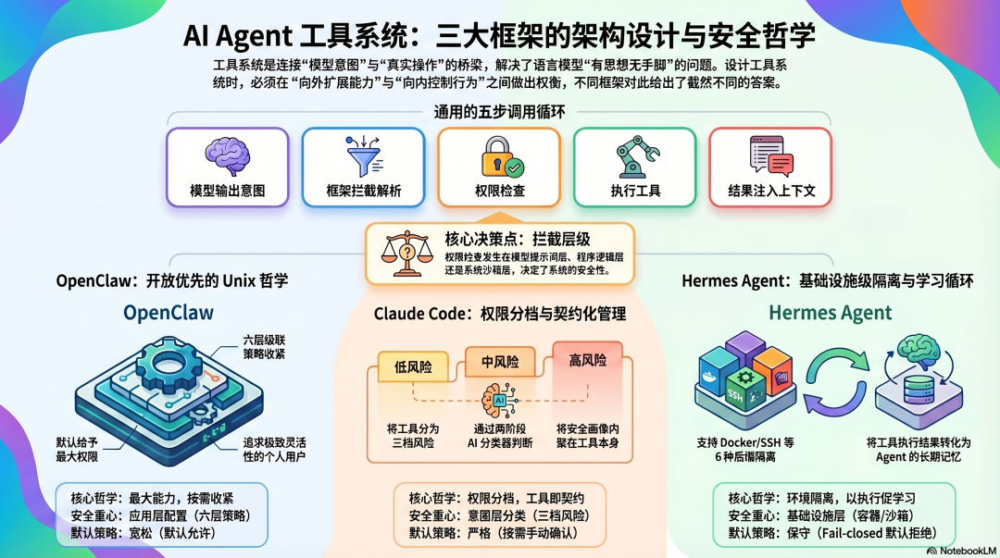
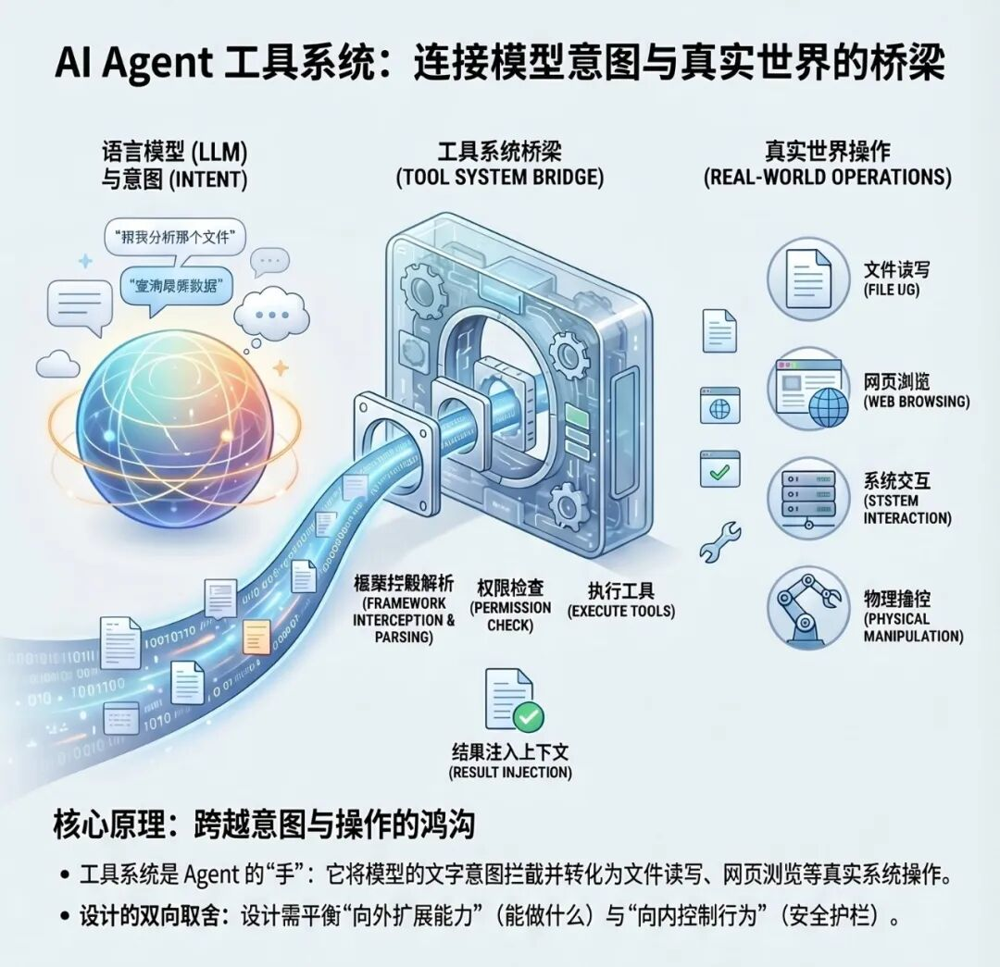
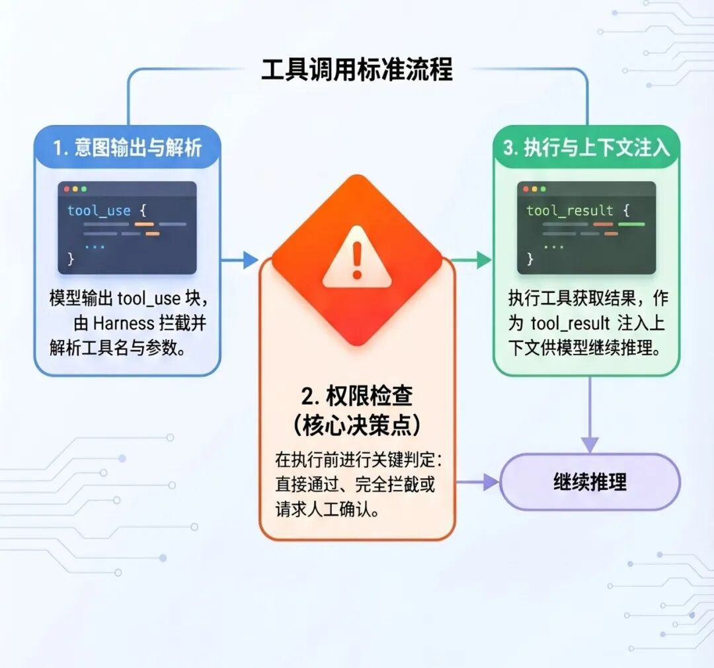
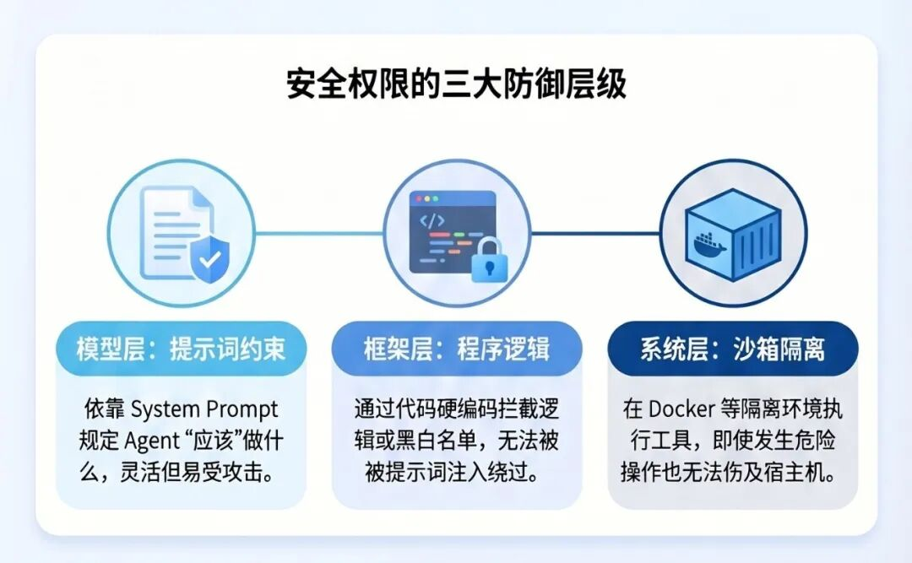
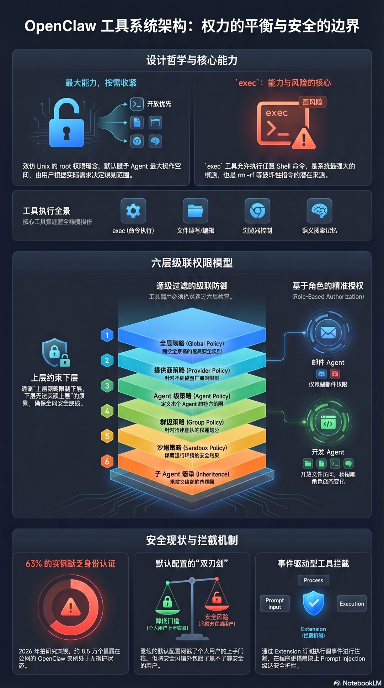
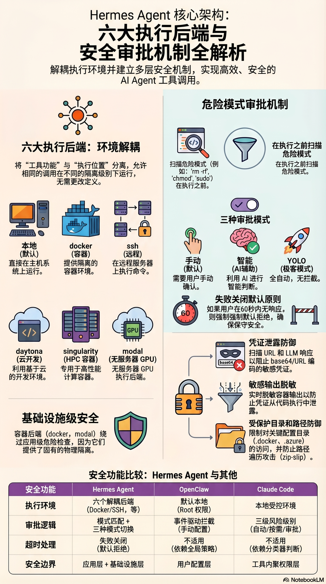

# AI Agent 架构设计（二）：工具系统设计（OpenClaw、Claude Code、Hermes Agent 对比）

<p class="tool-subtitle"><strong>从“模型想做什么”到“系统允许做什么”：拆解三个主流 Agent 框架如何设计工具、权限与安全边界</strong></p>

<div class="tool-cover tool-figure">
  
</div>

<div class="tool-meta-card">
  <ul>
    <li><strong>系列</strong>：AI Agent 架构设计（二）：工具系统设计</li>
    <li><strong>目标</strong>：从架构层面理解三个主流框架的工具系统设计决策，以及背后的工程取舍</li>
    <li><strong>适合</strong>：对 Agent 底层设计感兴趣，想真正理解“为什么这样设计”的读者</li>
    <li><strong>预计阅读</strong>：15 分钟</li>
  </ul>
</div>

---

## 工具系统解决什么问题？

语言模型本身只能输出文字。

你让它“帮我删掉这个目录里的临时文件”，它能理解这个意图，能输出一段描述该怎么做的文字。但如果没有工具系统，它什么也做不了——它没有手，碰不到文件系统。

**工具系统是连接“模型意图”和“真实操作”的桥梁。** 每次模型决定要采取一个行动，工具系统拦截这个决定，检查它是否被允许，然后执行，把结果返回给模型。

<div class="tool-figure">
  
  <p><sub>图 1：工具系统是连接“模型意图”与“真实操作”的桥梁</sub></p>
</div>

这个桥梁的设计，要同时回答两个方向的问题：

- **向外扩展能力**：Agent 能调用哪些工具，能做什么事，能力边界在哪里。
- **向内控制行为**：谁来决定工具调用是否被允许，危险操作如何拦截，人如何保持对 Agent 行为的控制。

这两个方向的设计取舍，在三个框架里给出了三种根本不同的答案。

---

## 工具调用的基本机制

在拆解三个框架之前，先把共同的底层机制说清楚。

<div class="tool-figure">
  
  <p><sub>图 2：所有 Agent 框架都绕不开的工具调用主链路</sub></p>
</div>

所有框架的工具调用都遵循同一个流程：

```text
模型输出 tool_use 块
        ↓
Harness 拦截，解析工具名和参数
        ↓
权限检查（通过 / 拦截 / 请求确认）
        ↓
执行工具，获取结果
        ↓
结果作为 tool_result 注入上下文
        ↓
模型继续推理
```

这个流程里有一个关键的设计决策点：**权限检查发生在哪里，由谁来做。**

<div class="tool-figure">
  
  <p><sub>图 3：权限检查既可以发生在模型层，也可以发生在框架层或基础设施层</sub></p>
</div>

是在模型层（靠提示词约束）？是在框架层（靠程序逻辑）？还是在系统层（靠沙箱隔离）？

**三个框架的根本差异，就在这里。**

---

## OpenClaw：开放优先，安全靠配置

<div class="tool-figure">
  
  <p><sub>图 4：OpenClaw 工具系统围绕高能力 `exec` 与分层策略展开</sub></p>
</div>

### 核心设计哲学：最大能力，按需收紧

OpenClaw 的工具系统设计哲学是：**默认给 Agent 最大的能力，让用户自己决定怎么收紧。**

这和 Unix 的设计哲学很像——系统给你 root 权限，你自己决定要不要用。

```text
OpenClaw 核心工具集：
├── exec          ← 执行任意 Shell 命令（最强也最危险）
├── read          ← 读取文件
├── write         ← 写入文件
├── edit          ← 编辑文件
├── browser       ← 浏览器控制
├── memory_search ← 语义搜索记忆
└── memory_get    ← 读取指定记忆文件
```

`exec` 是整个工具系统里最关键的工具。它能执行任意 Shell 命令，意味着 Agent 可以做操作系统层面能做的一切——这既是 OpenClaw 强大的根源，也是它安全风险最集中的地方。

**`rm -rf` 也是 Shell 命令。**

### 六层级联权限模型

OpenClaw 的权限不是简单的“允许/禁止”，而是一个六层的级联策略系统：

```text
全局策略（Global Policy）
        ↓
模型提供商策略（Provider Policy）
        ↓
Agent 级策略（Agent Policy）
        ↓
群组级策略（Group Policy）
        ↓
沙箱策略（Sandbox Policy）
        ↓
子 Agent 继承规则（Subagent Inheritance）
```

工具调用必须通过每一层的检查才能执行。上层策略可以限制下层，下层不能突破上层的约束。

这个设计的架构价值在于：**不同的 Agent 可以有不同的权限配置，而不是所有 Agent 共享同一套规则。**

一个专门处理邮件的 Agent，可以配置成只有邮件相关的工具权限；一个开发 Agent，可以有更完整的文件系统访问权限。权限随角色而定，而不是全局一刀切。

### 关键的默认设置问题

OpenClaw 有一个被广泛批评的设计选择：**默认配置是宽松的。**

官方文档承认：默认情况下，OpenClaw 没有工具权限限制，没有命令白名单，没有审批要求。

这个选择是合理的——对于个人用户快速上手来说，宽松的默认值降低了入门门槛。

但代价是：大量用户在不知情的情况下，运行着一个对本机拥有近乎完整权限的 AI Agent。2026 年初，安全研究人员发现超过 13.5 万个暴露在公网的 OpenClaw 实例，其中 63% 完全没有身份认证。

> **这揭示了一个架构设计的根本问题：把安全的责任交给用户配置，本质上是把风险外包给了最不了解安全的那批用户。**

### 工具拦截：事件驱动的扩展点

OpenClaw 的工具系统有一个很重要的扩展机制：工具执行前会触发事件，扩展（Extension）可以订阅这些事件进行拦截。

这是一个正确的架构设计——安全护栏写在程序逻辑里，而不是提示词里。程序级别的拦截不会被 Prompt Injection 绕过。

但这个机制是可选的，不是默认启用的。你需要主动配置扩展才能激活拦截。

---

## Claude Code：工具即契约，权限分三档

<div class="tool-figure">
  
  <p><sub>图 5：Claude Code 把工具 schema、风险画像与执行策略内聚在工具本身</sub></p>
</div>

### 核心设计哲学：每个工具都是一个独立的权限单元

Claude Code 的工具系统从泄露的源码里能看到一个非常清晰的架构原则：

**每个工具独立定义自己的 schema、权限级别和执行逻辑，没有共享的可变状态。**

`BashTool` 和 `FileReadTool` 在同一个工具注册表里，但权限完全不同——Bash 执行可以修改系统状态，文件读取是只读的。架构用不同的权限门控来反映这种风险差异，而不是对所有工具应用统一策略。

这个设计的架构价值在于：**工具的风险画像是内聚在工具本身里的，而不是分散在外部配置里。** 添加新工具，不需要修改权限系统的核心逻辑；工具的行为变了，权限也随之变化。

### 三档权限模型

Claude Code 把所有工具调用分成三个风险等级：

**第一档：自动批准**

只读或天然安全的操作——文件读取、文本搜索、代码导航。这类操作不改变系统状态，无需任何中断地执行。

**第二档：按需确认**

修改受控状态的操作——文件编辑、特定 Shell 命令。默认情况下，这类操作需要用户手动确认。

2026 年 3 月，Claude Code 推出了 Auto Mode（目前是 Team/Enterprise 的 Research Preview），引入了一个基于 Sonnet 4.6 的背景分类器，为这一档提供自动化判断能力。

分类器的工作机制值得仔细看：它分两个阶段运行——先用一个快速的单 token 过滤器做初步判断（通过/标记），只有被标记为可疑的调用才进入 chain-of-thought 推理阶段。这个两阶段设计保证了大多数正常操作的低开销，把计算资源集中在真正需要深度分析的可疑调用上。

分类器的输入范围有一个刻意的设计：**它能看到用户的请求和工具调用的内容，但看不到模型的推理文字，也看不到工具的执行结果。** 这是结构性的防御——防止模型用流畅的解释“说服”分类器放行，也防止恶意内容通过工具输出影响分类判断。安全边界只看行为和原始意图，不听理由，不看结果。

**第三档：要求明确审批或拦截**

高风险操作——可能破坏系统状态的 Shell 命令、工作目录之外的文件操作、任何疑似数据外泄的行为。

这三档不是固定的，用户可以通过配置调整，也可以在会话中临时修改（比如对某个具体命令选择“始终允许”）。

### 工具即注册表：AgentTool 的设计

从泄露的源码里能看到一个值得关注的设计：`AgentTool`——子 Agent 本身是工具注册表里的一个普通工具。

这意味着生成子 Agent 和调用文件读取，在架构层面是同一类操作，走同样的权限管道，受同样的拦截机制约束。

不需要单独的 Agent 编排层，不需要特殊的进程模型。子 Agent 是工具注册表的一等公民。这个设计极大地简化了多 Agent 系统的架构复杂度——扩展工具系统就等于扩展 Agent 协作能力。

### MCP 的工具发现：按需加载，不是全量注入

Claude Code 支持 MCP（Model Context Protocol）扩展外部工具。设计上有一个值得借鉴的细节：

**连接 MCP 服务器时，不会把所有工具的完整 schema 加载进上下文，只加载工具名称列表。** 当任务真正需要某个工具时，才加载该工具的完整定义。

这和 Skills 的渐进式加载是同一套逻辑：先知道“有什么可用”，按需再取完整内容。工具越多，这个设计的 Token 节省效果越明显。

MCP 服务器的推荐上限是 5-6 个活跃服务，因为每个服务会启动一个子进程，资源有限制。

---

## Hermes Agent：工具系统与学习循环的融合

<div class="tool-figure">
  
  <p><sub>图 6：Hermes Agent 把工具系统与学习闭环深度耦合在一起</sub></p>
</div>

### 核心设计哲学：工具执行是情景记忆的输入

Hermes Agent 的工具系统有一个和其他两个框架根本不同的设计出发点：

**工具的执行结果，不只是当次任务的输出，还是情景记忆系统的输入。**

当 Hermes Agent 完成一个涉及五次以上工具调用的复杂任务，它会分析这次执行过程，把成功的路径抽象成 Skill 文档。这意味着工具系统的设计必须支持执行过程的结构化捕获——不只是“执行了什么”，还有“为什么这样执行”“效果如何”。

这个设计让工具调用的意义发生了扩展：**每次执行，既是当次任务的操作，也是未来学习的素材。**

### 40+ 内置工具，六种执行后端

Hermes Agent 内置了 40 多个工具，覆盖文件管理、浏览器自动化、终端执行、邮件、日历、网页搜索等。

但工具系统里最值得关注的架构设计，是**六种执行后端**：

```text
local        ← 本机直接执行（默认）
docker       ← Docker 容器隔离
ssh          ← 远程 SSH 执行
daytona      ← 云端开发环境
singularity  ← HPC 容器（科学计算场景）
modal        ← Serverless GPU 执行
```

同样的工具调用，可以在不同的隔离级别下执行。这个设计把“工具是什么”和“工具在哪里执行”解耦了。

**架构价值：** 安全等级和能力需求可以独立调整。你可以在 Docker 后端里运行同样的工具集，获得容器级隔离，而不需要改任何工具的定义。

### 危险命令的审批机制

Hermes Agent 的审批机制和 OpenClaw 的事件拦截、Claude Code 的权限分档都不同：

**基于模式匹配的危险检测 + 三种审批模式。**

执行任何命令前，Hermes Agent 对比一个危险模式库——递归删除、权限修改、sudo 使用等都在检测范围内。匹配到危险模式，触发审批流程。

```yaml
approvals:
  mode: manual       # 手动确认（默认）
        smart        # AI 辅助判断
        off          # 全自动（YOLO 模式）
  timeout: 60        # 无响应则默认拒绝（fail-closed）
```

有几个设计细节值得关注：

- **Fail-closed 默认策略**：超时未响应，默认拒绝而不是默认放行。在安全设计里，这是正确的原则——不确定时选择更保守的行为。
- **容器后端绕过**：当运行在 Docker、Modal 等容器后端时，危险命令检查会被跳过，因为容器本身就是隔离边界。这是一个合理的设计取舍——把安全责任从应用层移到基础设施层。
- **YOLO 模式**：全自动、不拦截。这是为了在受信任的自动化场景下提升效率，同时用命名方式（YOLO）让用户意识到这是一个刻意的高风险选择。

### v0.7.0 的安全加固：凭证保护

2026 年 4 月，Hermes Agent v0.7.0 做了一次重要的安全加固，核心是对凭证泄漏的防御：

- 扫描浏览器 URL 和 LLM 响应，检测 base64 编码、URL 编码形式的凭证
- 容器执行输出脱敏，防止凭证从代码执行结果中泄漏
- 保护目录（`.docker`、`.azure`、`.config/gh`），文件工具无法访问
- 路径遍历防御，阻止 zip-slip 类攻击

这些加固说明 Hermes Agent 在安全设计上走的是“发现问题、迭代修复”的路径，而不是从一开始就有完整的安全架构。

---

## 三种架构哲学的本质差异

<div class="tool-figure">
  
  <p><sub>图 7：三个框架的工具系统最终体现出三种不同的安全与能力哲学</sub></p>
</div>

把三个框架的工具系统设计放在一起，能看到三种根本不同的安全哲学：

**OpenClaw：最大能力，安全靠配置**

给 Agent 最大的工具权限，让用户自己决定收紧到什么程度。这对个人用户友好，对安全意识弱的用户危险。

**Claude Code：权限内聚于工具，三档自动分级**

每个工具自带风险画像，框架按风险级别自动决定执行策略。安全不依赖用户配置，但也因此减少了灵活性。

**Hermes：安全是基础设施问题，工具系统服务于学习循环**

通过执行后端提供基础设施级隔离，工具执行和情景记忆深度耦合，安全设计随版本迭代演进。

---

## 工具系统设计的核心取舍

<div class="tool-figure">
  
  <p><sub>图 8：工具系统设计本质上是在能力、安全、灵活性与学习能力之间做取舍</sub></p>
</div>

分析三个框架之后，工具系统设计里有几个核心的架构取舍值得提炼：

### 取舍一：最大能力 vs 最小权限

OpenClaw 选择最大能力，降低使用门槛。Claude Code 选择最小权限，提高默认安全性。这不是非此即彼的选择，而是对目标用户群体的判断——个人用户更需要能力，企业用户更需要安全。

### 取舍二：应用层安全 vs 基础设施层安全

OpenClaw 和 Claude Code 的权限控制在应用层。Hermes Agent 的执行后端把安全下推到基础设施层（容器）。基础设施层的安全更可靠，但设置成本更高。

### 取舍三：工具调用是操作 vs 工具调用是素材

这是 Hermes Agent 和另外两个框架最根本的差异。当工具执行结果成为情景记忆的输入，工具系统就不只是一个执行层，而是 Agent 进化能力的基础设施。

### 取舍四：拦截在哪一层

提示词层的拦截可以被 Prompt Injection 绕过。程序层的拦截不会。容器级的隔离让拦截本身变得不那么必要。三个层次各有成本，安全等级递增，灵活性递减。

---

## 小结

工具系统的本质，不只是“让模型能调用命令”，而是**决定 Agent 的能力边界、风险边界与控制边界。**

从这三种设计可以看出非常清晰的分野：

- **OpenClaw**：优先把能力做满，再把安全责任留给配置系统
- **Claude Code**：优先把工具做成契约化权限单元，让风险判断成为框架内生能力
- **Hermes Agent**：优先考虑学习闭环，把工具系统变成经验沉淀与能力进化的基础设施

如果只带走三个最值得复用的设计模式，建议记住这三条：

1. **工具的风险画像要尽量内聚在工具本身**
2. **安全拦截最好落在程序层或基础设施层，而不是只依赖提示词**
3. **一旦想让 Agent 具备长期学习能力，工具执行日志就不再只是输出，而是训练素材**

未来更成熟的 Agent 工具系统，很可能会融合这三种路线：

- 既保留 OpenClaw 的高扩展性
- 又吸收 Claude Code 的权限建模
- 再叠加 Hermes Agent 把工具执行转化为情景记忆的能力

这也是从“会调用工具的模型”走向“能长期协作的智能体”时，最值得持续打磨的一层系统基础设施。

<style>
.tool-subtitle {
  margin: -4px 0 20px;
  text-align: center;
  color: #6b7280;
  font-size: 1.05rem;
  letter-spacing: 0.02em;
}

.tool-cover,
.tool-figure {
  margin: 28px auto;
  padding: 14px;
  border-radius: 20px;
  background: linear-gradient(180deg, #fffaf2 0%, #ffffff 100%);
  border: 1px solid rgba(222, 180, 106, 0.28);
  box-shadow: 0 14px 34px rgba(148, 101, 28, 0.08);
}

.tool-cover img,
.tool-figure img {
  width: 100% !important;
  max-height: none !important;
  border-radius: 12px;
}

.tool-meta-card {
  margin: 20px 0 28px;
  padding: 18px 20px;
  background: linear-gradient(135deg, rgba(255, 246, 221, 0.92), rgba(255, 255, 255, 0.98));
  border: 1px solid rgba(226, 179, 76, 0.34);
  border-radius: 18px;
  box-shadow: 0 10px 28px rgba(201, 145, 38, 0.08);
}

.tool-meta-card ul {
  margin: 0;
  padding-left: 1.1rem;
}

.tool-meta-card li {
  margin: 0.45rem 0;
  line-height: 1.75;
}

.vp-doc h2 {
  margin-top: 42px;
  padding-left: 14px;
  border-left: 4px solid #e2ad47;
}

.vp-doc h3 {
  margin-top: 28px;
}

.vp-doc blockquote {
  border-left: 4px solid #e2ad47;
  background: rgba(255, 248, 230, 0.72);
  border-radius: 0 14px 14px 0;
  padding: 10px 16px;
}

.vp-doc table {
  border-radius: 12px;
  overflow: hidden;
}

.vp-doc tr:nth-child(2n) {
  background-color: rgba(255, 248, 230, 0.45);
}

.dark .tool-subtitle {
  color: #c8d0da;
}

.dark .tool-cover,
.dark .tool-figure {
  background: linear-gradient(180deg, rgba(56, 43, 20, 0.65), rgba(30, 30, 30, 0.92));
  border-color: rgba(226, 173, 71, 0.28);
  box-shadow: 0 14px 34px rgba(0, 0, 0, 0.28);
}

.dark .tool-meta-card {
  background: linear-gradient(135deg, rgba(73, 53, 20, 0.86), rgba(30, 30, 30, 0.95));
  border-color: rgba(226, 173, 71, 0.28);
}

.dark .vp-doc blockquote {
  background: rgba(82, 61, 22, 0.3);
}
</style>
