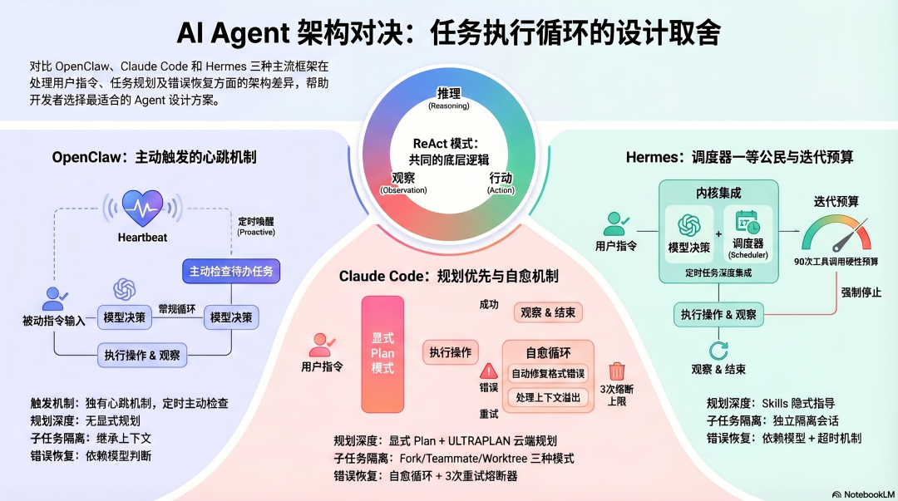
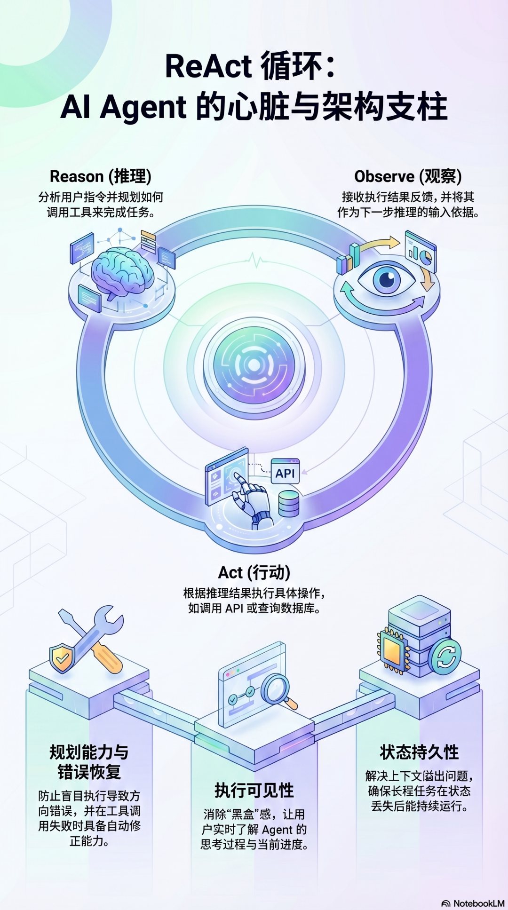
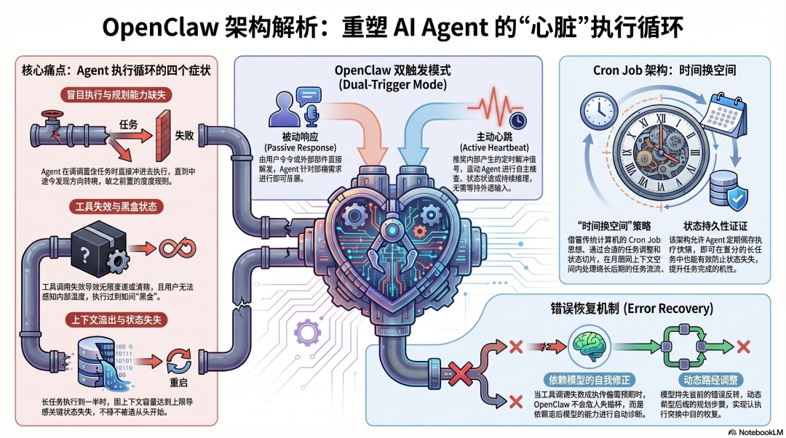
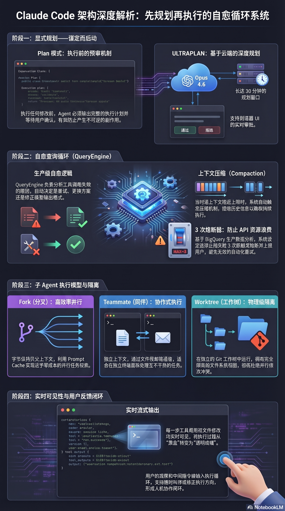
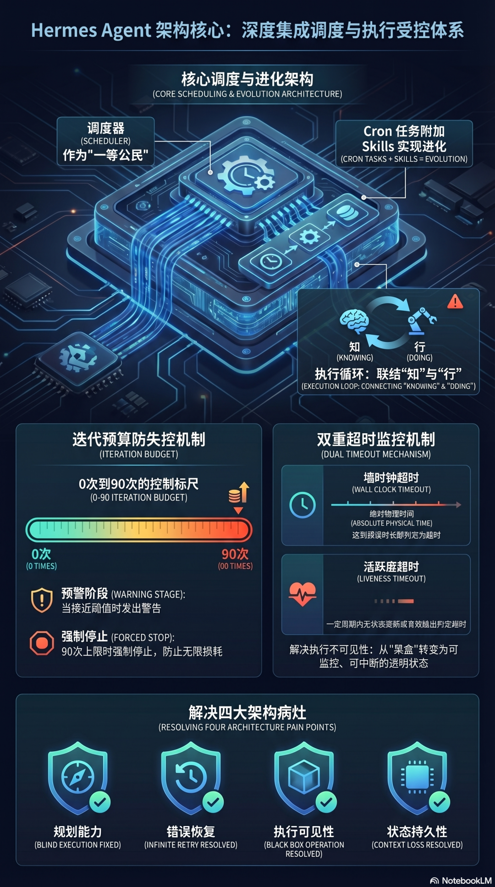
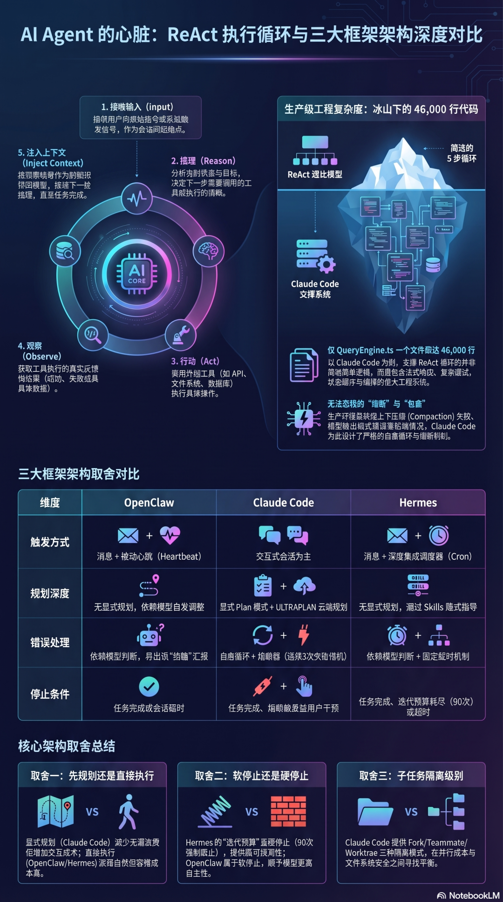

# AI Agent 架构设计（三）：任务规划与执行循环（OpenClaw、Claude Code、Hermes Agent 对比）

<p class="loop-subtitle"><strong>从“模型会调用工具”到“系统能稳定完成复杂任务”：拆解三种主流 Agent 框架如何规划、调度、恢复与停止</strong></p>

<div class="loop-cover loop-figure">
  
</div>

<div class="loop-meta-card">
  <ul>
    <li><strong>系列</strong>：AI Agent 架构设计（三）：任务规划与执行循环</li>
    <li><strong>目标</strong>：理解 OpenClaw、Claude Code、Hermes Agent 如何把一条用户指令拆成可执行、可恢复、可终止的多步任务</li>
    <li><strong>适合</strong>：想从架构层面理解 Agent 执行机制，而不只停留在“会调工具”层面的读者</li>
    <li><strong>预计阅读</strong>：15 分钟</li>
  </ul>
</div>

---

## 执行循环真正解决的是什么问题？

记忆系统回答的是“Agent 知道什么”，工具系统回答的是“Agent 能做什么”。

但真正决定 Agent 是否像一个系统而不是一个会说话的模型的，是第三个问题：

> **当用户给出一个复杂目标时，Agent 如何把它稳定地拆成一连串可执行动作，并在过程中持续修正自己？**

这就是执行循环的职责。

如果执行循环设计不好，系统通常会暴露出四类问题：

- **不会规划**：接到复杂任务后立刻动手，做了一半才发现方向错了
- **不会恢复**：工具失败后不是无限重试，就是直接中断
- **不可观察**：用户不知道系统在做什么，也无法及时纠偏
- **不够持久**：任务一长、上下文一满，状态就丢了

所以执行循环不是一个“小实现细节”，而是 Agent 的任务操作系统。它决定了 Agent 在现实世界里是“能跑一两步”，还是“能稳定完成一件事”。

---

## ReAct 是共同起点，但绝不是终点

<div class="loop-figure">
  
  <p><sub>图 1：Reason → Act → Observe 是现代 Agent 执行的共同底层结构</sub></p>
</div>

三种框架虽然差异很大，但共同建立在 ReAct（Reason → Act → Observe）模式之上：

```text
接收输入
  ↓
推理（Reason）：判断当前状态，决定下一步
  ↓
行动（Act）：调用工具执行操作
  ↓
观察（Observe）：读取工具返回结果
  ↓
将结果注入上下文，继续下一轮推理
```

这个循环本身并不复杂，复杂的是把它变成生产级系统之后必须回答的几个问题：

- 工具失败时，重试、改道还是上报？
- 上下文逼近上限时，如何压缩后继续执行？
- 长任务需要等待时，如何跨会话续跑？
- 用户怎样看到中间状态，并在必要时接管？

也就是说，**ReAct 只是执行循环的“骨架”，真正拉开差距的是系统如何处理触发、规划、调度、恢复和停止条件。**

---

## OpenClaw：把“主动唤醒”做成执行能力的一部分

<div class="loop-figure">
  
  <p><sub>图 2：OpenClaw 的执行循环同时支持消息驱动与 Heartbeat 驱动</sub></p>
</div>

### 两条入口：用户触发 + 系统心跳

OpenClaw 的执行循环很有辨识度，因为它不是只有一条入口。

第一条是典型的消息驱动路径：

- 用户发来消息
- Gateway 接收请求
- 启动 Agent 会话
- 进入 ReAct 循环
- 产出结果并结束

第二条是更有特点的主动心跳路径：

- 系统按固定周期触发 Heartbeat
- Agent 读取 `HEARTBEAT.md`
- 判断是否有到点任务或待处理事项
- 有任务则执行，没有任务则静默返回

这个设计解决了一个根本问题：**语言模型本身不会主动想起要做事。** OpenClaw 通过外部时钟把“主动性”嵌进了执行架构。

### 用调度替代阻塞等待

Heartbeat 解决的是“定期醒来看看”，而不是“精确地在某个时间继续执行”。

所以 OpenClaw 进一步用 Cron Job 处理等待型任务：如果某个外部动作需要 3 分钟后再检查结果，系统不会让当前会话原地阻塞，而是直接创建一个未来时刻的新任务。

```text
触发外部操作
    ↓
发现需要等待
    ↓
创建 3 分钟后的 Cron Job
    ↓
当前会话结束
    ↓
未来由新会话恢复执行
```

这是一种非常典型的工程思路：**把“等待”从会话内部拿掉，交给调度系统。** 这样每个会话都保持轻量，长任务则由多个短会话接力完成。

### 设计优势与代价

OpenClaw 的优势，是它天然适合长期运行和主动任务。你可以把它理解为一种“会被定期叫醒的 Agent”。

但它的恢复策略相对依赖模型自主判断。工具失败之后，错误会进入上下文，由模型自己决定是重试、换方案还是报告用户。这样做足够灵活，但也意味着：

- 恢复质量取决于模型本身
- 系统层硬约束较少
- 在复杂异常场景里，可预测性不如更强工程化的框架

**因此，OpenClaw 更像是“强调主动性与会话切分”的执行路线。**

---

## Claude Code：把规划、恢复与用户观察都纳入主循环

<div class="loop-figure">
  
  <p><sub>图 3：Claude Code 更强调显式规划、工程级恢复和执行可见性</sub></p>
</div>

### 先规划，再执行

Claude Code 的第一处关键差异，是它把“先想清楚再动手”提升成了架构层能力。

面对复杂任务时，系统通常会先进入 Plan 模式：

1. 先形成完整执行计划
2. 把计划暴露给用户确认
3. 再根据计划逐步执行

这背后的设计判断很明确：**在高副作用任务里，方向错误往往比执行慢更昂贵。**

如果任务涉及批量改代码、改配置、执行命令或调用外部服务，那么“做完才发现路线错了”的成本非常高。Plan 模式的价值，不是让系统更聪明，而是让错误暴露得更早。

### 恢复机制不是提示词技巧，而是系统逻辑

Claude Code 的第二个特点，是它把很多异常恢复做成了程序逻辑，而不是把责任全部交给模型自由发挥。

典型恢复分支包括：

- **工具调用失败**：先识别错误类型，再决定是否重试或换方案
- **模型输出格式错误**：提示模型修正结构并重新生成
- **上下文接近上限**：触发 Compaction，压缩历史后继续执行

这背后体现的是一种很典型的工程意识：**失败不是偶然事件，而是执行循环必须原生支持的常态分支。**

其中最值得借鉴的一点，是熔断逻辑。比如自动压缩连续失败，不应该无限尝试，而应该在达到阈值后停止并暴露给用户。

### 用户观察被视作执行输入

Claude Code 还有一个非常重要的设计选择：**执行过程默认对用户可见。**

工具调用、文件改动、命令执行、中间输出都会被实时展示。这不只是为了“看起来更透明”，而是因为它把用户当成执行循环中的动态参与者：

- 用户可以及时发现方向偏差
- 用户可以中途补充约束
- 用户可以在高风险动作前决定是否继续

换句话说，Claude Code 更像是一种“**可交互、可纠偏的工程执行体**”。

### 子 Agent 隔离级别被显式设计出来

Claude Code 对子 Agent 的处理也很有代表性。它没有默认采用一种固定模式，而是区分了不同的上下文共享和隔离等级：

- **Fork**：复制父上下文，适合并行探索
- **Teammate**：独立上下文，通过外部媒介协作
- **Worktree**：独立工作树，避免并行改文件冲突

这说明在 Claude Code 的架构里，**“子任务是否共享上下文”本身就是一个一等设计问题。**

---

## Hermes Agent：把调度内建进系统，再用预算限制失控

<div class="loop-figure">
  
  <p><sub>图 4：Hermes Agent 把调度器深度嵌入主循环，并引入明确的迭代预算</sub></p>
</div>

### 调度器不是外挂，而是核心部件

Hermes Agent 最大的特点，是调度器在架构里不是外围扩展，而是主循环的一部分。

在 OpenClaw 里，Heartbeat 与 Cron 更像是执行循环旁边的主动机制；在 Claude Code 里，重点更多放在交互式执行与恢复；而在 Hermes 中，`scheduler.tick()` 直接属于系统维护周期的一环。

它大致遵循这样的流程：

```text
scheduler.tick()
    ↓
获取调度器锁
    ↓
筛选到期任务
    ↓
为每个任务启动全新 Agent 会话
    ↓
加载附加 Skills
    ↓
执行任务并路由结果
    ↓
更新下一次执行时间
```

这意味着 Hermes 更适合长期运行、周期任务、多任务后台自治这类场景。

### Cron 与 Skills 联动，执行开始接近学习循环

Hermes 很特别的一点，是定时任务不只是定时执行一段 Prompt，它还可以绑定 Skills。

这带来一个很强的系统属性：**随着 Skills 积累，同一个调度任务本身也会变得越来越强。**

也就是说，执行循环不再只负责“完成当下任务”，它开始自然地和学习循环融合。长期来看，这种能力会非常适合做持续运营、研究助手、周期报告等场景。

### 迭代预算：强约束防止无限循环

Hermes 还有一个非常值得借鉴的设计：**Iteration Budget（迭代预算）**。

<div class="loop-figure">
  
  <p><sub>图 5：规划深度、调度方式、停止策略和隔离级别共同决定执行循环的性格</sub></p>
</div>

系统会给一次任务设置明确的工具调用预算，在接近上限时提前预警，到达上限后强制停止。

这类设计的价值非常直接：

- 它能显著降低无限循环的风险
- 它把资源边界变成系统级约束
- 它让“什么时候该停”不再只依赖模型主观判断

如果你要做的是一个可以长时间自治运行的 Agent，这种硬约束通常非常有必要。

### 超时策略揭示的设计哲学

Hermes 当前更接近固定墙钟超时：任务启动后到某个总时长就终止。它足够简单，但会误杀合法的长任务。

从架构角度看，更理想的方向通常是“活跃度超时”——只在系统长时间没有新动作时，才判定任务卡死。

这个细节很重要，因为它说明执行循环里的超时策略，目标不应该是“单纯限制耗时”，而应该是**识别真正的停滞与失控**。

---

## 三种框架，分别在取舍什么？

把三种路线放在一起看，会发现它们其实分别押注了不同的核心价值。

### 取舍一：先规划，还是边做边想？

- **Claude Code** 更强调先规划再执行
- **OpenClaw / Hermes** 更倾向直接进入执行循环，在过程中调整

前者更适合高副作用任务，后者更适合自动化与长期运行场景。

### 取舍二：停止机制是软约束还是硬约束？

- **Hermes** 用预算和上限做硬停止
- **Claude Code** 用条件式熔断处理特定异常
- **OpenClaw** 更多依赖模型自行判断任务何时结束

越硬的停止条件，可预测性越高；越软的停止条件，自主性越强。

### 取舍三：用户是旁观者，还是回路中的参与者？

- **Claude Code** 把用户观察与干预显式纳入回路
- **OpenClaw / Hermes** 更偏后台执行与异步自治

如果系统面向的是开发场景或高风险动作，用户在环通常更重要；如果系统面向的是周期任务或后台自治，自动化优先级会更高。

### 取舍四：调度是外部能力，还是底层能力？

- **OpenClaw** 用 Heartbeat / Cron 提供强实用性
- **Hermes** 把调度直接做进主循环
- **Claude Code** 则把更多精力放在交互式执行质量上

这三种答案没有绝对对错，只反映了系统想服务的任务形态不同。

---

## 一张表看清三种执行路线

| 维度 | OpenClaw | Claude Code | Hermes Agent |
| ---- | ---- | ---- | ---- |
| 执行入口 | 用户消息 + Heartbeat | 交互触发为主 | 用户消息 + 内建调度器 |
| 规划能力 | 较弱，依赖执行中修正 | 强，Plan 模式显式存在 | 中等，更多依赖调度组织 |
| 错误恢复 | 依赖模型判断 | 系统级恢复与熔断 | 预算、超时与调度共同约束 |
| 用户可见性 | 中等 | 很强，过程默认可见 | 中等，偏后台任务 |
| 长任务支持 | 通过会话切分与 Cron 串接 | 依赖压缩、恢复与交互控制 | 调度器原生支持周期任务 |
| 停止机制 | 偏软停止 | 条件式硬停止 | 明确预算硬停止 |
| 核心性格 | 主动唤醒型 | 工程协作型 | 调度自治型 |

---

## 收束：成熟的 Agent 执行循环，往往是三者的组合

执行循环的本质，不是“模型调几次工具”，而是**系统如何把一次任务从开始、推进、修复，一直带到结束。**

三种框架各自给出了很鲜明的路线：

- **OpenClaw** 强在主动唤醒与长周期任务切分
- **Claude Code** 强在规划、恢复与人类协同
- **Hermes Agent** 强在调度内建与预算约束

如果你正在设计自己的 Agent 框架，最值得继承的通常不是某一家的完整实现，而是三种能力的组合：

1. 像 Claude Code 一样，在高风险任务前先规划
2. 像 OpenClaw 一样，把等待交给调度，不让会话阻塞
3. 像 Hermes 一样，用预算、超时和停止条件约束系统失控

只有当这三类能力都足够成熟时，Agent 才真正从“会调用工具的模型”进化成“可以长期稳定工作的系统”。

<style>
.loop-subtitle {
  margin: -4px 0 20px;
  text-align: center;
  color: #6b7280;
  font-size: 1.05rem;
  letter-spacing: 0.02em;
}

.loop-cover,
.loop-figure {
  margin: 28px auto;
  padding: 14px;
  border-radius: 20px;
  background: linear-gradient(180deg, #fffaf2 0%, #ffffff 100%);
  border: 1px solid rgba(222, 180, 106, 0.28);
  box-shadow: 0 14px 34px rgba(148, 101, 28, 0.08);
}

.loop-cover img,
.loop-figure img {
  width: 100% !important;
  max-height: none !important;
  border-radius: 12px;
}

.loop-meta-card {
  margin: 20px 0 28px;
  padding: 18px 20px;
  background: linear-gradient(135deg, rgba(255, 246, 221, 0.92), rgba(255, 255, 255, 0.98));
  border: 1px solid rgba(226, 179, 76, 0.34);
  border-radius: 18px;
  box-shadow: 0 10px 28px rgba(201, 145, 38, 0.08);
}

.loop-meta-card ul {
  margin: 0;
  padding-left: 1.1rem;
}

.loop-meta-card li {
  margin: 0.45rem 0;
  line-height: 1.75;
}

.vp-doc h2 {
  margin-top: 42px;
  padding-left: 14px;
  border-left: 4px solid #e2ad47;
}

.vp-doc h3 {
  margin-top: 28px;
}

.vp-doc blockquote {
  border-left: 4px solid #e2ad47;
  background: rgba(255, 248, 230, 0.72);
  border-radius: 0 14px 14px 0;
  padding: 10px 16px;
}

.vp-doc table {
  border-radius: 12px;
  overflow: hidden;
}

.vp-doc tr:nth-child(2n) {
  background-color: rgba(255, 248, 230, 0.45);
}

.dark .loop-subtitle {
  color: #c8d0da;
}

.dark .loop-cover,
.dark .loop-figure {
  background: linear-gradient(180deg, rgba(56, 43, 20, 0.65), rgba(30, 30, 30, 0.92));
  border-color: rgba(226, 173, 71, 0.28);
  box-shadow: 0 14px 34px rgba(0, 0, 0, 0.28);
}

.dark .loop-meta-card {
  background: linear-gradient(135deg, rgba(73, 53, 20, 0.86), rgba(30, 30, 30, 0.95));
  border-color: rgba(226, 173, 71, 0.28);
}

.dark .vp-doc blockquote {
  background: rgba(82, 61, 22, 0.3);
}
</style>
