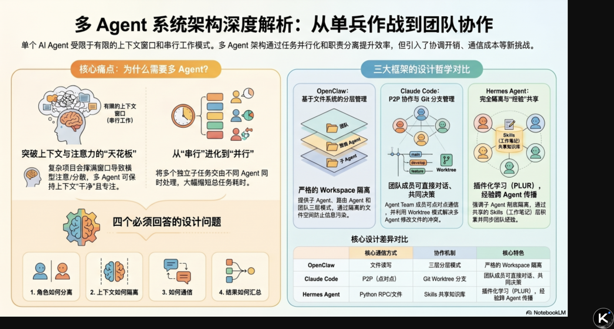
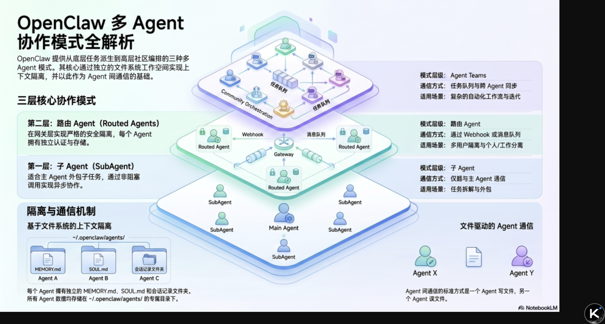
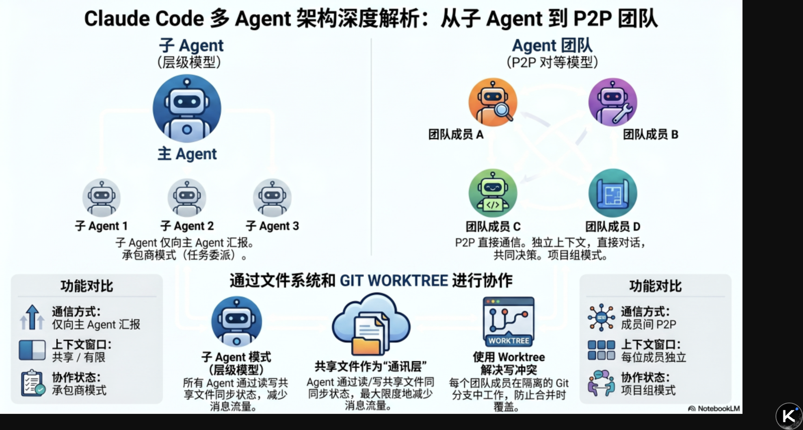
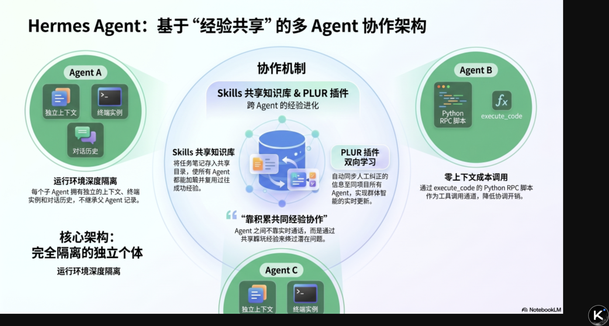

# AI Agent 架构设计（四）：多 Agent 协作（OpenClaw、Claude Code、Hermes Agent 对比）

<strong>从“一个 Agent 单线程完成全部工作”到“多个 Agent 并行分工、互相校验、共享经验”：拆解三种主流框架如何设计角色分离、上下文隔离与通信协调</strong>

  
  
导图：原文先用一张总览图，把“为什么需要多 Agent”“四个核心设计问题”和三种框架哲学放在同一视角下对照

  <ul>
    <li><strong>系列</strong>：AI Agent 架构设计（四）：多 Agent 协作</li>
    <li><strong>目标</strong>：从架构层面理解三个框架如何设计多 Agent 协作，以及角色分离、上下文隔离、通信协调背后的工程取舍</li>
    <li><strong>适合</strong>：对 Agent 底层设计感兴趣，想真正理解“为什么这样设计”的读者</li>
    <li><strong>预计阅读</strong>：15 分钟</li>
    <li><strong>原文来源</strong>：公众号「架构师带你玩转AI」 / 作者 AllenTang / 2026-04-15 22:29</li>
  </ul>

> 本文基于公众号原文整理发布，保留核心观点与章节结构，并按原文图示顺序重新对齐配图，尽量保持图文对应关系。  
> 原文链接：<https://mp.weixin.qq.com/s/YFU_ZLN8dvvI3cO9vHM53w>

---

## 为什么需要多 Agent？

单个 Agent 有两个根本限制。

**第一，上下文窗口是有限的。** 一个复杂项目涉及的文件、历史、工具调用结果，很快就会撑满单个上下文窗口。窗口越满，模型注意力越分散，“Lost in the Middle”问题越严重，输出质量下降。

**第二，一个 Agent 同时只能做一件事。** 如果一个任务有四个相互独立的子任务，单 Agent 必须串行——研究完再写，写完再审查，审查完再测试。四个子任务各需 5 分钟，总共 20 分钟。

多 Agent 的架构价值：让子任务并行，让每个 Agent 保持干净的上下文，专注于自己的职责范围。

但多 Agent 不是免费的——它引入了协调开销、通信成本、上下文一致性问题。设计糟糕的多 Agent 系统，协调成本会吃掉并行带来的所有收益，甚至让整体变得更慢更脆。

这篇要讲的，就是三个框架各自怎么解决这个问题。

---

## 多 Agent 系统的四个核心设计问题

在拆解三个框架之前，先明确多 Agent 系统必须回答的四个架构问题：

- **角色怎么分离**——谁做什么，怎么定义每个 Agent 的职责边界，防止职责重叠或遗漏。
- **上下文怎么隔离**——Agent 之间的信息怎么分隔，防止一个 Agent 的上下文污染另一个 Agent 的判断。
- **Agent 之间怎么通信**——结果怎么传递，任务怎么分配，协调靠语言还是靠结构。
- **结果怎么汇总**——多个 Agent 的输出怎么合并，冲突怎么解决，最终给用户一个一致的答案。

三个框架对这四个问题的答案，揭示了三种完全不同的多 Agent 哲学。

---

## OpenClaw：两层模式，从子 Agent 到 Agent Teams

  
  
图 1：原文把 OpenClaw 画成“三层协作模式”——底层子 Agent、中间 Routed Agents、上层 Agent Teams / 社区编排

### 多 Agent 模式，各有适用场景

OpenClaw 的多 Agent 支持分两个层次，常被混淆，但其实解决的是不同的问题。

**第一层：子 Agent（SubAgent）**

主 Agent 通过 `sessions_spawn` 工具或 `/subagents spawn` 命令派生子 Agent。调用是非阻塞的——主 Agent 发出指令后立刻继续工作，不等待子 Agent 完成。子 Agent 完成后，把结果发回给主 Agent，或者直接发到指定的消息渠道。

这是最常用的模式，适合“主 Agent 需要把某个子任务外包出去，自己继续干别的”这种场景。

它的关键限制也非常明确：**子 Agent 只能向主 Agent 汇报，不能和其他子 Agent 直接通信。** 所有协调都要经过主 Agent 这个中间层。

**第二层：路由 Agent（Routed Agents）**

这是 Gateway 层面的多 Agent 模式。每个 Agent 有独立的工作空间（workspace）、会话存储（sessions）和认证配置（auth profiles），再通过 bindings 把不同渠道、不同用户路由到不同的 Agent。

这层更适合：

- 工作和个人 Agent 分离
- 不同用户访问不同 Agent
- 需要严格安全隔离的场景

在这层结构里，Agent 之间完全独立——不共享记忆，不共享上下文，通信需要通过 webhook 或消息队列显式转发。

### 上下文隔离：文件系统是协调层

OpenClaw 的多 Agent 上下文隔离，核心是文件系统隔离。

每个 Agent 都有自己的 `workspace`，独立的 `MEMORY.md`、`SOUL.md`、会话记录，通常存储在 `~/.openclaw/agents/<agentId>/` 下。

因此，Agent 之间通信的标准方式并不是共享一整段上下文，而是**文件交接**：一个 Agent 把结果写到某个文件，另一个 Agent 再去读取这个文件。

这让 OpenClaw 的多 Agent 非常适合“强隔离、弱耦合”的场景：每个 Agent 都像一个边界清晰的小服务，协作主要通过磁盘与调度系统完成。

---

## Claude Code：Agent Teams，P2P 通信，文件系统协调

  
  
图 2：原文把 Claude Code 明确分成两套模型——左侧是层级式 Subagent，右侧是可直接互通的 P2P Agent 团队

### 两种模式的本质区别

Claude Code 的多 Agent 分成两个明确层次，而且官方文档直接强调了它们的边界：

**子 Agent（Subagents）**：在单个会话内派发，只能向主 Agent 汇报结果，不能和其他子 Agent 直接通信。适合“快速、聚焦、汇报完就结束”的任务。

**Agent Teams（实验性功能）**：多个完全独立的 Claude Code 实例组成团队，每个成员有自己的上下文窗口，并且可以**直接互相通信（P2P）**，不需要经过 Team Lead 中转。

这就是 Agent Teams 相对普通子 Agent 最核心的架构差异。

- 子 Agent 更像一组分别汇报的承包商
- Agent Teams 更像一个在同一房间里工作的项目组

成员之间可以直接对话、相互验证、共同决策。

### 文件系统作为协调层

Claude Code 的多 Agent 协调，核心也不是“把所有对话都互相转发”，而是**共享文件系统**。

可以这样理解：团队协作写文档，不是每个人改完都口头转述给下一个人，而是大家都能打开同一个共享文档，实时看到彼此的工作结果。

在 Claude Code 里，每个 Teammate 都是一个独立运行的 Agent 实例，各自负责不同子任务。某个成员完成一个模块后，另一个依赖它的成员直接读文件就能接上，不需要额外通知。

但共享文件也带来典型冲突：如果多个 Teammate 同时修改同一个文件，就会互相覆盖。

Claude Code 的解决方式是 **Worktree 模式**：让每个 Teammate 在独立的 Git 工作树中工作，就像每个人先在自己的草稿纸上写完，再统一合并，从而避免并发修改冲突。

### 什么时候用 Agent Teams，什么时候用 Subagent？

官方给出的判断标准非常工程化：

- **用 Subagents**：任务快速、聚焦、不需要彼此通信、只要回报结果即可
- **用 Agent Teams**：任务跨前端 / 后端 / 测试多个层面，需要成员之间共享发现并挑战彼此方案，而且任务能真正并行
- **继续单 Session 更好**：任务是顺序型的、会频繁修改同一文件、依赖关系非常强

这意味着 Claude Code 并没有把“多 Agent”当成默认答案，而是把它视为一种**有明确收益边界的协作结构**。

---

## Hermes Agent：隔离子 Agent + PLUR 共享情景记忆

  
  
图 3：原文用 Hermes 强调“完全隔离的执行单元 + Skills / PLUR 经验共享”，协作核心不是实时对话，而是经验传播

### 核心设计：完全隔离，通过文件和 Skills 协调

Hermes Agent 的多 Agent 设计哲学是：**每个子 Agent 完全隔离**，包括上下文、终端和对话历史；协作则主要通过文件系统与 Skills 层完成。

这种隔离体现在几个方面：

- 独立的对话线程：不继承父 Agent 历史
- 独立的终端实例
- 通过 `execute_code` 的 Python RPC 脚本提供零上下文成本的工具调用通道

这意味着 Hermes 在多 Agent 协作里非常强调“每个执行单元都应该保持干净”，而不是把父 Agent 的上下文大量继承给子 Agent。

### Skills：跨 Agent 的共享知识层

多个 Agent 协作时，一个很现实的问题是：一个 Agent 摸索出了好的做法，另一个 Agent 却完全不知道。

Hermes 的解决方案，不是让 Agent 互相发消息同步经验，而是通过 **Skills 这个共享知识库**。

所谓 Skills，本质上就是 Agent 在完成复杂任务后自动写下的“工作笔记”：

- 这件事怎么做
- 踩过什么坑
- 下次要注意什么

默认情况下，每个 Agent 的笔记各自保存，互相不可见。但如果把 Skill 放进 `~/.hermes/skills/` 这样的共享目录，所有 Agent 启动时都会加载它。

举个例子：

你让一个 Agent 研究竞品，它摸索出了一套高效分析流程，并把流程保存成 Skill。下次另一个 Agent 处理类似任务时，直接加载这份 Skill，就不必重新从零摸索。

更进一步的是 **PLUR 插件**。它让经验传播变成双向同步：你纠正了某个 Agent 的做法，这个纠正会自动同步给同项目的其他 Agent，而不需要逐个手动更新。

这是 Hermes 多 Agent 协作最独特的一点：**Agent 之间不靠实时对话达成协作，而靠共同积累经验。** 今天一个 Agent 踩过的坑，明天所有 Agent 都能绕过去。

---

## 多 Agent 系统设计的核心取舍

### 取舍一：让 AI 决定怎么分工，还是你来定规则？

同一件事，其实有两种做法。

一种是告诉 AI：“帮我做竞品分析。”让它自己决定先查什么、再查什么、什么时候结束。这样很省事，但每次做法可能都不一样，出了问题也很难知道卡在哪一步。

另一种是你把步骤明确写清楚：“第一步搜资料，第二步整理对比，第三步写报告，每步完成后才进下一步。”这样虽然慢一点，但出了问题可以立刻定位是哪一步没走完。

结论是：**任务越固定、越不能出错，越应该由人来定义规则；任务越开放、越需要随机应变，越可以让 AI 自己判断。**

### 取舍二：Agent 之间互发消息，还是靠文件传话？

也可以把这个问题想象成两个同事协作。

- 一种方式是坐在一起，做完一块就口头告诉对方，对方还能马上追问
- 另一种方式是做完先存到共享文件夹，对方稍后自己去取

前者实时，但两个人必须同时在线；后者更松耦合，但你不知道对方什么时候会看到。

多 Agent 协作也是一样：

- 需要来回确认、反复校验的任务，更适合实时消息
- 只需要传递结果、边界清晰的任务，用文件交换通常更省事

### 取舍三：子 Agent 知道主 Agent 在想什么，还是完全不知道？

你让一个同事去审查你的方案。

如果他全程旁听了你的思考过程，他在审查时往往会不自觉地顺着你的逻辑走，很难发现你最开始就错了。

如果他什么都不知道，只直接看你的结论，反而更容易提出真正独立的意见。

子 Agent 也是一样：

- 需要它帮你执行、背景越多越好 → 让它继承主 Agent 的上下文
- 需要它帮你审查、要求独立判断 → 让它从零开始

---

## 小结

多 Agent 不是“多开几个模型窗口”这么简单，它背后真正考验的是角色设计、上下文隔离、通信方式和结果汇总机制。

- **OpenClaw** 走的是“强隔离 + 文件协调 + 两层路由”的路线
- **Claude Code** 更强调“显式团队协作 + P2P 通信 + Worktree 冲突控制”
- **Hermes Agent** 则把重点放在“执行单元完全隔离 + 共享 Skills / PLUR 经验传播”上

没有一种多 Agent 架构能在所有场景里同时做到最优。真正重要的，是先看你的任务是否值得拆分，再决定应该用实时沟通、共享文件，还是共享经验来支撑协作。

