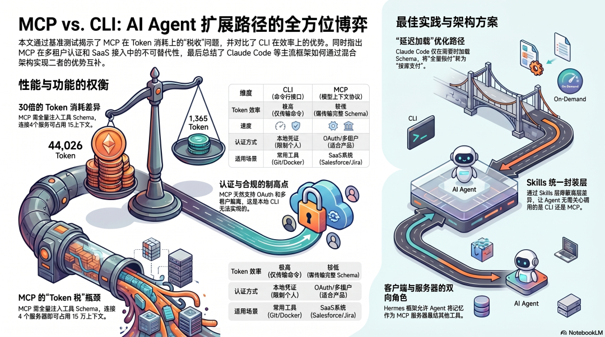
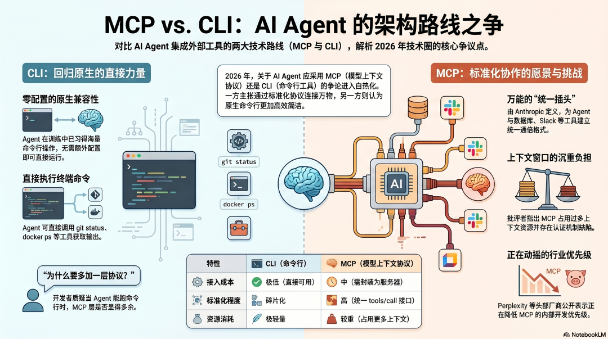
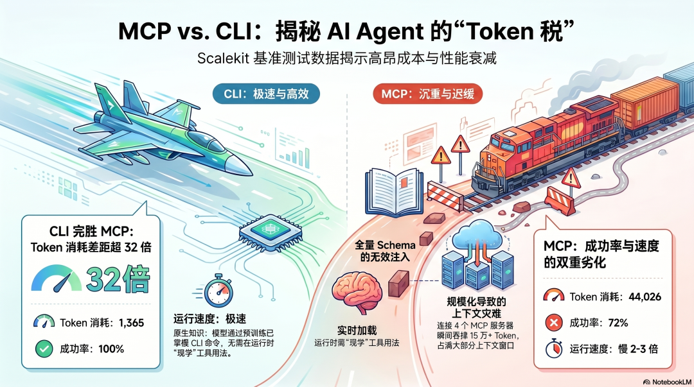
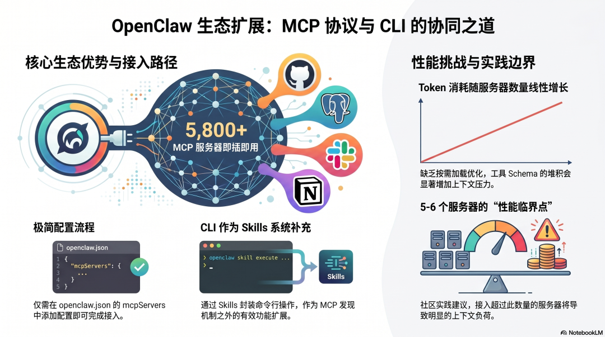
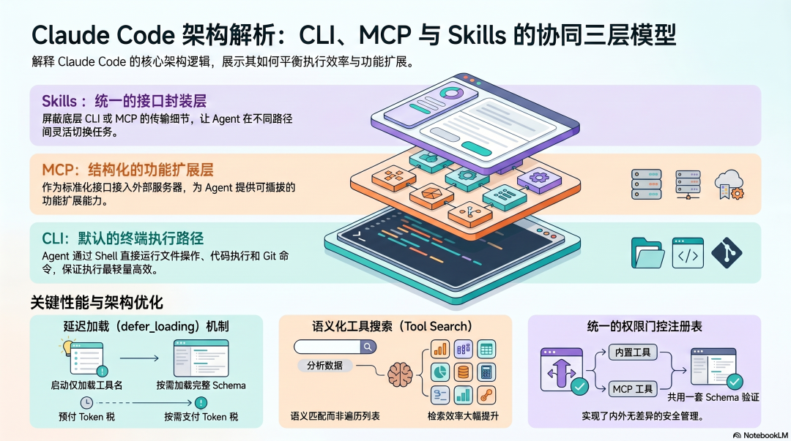
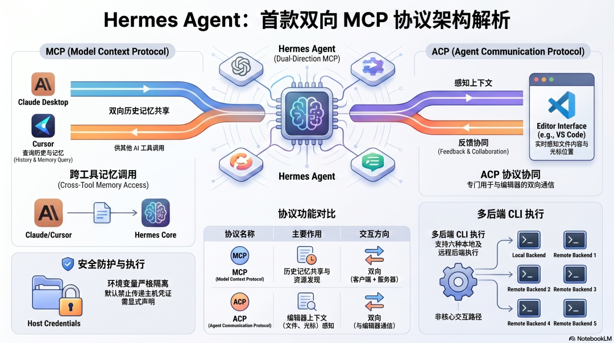

# AI Agent 架构设计（六）：MCP vs CLI（OpenClaw、Claude Code、Hermes Agent 对比）

<strong>当 Agent 已经能直接跑命令行，还要不要再加一层 MCP 协议？把 2026 年最热的 Agent 工具争论拆开来看。</strong>

  
  
导图：这一篇讨论的不是“谁更高级”，而是 Agent 到底应该优先走协议化工具接口，还是直接走命令行执行。

  <ul>
    <li><strong>系列</strong>：AI Agent 架构设计（六）：MCP vs CLI</li>
    <li><strong>核心问题</strong>：当 Agent 已经能直接调用 Shell 时，为什么 MCP 仍然在主流框架里占据关键位置？</li>
    <li><strong>你会看到</strong>：Token 成本、认证边界、工具发现机制，以及 OpenClaw、Claude Code、Hermes Agent 三种不同答案</li>
    <li><strong>适合</strong>：对 Agent 底层设计感兴趣，想真正理解“为什么这样设计”的读者</li>
    <li><strong>预计阅读</strong>：15 分钟</li>
  </ul>

---

## 先说清楚这个争论

  
  
图 1：MCP vs CLI 之争真正触碰到的，不是偏好问题，而是 Token 成本、能力边界和产品场景的架构取舍。

  <strong>先抓重点：</strong>这一篇讨论的不是“CLI 替代 MCP”或者“MCP 淘汰 CLI”，而是 Agent 在不同任务里，到底该把哪一种接口放在前面。

2026 年，AI Agent 圈有一个争论越来越热：

**到底该用 MCP 还是 CLI？**

Perplexity 的 CTO 在公开场合说，公司内部正在降低 MCP 的优先级。YC CEO Garry Tan 也公开表示，MCP 会吃掉太多上下文窗口，认证机制还有额外复杂度，他自己甚至用 30 分钟造了一个 CLI 替代品。Hacker News 上反 MCP 的声音也越来越多。

与此同时，OpenClaw 创始人 Peter Steinberger 在 X 上说过一句被广泛转发的话：**“当 Agent 能直接跑命令行，为什么还要多一层协议？”** 随后他又做了 MCPorter，用来把 MCP 服务器转换成 CLI 工具。

这个争论不是在争谁更先进，而是触碰到了一个真实存在的架构问题。

---

## MCP 是什么，CLI 是什么

**CLI（命令行工具）** 指的是像 `git status`、`gh pr list`、`docker ps` 这类命令。Agent 直接在终端里执行命令，拿到输出，再继续完成任务。

模型在训练数据里见过海量命令行操作，天然就知道这些工具怎么用。它的优点是：**零额外配置，直接可用。**

**MCP（Model Context Protocol）** 则是 Anthropic 制定的开放标准，用来定义 Agent 和外部工具之间通信的统一格式。工具提供方会把自己的能力包装成 MCP 服务器，Agent 通过 `tools/list` 发现有哪些工具，再通过 `tools/call` 去调用它们。

换句话说，MCP 就像给所有工具装了一个统一插头。理论上，只要某个工具遵循 MCP 标准，它就能接进任何支持 MCP 的 Agent。

  
CLI 更像模型已经“会用”的现成工具箱，MCP 更像给 Agent 打开一套“可发现、可认证、可管理”的外部能力总线。

---

## 为什么这个争论会出现：一个真实的 Token 问题

  
  
图 2：同一个 GitHub 任务，在 CLI 和 MCP 路径上的上下文成本差异，是这场争论最直接的导火索。

Scalekit 做过一组基准测试，结果很直接：完成同一个 GitHub 任务，MCP 路径和 CLI 路径的 Token 开销差异非常明显。

为什么会差这么多？

GitHub 的 MCP 服务器暴露了 43 个工具。Agent 一旦连上它，这 43 个工具的完整 schema——名称、参数、描述、用法——都会注入上下文。无论这次任务到底会不会用到这些工具，它们都已经占据了上下文空间。

对于一个简单的“查一下某个 PR 状态”的任务，Agent 实际可能只用到了 1 到 2 个工具，但却要带着另外 41 个工具的 schema 全程陪跑。

如果走 CLI，Agent 直接执行 `gh pr view 123 --json title,state`，几百个 Token 就结束了，甚至连“发现工具”这一步都不需要，因为模型在训练数据里已经见过这个命令。

**这就是 MCP 的 Token 税。**

连接的服务器越多，这笔税就越重。有人测过，当同时接入 4 个 MCP 服务器（GitHub、数据库、Microsoft Graph、Jira）时，光工具 schema 就会吃掉 150,000+ Token——任务还没真正开始，上下文窗口就已经去了大半。

  <strong>小结提示：</strong>如果任务非常短、非常高频，而且模型早就熟悉命令格式，那么 CLI 往往先赢在成本；MCP 的问题不是不能用，而是默认上下文开销更重。

---

## 那 MCP 没用了？不对

这个结论跳得太快。CLI 的确赢了个人开发者场景，但它输给了另一类关键场景。

**CLI 的根本限制，是它默认使用的是“你的凭证、你的权限”。**

Agent 通过 CLI 执行任务时，用的是你本地已经配置好的 GitHub Token、AWS 凭证、数据库密码。对于你自己的个人工作流，这通常完全没问题。

但如果你在做一个产品，你的用户需要通过你的 Agent 去访问他们自己的 GitHub、他们自己的 Salesforce、他们自己的工作区——这就不是“拿我的凭证去跑 CLI”能解决的了。

这时你真正需要的是：

- 每个用户独立的 OAuth 认证
- 用户级别的权限隔离
- 结构化的审计日志
- 多租户访问控制

这些能力，MCP 天然更擅长；CLI 则不具备这层抽象。

另一个关键场景是：**有些系统根本没有 CLI。**

Salesforce 没有 CLI，Workday 没有 CLI，Greenhouse 也没有 CLI。很多 SaaS 系统只提供 API，而且常常还是需要 OAuth 的复杂 API。对于这类系统，MCP 不是“更优雅的备选项”，而是唯一真正能落地的路径。

---

## 结论：不是选边，是按场景分工

业界在这个争论里形成的共识，比“谁赢了”更有价值。

**CLI 更适合这些场景：**

- 模型训练数据里已经见过的工具，例如 `git`、`gh`、`aws`、`docker`
- 本地执行、不需要多用户身份的任务
- 高频、轻量、每次调用成本必须非常低的操作
- 需要循环处理大批量数据的工作流，比如 150 个 API 请求批处理，CLI 可以直接写循环，而 MCP 需要做 150 次工具调用

**MCP 更适合这些场景：**

- SaaS 系统集成，例如 Salesforce、Workday 这类根本没有 CLI 的服务
- 需要 OAuth、多用户身份管理的产品能力
- 需要审计日志和权限隔离的合规场景
- 需要工具发现的场景，也就是 Agent 不知道系统里到底有什么可用工具时，MCP 能自动把这些能力暴露出来

**最聪明的架构，不是二选一，而是两个都用，然后按任务选择。**

Claude Code 就是这么做的：本地文件操作和代码执行走 CLI，SaaS 集成走 MCP，再通过 Skills 这一层把两条路径统一封装起来。对 Agent 本身来说，它不需要关心下面走的是哪条路。

  
真正成熟的 Agent 架构，不是替 CLI 或 MCP 站队，而是让两者各自服务最擅长的任务，再在上层做统一抽象。

---

## 三个框架各自怎么站队

  <strong>带着这个视角往下看：</strong>OpenClaw 更强调继承 MCP 生态，Claude Code 更强调 CLI 与 MCP 并行分层，Hermes Agent 则把 MCP 做成了双向能力接口。

### OpenClaw：MCP 作为生态继承层

  
  
图 3：OpenClaw 的思路是优先继承外部 MCP 生态，把协议层当成主要扩展面；CLI 更像补充能力。

OpenClaw 接 MCP 的出发点很直接：**外面已经有 5,800+ 个 MCP 服务器，没有必要自己再造轮子。**

配置方式也很简单：在 `openclaw.json` 里加一段 `mcpServers`，连上哪个服务器，Agent 就可以用哪个服务器里的工具。GitHub、Postgres、Slack、Notion 等等，全都可以接。

但 OpenClaw 没有对工具进行按需加载优化。接入的服务器越多，上下文里的工具 schema 就越多，Token 消耗会线性增长。社区里的实践反馈是，一旦接到 5 到 6 个以上的 MCP 服务器，上下文压力就会明显变重。

CLI 在 OpenClaw 里主要通过 Skills 系统来承载：把命令行操作封装进 Skill，由 Agent 调用 Skill，再由 Skill 去执行具体命令。这条路是通的，但还没有形成像 MCP 那样统一的发现和接入机制。

**总结：MCP 是 OpenClaw 的主要扩展路径，CLI 是补充。它的最大优势是生态规模，最明显的短板是 Token 效率。**

### Claude Code：两条路都走，Skills 统一封装

  
  
图 4：Claude Code 不是在 CLI 和 MCP 之间选边，而是做分层：CLI 负责干活，MCP 负责扩展，Skills 负责统一抽象。

Claude Code 给出了目前最系统的一种架构答案。

**CLI 是默认执行方式。** Claude Code 本质上就是一个能直接跑终端命令的 Agent，文件操作、代码执行、Git 操作，全部优先走 Shell。这是最轻量、最高效的路径。

**MCP 是结构化扩展层。** Claude Code 在接入 MCP 服务器时做了一个关键优化：**延迟加载（`defer_loading: true`）**。也就是说，Session 启动时只先加载工具名称，完整 schema 只有在真正需要的时候才加载。这样就把 MCP 的 Token 税从“全量预付”变成了“按需支付”。

同时，它还提供 tool search 机制，让 Agent 通过语义搜索找到相关工具，而不是一次性遍历整个工具列表。

**Skills 是统一接口层。** 无论下面最终走的是 CLI 还是 MCP，对 Agent 来说都只是调用一个 Skill。这个抽象让 Agent 不需要关心底层传输细节，也让同一个任务可以在两条路径之间灵活切换。

从源码分析里还能看到，Claude Code 的内置工具（文件读写、Shell 执行）和 MCP 工具走的是同一套工具注册表：统一的权限门控、统一的 schema 验证，没有明显的“内置”和“外部”之分。甚至它的 Computer Use 功能本身，也被做成了 `@ant/computer-use-mcp`，也就是通过 MCP 服务器标准接口实现。

**总结：CLI 负责干活，MCP 负责扩展，Skills 负责统一，Claude Code 把三层分工做得最清晰。**

### Hermes Agent：MCP 客户端 + MCP 服务器，双向参与

  
  
图 5：Hermes Agent 的独特之处在于，它不只是消费 MCP 生态，也把自己暴露成 MCP 服务器，让别的 AI 工具反向访问它的记忆和历史。

Hermes Agent 对 MCP 的处理有一个非常独特的角度：**它不只是 MCP 客户端，自己也能作为 MCP 服务器。**

通过 `hermes mcp serve` 命令，Hermes 可以把自己的会话历史和记忆暴露给外部 MCP 客户端。Claude Desktop、VS Code、Cursor 都可以通过 MCP 协议查询 Hermes 的历史记录。也就是说，Hermes 的记忆不只是给自己用，也能被其他 AI 工具调用。

Hermes 还有 ACP（Agent Communication Protocol），专门用于和编辑器做双向通信。编辑器把当前打开的文件、光标位置等上下文告诉 Hermes，Hermes 再据此更准确地理解任务。

在安全处理上，Hermes 对 MCP 子进程做了环境变量隔离：宿主机上的敏感凭证默认不会传给 MCP 服务器进程；如果某个服务器需要特定环境变量，必须在 Skill 里显式声明。

CLI 在 Hermes 里也存在，它通过六种执行后端支持本地和远程命令行执行，但并没有形成像 MCP 那样统一的发现接口。

**总结：MCP 的双向参与是 Hermes Agent 最大的特色，安全处理也最保守；CLI 是执行选项之一，但不是它的核心扩展路径。**

---

## 这个争论的真正答案

MCP vs CLI 不是非此即彼的选择，而是**按场景分工的问题**。

一句话总结行业共识：

> **CLI 处理模型已经知道的工具，MCP 处理需要发现和认证的工具。**
>
> 对个人开发者工作流来说，CLI 更快、更便宜；对面向用户的产品来说，MCP 解决了 CLI 做不到的多用户认证问题；对根本没有 CLI 的 SaaS 系统来说，MCP 则是唯一真正可用的选项。

最成熟的 Agent 架构——比如 Claude Code——其实已经把这个问题内部解决掉了：CLI 和 MCP 并行运行，Skills 这一层做统一封装，Agent 本身不需要操心下面到底走的是哪条路。

这个问题在社区里还会继续被热烈讨论，但架构答案，其实已经先在产品里出现了。

  
CLI 处理模型已经知道的工具，MCP 处理需要发现和认证的工具——这不是口号，而是目前主流 Agent 框架逐渐收敛出来的工程分工。

---

## 总结

这一篇最重要的价值，不是在“替 CLI 站队”或者“替 MCP 站队”，而是在把这场争论还原成真正的架构问题：

1. **CLI 为什么会赢得很多开发者支持**：因为它轻、快、便宜，而且模型天然熟悉命令行工具。
2. **MCP 为什么依然不可替代**：因为它解决的是多用户认证、SaaS 集成、权限隔离和工具发现这些 CLI 无法天然承担的问题。
3. **三个框架真正的差异在哪里**：OpenClaw 更偏向继承 MCP 生态，Claude Code 做了最成熟的 CLI/MCP/Skills 三层分工，Hermes Agent 则把 MCP 做成了双向参与的能力层。
4. **最成熟的答案是什么**：不是二选一，而是让 CLI 和 MCP 并行存在，再通过统一抽象把它们封装起来。

如果把全文压缩成一句话，那就是：**MCP vs CLI 不是路线之争，而是 Agent 在不同任务场景下如何选择“最合适工具接口”的分工问题。**

