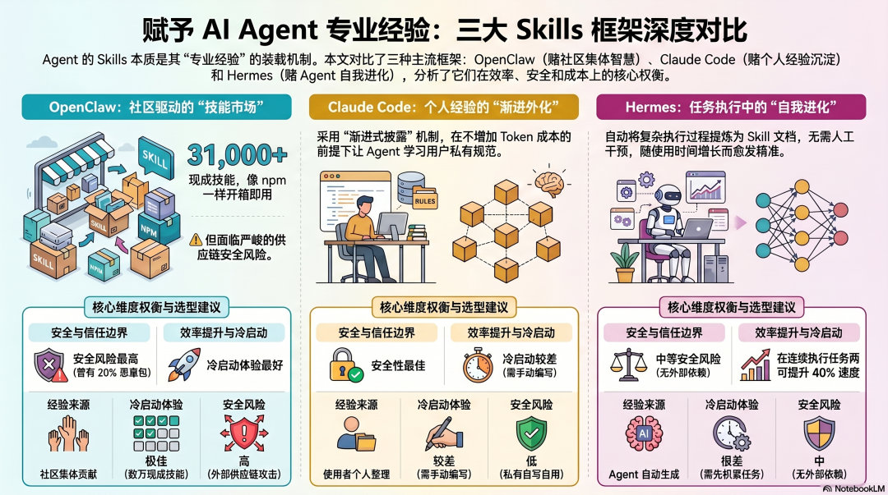
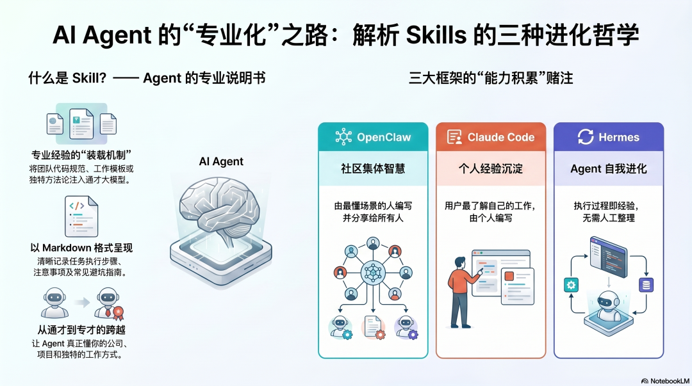
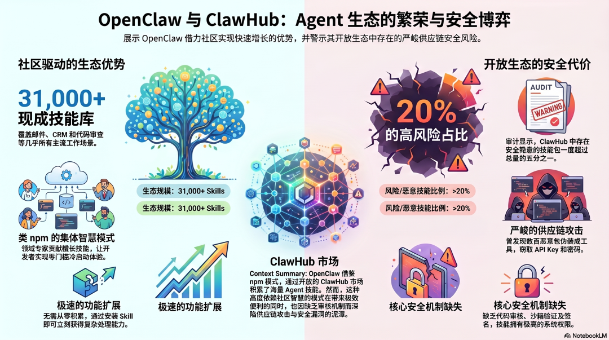
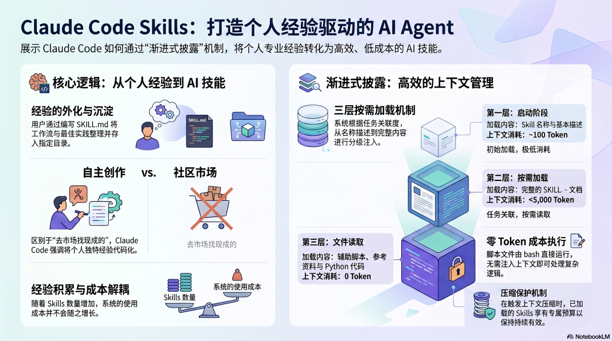
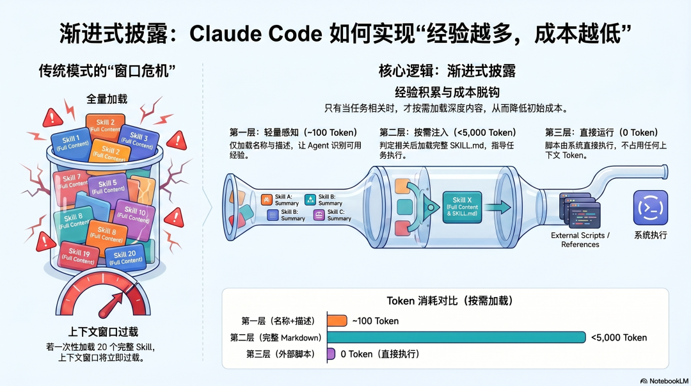
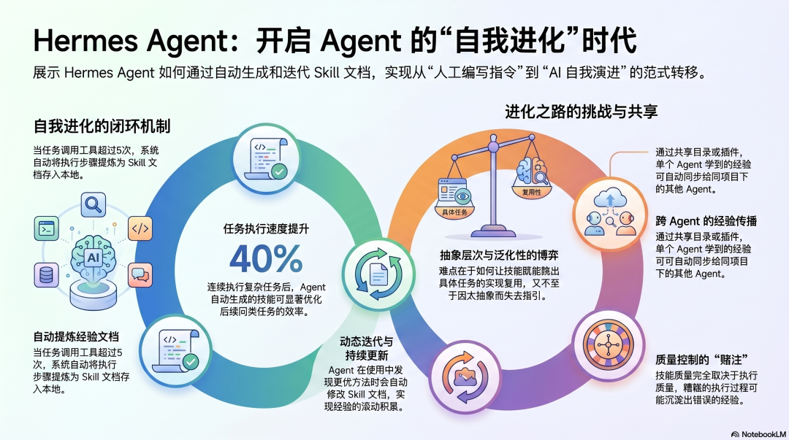
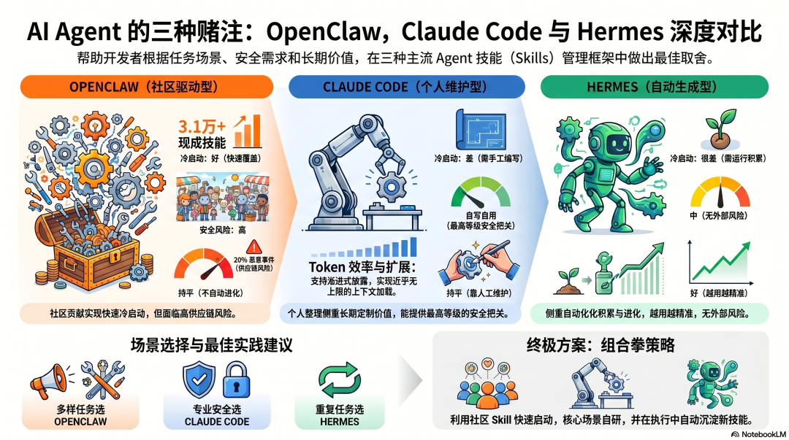

# AI Agent 架构设计（七）：Skills 系统设计（OpenClaw、Claude Code、Hermes Agent 对比）

<p class="protocol-subtitle"><strong>Skills 不是一份普通的说明书，而是 Agent 如何积累专业经验、沉淀方法论、跨任务复用能力的核心机制。</strong></p>

<div class="protocol-figure">
  
  <p><sub>导图：这一篇讨论的不是“Skill 文件怎么写”，而是 Agent 的专业经验到底应该从社区、个人，还是执行过程本身中长出来。</sub></p>
</div>

<div class="protocol-meta-card">
  <ul>
    <li><strong>系列</strong>：AI Agent 架构设计（七）：Skills 系统设计</li>
    <li><strong>核心问题</strong>：Agent 的“专业经验”应该从哪里来，又该如何稳定地在后续任务中复用？</li>
    <li><strong>你会看到</strong>：OpenClaw 的社区市场、Claude Code 的个人经验沉淀、Hermes Agent 的自动技能生成</li>
    <li><strong>适合</strong>：正在搭建 Agent 工作流，想真正理解 Skill / SKILL.md / 经验复用机制的读者</li>
    <li><strong>预计阅读</strong>：15 分钟</li>
  </ul>
</div>

---

## Skills 到底在解决什么问题

<div class="protocol-figure">
  
  <p><sub>图 1：模型是通才，但它并不了解你的公司知识、团队规范和个人工作方法，Skills 负责把这些经验装进 Agent。</sub></p>
</div>

语言模型天然是通才。它知道怎么写代码、怎么回答问题、怎么调用工具，但它并不知道你的团队怎么命名分支、怎么写周报、怎么跑发布流程，也不知道你做某类任务时积累下来的那些“只在这个上下文里才成立”的经验。

这正是 Skills 的价值所在。

一个 Skill 的表面形式通常很简单：一份 Markdown 文档，或者一套带有说明、脚本与参考资料的目录结构。Agent 在需要的时候加载它，照着里面的方法做事。

但真正值得讨论的，不是 Skill 文件长什么样，而是下面这个问题：

<div class="protocol-callout">
  <strong>真正的关键：</strong>Skill 不是“再写一篇文档”，而是决定 Agent 的专业经验到底从哪里来，以及这些经验怎样被持续复用。
</div>

围绕这个问题，主流框架给出了三种完全不同的答案：

- OpenClaw 把答案押在社区：让最懂某个场景的人，把经验写成可安装的 Skill，供所有人复用。
- Claude Code 把答案押在使用者自己：你最懂自己的项目和流程，所以最好的 Skill 应该由你来沉淀。
- Hermes Agent 把答案押在 Agent 自己：执行过程本身就是经验来源，Skill 应该从真实任务中自动生长出来。

这三种路径，决定了三个框架在生态、成本、安全和演化方式上的全部分歧。

---

## OpenClaw：把经验来源交给社区

<div class="protocol-figure">
  
  <p><sub>图 2：OpenClaw 通过 ClawHub 继承社区技能生态，冷启动极强，但同时把信任边界也交给了外部市场。</sub></p>
</div>

### ClawHub：Agent 世界里的 npm

OpenClaw 的思路非常直接：既然不同场景的专业知识高度分散，那就不要要求每个人都自己从零写 Skill，而是建立一个开放市场，让社区中最懂这个场景的人来提供现成经验。

ClawHub 就承担了这个角色。邮件处理、CRM、代码审查、数据分析、知识整理……用户装上 OpenClaw 后，可以直接从市场里安装现成 Skill，快速覆盖大量任务。

这条路的最大优势是冷启动体验。

- 你不需要先学会怎么写 Skill。
- 你也不需要先把经验系统化整理出来。
- 只要找到对应场景的 Skill，装上就能用。

这和 npm、Homebrew、VS Code 插件市场背后的逻辑很像：让经验先商品化、模块化、标准化，再让更多人低成本复用。

### 开放生态的代价：供应链风险

但社区路径也有非常明确的代价。

OpenClaw 把“经验来源”外包给市场，同时也把“信任边界”扩展给了外部作者。安装一个 Skill，本质上就是在自己的工作环境里执行别人提供的逻辑。如果审核、签名、隔离和追溯机制跟不上，生态规模越大，风险就越难控制。

<div class="protocol-highlight">
  <p>社区驱动让 Skills 生态扩张得最快，但它的前提不是“大家都很聪明”，而是“你愿意承担外部经验进入本地环境的风险”。</p>
</div>

因此，OpenClaw 很适合需要快速覆盖多种任务类型的团队，但它也要求你对每一个安装进来的 Skill 做更严格的来源审查、权限约束和供应链治理。

---

## Claude Code：把经验沉淀为自己的工作方法

<div class="protocol-figure">
  
  <p><sub>图 3：Claude Code 更强调“把自己的方法整理出来”——Skill 是个人或团队经验的外化，而不是从市场里捞现成答案。</sub></p>
</div>

### 你自己写，Agent 才真正学会你的工作方式

Claude Code 的核心假设和 OpenClaw 完全相反。

它认为最关键的经验往往不是通用知识，而是和你的团队、仓库、工具链、协作方式深度绑定的那一部分。也因此，最准确的 Skill 通常不该来自外部市场，而应该来自你自己。

这也是为什么 Claude Code 把 `SKILL.md`、参考文件、脚本目录、模板目录组织成一整套工作机制：你写下规范、附上脚本、补充参考资料，Agent 就能在任务中按你的方法工作。

这种路线的优势非常明显：

- 经验更贴近真实工作流，而不是“对所有人都差不多有用”的泛化版本。
- 安全边界更清晰，Skill 的来源由你自己或团队控制。
- 随着项目推进，Skills 会逐渐变成团队的操作手册与自动化知识库。

代价也同样明显：门槛更高。你要会写，也要愿意写，还要知道什么信息值得沉淀成 Skill。

### 渐进式披露：经验越多，上下文成本不一定越高

<div class="protocol-figure">
  
  <p><sub>图 4：Claude Code 通过 Progressive Disclosure 把 Skill 拆成多层加载，让“经验库越大”不再等于“上下文永远更贵”。</sub></p>
</div>

Claude Code 在 Skills 设计上最值得关注的一点，是它并没有把所有经验一次性塞进上下文，而是做了渐进式披露（Progressive Disclosure）：

```text
第一层（启动时，约 100 Token）
只加载 Skill 名称与简介
Agent 知道“有哪些经验可用”

第二层（按需加载，通常小于 5,000 Token）
只在当前任务相关时加载完整 SKILL.md
Agent 按说明执行

第三层（直接读取文件系统）
scripts/、templates/、references/ 等辅助内容
不直接注入上下文，按需读取或执行
```

这个设计解决了一个非常现实的问题：当个人或团队积累的 Skills 越来越多时，系统不必为了“经验更丰富”而承受线性上涨的上下文成本。

尤其是第三层很关键。脚本、模板和参考资料可以很大，但它们并不需要在推理时全部塞给模型，只在真正需要时再读取或执行即可。这样，Skill 可以很重，使用时却不一定很贵。

### Compaction 之后，经验仍然能持续生效

Claude Code 还额外解决了一个长任务问题：当上下文压缩（Compaction）发生时，当前任务已经加载过的 Skills 不会直接失效，而是会以受控预算继续保留关键部分。

这意味着：

- 你花时间写进去的约束，不会因为任务拉长就突然丢失。
- 一次会话里学到的方法，能在更长的执行周期中持续生效。
- Skill 不只是“启动时的提示词补丁”，而是完整工作周期里的持久规则层。

---

## Hermes Agent：让 Skill 从执行过程里自动长出来

<div class="protocol-figure">
  
  <p><sub>图 5：Hermes Agent 的独特之处在于，它把真实任务执行过程直接转成 Skill，并在后续任务里继续更新这份经验。</sub></p>
</div>

### 最大的颠覆：经验为什么一定要由人来写

Hermes Agent 挑战了另外两个框架默认接受的前提：为什么 Skills 必须由人来整理？

如果 Agent 在执行复杂任务时，本来就会经历“试错—修正—完成”的过程，那么最有价值的经验，也许恰恰不是事先写好的说明书，而是任务完成后自动沉淀出来的那份方法总结。

Hermes 的做法就是把这一点推到底：

- 当 Agent 完成足够复杂的任务后，系统自动提炼执行过程。
- 提炼结果会变成 Skill 文档，存放到技能目录中。
- 当后续任务相似时，再自动加载这些经验。
- 如果 Agent 在后续执行里找到了更好的方法，还会继续更新同一份 Skill。

这是一条典型的“自我进化”路线。Skill 不再只是人为维护的静态文档，而是任务历史不断压缩后的经验结晶。

### 真正难的不是生成，而是判断质量

Hermes 这条路最难的地方，不在“能不能自动写出一份文档”，而在“写出来的到底是不是值得复用的经验”。

主要难点集中在三个问题上：

1. <strong>什么任务值得生成 Skill</strong>：如果门槛太低，会沉淀大量噪音；门槛太高，又会错过真正有价值的经验。
2. <strong>抽象层次怎么拿捏</strong>：太具体，只能复现某一次任务；太抽象，又无法为下一次执行提供足够指引。
3. <strong>质量如何保障</strong>：如果原始执行本身有偏差，那么自动生成的 Skill 也可能把错误方法固化下来。

<div class="protocol-callout">
  <strong>Hermes 的最大风险：</strong>只有当执行质量本身足够高时，“自动沉淀经验”这件事才成立。否则，自我进化也可能演变成自我强化错误。
</div>

### 共享目录让经验开始跨 Agent 流动

Hermes 另一个很有意思的方向，是让 Skills 不只服务当前 Agent，而是通过共享目录或社区插件在多个 Agent 之间传播。

这意味着“一个 Agent 学到的东西，其他 Agent 也能受益”。从工程视角看，这相当于把 Agent 的执行历史，转化成可扩散、可继承的组织经验层。

---

## 三种赌注，三种取舍

<div class="protocol-figure">
  
  <p><sub>图 6：OpenClaw、Claude Code、Hermes Agent 在生态速度、经验精度、安全边界与自我演化能力上，分别押了不同的重心。</sub></p>
</div>

把三种路线放在一起看，会发现这不是“谁更先进”的问题，而是三种不同的工程赌注：

| 路线 | 经验主要来源 | 最大优势 | 最大风险 | 更适合的场景 |
| ---- | ---- | ---- | ---- | ---- |
| OpenClaw | 社区市场 | 冷启动快、覆盖广 | 供应链与权限风险更高 | 任务类型很多、希望快速装配能力 |
| Claude Code | 个人 / 团队沉淀 | 经验精确、边界清晰、可深度定制 | 需要投入整理成本 | 对质量、安全、团队流程要求高 |
| Hermes Agent | 执行过程自动生成 | 能随任务持续进化 | 质量控制最难 | 重复任务多、愿意长期训练 Agent |

这也是为什么现实世界里，最成熟的做法通常不是单选，而是组合：

- 用社区 Skills 快速覆盖通用能力。
- 用自己写的 Skills 固化核心流程与高价值经验。
- 再让 Agent 把真实执行中冒出来的新方法继续沉淀下来。

<div class="protocol-highlight">
  <p>Skills 的未来，很可能不是“社区 / 个人 / 自进化”三选一，而是三条路径同时存在，再通过统一格式与更稳定的经验治理机制把它们连起来。</p>
</div>

当 Skills 的格式逐渐向开放标准靠拢，跨框架复用也会越来越现实。到那时，Skill 不只是某个产品里的功能组件，而会变成 Agent 生态里的通用经验单元。

---

## 总结

这一篇最重要的价值，不是在介绍某个 `SKILL.md` 应该怎么写，而是在拆清楚 Skills 背后的三种系统设计哲学：

1. <strong>OpenClaw 的答案</strong>：让社区成为经验池，换来最快的能力覆盖速度。
2. <strong>Claude Code 的答案</strong>：让使用者把自己的方法写出来，换来最精准、最可控的工作流沉淀。
3. <strong>Hermes Agent 的答案</strong>：让执行过程自己长出 Skill，换来持续演化的可能性。
4. <strong>真正成熟的方向</strong>：不是替某一种下注站队，而是让通用能力、私有经验和自动沉淀在同一套工程体系里协同工作。

如果把全文压缩成一句话，那就是：<strong>Skills 设计的本质，不是“怎么写一份说明书”，而是 Agent 应该如何获得、保存并复用专业经验。</strong>

<style>
.protocol-kicker {
  margin: 0 0 10px;
  text-align: center;
  color: #b56a41;
  font-size: 0.82rem;
  letter-spacing: 0.18em;
  text-transform: uppercase;
}

.protocol-subtitle {
  margin: -4px 0 20px;
  text-align: center;
  color: #7c5034;
  font-size: 1.05rem;
  letter-spacing: 0.02em;
}

.protocol-callout,
.protocol-highlight {
  margin: 22px 0 26px;
  padding: 16px 18px;
  border-radius: 18px;
}

.protocol-callout {
  background: linear-gradient(135deg, rgba(255, 245, 238, 0.96), rgba(255, 255, 255, 0.98));
  border: 1px solid rgba(223, 129, 79, 0.22);
  color: #7f4b31;
  box-shadow: 0 10px 24px rgba(179, 93, 55, 0.06);
}

.protocol-callout strong {
  color: #b35e34;
}

.protocol-highlight {
  position: relative;
  background: linear-gradient(135deg, rgba(223, 129, 79, 0.14), rgba(255, 243, 234, 0.92));
  border: 1px solid rgba(223, 129, 79, 0.26);
  box-shadow: 0 14px 28px rgba(164, 86, 49, 0.08);
}

.protocol-highlight::before {
  content: "“";
  position: absolute;
  top: -18px;
  left: 14px;
  font-size: 3rem;
  line-height: 1;
  color: rgba(223, 129, 79, 0.34);
  font-family: Georgia, serif;
}

.protocol-highlight p,
.protocol-callout p {
  margin: 0;
  line-height: 1.85;
}

.protocol-highlight p {
  color: #7b452c;
  font-weight: 600;
}

.protocol-cover,
.protocol-figure {
  margin: 28px auto;
  padding: 14px;
  border-radius: 20px;
  background: linear-gradient(180deg, #fff7f1 0%, #ffffff 100%);
  border: 1px solid rgba(226, 145, 97, 0.26);
  box-shadow: 0 14px 34px rgba(150, 78, 41, 0.08);
  overflow: hidden;
}

.protocol-cover img,
.protocol-figure img {
  display: block;
  width: 100% !important;
  max-height: none !important;
  margin: 0 auto;
  border-radius: 12px;
}

.protocol-cover p,
.protocol-figure p {
  margin: 12px 6px 2px;
  text-align: center;
  color: #8a4c2d;
  font-size: 0.94rem;
  line-height: 1.7;
}

.protocol-meta-card {
  margin: 20px 0 28px;
  padding: 18px 20px;
  background: linear-gradient(135deg, rgba(255, 240, 232, 0.95), rgba(255, 255, 255, 0.98));
  border: 1px solid rgba(223, 129, 79, 0.28);
  border-radius: 18px;
  box-shadow: 0 10px 28px rgba(179, 93, 55, 0.08);
}

.protocol-meta-card ul {
  margin: 0;
  padding-left: 1.1rem;
}

.protocol-meta-card li {
  margin: 0.45rem 0;
  line-height: 1.75;
}

.vp-doc h2 {
  margin-top: 42px;
  padding-left: 14px;
  border-left: 4px solid #df814f;
}

.vp-doc h3 {
  margin-top: 28px;
}

.vp-doc blockquote {
  border-left: 4px solid #df814f;
  background: rgba(255, 241, 234, 0.76);
  border-radius: 0 14px 14px 0;
  padding: 10px 16px;
}

.vp-doc table {
  border-radius: 12px;
  overflow: hidden;
}

.vp-doc tr:nth-child(2n) {
  background-color: rgba(255, 241, 234, 0.42);
}

.dark .protocol-subtitle {
  color: #efc1ab;
}

.dark .protocol-kicker {
  color: #f0b896;
}

.dark .protocol-callout {
  background: linear-gradient(135deg, rgba(88, 42, 24, 0.7), rgba(34, 27, 24, 0.94));
  border-color: rgba(223, 129, 79, 0.22);
  color: #f2d5c7;
}

.dark .protocol-callout strong {
  color: #ffcfb6;
}

.dark .protocol-highlight {
  background: linear-gradient(135deg, rgba(143, 78, 47, 0.36), rgba(46, 33, 29, 0.95));
  border-color: rgba(223, 129, 79, 0.24);
}

.dark .protocol-highlight::before {
  color: rgba(255, 201, 170, 0.28);
}

.dark .protocol-highlight p {
  color: #ffd8c3;
}

.dark .protocol-cover,
.dark .protocol-figure {
  background: linear-gradient(180deg, rgba(82, 37, 24, 0.68), rgba(30, 30, 30, 0.92));
  border-color: rgba(223, 129, 79, 0.26);
  box-shadow: 0 14px 34px rgba(0, 0, 0, 0.28);
}

.dark .protocol-meta-card {
  background: linear-gradient(135deg, rgba(88, 42, 24, 0.86), rgba(30, 30, 30, 0.95));
  border-color: rgba(223, 129, 79, 0.24);
}

.dark .protocol-cover p,
.dark .protocol-figure p {
  color: #f3cbb8;
}

.dark .vp-doc blockquote {
  background: rgba(110, 53, 30, 0.3);
}

@media (max-width: 768px) {
  .protocol-cover,
  .protocol-figure,
  .protocol-meta-card,
  .protocol-callout,
  .protocol-highlight {
    border-radius: 16px;
  }

  .protocol-cover,
  .protocol-figure {
    padding: 10px;
  }

  .protocol-cover p,
  .protocol-figure p {
    margin-top: 10px;
    font-size: 0.9rem;
    line-height: 1.65;
  }
}
</style>
