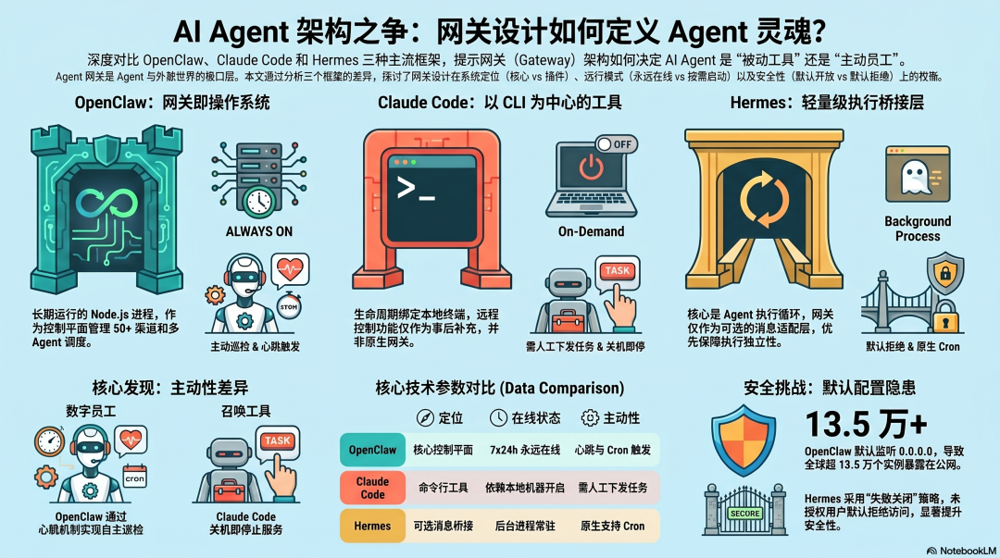
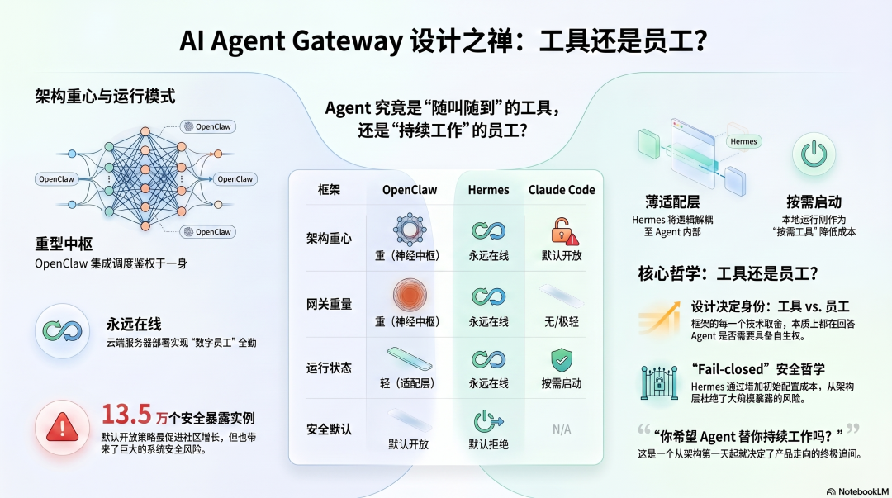
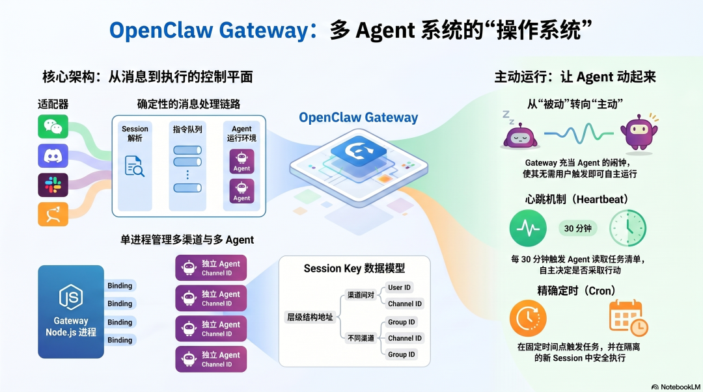
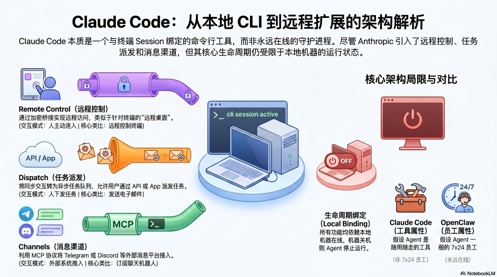
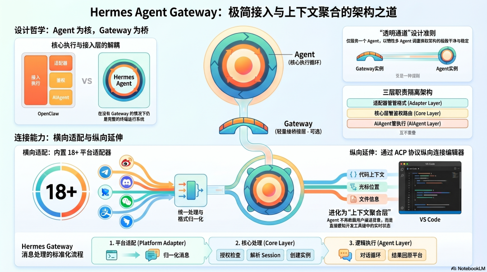

# AI Agent 架构设计（八）：Gateway 架构设计（OpenClaw、Claude Code、Hermes Agent 对比）

<p class="protocol-subtitle"><strong>Gateway 不只是消息入口，它决定 Agent 是一个“等你召唤的工具”，还是一个“持续在岗的数字员工”。</strong></p>

<div class="protocol-figure">
  
  <p><sub>导图：这一篇讨论的不是“怎么接 Telegram / Slack”，而是 Gateway 作为 Agent 与世界之间的入口层，如何反过来塑造整个系统的工作模式。</sub></p>
</div>

<div class="protocol-meta-card">
  <ul>
    <li><strong>系列</strong>：AI Agent 架构设计（八）：Gateway 架构设计</li>
    <li><strong>核心问题</strong>：Gateway 到底只是消息桥，还是 Agent 系统真正的控制平面？</li>
    <li><strong>你会看到</strong>：OpenClaw 的常驻控制平面、Claude Code 的后置远程控制层、Hermes Agent 的轻量桥接模型</li>
    <li><strong>适合</strong>：关心 Agent 接入层、消息路由、多 Agent 调度、长期运行模式的读者</li>
    <li><strong>预计阅读</strong>：15 分钟</li>
  </ul>
</div>

---

## Gateway 的设计哲学，决定了 Agent 是什么

<div class="protocol-figure">
  
  <p><sub>图 1：Gateway 决定消息从哪里来、如何路由、谁有权限触发 Agent，也因此决定了 Agent 究竟是被动响应工具，还是主动工作的系统。</sub></p>
</div>

一个 Agent，到底是“你发消息它才开始动”，还是“它一直在线盯着事情、按规则自主运行”？

这不是一个功能点差异，而是系统设计上的根本分叉。而这个分叉，恰恰藏在 Gateway 的定义里。

Gateway 是 Agent 与外部世界之间的入口层。消息从哪个平台进来、如何完成鉴权、如何解析会话、如何决定应该交给哪个 Agent、结果如何回流——这些问题看似都在“入口”发生，但它们最终决定的是 Agent 的工作形态。

- 如果 Gateway 只是“把消息转进来”，Agent 往往更像一个被动响应的工具。
- 如果 Gateway 还承担路由、定时、调度和状态管理，Agent 就更像一个长期在岗的数字员工。
- 如果 Gateway 只是可选接入方式，而执行循环本身才是核心，那么系统会更偏向“Agent 核心能力优先，入口层尽量薄”。

<div class="protocol-callout">
  <strong>真正的问题：</strong>Gateway 不是“消息接口怎么接”的工程细节，而是在回答“Agent 和世界之间，应该通过一个轻入口连接，还是通过一个长期运行的控制平面连接”。
</div>

这也是为什么 OpenClaw、Claude Code 和 Hermes Agent 在 Gateway 上，做出了三种几乎完全不同的设计取向。

---

## OpenClaw：Gateway 就是系统的操作系统

<div class="protocol-figure">
  
  <p><sub>图 2：OpenClaw 把 Gateway 做成了真正的控制平面：渠道接入、会话解析、命令队列、Agent Runtime 都围绕它运转。</sub></p>
</div>

### 常驻在线的控制平面

OpenClaw 的 Gateway 不是一个可有可无的外设，而是系统最核心的产品层之一。

它通常以长期运行的 Node.js 进程存在，监听固定端口，向外暴露 WebSocket 与 HTTP 能力。消息进来后，不只是简单转发，而是要经历一整条确定性的控制路径：

```text
外部消息（Telegram / Slack / Discord / WhatsApp ...）
        ↓
Channel Bridge（平台适配器）
        ↓
Session Resolution（根据规则解析 session key）
        ↓
Command Queue（串行化执行，避免工具竞争）
        ↓
Agent Runtime（LLM 推理 + 工具执行）
        ↓
结果回流原渠道
```

这意味着 OpenClaw 的 Gateway 本质上不是“消息入口”，而是一个明确的控制平面。谁能进来、进来之后落到哪个上下文、能触发什么逻辑，都先由 Gateway 决定，而不是让模型临场去猜。

### 多渠道、多 Agent、一个进程统一调度

OpenClaw 最有代表性的能力，是它把多个渠道和多个 Agent 放进同一个持续运行的控制中心里。

不同渠道、不同账号、不同工作区，可以通过 bindings 规则精确路由到不同 Agent。每个 Agent 又拥有自己的 workspace、会话历史和权限上下文。这样一来，Gateway 不只是处理接入，它还天然承担了“调度中心”的角色。

这种设计带来几个非常强的特性：

- <strong>确定性路由</strong>：Slack、Telegram、WhatsApp 等外部来源可以稳定映射到不同 Agent。
- <strong>上下文隔离</strong>：session key 成为统一数据模型，不同渠道、不同对话天然分开。
- <strong>单点治理</strong>：你可以在一个 Gateway 进程中统一配置接入、鉴权、路由与执行边界。

### 心跳与 Cron，把 Agent 从被动响应变成主动运行

OpenClaw 的 Gateway 还有一个决定性价值：它不仅接消息，还负责“叫醒 Agent”。

- <strong>Heartbeat</strong>：按固定节奏唤醒 Agent，让它检查有没有需要自主处理的事情。
- <strong>Cron</strong>：在明确时间点触发任务，并将每次运行放入隔离会话中。

这一步非常关键。因为一旦 Gateway 既能收消息，又能定时触发，那么 Agent 的存在方式就从“对话工具”升级成了“持续工作的系统”。

<div class="protocol-highlight">
  <p>OpenClaw 最大的 Gateway 洞察，不是“支持很多渠道”，而是把 Gateway 变成了多 Agent 系统的控制平面与主动运行调度中心。</p>
</div>

---

## Claude Code：它一开始没有 Gateway

<div class="protocol-figure">
  
  <p><sub>图 3：Claude Code 的核心从来不是 Gateway，而是本地 CLI 会话；远程控制、Dispatch 与 Channels 更像后续补上的远程接入能力。</sub></p>
</div>

### 本质上是 CLI 工具，而不是守护进程

Claude Code 的出发点和 OpenClaw 完全不同。

它首先是一个命令行工具。你打开终端、运行 `claude`、开始对话；你关闭终端，会话生命周期也就基本结束。它并没有预设一个长期在线、常驻监听、负责全局路由的 Gateway 层。

这意味着 Claude Code 默认假设的是：

- Agent 是你工作时主动调用的工具。
- 生命周期和本地终端 session 深度绑定。
- “一直在线”不是默认能力，而是后续用户需求推动下再补进去的能力。

### 三种远程能力，本质上是“后来才长出来的 Gateway”

随着用户开始需要远程接入、异步派发和渠道消息控制，Claude Code 逐步补出了三种不同形态的能力层：

- <strong>Remote Control</strong>：让你从另一台设备连接到当前运行中的本地 session，像远程操控终端。
- <strong>Dispatch</strong>：允许你把任务异步丢给 Claude Code 执行，再等待结果返回。
- <strong>Channels</strong>：通过消息平台把外部输入接进 Claude Code，让 Telegram 或 Discord 也能成为操作入口。

但这些能力并没有把 Claude Code 彻底改造成 OpenClaw 那种 Gateway-first 架构。它们更像是在 CLI 主体外，再补上一层远程控制与外部连接能力。

### 它的限制，也恰恰来自这个出发点

Claude Code 这条路线的根本限制是：它仍然高度依赖本地机器在线。

如果本地机器关闭、桌面应用不运行、终端 session 不存在，那么远程控制、任务派发、消息通道这些能力都会受到影响。也就是说，它虽然已经拥有了某种“Gateway 能力”，但这层能力仍然不是一个真正独立、可长期部署、可 7×24 运行的控制平面。

所以 Claude Code 给出的答案其实很清晰：

- 默认情况下，Agent 是工具，不是员工。
- 远程接入可以有，但它是对 CLI 主体的补充，不是整个系统的中枢。
- Gateway 不是它的基础架构前提，而是它在真实使用需求推动下逐渐拼接出来的扩展层。

---

## Hermes Agent：Gateway 只是一个轻量桥接层

<div class="protocol-figure">
  
  <p><sub>图 4：Hermes Agent 的优先级和 OpenClaw 相反——AIAgent 执行循环是核心，Gateway 只是把平台消息接进来的一层薄桥接。</sub></p>
</div>

### 核心不在 Gateway，而在 AIAgent 执行循环

Hermes Agent 的设计优先级几乎和 OpenClaw 反过来。

在 Hermes 里，真正的核心是 AIAgent 执行循环本身。即使你完全不用 Gateway，直接在终端中运行 Hermes，它仍然是一个完整的 Agent 系统。Gateway 只是多出来的一种接入方式。

这件事会直接影响整个架构的复杂度分配：

- OpenClaw 没有 Gateway，系统几乎就不存在。
- Hermes 没有 Gateway，系统依旧成立。
- 所以 Hermes 的 Gateway 天然会被设计得更薄、更克制、更像一个适配层。

### 统一接平台消息，但不承担调度中心职责

Hermes Gateway 同样可以接多个平台，但它更强调的是“统一格式归一化 + 会话路由 + 结果回推”这三件事，而不是在 Gateway 内部承载重调度逻辑。

典型路径更像这样：

```text
平台消息
    ↓
Platform Adapter（消息格式归一化）
    ↓
授权检查 + session 解析
    ↓
创建或调用 AIAgent 实例
    ↓
执行会话循环
    ↓
结果回推原平台
```

这里最值得注意的是职责边界：

- 平台适配器负责“把消息翻译成统一格式”。
- Gateway 核心负责“鉴权、路由、实例接入”。
- AIAgent 负责“真正执行”。

正因为 Gateway 不承担过多控制逻辑，Hermes 才能在支持平台不断增加时，保持相对干净的结构。

### 干净架构的代价：单 Agent 边界更明显

这种薄 Gateway 设计当然也不是没有代价。

因为它不承担真正的调度中心职责，所以一个 Gateway 实例和一个 Agent 实例之间的绑定关系会更紧。要把“工作 Agent”和“个人 Agent”完全分开，你往往更容易想到的是分别启动不同实例，而不是像 OpenClaw 那样在一个控制平面里用绑定规则统一调度。

但 Hermes 有一个非常有意思的延伸方向：它不仅横向接消息平台，还能纵向接开发工具链。通过 ACP 等机制，编辑器上下文也能被纳入 Agent 的入口层，这让 Gateway 开始从“消息桥”进一步演化成“上下文聚合层”。

<div class="protocol-callout">
  <strong>Hermes 的关键判断：</strong>Gateway 不是系统核心，它的任务是把世界稳定地接进来；真正决定 Agent 能力上限的，还是执行循环本身。
</div>

---

## 三种 Gateway 路线的核心取舍

<div class="protocol-figure">
  
  <p><sub>图 5：OpenClaw、Claude Code、Hermes Agent 在“Gateway 是核心还是入口”“是否长期在线”“默认开放还是默认收紧”三个维度上给出了不同答案。</sub></p>
</div>

把这三条路线放在一起看，会发现它们真正分歧的不是“谁支持的平台更多”，而是以下三组根本取舍。

### 取舍一：Gateway 是系统核心，还是接入入口

- <strong>OpenClaw</strong>：Gateway 是神经中枢，承载调度、路由、鉴权、多 Agent 管理。
- <strong>Claude Code</strong>：Gateway 不是架构原点，而是围绕 CLI 工具逐步补出的远程能力层。
- <strong>Hermes Agent</strong>：Gateway 是薄入口，执行循环才是绝对核心。

Gateway 越重，系统越集中，配置越复杂，但统一控制能力越强。Gateway 越轻，Agent 核心越独立，系统也越容易拆分、替换和测试。

### 取舍二：Agent 应该永远在线，还是按需启动

- <strong>OpenClaw</strong> 与 <strong>Hermes</strong> 更适合部署在服务器上长期运行。
- <strong>Claude Code</strong> 天然偏向“本地机器在线时才工作”的工具模式。

永远在线意味着更高的运维与安全暴露面，但也换来了主动性；按需启动更轻，但会失去很多自动调度与离线持续工作的能力。

### 取舍三：默认开放，还是默认收紧

Gateway 还是系统暴露面最直接的一层，因此默认开放还是默认拒绝，会直接影响安全风险。

- 更开放的默认策略，能让接入更快，但也更容易在真实部署中被暴露。
- 更保守的 fail-closed 策略，会增加配置门槛，但能从架构层面压住风险扩散。

这件事并不只是“安全选项”，而是系统哲学的投影：你到底希望 Agent 被当作一个灵活试验工具，还是一个需要持续稳定运营的生产系统。

<div class="protocol-highlight">
  <p>Gateway 设计归根到底在回答同一个问题：你想让 Agent 成为“你召唤时出现的工具”，还是“即使你不在，它也持续工作的员工”。</p>
</div>

三个框架在这个问题上的不同答案，也让它们从一开始就走向了完全不同的系统形态。

---

## 总结

这一篇最重要的价值，不是在罗列三个框架支持哪些消息平台，而是在拆清楚 Gateway 背后的三种架构判断：

1. <strong>OpenClaw 的答案</strong>：Gateway 是操作系统级控制平面，多渠道、多 Agent、主动调度都围绕它组织。
2. <strong>Claude Code 的答案</strong>：CLI 才是系统起点，Gateway 能力是围绕真实需求逐步补出来的远程控制扩展层。
3. <strong>Hermes Agent 的答案</strong>：Gateway 只是薄薄的桥接层，真正的核心永远是 AIAgent 执行循环本身。
4. <strong>最本质的取舍</strong>：不是“接哪个平台”，而是你的 Agent 究竟是一个对话工具、一个长期运行系统，还是一个以执行循环为中心、入口层尽量轻量的架构体。

如果把全文压缩成一句话，那就是：<strong>Gateway 的设计哲学，最终决定了 Agent 是什么。</strong>

<style>
.protocol-kicker {
  margin: 0 0 10px;
  text-align: center;
  color: #b56a41;
  font-size: 0.82rem;
  letter-spacing: 0.18em;
  text-transform: uppercase;
}

.protocol-subtitle {
  margin: -4px 0 20px;
  text-align: center;
  color: #7c5034;
  font-size: 1.05rem;
  letter-spacing: 0.02em;
}

.protocol-callout,
.protocol-highlight {
  margin: 22px 0 26px;
  padding: 16px 18px;
  border-radius: 18px;
}

.protocol-callout {
  background: linear-gradient(135deg, rgba(255, 245, 238, 0.96), rgba(255, 255, 255, 0.98));
  border: 1px solid rgba(223, 129, 79, 0.22);
  color: #7f4b31;
  box-shadow: 0 10px 24px rgba(179, 93, 55, 0.06);
}

.protocol-callout strong {
  color: #b35e34;
}

.protocol-highlight {
  position: relative;
  background: linear-gradient(135deg, rgba(223, 129, 79, 0.14), rgba(255, 243, 234, 0.92));
  border: 1px solid rgba(223, 129, 79, 0.26);
  box-shadow: 0 14px 28px rgba(164, 86, 49, 0.08);
}

.protocol-highlight::before {
  content: "“";
  position: absolute;
  top: -18px;
  left: 14px;
  font-size: 3rem;
  line-height: 1;
  color: rgba(223, 129, 79, 0.34);
  font-family: Georgia, serif;
}

.protocol-highlight p,
.protocol-callout p {
  margin: 0;
  line-height: 1.85;
}

.protocol-highlight p {
  color: #7b452c;
  font-weight: 600;
}

.protocol-cover,
.protocol-figure {
  margin: 28px auto;
  padding: 14px;
  border-radius: 20px;
  background: linear-gradient(180deg, #fff7f1 0%, #ffffff 100%);
  border: 1px solid rgba(226, 145, 97, 0.26);
  box-shadow: 0 14px 34px rgba(150, 78, 41, 0.08);
  overflow: hidden;
}

.protocol-cover img,
.protocol-figure img {
  display: block;
  width: 100% !important;
  max-height: none !important;
  margin: 0 auto;
  border-radius: 12px;
}

.protocol-cover p,
.protocol-figure p {
  margin: 12px 6px 2px;
  text-align: center;
  color: #8a4c2d;
  font-size: 0.94rem;
  line-height: 1.7;
}

.protocol-meta-card {
  margin: 20px 0 28px;
  padding: 18px 20px;
  background: linear-gradient(135deg, rgba(255, 240, 232, 0.95), rgba(255, 255, 255, 0.98));
  border: 1px solid rgba(223, 129, 79, 0.28);
  border-radius: 18px;
  box-shadow: 0 10px 28px rgba(179, 93, 55, 0.08);
}

.protocol-meta-card ul {
  margin: 0;
  padding-left: 1.1rem;
}

.protocol-meta-card li {
  margin: 0.45rem 0;
  line-height: 1.75;
}

.vp-doc h2 {
  margin-top: 42px;
  padding-left: 14px;
  border-left: 4px solid #df814f;
}

.vp-doc h3 {
  margin-top: 28px;
}

.vp-doc blockquote {
  border-left: 4px solid #df814f;
  background: rgba(255, 241, 234, 0.76);
  border-radius: 0 14px 14px 0;
  padding: 10px 16px;
}

.vp-doc table {
  border-radius: 12px;
  overflow: hidden;
}

.vp-doc tr:nth-child(2n) {
  background-color: rgba(255, 241, 234, 0.42);
}

.dark .protocol-subtitle {
  color: #efc1ab;
}

.dark .protocol-kicker {
  color: #f0b896;
}

.dark .protocol-callout {
  background: linear-gradient(135deg, rgba(88, 42, 24, 0.7), rgba(34, 27, 24, 0.94));
  border-color: rgba(223, 129, 79, 0.22);
  color: #f2d5c7;
}

.dark .protocol-callout strong {
  color: #ffcfb6;
}

.dark .protocol-highlight {
  background: linear-gradient(135deg, rgba(143, 78, 47, 0.36), rgba(46, 33, 29, 0.95));
  border-color: rgba(223, 129, 79, 0.24);
}

.dark .protocol-highlight::before {
  color: rgba(255, 201, 170, 0.28);
}

.dark .protocol-highlight p {
  color: #ffd8c3;
}

.dark .protocol-cover,
.dark .protocol-figure {
  background: linear-gradient(180deg, rgba(82, 37, 24, 0.68), rgba(30, 30, 30, 0.92));
  border-color: rgba(223, 129, 79, 0.26);
  box-shadow: 0 14px 34px rgba(0, 0, 0, 0.28);
}

.dark .protocol-meta-card {
  background: linear-gradient(135deg, rgba(88, 42, 24, 0.86), rgba(30, 30, 30, 0.95));
  border-color: rgba(223, 129, 79, 0.24);
}

.dark .protocol-cover p,
.dark .protocol-figure p {
  color: #f3cbb8;
}

.dark .vp-doc blockquote {
  background: rgba(110, 53, 30, 0.3);
}

@media (max-width: 768px) {
  .protocol-cover,
  .protocol-figure,
  .protocol-meta-card,
  .protocol-callout,
  .protocol-highlight {
    border-radius: 16px;
  }

  .protocol-cover,
  .protocol-figure {
    padding: 10px;
  }

  .protocol-cover p,
  .protocol-figure p {
    margin-top: 10px;
    font-size: 0.9rem;
    line-height: 1.65;
  }
}
</style>
