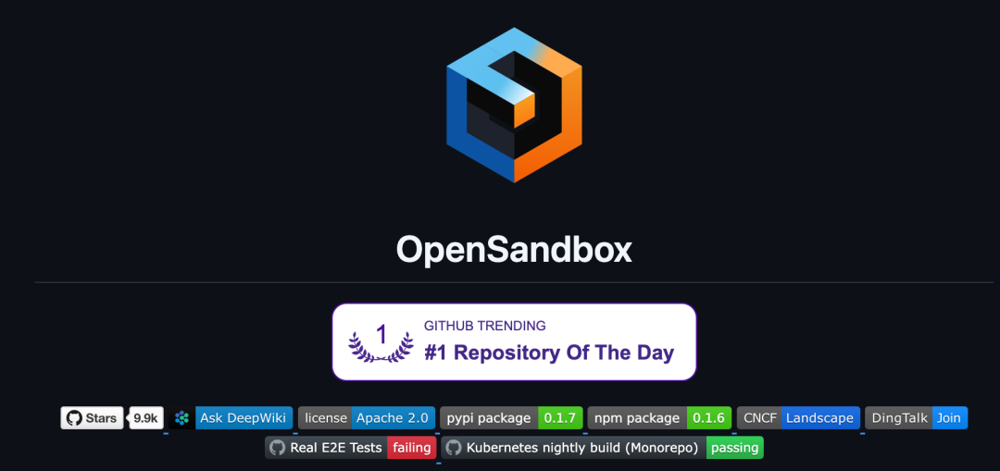
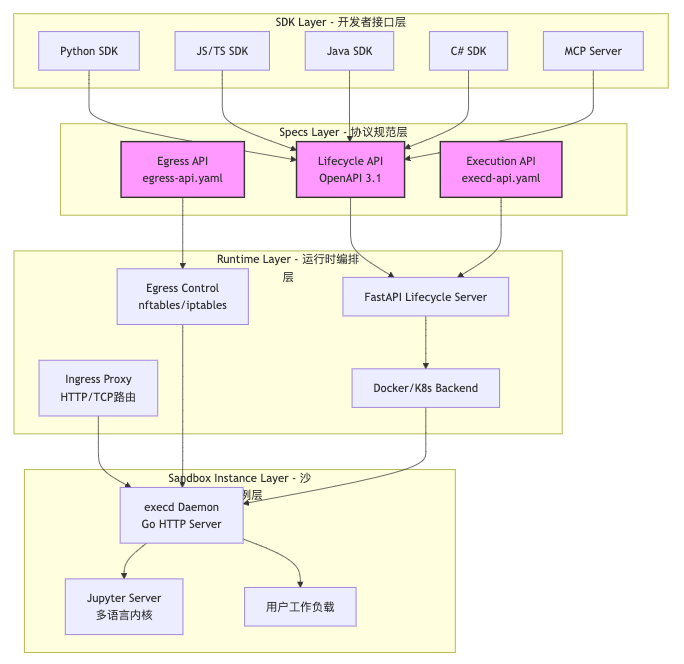
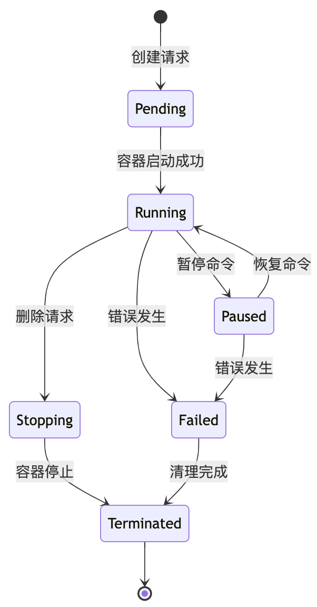

# 阿里重磅开源！揭秘AI时代的"核反应堆"：OpenSandbox万星爆款技术全解析

<AiPickArticle>

<AiPickCover
  eyebrow="AI 开源精选集 · 第一篇"
  title="OpenSandbox"
  description="一个面向 AI Agent 的通用沙箱平台，把代码执行、浏览器自动化、远程开发环境和网络边界控制，收束进一套可编排、可扩展、可审计的基础设施。"
  :chips='["协议优先", "四层架构", "安全容器", "Kubernetes 原生"]'
/>

<AiPickSummaryGrid
  :items='[
    { "label": "一句话判断", "value": "它不是 Docker 包装层，而是 Agent 执行环境的控制平面。" },
    { "label": "最值得看", "value": "Lifecycle / Execd / Egress 三套 API 如何共同定义沙箱边界。" },
    { "label": "适合谁读", "value": "做代码执行、远程开发、浏览器自动化、Code Interpreter 与 Agent Runtime 的工程团队。" },
    { "label": "工程启发", "value": "把运行什么和能访问什么拆成协议、运行时、网络与实例层分别治理。" }
  ]'
/>

> **导读**：当AI Agent能够自主执行代码时，谁来保证你的服务器不会变成"肉鸡"？阿里巴巴刚刚开源的OpenSandbox，用一套四层架构给出了答案。本文将带你深入源码，看穿这个CNCF新晋项目的技术内核。

---

## 一、为什么我们需要沙箱？一个血淋淋的现实

2026年1月，某知名AI编程助手爆出严重安全漏洞：攻击者通过精心构造的提示词，让模型生成了恶意代码，直接读取了服务器上的敏感文件。这不是科幻电影，而是正在发生的现实。

**问题的根源在于**：

- 🚨 **AI生成的代码不可信**：大模型可能被提示词注入攻击，生成`rm -rf /`这样的毁灭性指令
- 🚨 **传统容器隔离不足**：Docker默认配置下，容器逃逸漏洞屡见不鲜
- 🚨 **资源滥用风险**：一段死循环代码就能耗尽你的CPU和内存
- 🚨 **数据泄露隐患**：未隔离的环境可能导致敏感信息跨会话泄露

据安全团队统计，**超过60%的AI代码执行服务曾因隔离不当导致安全事故**。这就是为什么我们需要专业的沙箱平台——它就像核反应堆的控制棒，让AI的能力在安全边界内释放。

---

## 二、OpenSandbox横空出世：阿里千锤百炼的AI基础设施

2026年初，阿里巴巴正式开源了**OpenSandbox** ——一个面向AI应用的通用沙箱平台。项目一经发布便引发轰动，迅速入选**CNCF Landscape**，成为云原生领域的新星。



### 2.1 核心定位

OpenSandbox不是简单的"Docker封装器"，而是一个**协议驱动、生产级**的沙箱平台：

✅ **支持五大AI场景**：

- 编码助手（Claude Code、Gemini CLI、Codex CLI）
- 浏览器自动化（Chrome、Playwright）
- AI代码解释器（多语言代码执行）
- 远程开发环境（VS Code Web、桌面环境）
- 强化学习训练（RL Training）

✅ **从笔记本到K8s集群无缝扩展**：单机开发用Docker，生产部署用Kubernetes

✅ **多语言SDK全覆盖**：Python、JavaScript/TypeScript、Java/Kotlin、C#/.NET，Go SDK在规划中

### 2.2 技术亮点速览

```text
🔐 安全隔离：支持 gVisor、Kata Containers、Firecracker microVM 等安全容器运行时
🌐 网络控制：Ingress 反向代理 + Egress 网络策略双重防护
⚡ 高性能：Go 语言核心组件 + SSE 实时流式传输
🛠️ 易扩展：OpenAPI 3.1 规范定义的四层架构
```

---

## 三、四层架构深度拆解：从SDK到容器的完整链路

OpenSandbox的核心设计哲学是**分层解耦**。整个系统分为四层，每层职责清晰，可以独立替换和扩展。

### 3.1 架构全景图



**数据流向**：

1. 你的应用代码调用SDK（如Python SDK）
2. SDK通过HTTP请求访问Lifecycle API或Execution API
3. Runtime层的FastAPI Server接收请求，调用Docker/K8s API创建容器
4. 容器启动后，execd daemon注入其中，提供执行接口
5. Ingress/Egress侧边车控制网络流量

### 3.2 第一层：SDK Layer —— 让开发者无感接入

SDK层是开发者与OpenSandbox的交互界面。每个语言都有两个包：

**Python示例**：

```python
# 基础沙箱 SDK
from opensandbox import SandboxClient

client = SandboxClient(base_url="http://localhost:8080")

# 创建沙箱
sandbox = client.create(
    image="python:3.11",
    resources={"cpu": "2", "memory": "4Gi"},
    ttl=3600,  # 1 小时后自动销毁
)

# 执行命令
result = sandbox.execute(
    "pip install numpy && python -c 'import numpy as np; print(np.random.rand())'"
)
print(result.stdout)

# 文件操作
sandbox.upload("script.py", "print('hello')")
sandbox.download("output.txt")

# 代码解释器（多语言会话）
from opensandbox_code_interpreter import CodeInterpreter

interpreter = CodeInterpreter(sandbox)
session = interpreter.create_session(language="python")

session.execute("x = 10")
result = session.execute("x * 2")  # 可以访问之前的变量
print(result.output)  # 20
```

**技术细节**：

- 所有SDK都基于**同一套OpenAPI规范** 生成，保证跨语言一致性
- 支持**异步API**，避免阻塞主线程
- 自动处理**认证和重试逻辑**
- MCP（Model Context Protocol）集成，让AI Agent框架（如LangChain）可以直接调用

### 3.3 第二层：Specs Layer —— 协议即契约

这是OpenSandbox最精妙的设计之一。**三个OpenAPI规范** 定义了所有组件的交互协议：

#### Lifecycle API （`sandbox-lifecycle.yml`）

管理沙箱的生命周期，核心端点：

```text
POST   /sandboxes              # 创建沙箱
GET    /sandboxes              # 列出所有沙箱
GET    /sandboxes/{id}         # 获取沙箱详情
DELETE /sandboxes/{id}         # 删除沙箱
POST   /sandboxes/{id}/pause   # 暂停沙箱
POST   /sandboxes/{id}/resume  # 恢复沙箱
POST   /sandboxes/{id}/renew   # 续期 TTL
```

**状态机设计**：



每个状态转换都有明确的触发条件和副作用，确保沙箱管理的可靠性。

#### Execution API （`execd-api.yaml`）

这是execd daemon提供的接口，运行在**每个沙箱容器内部**：

```text
# 命令执行
POST   /exec                   # 执行命令（支持后台/前台）
GET    /exec/{pid}/logs        # 获取实时日志（SSE 流）
POST   /exec/{pid}/kill        # 终止进程

# 文件操作
GET    /files                  # 列出目录
POST   /files/upload           # 上传文件
GET    /files/download         # 下载文件
PUT    /files/rename           # 重命名
DELETE /files                  # 删除文件/目录

# 代码解释器
POST   /kernels                # 创建 Jupyter 内核
POST   /kernels/{id}/execute   # 执行代码
GET    /kernels/{id}/outputs   # 获取输出

# 系统监控
GET    /metrics/cpu            # CPU 使用率
GET    /metrics/memory         # 内存使用
```

**关键技术点**：

- 使用**Server-Sent Events (SSE)** 实现实时日志流，比WebSocket更轻量
- Jupyter内核协议集成，支持Python、Java、JavaScript、Go等多语言
- 文件操作支持glob模式搜索、内容替换、权限修改等高级功能

#### Egress API （`egress-api.yaml`）

控制沙箱的**出站网络流量**：

```text
GET    /egress/policies        # 获取网络策略
POST   /egress/policies        # 创建策略
PUT    /egress/policies/{id}   # 更新策略
DELETE /egress/policies/{id}   # 删除策略
```

策略示例：

```json
{
  "sandbox_id": "sb-123",
  "rules": [
    {
      "direction": "outbound",
      "protocol": "tcp",
      "port_range": "443",
      "cidr": "0.0.0.0/0",
      "action": "allow"
    },
    {
      "direction": "outbound",
      "protocol": "tcp",
      "port_range": "22",
      "cidr": "10.0.0.0/8",
      "action": "deny"
    }
  ]
}
```

### 3.4 第三层：Runtime Layer —— orchestrator的艺术

这一层是OpenSandbox的"大脑"，负责编排和管理所有沙箱实例。

#### FastAPI Lifecycle Server

用Python FastAPI编写，核心职责：

1. **接收SDK请求**：解析OpenAPI规范定义的HTTP请求
2. **调用容器运行时**：通过Docker SDK或Kubernetes Client创建容器
3. **注入execd**：在容器启动时注入execd daemon
4. **配置网络**：设置Ingress/Egress侧边车
5. **状态管理**：维护沙箱元数据（状态、资源使用、TTL等）

**关键代码片段**（简化版）：

```python
# server/opensandbox_server/main.py
from fastapi import FastAPI
from docker import DockerClient
from kubernetes import client as k8s_client

app = FastAPI()

class SandboxManager:
    def __init__(self, runtime: str = "docker"):
        if runtime == "docker":
            self.client = DockerClient.from_env()
        else:
            self.client = k8s_client.CoreV1Api()

    async def create_sandbox(self, spec: SandboxSpec) -> Sandbox:
        # 1. 生成唯一 ID
        sandbox_id = generate_uuid()

        # 2. 准备容器配置
        container_config = {
            "image": spec.image,
            "command": ["/execd"],  # 注入 execd 作为入口点
            "environment": spec.env_vars,
            "labels": {
                "opensandbox.io/sandbox-id": sandbox_id,
                "opensandbox.io/state": "pending",
            },
        }

        # 3. 创建容器
        if isinstance(self.client, DockerClient):
            container = self.client.containers.run(**container_config, detach=True)
        else:
            container = self.client.create_namespaced_pod(
                namespace="sandboxes",
                body=container_config,
            )

        # 4. 等待 execd 就绪
        await wait_for_execd_ready(sandbox_id)

        # 5. 更新状态
        sandbox = Sandbox(id=sandbox_id, container=container, state="running")
        self.update_state(sandbox_id, "running")
        return sandbox

manager = SandboxManager()

@app.post("/sandboxes")
async def create_sandbox(spec: SandboxSpec):
    sandbox = await manager.create_sandbox(spec)
    return sandbox.to_dict()
```

#### Ingress Proxy Gateway

用Go编写的反向代理，负责**外部流量路由到沙箱**：

**工作原理**：

1. 监听80/443端口
2. 根据URL路径解析沙箱ID和端口：`{domain}/sandboxes/{sandboxId}/port/{port}`
3. 动态查找沙箱容器的内部IP和端口
4. 建立反向代理连接

**示例**：

```text
# 访问沙箱 sb-123 中运行的 Web 应用（监听 8080 端口）
GET https://opensandbox.example.com/sandboxes/sb-123/port/8080

# 访问 VNC 桌面（端口 5900）
GET https://opensandbox.example.com/sandboxes/sb-123/port/5900
```

**技术细节**：

- 使用Go的`httputil.ReverseProxy`实现高性能代理
- 支持WebSocket升级（用于VNC、DevTools等）
- 自动TLS终止和证书管理

#### Egress Network Control

同样是Go编写的侧边车，负责**控制沙箱的出站流量**：

**实现机制**：

1. **nftables/iptables规则**：在内核层面过滤网络包
2. **DNS代理**：拦截DNS查询，根据策略决定是否允许解析
3. **动态策略更新**：通过Egress API实时修改规则

**策略示例**：

```bash
# 只允许访问 HTTPS（443 端口）
iptables -A OUTPUT -p tcp --dport 443 -j ACCEPT

# 禁止访问内网
iptables -A OUTPUT -d 10.0.0.0/8 -j DROP
iptables -A OUTPUT -d 192.168.0.0/16 -j DROP

# 默认拒绝
iptables -A OUTPUT -j DROP
```

### 3.5 第四层：Sandbox Instance Layer —— 真正的执行者

这是最底层的容器层，每个沙箱都是一个**独立的容器**，包含：

#### execd Daemon

一个轻量级Go HTTP服务器，注入到每个沙箱容器中：

**核心功能**：

1. **命令执行**：使用`os/exec`包启动子进程，通过管道捕获stdout/stderr
2. **文件服务**：提供RESTful API访问容器文件系统
3. **Jupyter集成**：启动Jupyter Server，通过WebSocket转发内核消息
4. **指标采集**：读取`/proc`文件系统获取CPU/内存使用数据

**execd架构**：

```text
HTTP Server
└── Gin Framework
    ├── Router
    │   ├── Exec Handler
    │   ├── File Handler
    │   ├── Kernel Handler
    │   └── Metrics Handler
    ├── os/exec
    │   └── Process Manager
    ├── io/fs
    ├── Jupyter Server
    │   ├── ZeroMQ Protocol
    │   └── Session Manager
    └── stat / meminfo
```

**execd启动流程**（简化）：

```go
// components/execd/main.go
package main

import (
    "github.com/gin-gonic/gin"
    "opensandbox/execd/handlers"
)

func main() {
    r := gin.Default()

    // 注册路由
    r.POST("/exec", handlers.ExecuteCommand)
    r.GET("/files/*path", handlers.ListFiles)
    r.POST("/files/upload", handlers.UploadFile)
    r.POST("/kernels", handlers.CreateKernel)
    r.GET("/metrics/cpu", handlers.GetCPUMetrics)

    // 启动 Jupyter Server
    go startJupyterServer()

    // 监听端口
    r.Run(":8080")
}
```

#### Jupyter Server

预集成在沙箱镜像中，提供**多语言代码执行能力**：

- 支持Python、Java、JavaScript、TypeScript、Go、Bash
- 会话状态持久化（变量、导入的模块等）
- 富文本输出（HTML、Markdown、图片）
- 自动补全和代码高亮

---

## 四、安全机制剖析：三层防护体系

OpenSandbox的安全设计堪称教科书级别，采用**纵深防御** 策略。

### 4.1 第一层：容器隔离

**传统Docker的问题**：

- 共享宿主机内核，容器逃逸漏洞（如Dirty COW）可能导致宿主机沦陷
- 默认配置下，容器可以访问宿主机的某些资源

**OpenSandbox的解决方案**：

支持三种**安全容器运行时**：

1. **gVisor**（Google开发）：
     - 在容器和宿主机之间插入一个用户态内核（Sentry）
     - 拦截系统调用，提供额外的隔离层
     - 性能开销约10-20%
2. **Kata Containers**：
     - 每个容器运行在独立的轻量级VM中
     - 使用KVM硬件虚拟化，安全性接近传统VM
     - 性能开销约5-10%
3. **Firecracker microVM**（AWS开发）：
     - 基于KVM的超轻量级VM
     - 启动时间<125ms，内存开销<5MB
     - Lambda和Fargate的底层技术

**配置示例**：

```yaml
# server/config.yaml
runtime:
  type: "kubernetes"
  secure_container:
    enabled: true
    runtime_class: "kata"  # 或 "gvisor", "firecracker"
```

### 4.2 第二层：网络隔离

**Ingress控制**：

- 默认**禁止所有入站流量**
- 只有通过Ingress Proxy显式暴露的端口才可访问
- 每个沙箱的访问路径包含唯一ID，防止未授权访问

**Egress控制**：

- 默认策略可配置（允许所有/拒绝所有/白名单）
- 支持基于IP、端口、协议的细粒度规则
- DNS代理防止DNS劫持和数据泄露

**实战场景**：

```python
# 创建一个只能访问特定 API 的沙箱
sandbox = client.create(
    image="python:3.11",
    egress_policy={
        "default_action": "deny",
        "rules": [
            {"protocol": "tcp", "port": 443, "cidr": "203.0.113.0/24"}
        ],
    },
)
```

### 4.3 第三层：资源限制

**CPU和内存配额**：

```python
sandbox = client.create(
    image="python:3.11",
    resources={
        "cpu": "2",      # 2 个 CPU 核心
        "memory": "4Gi", # 4GB 内存
        "gpu": "0",      # 无 GPU
    },
)
```

**底层实现**：

- Docker：使用cgroups v2限制资源
- Kubernetes：使用ResourceQuota和LimitRange

**TTL自动销毁**：

```python
# 沙箱 1 小时后自动删除，防止资源泄漏
sandbox = client.create(image="python:3.11", ttl=3600)

# 也可以手动续期
sandbox.renew(ttl=1800)  # 再延长 30 分钟
```

### 4.4 第四层：审计和监控

**日志记录**：

- 所有命令执行记录（包括参数、执行时间、退出码）
- 文件操作审计（上传、下载、删除）
- 网络流量统计

**实时指标**：

```python
# 获取沙箱实时 CPU / 内存使用
metrics = sandbox.get_metrics()
print(f"CPU: {metrics.cpu_percent}%")
print(f"Memory: {metrics.memory_used / 1024 / 1024}MB")
```

---

## 五、Kubernetes运行时：从单机到集群的无缝扩展

OpenSandbox支持两种运行时模式：**Docker**（单机）和**Kubernetes**（集群）。

### 5.1 BatchSandbox：大规模并行执行

在K8s模式下，OpenSandbox提供了**BatchSandbox** CRD（Custom Resource Definition），用于大规模并行任务：

**示例**：并行评估100个AI Agent

```yaml
apiVersion: opensandbox.io/v1
kind: BatchSandbox
metadata:
  name: agent-evaluation
spec:
  replicas: 100  # 创建 100 个沙箱
  template:
    image: "agent-cli:latest"
    resources:
      cpu: "1"
      memory: "2Gi"
    command: ["run-evaluation"]
  completion_policy: "All"  # 等待所有沙箱完成
```

**技术细节**：

- 使用K8s Controller模式，自动管理沙箱生命周期
- 支持**资源池化**（Resource Pooling），预创建沙箱池加速启动
- 集成K8s HPA（Horizontal Pod Autoscaler），根据负载自动扩缩容

### 5.2 SIG Agent-Sandbox兼容性

OpenSandbox遵循**SIG（Special Interest Group）Agent-Sandbox** 规范，确保与其他AI Agent框架的互操作性。

这意味着：

- LangChain、LlamaIndex等框架可以直接调用OpenSandbox
- 符合标准的Agent工具可以无缝迁移

---

## 六、实战场景：用OpenSandbox构建AI代码解释器

让我们看一个完整的应用案例：**构建类似ChatGPT Code Interpreter的服务**。

### 6.1 架构设计

```text
用户 -> FastAPI 服务：上传数据文件 + 提问
FastAPI 服务 -> 对象存储：存储文件
FastAPI 服务 -> OpenSandbox：创建沙箱并挂载文件
FastAPI 服务 -> 用户：返回沙箱 ID
用户 -> 大语言模型：发起“分析数据趋势”请求
大语言模型 -> OpenSandbox：生成并执行 Python 代码
OpenSandbox -> FastAPI 服务：返回结果 + 图表
FastAPI 服务 -> 用户：展示分析结果
OpenSandbox -> OpenSandbox：TTL 到期后删除沙箱
```

### 6.2 核心代码

```python
from fastapi import FastAPI, UploadFile
from opensandbox import SandboxClient
from openai import OpenAI

app = FastAPI()
sandbox_client = SandboxClient(base_url="http://localhost:8080")
llm_client = OpenAI(api_key="sk-xxx")

@app.post("/chat")
async def chat(file: UploadFile, question: str):
    # 1. 创建沙箱
    sandbox = sandbox_client.create(
        image="python:3.11-code-interpreter",
        resources={"cpu": "2", "memory": "4Gi"},
        ttl=1800,
    )

    # 2. 上传文件到沙箱
    sandbox.upload(file.filename, file.file.read())

    # 3. 调用 LLM 生成代码
    prompt = f"""
你有一个数据分析任务。文件 {file.filename} 已上传到沙箱。

用户问题：{question}

请编写 Python 代码来回答问题。代码应该：
1. 读取文件
2. 进行分析
3. 生成图表并保存为 chart.png

只返回代码，不要解释。
"""

    response = llm_client.chat.completions.create(
        model="gpt-4",
        messages=[{"role": "user", "content": prompt}],
    )
    code = response.choices[0].message.content

    # 4. 在沙箱中执行代码
    result = sandbox.execute(code, timeout=60)

    # 5. 获取生成的图表
    chart_data = sandbox.download("chart.png")

    return {
        "code": code,
        "stdout": result.stdout,
        "stderr": result.stderr,
        "chart": chart_data,
    }
```

### 6.3 性能优化技巧

1. **沙箱池化**：预创建一批沙箱，减少冷启动延迟
2. **镜像缓存**：使用本地镜像仓库加速拉取
3. **会话复用**：同一用户的多次请求复用同一个沙箱
4. **异步执行**：使用Celery或RQ处理长时间任务

---

## 七、与竞品对比：OpenSandbox的优势在哪？

| 特性         | OpenSandbox       | E2B           | AWS Bedrock Code Interpreter | 自研方案  |
|------------|-------------------|---------------|------------------------------|-------|
| **开源**     |  ✅ Apache 2.0     | ❌ 商业          | ❌ 闭源                         | -     |
| **多语言SDK** |  ✅ 4+语言           | ✅ 3语言         | ❌ 仅Python                    | 需自研   |
| **K8s原生**  |  ✅ 完整支持           | ⚠️ 有限         | ❌ 不支持                        | 需自研   |
| **安全运行时**  |  ✅ gVisor/Kata    | ✅ Firecracker | ✅ 自研                         | 需自研   |
| **网络控制**   |  ✅ Ingress+Egress | ✅ 有限          | ⚠️ 仅Egress                   | 需自研   |
| **成本**     |  ✅ 免费             | ❌ 按使用付费       | ❌ 按调用付费                      | 高研发成本 |
| **社区**     |  ✅ CNCF + 阿里背书    | ⚠️ 初创公司       | ❌ AWS封闭                      | -     |

**OpenSandbox的核心优势**：

1. **开源免费**：无供应商锁定，可自由定制
2. **生产级**：基于阿里内部大规模AI基础设施，经受过实战考验
3. **生态丰富**：20+集成示例，覆盖主流AI场景
4. **云原生**：深度集成K8s，适合大规模部署

---

## 八、性能测试数据：真实场景下的表现

根据官方和社区测试：

**单节点性能**（16核32GB服务器）：

- 并发沙箱数：50-100个（取决于资源配额）
- 沙箱启动时间：1-3秒（Docker），5-10秒（Kata Containers）
- 命令执行延迟：<10ms（本地），<50ms（远程）
- 文件上传/下载：100MB/s（本地网络）

**K8s集群性能**（10节点，每节点16核32GB）：

- 并发沙箱数：500-1000个
- 批量创建100个沙箱：30-60秒
- 资源利用率：70-85%（通过HPA自动扩缩容）

**代码解释器性能**：

- Python代码执行：与本地Python性能相当（<5%开销）
- Jupyter内核启动：1-2秒
- 会话切换延迟：<100ms

---

## 九、未来路线图：OSEP提案驱动演进

OpenSandbox采用**OSEP（OpenSandbox Enhancement Proposal）**机制管理演进。已公开的规划包括：

### 短期（2026 Q2-Q3）

- ✅ **Go SDK**：补全主流语言支持
- ✅ **WebAssembly运行时**：支持Wasm沙箱，更轻量级隔离
- ✅ **GPU调度优化**：支持MIG（Multi-Instance GPU）切分

### 中期（2026 Q4-2027 Q1）

- 🔜 **边缘计算支持**：在边缘节点运行沙箱
- 🔜 **联邦学习集成**：跨沙箱的隐私保护计算
- 🔜 **AI驱动的自动扩缩容**：基于预测的资源调度

### 长期（2027+）

- 🔮 **可信执行环境（TEE）**：基于Intel SGX/AMD SEV的硬件级隔离
- 🔮 **区块链审计**：沙箱操作不可篡改日志
- 🔮 **跨云编排**：多云/混合云沙箱调度

---

## 十、快速上手：5分钟运行你的第一个沙箱

### 10.1 安装（Docker模式）

```bash
# 1. 克隆仓库
git clone https://github.com/alibaba/OpenSandbox.git
cd OpenSandbox

# 2. 启动服务器
docker-compose up -d

# 3. 验证安装
curl http://localhost:8080/health
```

### 10.2 运行Python沙箱

```bash
# 安装 Python SDK
pip install opensandbox

# 创建 test.py
cat > test.py <<'EOF'
from opensandbox import SandboxClient

client = SandboxClient(base_url="http://localhost:8080")

# 创建沙箱
sandbox = client.create(image="python:3.11")

# 执行命令
result = sandbox.execute("python -c 'print(\"Hello, OpenSandbox!\")'")
print(result.stdout)

# 清理
sandbox.delete()
EOF

python test.py
```

### 10.3 部署到K8s

```bash
# 1. 安装 Helm Chart
helm repo add opensandbox https://alibaba.github.io/OpenSandbox/helm
helm install opensandbox opensandbox/opensandbox

# 2. 配置 Ingress
kubectl apply -f ingress.yaml

# 3. 访问 Dashboard
kubectl port-forward svc/opensandbox-dashboard 8080:80
```

---

## 十一、常见问题与最佳实践

### Q1: 沙箱之间如何通信？

**A**: 默认禁止，但可以通过以下方式实现：

- 使用共享存储（PVC）
- 通过外部消息队列（Redis/RabbitMQ）
- 显式配置网络策略允许特定IP段

### Q2: 如何持久化沙箱数据？

**A**:

```python
sandbox = client.create(
    image="python:3.11",
    volumes=[
        {"host_path": "/data", "mount_path": "/mnt/data"}
    ],
)
```

### Q3: 沙箱被攻击了怎么办？

**A**:

1. 立即调用`sandbox.pause()`暂停
2. 导出日志和文件系统快照用于取证
3. 调用`sandbox.delete()`销毁
4. 审查Egress日志，检查是否有数据外泄

### 最佳实践清单：

- ✅ **始终设置TTL**：防止资源泄漏
- ✅ **使用安全容器运行时**：生产环境必须启用
- ✅ **最小权限原则**：Egress策略默认拒绝
- ✅ **定期更新镜像**：修复安全漏洞
- ✅ **启用审计日志**：满足合规要求

---

## 十二、总结：OpenSandbox的技术哲学

回顾OpenSandbox的设计，我们可以看到几个核心理念：

1. **协议优先**：通过OpenAPI规范定义清晰的契约，实现组件解耦
2. **分层架构**：四层设计允许独立演进和替换
3. **安全至上**：纵深防御策略，从内核到网络多层防护
4. **云原生基因**：深度集成K8s，支持大规模分布式场景
5. **开源开放**：Apache 2.0协议，欢迎社区贡献

正如阿里技术团队所说："OpenSandbox不是终点，而是AI基础设施标准化的起点"。在AI Agent爆发的时代，安全可控的执行环境将成为像水电一样的基础设施。

**最后，留几个思考题**：

- 如果让你设计一个支持百万并发的沙箱平台，你会如何优化？
- WebAssembly能否完全替代容器沙箱？
- 在边缘计算场景下，如何平衡安全性和性能？

欢迎在评论区讨论！

---

## 参考资料

<AiPickReferenceList
  :items='[
    { "title": "OpenSandbox 官方仓库", "description": "查看项目代码、README、路线图与部署方式。", "href": "https://github.com/alibaba/OpenSandbox" },
    { "title": "CNCF Landscape", "description": "确认项目在云原生生态中的定位与相邻能力版图。", "href": "https://landscape.cncf.io/" },
    { "title": "阿里巴巴 OpenSandbox 技术博客", "description": "补充项目设计背景、落地场景与官方叙述视角。", "href": "https://zread.ai/alibaba/OpenSandbox" },
    { "title": "Jupyter Kernel Protocol", "description": "理解多语言代码解释器能力背后的协议基础。", "href": "https://jupyter-client.readthedocs.io/" }
  ]'
/>

</AiPickArticle>
