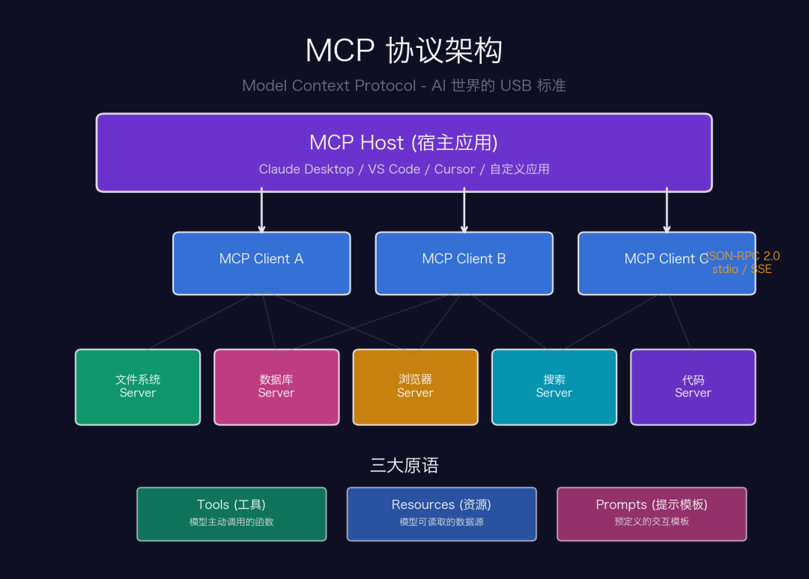
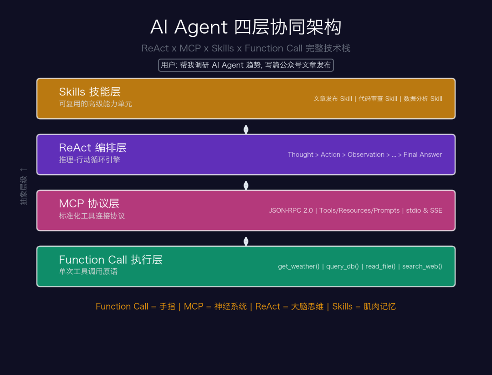

# 深度解析：Function Call / MCP / ReAct / Skills 如何构成 AI Agent 的完整技术栈

<p class="llm-stack-subtitle"><strong>从函数调用到协议标准，再到推理编排与能力沉淀，一篇文章看清 AI Agent 的四层技术栈</strong></p>

<div class="llm-stack-meta-card">
  <ul>
    <li><strong>主线问题</strong>：Function Call、MCP、ReAct、Skills 分别解决哪一层问题，为什么必须协同出现</li>
    <li><strong>阅读收益</strong>：建立一套能解释绝大多数 AI Agent 产品架构的统一分析框架</li>
    <li><strong>适合人群</strong>：想把工具调用、协议标准、Agent Loop 与工作流沉淀彻底串起来的开发者与产品设计者</li>
  </ul>
</div>


当你对 AI 说「帮我查一下北京天气」时，它不再只是编一个答案——而是真的去调 API、拿到实时数据、再用自然语言告诉你。这背后，是 **Function Call、MCP、ReAct、Skills** 四项技术的协同工作。

这篇文章将从协议细节到架构设计，深入拆解这四大核心技术。

## 一、Function Call：从「能说」到「能做」的第一步

### 1.1 它解决了什么问题？

大语言模型的本质是一个**文本续写器** ——给它一段文字，它预测下一段最合理的文字。这意味着它天生有两个致命缺陷：

**缺陷一：知识截止** — 训练数据有截止日期，无法获取实时信息

**缺陷二：无法执行** — 它能"说"该怎么做，但不能真正"去做"

Function Call 的核心思想很简单：**让模型不仅输出文字，还能输出一段结构化的 JSON，声明"我需要调用某个函数"** 。宿主程序拦截这个 JSON，执行对应的函数，再把结果喂回模型。

---

### 1.2 技术细节：一次 Function Call 到底发生了什么？

<div class="llm-stack-figure">
  
  <p><sub><b>图 1</b> — Function Call 完整执行序列</sub></p>
</div>

上图展示了一次完整的 Function Call 流程。关键技术点在于：

**工具定义（Tool Schema）** ：每个可调用的函数都用 JSON Schema 描述其参数类型和含义。这是模型"理解"工具能力的基础：

```
    {
      "name": "get_weather",
      "description": "查询城市天气",
      "parameters": {
        "type": "object",
        "properties": {
          "city": {"type": "string", "description": "城市名"},
          "date": {"type": "string", "description": "日期, YYYY-MM-DD"}
        },
        "required": ["city"]
      }
    }

```

**模型的决策过程** ：模型并不是简单地"关键词匹配"来决定调用哪个函数。它会：

1\. 理解用户意图的语义（不是匹配关键词）

2\. 从所有可用工具中选择最匹配的（可能选零个、一个或多个）

3\. 根据上下文推断缺失参数（如用户没说日期，推断为"今天"）

4\. 生成严格符合 JSON Schema 的参数对象

---

### 1.3 演进：从单次调用到并行调用

2023 年 Function Call 刚出来时只支持**单次调用** ：模型一轮只能调一个函数。到 2024 年底，主流模型已支持**并行函数调用（Parallel Tool Use）** ——模型可以在一轮中同时请求调用多个函数，宿主程序并行执行后统一返回结果。

这大幅提升了复杂任务的效率。比如用户问「北京和上海今天天气对比」，模型会同时发出两个 get_weather 调用，而不是串行执行两次。

但 Function Call 本质仍是**一次性的、无状态的** 。要让模型能自主完成多步骤任务——比如"先搜索资料，再写文章，最后发布"——需要更高级的编排模式。

## 二、ReAct：让大模型学会「边想边做」

---

### 2.1 论文核心：为什么要同时推理和行动？

2022 年普林斯顿的 Yao 等人发表了开创性的论文《ReAct: Synergizing Reasoning and Acting in Language Models》。他们发现了一个关键洞察：

**纯推理（Chain-of-Thought）** ：模型能想得很深，但容易"幻觉"——因为它只在自己的知识里打转，无法验证想法。

**纯行动（Act-only）** ：模型能调用工具，但缺乏规划——它不知道为什么要调这个工具，也不知道拿到结果后下一步该做什么。

ReAct = 让推理指导行动，让行动结果修正推理。

<div class="llm-stack-figure">
  
  <p><sub><b>图 2</b> — ReAct 推理-行动循环流程</sub></p>
</div>

---

### 2.2 一个完整的 ReAct 执行过程

以「查询苹果公司最新市值并与微软对比」为例，看 ReAct 循环如何运作：

```
    [Thought 1] 用户想对比苹果和微软的市值。
      我需要分别查询两家公司的最新市值数据。
      先查苹果。

    [Action 1] search_web("Apple Inc market cap 2026")

    [Observation 1] 苹果市值约 3.8 万亿美元（2026 年 4 月）

    [Thought 2] 拿到了苹果的数据。
      现在需要查微软的市值，才能做对比。

    [Action 2] search_web("Microsoft market cap 2026")

    [Observation 2] 微软市值约 3.4 万亿美元（2026 年 4 月）

    [Thought 3] 两个数据都有了。
      苹果 3.8 万亿 vs 微软 3.4 万亿,
      苹果领先约 11.8%。
      可以给出最终答案了。

    [Final Answer] 截至 2026 年 4 月，苹果市值约 3.8 万亿...


```

---

### 2.3 ReAct 的三个关键设计决策

| 设计决策           | 作用               | 如果缺失会怎样          |
|----------------|------------------|------------------|
| Thought 可见     | 推理过程写入上下文，指导后续决策 | 模型重复调用相同工具，陷入死循环 |
| Observation 注入 | 真实数据取代模型的猜测      | 模型依赖训练数据，产生过时信息  |
| 循环终止条件         | 模型自主判断何时该停止      | 无限循环消耗 token 和时间 |

---

### 2.4 2026 年的 ReAct 演进

到 2026 年，ReAct 已经从单 Agent 模式扩展为更复杂的架构：

**Plan-and-Execute** ：先用一个规划 LLM 生成完整计划，再用执行 LLM 逐步实施。比 vanilla ReAct 更适合长任务。

**Reflexion** ：在 ReAct 循环外增加"反思"环节——任务完成后回顾整个过程，提炼经验，下次做得更好。

**Multi-Agent ReAct** ：多个 Agent 各自运行 ReAct 循环，通过 A2A 协议协作，主 Agent 负责拆解和汇总。

## 三、MCP：标准化一切工具连接

---

### 3.1 Function Call 的碎片化困境

Function Call 虽好，但带来了一个严重的工程问题：**每个 AI 应用都需要自己实现工具接入** 。

假设你的 AI 应用要接 5 个工具（搜索、文件、数据库、浏览器、日历），如果市场上有 3 个 AI 应用（Claude Desktop、VS Code AI、自研系统），那就是 5 x 3 = 15 个独立的接入实现。每加一个工具或一个应用，整个矩阵都要扩展。

这就是经典的 **M x N 问题** 。HTTP 协议解决了 Web 的 M x N 问题，USB 解决了硬件外设的 M x N 问题——AI 工具连接需要自己的 USB。

---

### 3.2 MCP 的架构设计

<div class="llm-stack-figure">
  
  <p><sub><b>图 3</b> — MCP 三层协议架构</sub></p>
</div>

MCP（Model Context Protocol）由 Anthropic 在 2024 年底提出并开源，其核心设计分为三层：

**第一层：传输层stdio 模式** ：MCP Server 作为子进程运行，通过标准输入/输出通信。最简单、最安全，适合本地工具。

**HTTP + SSE 模式** ：MCP Server 作为独立 HTTP 服务运行，支持远程连接。适合共享型工具（如数据库、云服务）。

两种模式上层协议完全一致，切换无需改代码。

**第二层：协议层（JSON-RPC 2.0）
MCP 复用了成熟的 JSON-RPC 2.0 协议，而不是发明新轮子。核心方法：

`initialize` — 握手协商双方能力

`tools/list` — 列出 Server 提供的所有工具

`tools/call` — 调用指定工具并传参

`resources/read` — 读取数据资源

**第三层：能力层（三大原语）

| 原语        | 说明                   | 谁控制        |
|-----------|----------------------|------------|
| Tools     | 可执行的函数（如查天气、写文件）     | **模型主动调用** |
| Resources | 可读取的数据源（如文件内容、DB 记录） | **应用程序控制** |
| Prompts   | 预定义的交互模板（如"代码审查"流程）  | **用户选择触发** |

---

### 3.3 一个 MCP Server 长什么样？

```
    from mcp.server import Server
    from mcp.types import Tool, TextContent

    app = Server("weather-server")

    @app.list_tools()
    async def list_tools():
        return [Tool(
            name="get_weather",
            description="查询城市天气",
            inputSchema={
                "type": "object",
                "properties": {
                    "city": {"type": "string"}
                }
            }
        )]

    @app.call_tool()
    async def call_tool(name, arguments):
        if name == "get_weather":
            result = await weather_api.query(arguments["city"])
            return [TextContent(text=json.dumps(result))]

    # 启动后，任何 MCP 客户端都能自动发现并调用
    app.run(transport="stdio")


```

写一次 MCP Server，就能被 Claude Desktop、VS Code Copilot、Cursor、以及任何支持 MCP 的应用调用。这就是协议标准化的力量——**M x N 降为 M + N** 。

---

### 3.4 MCP 生态爆发

截至 2026 年 4 月，MCP 生态已经覆盖：

**文件与代码** ：filesystem、Git、GitHub、GitLab

**数据库** ：PostgreSQL、MySQL、SQLite、MongoDB

**浏览器** ：Puppeteer、Playwright、Browser MCP

**设计工具** ：Figma、Pencil（本文的架构图就是通过 MCP 驱动 matplotlib 生成的）

**云服务** ：AWS、GCP、Cloudflare、Docker

... 以及数千个社区贡献的 Server

## 四、Skills：可复用的能力封装

---

### 4.1 为什么需要 Skills？

有了 Function Call + ReAct + MCP，模型已经能自主调用工具完成任务。但在实际部署中，我们会发现一个问题：**同样的工具组合 + 同样的流程，在不同场景下反复出现** 。

比如"发布一篇微信公众号文章"这个任务，每次都涉及：

```
    1. 搜索素材（调用 search MCP Server）
    2. 撰写文章（调用 LLM 自身能力）
    3. 排版转 HTML（调用 formatter 工具）
    4. 生成配图（调用 image generation MCP Server）
    5. 发布到公众号（调用 wechat-publish API）
    6. 检查发布结果（验证步骤）

```

如果每次都靠 ReAct 从零推理这个流程，不仅慢（每步都要思考），还不稳定（可能遗漏步骤或顺序出错）。

**Skill = 经验的固化** 。它把"我已经知道怎么做"这件事封装起来：已验证的工具组合 + 固定的执行流程 + 特定领域的知识 = 一个可复用的能力单元。

---

### 4.2 Skill 的技术构成

一个 Skill 通常包含四个部分：

| 组成部分      | 说明                                    |
|-----------|---------------------------------------|
| Prompt 模板 | 告诉 Agent "你现在的角色是XXX，你需要完成XXX"的系统提示词  |
| 工具清单      | 这个 Skill 需要哪些 MCP Server 和 Tools      |
| 执行脚本      | 可选的确定性流程代码（不是所有步骤都需要 LLM 推理）          |
| 领域知识      | 特定领域的规则和约束（如"微信会剥离 style 标签，必须用内联样式"） |

---

### 4.3 Skill vs Prompt vs Agent

这三个概念容易混淆，区分如下：

**Prompt** ：一段静态的指令文本。没有工具，没有流程，没有执行能力。类比一张「菜谱」。

**Skill** ：Prompt + 工具 + 流程 + 知识的打包。可被 Agent 激活和执行。类比一个「训练有素的厨师」。

**Agent** ：拥有多个 Skills、能自主决策调用哪个 Skill 的完整实体。类比一个「餐厅经理」。

## 五、四层协同：完整的 Agent 技术栈

<div class="llm-stack-figure">
  
  <p><sub><b>图 4</b> — AI Agent 四层协同架构</sub></p>
</div>

现在把四者放在一起看。当你对 AI 说**「帮我调研 AI Agent 趋势，写篇公众号文章发布」** 时，一个完整的 Agent 内部是这样运作的：

**Step 1 - Skills 层** ：Agent 识别到这是一个"调研+写作+发布"任务，激活 research-to-wechat Skill。

**Step 2 - ReAct 层** ：Skill 启动 ReAct 循环。Thought: "先搜索 AI Agent 2026 相关资料"。

**Step 3 - MCP 层** ：ReAct 决定调用搜索工具，通过 MCP 协议连接搜索 Server，发送 tools/call 请求。

**Step 4 - Function Call 层** ：search_web("AI Agent 2026 trends") 被实际执行，返回搜索结果。

**Step 5 - ReAct 层** ：Observation 接收结果。Thought: "资料足够，开始写文章"。

**Step 6 - MCP 层** ：连接图表生成 Server，生成架构图。

**Step 7 - Function Call 层** ：matplotlib 渲染图表，返回图片数据。

**Step 8 - ReAct 层** ：Thought: "文章和图表就绪，调用发布 API"。

**Step 9 - Function Call 层** ：POST wechat-publish API，返回发布成功。

**Step 10 - Skills 层** ：Skill 执行完毕，向用户报告结果。

这个例子不是假设——**你正在阅读的这篇文章，就是这个架构的实际产物** 。本文的架构图由 matplotlib MCP 工具生成，内容由 ReAct 循环驱动搜索和写作，最终通过微信发布 API 的 Function Call 推送到你的屏幕上。

## 六、对比与思考

---

### 6.1 四者关系一张表

| 维度     | Function Call | MCP   | ReAct | Skills   |
|--------|---------------|-------|-------|----------|
| 层级     | 执行层           | 协议层   | 编排层   | 能力层      |
| 粒度     | 单次调用          | 连接标准  | 多步循环  | 完整流程     |
| 类比     | 手指            | 神经系统  | 大脑    | 肌肉记忆     |
| 有无状态   | 无状态           | 有连接状态 | 有推理状态 | 有领域知识    |
| 可否独立使用 | 可以            | 需要工具  | 需要工具  | 需要 Agent |

---

### 6.2 安全问题不可忽视

当 AI 从"只会说话"进化到"能调工具、能自主循环、能执行多步任务"时，安全威胁面也发生了本质变化：

**Prompt 注入升级** ：恶意内容可以通过工具返回值（如网页内容、文件内容）注入到 Agent 的上下文中，劫持后续行为。

**权限扩散** ：Agent 具备文件读写、API 调用等能力后，一次误操作的影响范围远大于纯文本对话。

**Tool Confusion** ：恶意 MCP Server 可能伪装成正常工具，窃取用户数据或执行恶意操作。

目前的应对方案包括：MCP 的能力协商机制（Server 声明权限边界）、Agent 的人工审批节点（关键操作需用户确认）、以及沙箱化执行环境。但这仍是一个快速演进的领域。

## 写在最后

Function Call 让模型长出了手指，MCP 为这些手指接通了神经系统，ReAct 赋予了大脑边想边做的能力，Skills 则沉淀下肌肉记忆。

四者的融合，正在把 AI 从「被动回答问题的工具」变成「主动解决问题的助手」。而这个转变，不是发生在未来——你手中的这篇文章，就是它今天的作品。

<style>
.llm-stack-subtitle {
  margin: -6px 0 22px;
  text-align: center;
  color: #6b7280;
  font-size: 1.05rem;
  letter-spacing: 0.02em;
}

.llm-stack-meta-card,
.llm-stack-source,
.llm-stack-figure {
  border-radius: 20px;
  border: 1px solid rgba(222, 180, 106, 0.28);
  box-shadow: 0 14px 34px rgba(148, 101, 28, 0.08);
}

.llm-stack-meta-card {
  margin: 20px 0 18px;
  padding: 18px 20px;
  background: linear-gradient(135deg, rgba(255, 246, 221, 0.96), rgba(255, 255, 255, 0.98));
}

.llm-stack-meta-card ul {
  margin: 0;
  padding-left: 1.1rem;
}

.llm-stack-meta-card li {
  margin: 0.5rem 0;
  line-height: 1.75;
}

.llm-stack-source {
  margin: 0 0 28px;
  padding: 14px 18px;
  background: linear-gradient(180deg, #fffaf2 0%, #ffffff 100%);
}

.llm-stack-source p {
  margin: 0.35rem 0;
}

.llm-stack-figure {
  margin: 28px auto;
  padding: 14px;
  background: linear-gradient(180deg, #fffaf2 0%, #ffffff 100%);
}

.llm-stack-figure img {
  width: 100% !important;
  border-radius: 12px;
}

.llm-stack-figure p {
  margin: 12px 0 4px;
  text-align: center;
  color: #7c5a1f;
}

.vp-doc h2 {
  margin-top: 42px;
  padding-left: 14px;
  border-left: 4px solid #e2ad47;
}

.vp-doc h3 {
  margin-top: 30px;
}

.vp-doc blockquote {
  border-left: 4px solid #e2ad47;
  background: rgba(255, 248, 230, 0.72);
  border-radius: 0 14px 14px 0;
  padding: 10px 16px;
}

.vp-doc table {
  border-radius: 12px;
  overflow: hidden;
}

.vp-doc tr:nth-child(2n) {
  background-color: rgba(255, 248, 230, 0.45);
}

.dark .llm-stack-subtitle {
  color: #c8d0da;
}

.dark .llm-stack-meta-card,
.dark .llm-stack-source,
.dark .llm-stack-figure {
  background: linear-gradient(180deg, rgba(56, 43, 20, 0.65), rgba(30, 30, 30, 0.92));
  border-color: rgba(226, 173, 71, 0.28);
  box-shadow: 0 14px 34px rgba(0, 0, 0, 0.28);
}

.dark .llm-stack-figure p {
  color: #f2d7a0;
}

.dark .vp-doc blockquote {
  background: rgba(82, 61, 22, 0.3);
}
</style>
