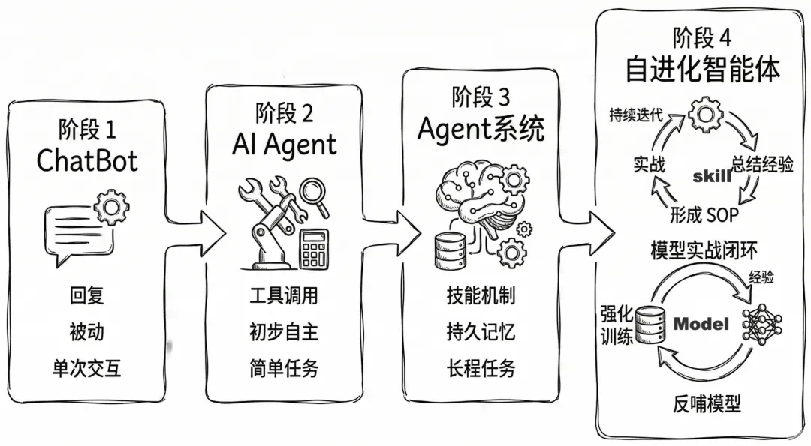
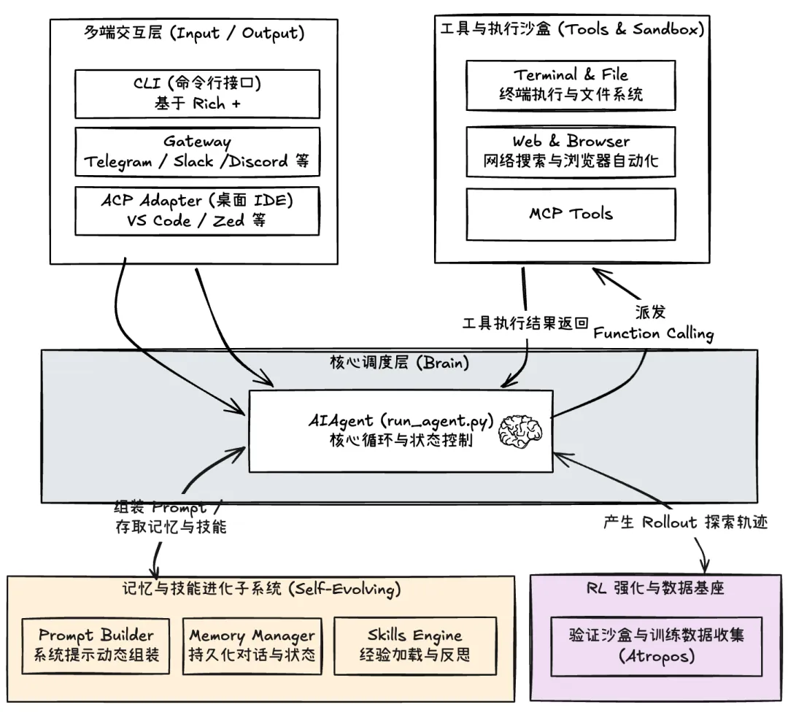
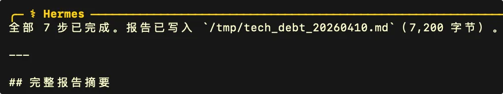

# 硬核拆解 Hermes-Agent：自学习 Skill 机制的架构设计与实现原理

<p class="hermes-subtitle"><strong>从技能手册到自我进化：拆解 Hermes-Agent 如何在实战中自动学习、修补并激活 Skill</strong></p>

<div class="hermes-cover hermes-figure">
  
</div>

OpenClaw 有着极其强大的技能（Skill）生态，那么新兴的 Agent 如何挑战这只 **“龙虾”**？最近兴起的 Hermes-Agent 项目给出了一个与众不同的答案。

<div class="hermes-figure">
  
</div>

<div class="hermes-meta-card">
  <ul>
    <li><strong>主线问题</strong>：为什么 Agent 需要从“会用 Skill”升级到“会自己长出 Skill”</li>
    <li><strong>拆解范围</strong>：自学习意识注入、触发链路、后台巡检、补丁修复、条件激活与安全守卫</li>
    <li><strong>阅读收益</strong>：看懂 Hermes-Agent 如何把一次性执行经验沉淀成长期可复用的能力资产</li>
  </ul>
</div>

它的核心哲学是：不再仅追究技能的广度，而是试图让 Agent 在实践中 **具备自我学习与进化** 的能力，从而做到“越用越强”。

本文将首先为大家拆解其核心利器之一 —— Skill 自学习机制的实现原理：

1. 思考：为什么我们需要自学习的 Agent
2. 演示：Hermes-Agent 如何自学习 Skill
3. 揭秘：Hermes-Agent Skill 机制全解析
   - Skill 的自学习意识是如何植入的
   - Skill 自学习的完整链路与触发时机
   - Skill 的自动修复机制：给技能“打补丁”
   - 其他：Skill 的条件激活与安全守卫

让我们一起走进这个 Agent 中的“爱马仕”。

---

## Part 01 — 思考：为什么我们需要自学习的 Agent

回想这一轮 AI 的发展，我们经历了从构建被动响应的对话 **ChatBot**，到能够自主调用工具的简单 **Agent**，再到具备持久记忆、连续工作的复杂 Agent。

能力固然在增强，但绝大部分 Agent 依然缺乏人类最核心的能力之一 — **在不断的实战中总结经验、学习技能，形成解决问题的"肌肉记忆"与标准流程（SOP）。**

<div class="hermes-figure">
  
  <p><sub><B>Agent 能力演进：从 ChatBot → 简单 Agent → 复杂 Agent → 自学习 Agent</B></sub></p>
</div>


### ACE：主动式上下文工程

事实上，学术与工程界一直没有停止探索。比如我们之前介绍过的主动上下文工程**（ACE，Agentic Context Engineering）**： 让 Agent 在每次任务完成后回顾历史消息，总结出后续任务可参考的"**Bullet**"（经验条目）。但 ACE 方法的局限性在于，它的"Bullet"通常是用**非结构化的自然语言表达的简单指南**。比如："对价格、数量等关键数据，应对比多个权威来源，验证准确性。"这种非结构化的知识，就像散落在人脑中的碎片化经验，难以被固化为精确的工作流程或者代码逻辑；且随着经验库的膨胀，还会面临上下文超载、规则冲突等问题；而面对复杂任务时，模型仍需重新做大量的推理，低效且不稳定。

### Skill：结构化的知识卡片

Skill 无疑是一项重大的 Agent 工程突破：**它用一种结构化的、标准化的模式来组织经验，并用渐进式加载机制来降低上下文负担**。但 Skill 仍然不是"自驱动的"，而是人类写好并塞给 AI 的"经验手册" — 让 Agent 遇到问题先去翻书查答案。

<div class="hermes-figure">
  
  <p><sub><B>Skill 的本质：结构化的经验手册，但仍然依赖人工编写</B></sub></p>
</div>


但现实的问题是：Agent 的任务与环境是多变的，不可能所有的问题都有预设的标准解法。这时候就需要 Agent 能够在解决难题后，自己"写手册" — **在复杂试错中提炼出最佳实践，并将其固化为全新的 Skill**。

> 而这正是 **Hermes-Agent** 试图跨越的鸿沟。

### 更进一步：强化学习（RL）闭环

尽管最近大家都强调 **Harness Engineering** 的重要性，但基础大模型仍然是 Agent 的大脑。在传统 Agent 系统中，一旦选型结束，你的大模型能力基线就确定了。那么有没有一种方式，可以自动从 Agent 的实战经验中汲取养分，构建训练数据，并快速用于强化训练？

从而让模型拥有对某些复杂任务处理的本能反应，而不用去查"操作手册"。这就是 Hermes-Agent 另一项更具野心的机制：**强化学习（RL）训练闭环**。关于如何收集 Agent 轨迹、通过奖励模型标注并反向强化大模型，我们将在后续文章做详细拆解。今天我们先聚焦于它是如何做到自动"写手册"（Skill）的。

---

## Part 02 — 演示：Hermes-Agent 如何自学习 Skill

本节我们设计一个具体的任务来直观的体验 Hermes-Agent 自学习 Skill 的能力。在此之前，首先来了解下 Hermes-Agent 的整体架构并做好安装配置。

### Hermes-Agent 的整体架构

<div class="hermes-figure">
  
  <p><sub><b>Hermes-Agent 整体架构 — 注意其技能进化子系统（右侧）</b></sub></p>
</div>


与 OpenClaw 不同的是，**Hermes-Agent 的 Gateway** 并不作为核心模块，如果你不接入外部消息渠道，甚至无需启动它。接下来我们重点关注其技能进化子系统。

### 安装与配置

Hermes-Agent的安装、配置与使用更简洁，它省略了OpenClaw 中很多复杂选项，而专注在核心能力。

极简模式下，你只需要三步走：一键安装 -> 配置模型 -> 执行"hermes"命令（详细参考 GitHub 文档）。

个人使用时的一个特别体验：Hermes 除了支持常见模型的 Direct 访问外（配置API Key）；也支持借用已有 AI 编程工具的订阅（比如 Codex、Copilot 等），直接调用订阅计划所包含的多个顶级模型，而无需额外配置。比如接入你的 GitHub Copilot 订阅：

<div class="hermes-figure">
  
  <p><sub>配置示例：接入 GitHub Copilot 订阅，复用已有模型额度</sub></p>
</div>


### 设计一个任务以触发自学习 Skill

那么什么时候 **Hermes-Agent** 会尝试自己去总结并创建一个新的 Skill？在下一节的揭秘之前，我们想象至少应该具备如下条件：

  1. 这个任务无法借助已有技能直接完成
  2. 这个任务要有一定的复杂度，比如超过 N 次的工具调用
  3. 这个任务未来有被重复执行的可能

所以，我们设计一个多步骤的代码审计任务：

```
对 ～/hermes-agent 源代码做一次代码库质量检查，要求完成：
1. 统计 .py 文件总数和总行数，找出最大的5个文件
2. 搜索 TODO/FIXME/HACK 注释，按子目录分组统计数量
3. 读最大文件的头20行和尾20行，再逐条读取它的 TODO 注释上下文
4. 搜索非测试文件中的 password=、secret=、api_key= 行，判断是占位符还是硬编码
5. 在 tools/ 下找被整个项目 import ≤1 次的"孤儿"模块
6. 找被引用次数最多的5个模块，读取第1名的前50行
7. 把完整报告写入 /tmp/source_checkreport_$(date +%Y%m%d).md，
   包含各步骤数据汇总表格和至少8条按高/中/低优先级排列的技术债清单
最后告诉我，下次做类似审计时，你会从哪一步先入手。
```

这里的最后一句是为了"暗示"这个任务可能会反复执行。现在给 Hermes-Agent 输入这个任务：

> **以下为 Skill 自学习的完整演示过程（6 步）：**

<div class="hermes-figure">
  
  <p><sub><b>Step 1</b> — 将代码审计任务粘贴到 Hermes-Agent 的 TUI 输入框</sub></p>
</div>

等待一段时间后，可以看到任务执行的输出：

<div class="hermes-figure">
  
  <p><sub><b>Step 2</b> — Agent 自主完成多步骤代码审计任务</sub></p>
</div>

接着我们发现，在输出的最后有如下信息（红框部分）：

<div class="hermes-figure">
  
  <p><sub><b>Step 3</b> — 日志显示：一个新的 Skill 被自动创建！</sub></p>
</div>

此时在 `~/.hermes/skills/` 目录下可以发现这个新的 Skill：

<div class="hermes-figure">
  
  <p><sub><b>Step 4</b> — 自动生成的 Skill 目录结构，归类到 software-development</sub></p>
</div>

查看它的 SKILL.md，这是一个对应上述任务的代码审计 Skill：

<div class="hermes-figure">
  
  <p><sub><b>Step 5</b> — 自动生成的 SKILL.md：包含完整的代码审计工作流</sub></p>
</div>

以上过程表明，我们的测试任务成功的触发了 Hermes-Agent 的反思与学习，并创建了一个新 Skill，且被归类到了 software-development 这个类别。现在，Agent 已经"偷偷"的掌握了代码审计的 Skill — 当你下次发出"对 xxx 项目做一次代码审计"的消息时，这个 Skill 就可能被触发：

<div class="hermes-figure">
  
  <p><sub><b>Step 6</b> — 下次发出类似指令时，已学习的 Skill 被自动触发</sub></p>
</div>

整个过程，你无需干预，也无需从某个 Skill-Hub 安装，Agent 自己"复盘"并自学了新的 Skill！

---

## Part 03 — 揭秘：Hermes-Agent Skill 机制全解析

现在，我们来扒一扒 Hermes-Agent 这套自学习的 Skill 机制背后的秘密。弄明白下面这几点，你也可以在自己的 Agent 系统中灵活应用：

- Skill 的自学习意识是如何植入的?
- Skill 自学习的完整链路与触发时机?
- Skill 的自动修复机制：给技能"打补丁"?
- 其他：Skill 的条件激活与安全守卫?

### Skill 的自学习意识是如何植入的？

一切开始于你启动 Hermes-Agent 会话的那一刻。在 Agent 的启动与初始化入口（代码：`run_agent.py`）有一条明确的系统提示组装流水线，其中一个重要工序就是把 Agent 应该如何学习技能、使用技能和修复技能这套意识植入。

```python
SKILLS_GUIDANCE = (
    "当你完成一个复杂任务（例如需要多次调用工具，通常为 5 次及以上）、"
    "解决了一个棘手错误，或发现了一套非显而易见但可复用的工作流程时，"
    "请使用 skill_manage 将该方法保存为一个技能（skill），"
    "以便下次在类似场景中复用。\n"
    "当你在使用某个技能时，如果发现它已经过时、不完整或存在错误，"
    "请立即使用 skill_manage(action='patch') 对其进行修补，"
    "不要等到被要求时才处理。"
    "如果技能得不到维护，它最终就会从资产变成负担。"
)
```

随后会在系统提示中注入当前可用 Skill 的分类索引。

现在，经过"入职培训"的 Agent 就具备了"自己学习自己修复"的意识。不过，这种前端的主动意识只是 Skill 学习的触发机制之一。

### Skill 自学习的完整链路与触发时机

自学习 Skill 并不意味着每次调完工具或者完成任务，就立刻判断要不要写 Skill 的这种机械逻辑。Hermes-Agent 采用**"前台自觉 + 后台巡检"**的双重机制：

- **前台自觉**：这就是上面注入的系统提示的作用。在完成复杂任务、发现复杂工作流时，模型应主动考虑创建成 Skill（调用 `skill_manage` 工具）。
- **后台巡检**：即便模型在这轮没主动沉淀，主控流程仍会根据工具调用的计数器，在后续的适当时机触发后台复盘（异步兜底）。

注意：后台触发看的是多次任务的 tool-calling 累计计数（`_iters_since_skill`），当其到达阈值（默认 10），就会触发一次后台的异步巡检。

<div class="hermes-figure">
  
  <p><sub><b>后台巡检与反思触发</b>——当累计工具调用达到阈值后，系统会异步启动复盘链路</sub></p>
</div>

用两个例子帮助理解这两套机制：

* **前台自觉**

  Agent 在正常执行任务过程中，模型可能会自己判断"这个方法值得保存为 Skill"，此时就会调用 `**skill_manage**` 工具，自行创建 Skill；并将计数 `_iters_since_skill` 复位为 0。此时，本轮肯定不会再触发后台复盘（计数器已复位）。

* **后台巡检**

  当一次任务全程都没有触发 `skill_manage`，那么计数器会一直累加，当达到阈值时，就会触发后台的复盘动作（独立线程 + 独立的 `review_agent`）。比如：

> 第一个任务：复杂任务，8 次工具迭代。（`_iters_since_skill = 8`）
> 第二个任务：简单任务，3 次工具迭代。（`_iters_since_skill = 11`）→ 触发巡检

| 机制 | 时机 | 触发条件 |
|------|------|----------|
| 前台自觉 | 任务过程中 | 自行推理并调用 `skill_manage` |
| 后台巡检 | 任务结束后 | 工具调用累计计数 >= 10（可配） |

当进入后台兜底反思过程时，它是如何决定"要不要把某些经验沉淀出新的 Skill"？这依赖于 `**review_agent**` 的提示：

```python
_SKILL_REVIEW_PROMPT = (
    "回顾上面的对话内容，判断是否有必要保存或更新某个技能。\n\n"
    "重点关注：在完成任务的过程中，是否采用了非显而易见的方法，"
    "是否经历了反复试错，或在实践过程中因为经验反馈而调整了方向，"
    "或者用户是否期望或需要一种不同的方法或结果？\n\n"
    "如果已经存在相关技能，请基于当前经验对其进行更新；"
    "如果不存在且该方法具备可复用性，则创建一个新的技能。\n"
    "如果没有值得保存的内容，请直接输出：'Nothing to save.' 并停止。"
)
```

>  说人话就是：
>
> 只有那些真的绕过弯路、踩过坑、改过方案之后总结出来的经验，才值得创建成 Skill。注意后台反思过程是异步的，不会阻塞主会话。

### Skill 的自动修复机制：给技能打"补丁"

Hermes-Agent 给 Skill 设计了自动修复的机制。**它是一种 Agent 在使用技能时，由系统提示和工具（`skill_manage`）共同驱动的自修复行为** — 就像一个有经验的人边干活边修订"操作手册"。

核心逻辑是：当模型判断到"问题在于 Skill 本身而不是其他环境问题"，就启动 Skill 修复 — 调用 `skill_manage(action='patch')` 工具。

<div class="hermes-figure">
  
  <p><sub><b>Skill 补丁与修复</b>——系统会在发现 Skill 本身失效时尝试直接修补技能内容</sub></p>
</div>

打补丁的动作本质上就是字符串替换，比如对 SKILL.md 中有问题的部分进行重写（当然也可能修改其他 Skill 相关文件）。

例子：假设你有一个 `feature-publish` 的发布技能，但是在执行时出错。经过 Agent 分析，发现是由于"发布的 URL 已经发生变化"，于是 Agent 调用：

```python
skill_manage(action="patch",
             old_string="https://old-registry.xx.xx",
             new_string="https://registry.xx.xx")
```

这样，Skill 得到原地修复并继续执行。在此过程中，为了获得修复的方法，Agent 有可能会借助其他工具，比如通过搜索获得新的 URL 等。

### Skill 的条件激活与安全守卫

当 Skill 和 Tool 越来越多后，它们之间可能会存在重复或者依赖关系。因此，在每次注入 Skill 索引时，并非所有 Skill 都需要或者适合登场。Hermes 会做一个过滤，其基本逻辑是：

>  当主力工具在时，"替补"的 Skill 会被隐藏；当 Skill 的前置工具缺失时，该 Skill 隐藏。

每个技能的激活判断流程如下：

<div class="hermes-figure">
  
  <p><sub><b>条件激活与安全守卫</b>——Skill 的展示与可用性并不是静态的，而是由工具可用性、替补关系与风险等级共同决定</sub></p>
</div>

例子：

假如 `duckduckgo-search` 技能配置了 `fallback_for_toolsets: [web]`，代表这个技能是 web 工具的"替补"。那么当用户配置了 web 工具的 API Key、web 工具可用时，`duckduckgo-search` 技能就会隐身。再或者，一个 `deep-research` 技能依赖前置工具 `web-fetch`，那么如果 `web-fetch` 工具不可用，`deep-research` 技能就不会加载。

除此之外，所有的 Skill 在加载时还需要经过**安全守卫**的扫描，主要检测项包括：

- 硬编码的密钥，如 API Key 等
- 可疑的代码执行模式（后门代码）
- 提示词注入，如试图操控 Agent 行为的指令
- 危险的命令，比如 `rm -rf`，`chmod 777` 等高危操作

最终，Hermes 会根据扫描出来的危险级别（包括 `safe`、`caution`、`dangerous`），以及 Skill 来源（内置、官方认证、社区等），综合判断该 Skill 是否被允许。这两种机制用来确保 Skill 能够稳定与安全的运行。

---

至此，我们完整拆解了 Hermes-Agent 这套自学习 Skill 机制的底层逻辑。它打破了传统 Agent 依赖人工持续喂养与维护技能的瓶颈，通过"**前台自觉+后台巡检**"的双引擎驱动新技能的自动捕获，结合"热补丁"实现自动纠错，并辅以安全守卫等手段构筑起坚实的运行底座。这为构建能够长期稳定运行的生产级 Agent 系统，提供了一条极具吸引力的思路：让 Agent 在实战中不断自我迭代，持续拓展能力边界。


<style>
.hermes-subtitle {
  margin: -4px 0 20px;
  text-align: center;
  color: #6b7280;
  font-size: 1.05rem;
  letter-spacing: 0.02em;
}

.hermes-cover,
.hermes-figure {
  margin: 28px auto;
  padding: 14px;
  border-radius: 20px;
  background: linear-gradient(180deg, #fffaf2 0%, #ffffff 100%);
  border: 1px solid rgba(222, 180, 106, 0.28);
  box-shadow: 0 14px 34px rgba(148, 101, 28, 0.08);
}

.hermes-cover img,
.hermes-figure img {
  width: 100% !important;
  max-height: none !important;
  border-radius: 12px;
}

.hermes-meta-card {
  margin: 20px 0 28px;
  padding: 18px 20px;
  background: linear-gradient(135deg, rgba(255, 246, 221, 0.92), rgba(255, 255, 255, 0.98));
  border: 1px solid rgba(226, 179, 76, 0.34);
  border-radius: 18px;
  box-shadow: 0 10px 28px rgba(201, 145, 38, 0.08);
}

.hermes-meta-card ul {
  margin: 0;
  padding-left: 1.1rem;
}

.hermes-meta-card li {
  margin: 0.45rem 0;
  line-height: 1.75;
}

.vp-doc h2 {
  margin-top: 42px;
  padding-left: 14px;
  border-left: 4px solid #e2ad47;
}

.vp-doc h3 {
  margin-top: 28px;
}

.vp-doc blockquote {
  border-left: 4px solid #e2ad47;
  background: rgba(255, 248, 230, 0.72);
  border-radius: 0 14px 14px 0;
  padding: 10px 16px;
}

.vp-doc table {
  border-radius: 12px;
  overflow: hidden;
}

.vp-doc tr:nth-child(2n) {
  background-color: rgba(255, 248, 230, 0.45);
}

.dark .hermes-subtitle {
  color: #c8d0da;
}

.dark .hermes-cover,
.dark .hermes-figure {
  background: linear-gradient(180deg, rgba(56, 43, 20, 0.65), rgba(30, 30, 30, 0.92));
  border-color: rgba(226, 173, 71, 0.28);
  box-shadow: 0 14px 34px rgba(0, 0, 0, 0.28);
}

.dark .hermes-meta-card {
  background: linear-gradient(135deg, rgba(73, 53, 20, 0.86), rgba(30, 30, 30, 0.95));
  border-color: rgba(226, 173, 71, 0.28);
}

.dark .vp-doc blockquote {
  background: rgba(82, 61, 22, 0.3);
}
</style>
