# 一文带你弄懂 AI 圈爆火的新概念：Harness Engineering

今天这篇教程，我会从三个角度把 Harness 这个新概念跟大家讲清楚：

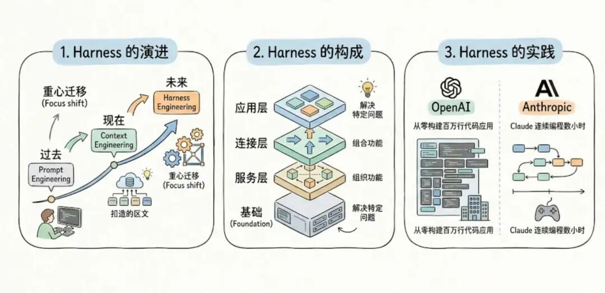

  * **Harness 的演进** ：从 Prompt Engineering 到 Context Engineering 再到 Harness Engineering，AI 工程的重心经历的三次迁移。

  * **Harness 的构成** ：拆开来看，一个成熟的 Harness 到底包含哪些部分，每一层分别在解决什么问题。

  * **Harness 的实践** ：OpenAI、Anthropic 等头部公司，是怎么在真实产品中落地 Harness 的，以及它们的做法为什么有效。

## 一、Harness 的演进

过去两年，AI 工程领域经历了三次重心迁移。

表面上看只是术语在更新 — `Prompt Engineering`、`Context Engineering`、`Harness Engineering` 。

但把时间线拉长，你会发现它们对应着三个越来越本质的问题：

  * 模型是否听得懂你在说什么？
  * 模型是否拿到了足够且正确的信息？
  * 模型是否能在真实执行中持续做对？

理解这三次迁移，不只是理解几个新名词，而是在理解 AI 系统是如何一步步从 "会聊天" 走向 "可交付" 的。

### 1.1 Prompt Engineering

大模型刚爆发的时候，很多人第一次感受到一种近乎魔法的体验：

同一个模型，换一种说法，结果可能天差地别。你对它说：

> “帮我总结一下这篇文章。”

它可能给你一段平平无奇的概述。但如果你换成：

> “请以资深技术编辑的身份，用三段结构总结这篇文章，先讲核心观点，再讲论证方式，最后讲局限性，每段不超过 150 字。”

结果通常会明显好很多。这就是 Prompt Engineering 最早的魅力所在。

它的核心思想很朴素：**模型不是不会，而是你没有把问题讲清楚。既然模型对输入形式敏感，那工程优化的第一步，自然就是优化指令本身。**
于是，一整套方法迅速流行起来：

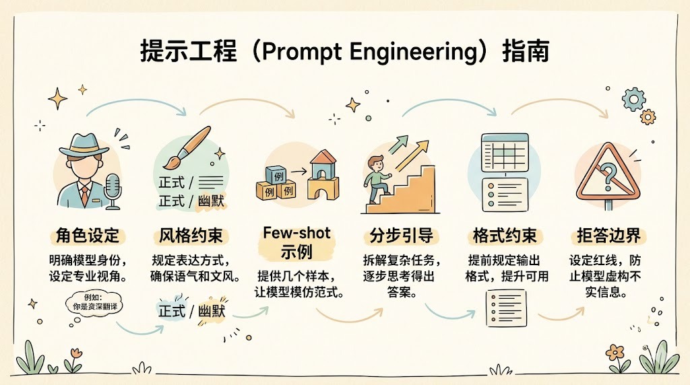

  * **角色设定** ：先告诉模型 “你是谁”。目的不是 cosplay，而是先限定它该站在哪个专业视角上说话。
  * **风格约束** ：告诉模型 “怎么说”。解决的不是对不对，而是像不像你要的表达。
  * **Few-shot** 示例：少讲原则，多给样例。很多时候，模型不是听不懂规则，而是更擅长模仿范式。
  * **分步引导** ：别让它直接跳答案，先拆再想再答。作用是减少拍脑袋式结论。
  * **格式约束** ：提前规定输出长什么样。它提升的不是智商，而是可用性。
  * **拒答边界** ：先划红线，再让它回答。核心是降低 “明明不知道还特别自信” 的风险。

那时候，Prompt 像一把万能钥匙。

很多团队都曾真诚地相信，只要提示词打磨得足够精细，模型就能越来越稳定、越来越好用。

这种判断并不荒谬。

因为在那个阶段，Prompt Engineering 确实解决了一个最直接的问题：**如何把人类意图更准确地映射成模型行为。**

####  1.1.1 Prompt Engineering 为什么会有效

因为大模型本质上是一个对上下文极度敏感的概率生成系统。它不是“命令行”，更像是一个临时搭建出来的认知场：

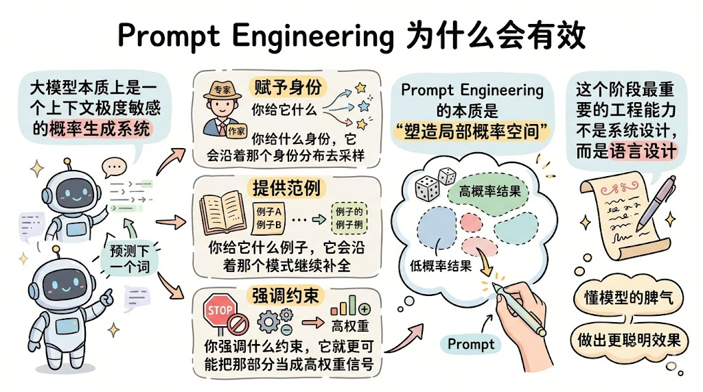

  * 你给它什么身份，它会沿着那个身份分布去采样；
  * 你给它什么例子，它会沿着那个模式继续补全；
  * 你强调什么约束，它就更可能把那部分当成高权重信号。

所以，Prompt Engineering 的本质，不是“下命令”，而是“塑造局部概率空间”。

这个阶段最重要的工程能力，也不是系统设计，而是语言设计。

谁更懂模型的脾气，谁就更容易做出看起来更聪明的效果。

#### 1.1.2 Prompt Engineering 的天花板

Prompt 问题出在：很多任务不是“你说清楚就行”，而是“你得真的知道”，比如你让模型：

  * 分析一份公司内部文档
  * 回答某个产品最新配置
  * 对照一套长规范生成代码
  * 在多个工具之间完成复杂任务

这时你会发现，提示词再漂亮，也不能替代事实本身。

Prompt 擅长的是：**澄清任务、约束输出、激发已有能力。**
但它不擅长：**凭空补齐缺失知识、管理大量动态信息、处理长链条任务中的状态变化。**
说得更直接一点：

Prompt 解决的是 **“表达问题”** ，不是 **“信息问题”** 。

当任务从开放问答进入真实业务，工程重点自然开始转移。

大家逐渐意识到，模型答得不好，未必是因为你不会问，也可能是因为你根本没把它需要的材料给全。

问题的焦点，从 "怎么说" 变成了 "给什么"。

于是，第二次迁移来了。

### 1.2 Context Engineering

如果说 Prompt Engineering 的默认假设是： 模型本来就知道，只是你得问对。

那么 Context Engineering 的默认假设变成了： 模型未必知道，所以系统必须在调用时把正确的信息送进去。

在 Prompt 时代，大家主要研究的是 “怎么把一句话说好”。到了 Context 时代，问题变成了：

  * 模型现在看到了什么？没看到什么？
  * 哪些信息该提前给，哪些该延后给？
  * 哪些信息该完整保留，哪些该摘要压缩？
  * 哪些信息应该对当前模块可见，哪些应该被隔离？

#### 1.2.1 为什么 Context Engineering 会兴起

最重要的原因是模型的使用场景变了。

在大模型刚流行的时候，主流交互形态还是聊天：用户提一个问题，模型给一段回答。

这种模式下，Prompt 的权重很高，因为任务短、链路短、状态少，很多问题确实可以靠 “把话说清楚” 解决。

但后来 Agent 开始爆火，情况一下子变了。模型不再只是回答问题，而开始被放进真实的执行环境中：

  * 要持续多轮对话、要调用搜索、浏览器、代码、数据库等工具
  * 要在多个步骤之间传递中间结果、要根据外部反馈不断修正计划、甚至要和其他 Agent 分工协作

这时候，系统面对的已经不是 “一次回答对不对”，而是 “一整个任务链路能不能跑通”。

举个很简单的例子，如果你只是问模型一句：

> “帮我总结这篇文章。”

那它只需要看文章内容，再按要求输出即可。

但如果你让它完成一个更真实的任务，比如：

> “帮我分析这份需求文档，找出潜在风险，结合历史评审意见给出修改建议，并生成一版给产品经理看的反馈稿。“

这已经不是一句 prompt 能解决的事了。它至少需要拿到：

  * 当前需求文档、历史评审记录
  * 相关规范或最佳实践、当前任务目标
  * 之前已经分析过的中间结论、输出对象是谁、语气应该如何调整

这时就有新的问题暴露出来了，模型的上下文窗口是有限的，这时候你就必须要考虑：

**你有没有把对的信息，以对的形式，在对的时刻，交给模型。**
这就是 Context Engineering 兴起的真正背景。

#### 1.2.2 Context 到底是什么？

很多人一提到 Context，就会想到 “给模型补几段背景资料”。这当然没错，但太窄了。

在工程意义上，Context 不是一堆附加文本，而是所有会影响模型当前决策的信息总和。它通常包括：

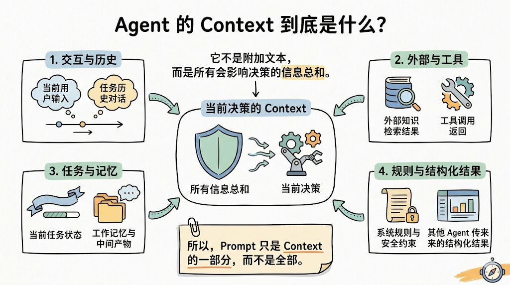

  * 当前用户输入、整个任务的历史对话
  * 外部知识检索结果、工具调用返回
  * 当前任务状态、工作记忆与中间产物
  * 系统规则与安全约束、其他 Agent 传过来的结构化结果

所以，Prompt 只是 Context 的一部分，而不是全部。

这也是为什么很多人会有一种很强的体感：**同一个模型、同一个 Prompt，放在不同系统里，效果完全不一样。**
原因往往不在模型，也不在 Prompt，而在于它们背后的上下文供给机制根本不是一回事。

#### 1.2.3 Context Engineering 的典型实践

Context Engineering 早期最典型的代表，就是 RAG。

RAG 的价值其实不复杂：它回答了一个非常现实的问题：

**模型参数里没有的知识，怎么在运行时补进去？**
它的基本做法是：先从外部知识库中检索相关内容，再把这些内容注入到当前上下文里，让模型基于这些信息继续生成。

所以 RAG 之所以重要，就是因为它第一次把 “模型不知道怎么办” 这个问题，变成了一个工程上可落地的机制。

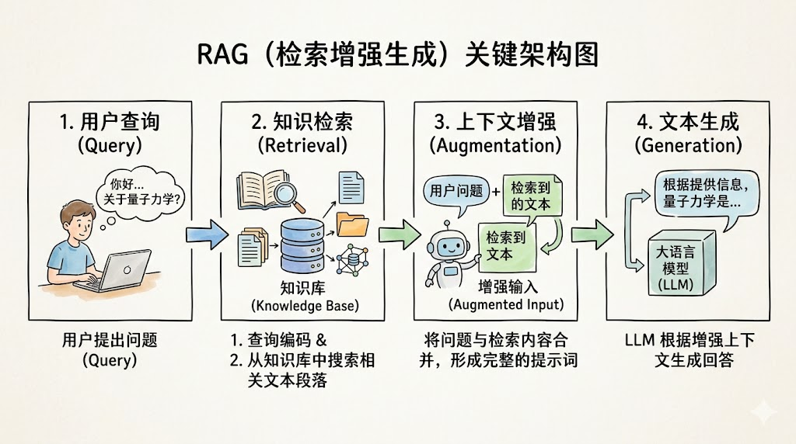

但是，真正成熟的 Context Engineering，关心的肯定不只是 “检索一下”，而是整条链路：

  * 文档如何切块，才能既保留语义又方便召回
  * 检索结果如何排序，才能让真正关键的内容优先进入上下文
  * 长文档如何压缩，才能不把窗口挤爆
  * 历史对话什么时候保留原文，什么时候该摘要
  * 工具返回的原始结果是否要全部暴露给模型
  * 多个 Agent 之间到底该传原文、摘要，还是结构化字段

所以，RAG 可以说是 Context Engineering 的起点，围绕上下文的优化，还有很长的路要走。

而最近爆火的 Agent Skills，我认为是对 Context Engineering 的又一大典型实践。

当系统开始调用工具时，模型面临的问题不再只是 **“知道什么”** ，还包括 **“当前能做什么”** 。

比如你给模型接了十几个工具，然后把工具说明、参数定义、注意事项，一次性全塞进上下文，模型当然 “理论上更知道自己能做什么”。

但实践里常常更糟：Token 消耗巨大、注意力被分散、简单任务也要背一堆无关能力 ...

* * *

Skills 的核心机制（渐进式披露）巧妙地缓解了这些问题：

**不要让模型从一开始就看到全部能力和全部信息，而是只在需要的时候，暴露与当前任务最相关的那一部分。**
它将技能信息分为三层，实现 “按需加载、精准投放”：

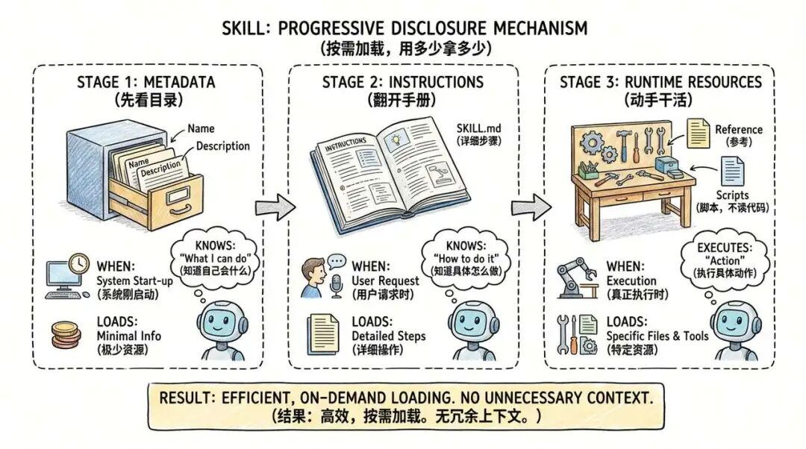

  * 元数据层（~50 Token）：仅包含技能名称、触发条件、功能概述，启动时全局加载
  * 指令层（~500 Token）：标准作业流程（SOP）、输入输出规范，仅在任务触发时加载
  * 资源层（按需加载）：脚本、模板、API 文档等，仅在执行具体步骤时动态调用

这种机制将模型在复杂 Agent 场景下的上下文利用率提升了数倍。

#### 1.2.4 Context Engineering 的局限性

到这里，很多系统已经比纯 Prompt 时代强很多了。

模型拿到了更好的信息，也能处理更复杂的任务。

可新的问题又出现了，即便信息是对的，模型也未必会稳定执行对。它可能：

  * 计划做得很好，但执行偏了
  * 调了工具，但误解了结果
  * 中间某一步出错后继续一路错下去
  * 表面看起来很自信，实际上任务状态早已失真
  * 在长流程里逐渐偏航，却没人发现

你会发现，Prompt 和 Context 都主要作用在“输入侧”：

  * Prompt 在优化意图表达
  * Context 在优化信息供给

但真实世界的复杂任务，还有一个更难的问题：

**当模型开始连续行动时，谁来持续监督它、约束它、纠正它？**
这时，第三次迁移开始发生。

### 1.3 Harness Engineering

Harness 这个词，原本就有 “缰绳、马具、约束装置” 的意思。

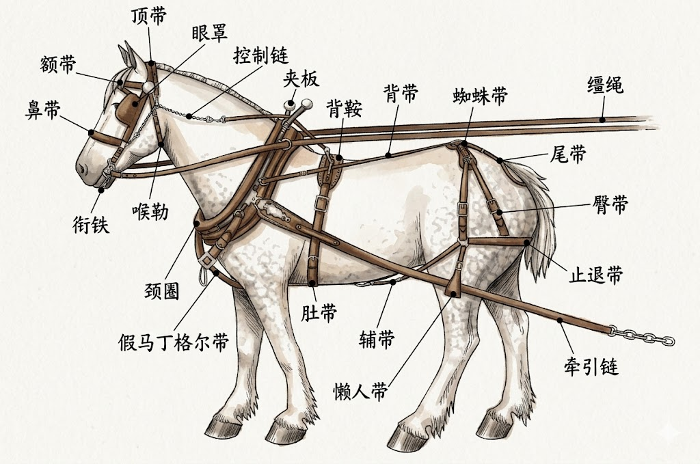

放在 AI 系统里，它不是一个华丽的新包装，而是一个非常直白的提醒：

**当模型从“回答问题”走向“执行任务”，系统不能只负责喂信息，还必须负责驾驭过程。**

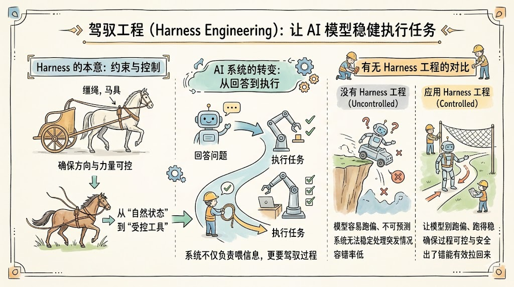

这就是 Harness Engineering 的出发点。

如果说前两代工程思路，关注的是如何让模型 “更会想”，那么 Harness Engineering 更关心的是：**如何让模型“别跑偏、跑得稳、出了错能拉回来”。**

####  1.3.1 三者的对比

我们来看一个通俗的例子：假设你要让一个新人完成一次重要客户拜访。

**Prompt Engineering**
你会先把任务讲清楚：

> “见面先寒暄，再介绍方案，再问需求，最后确认下一步。”

这是提示词层面的工作。重点是把话说明白。

* * *

**Context Engineering**
接着你会把资料准备齐：

>   * 客户背景、过往沟通记录
>   * 产品报价、竞品情况、这次会议目标
>

这是上下文层面的工作。重点是把信息给对。

* * *

**Harness Engineering**
但如果会议很重要，你不会只做到这里。你还会：

>   * 让他带着 checklist 去、要求关键节点实时回报
>   * 会后核对纪要与录音、出现偏差时马上纠正
>   * 对最终结果按明确标准验收
>

这就是 Harness。重点已经不只是“说清楚”和“给资料”，而是建立一个持续观测、纠偏、验收的机制。

#### 1.3.2 三者的关系

很多人看到新词出现，就容易误以为旧词过时了，恰恰相反，他们是层层递进的关系。

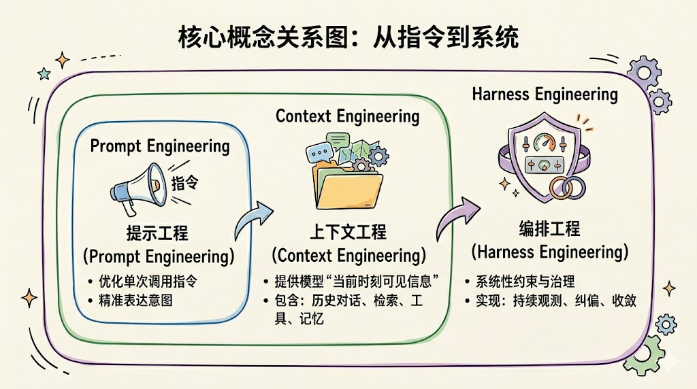

  * **Prompt Engineering** 关注的是 “我该怎么对模型说”，本质上是在优化单次调用里的指令表达；

  * **Context Engineering** 往外扩了一层，关注的不再是 prompt 本身，而是模型在当前时刻 “能看到什么信息”，因此 prompt 只是 context 的一个组成部分，历史对话、检索结果、工具返回、任务状态、工作记忆都被纳入进来；

  * **Harness Engineering** 则又再往外扩了一层，它关心的已经不是 “输入给得对不对”，而是模型在真实执行过程中是否被一个完整系统持续约束、观测、纠偏和收敛，因此 context 也只是 harness 中的一部分。

换句话说，

  * **Prompt** 是对 “提示词” 的工程化；
  * **Context** 是对 “输入环境” 的工程化；
  * **Harness** 是对 “整个运行控制系统” 的工程化；

边界一层比一层大，所以后者天然包含前者。

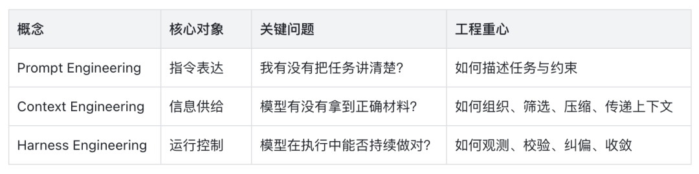

很多技术趋势，看上去像观点之争，实际上是任务复杂度逼出来的。

  * 当任务简单时，Prompt 就够了。
  * 当任务复杂到上下文不够用时，Context 成为核心。
  * 当任务变成需要持续执行、长链路、低容错时，Harness 几乎不可避免。

---

## 二、Harness 的构成

### 2.1 Harness 到底是什么？

LangChain 工程师给 Harness 下一个非常典型的定义：

>   * Agent = Model + Harness
>   * Harness = Agent - Model
>

简单理解：Harness 是在一个 Agent 环境中除了模型外的所有东西，它决定了模型看到什么、能做什么、按什么规则做、做错了怎么纠偏，以及最后如何把能力稳定地交付出来。

理解这一点，你对 Agent 的认识会一下子清晰很多：

  * 为什么同一个模型，在不同产品里表现差距巨大？
  * 为什么有些 Agent 看起来“像个实习生”，有些却像“成熟员工”？

模型的能力上限是由 OpenAI、Anthropic 这些公司决定，而 Harness 由我们这些工程师来决定。

如果拆开来看，一个成熟的 Harness，通常至少包含下面六个核心部分（仅代表我个人的拆解）：

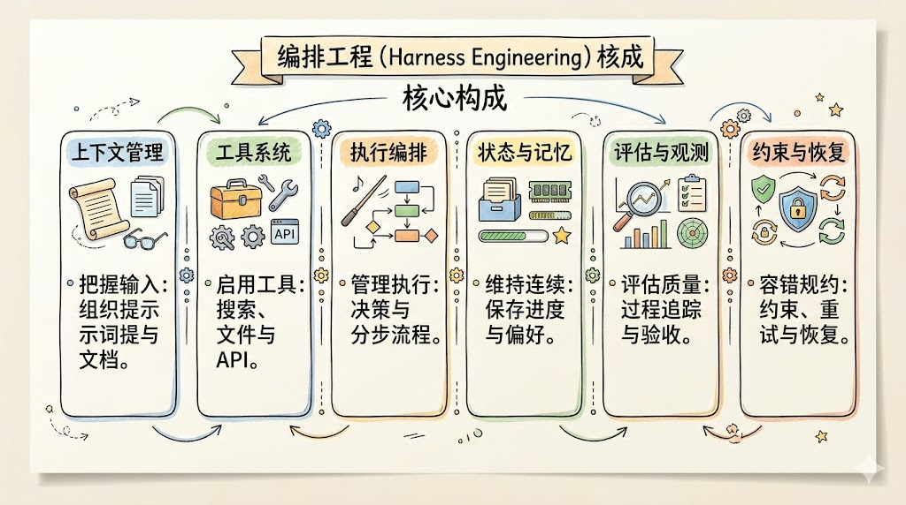

### 2.2 Harness 的第一层：上下文管理

上面在 Context Engineering 的章节我们已经介绍过上下文管理了，这里我们再从 Harness 的视角来看一看。

在大量任务里，大模型能力的差异并不在于它本身的 “智商” ，而是来自：它看到了什么信息。

一个模型再强，如果上下文是乱的、缺的、过载的，它也很难稳定发挥。

所以 Harness 的第一职责，是让模型在正确的信息边界内思考。

这包括几件事：

#### 2.2.1 角色与目标定义

模型需要先知道自己是谁、任务是什么、成功标准是什么。

比如同样是“写一篇文章”，你给它的上下文不同，结果会完全不同：

  * 是技术科普，还是产品宣传？
  * 面向小白，还是面向工程师？
  * 是追求传播性，还是追求严谨性？
  * 允许类比吗？允许口语化吗？

这些都不是“文风细节”，而是任务边界。

Harness 要把这些边界明确地灌给模型。

#### 2.2.2 信息选择与裁剪

上下文不是越多越好。

大模型常见问题不是“知道太少”，而是“信息太杂”。

一个好的 Harness 会做两件事：

  * 把相关信息挑出来
  * 把不相关的信息挡在外面

这其实很像一个成熟工程师接需求：

不是把所有文档都丢给同事，而是先整理好关键背景，再让他进入问题。

#### 2.2.3 上下文的结构化组织

同样的信息，堆成一团和按层次组织，效果天差地别。成熟 Harness 往往会把上下文分层，比如：

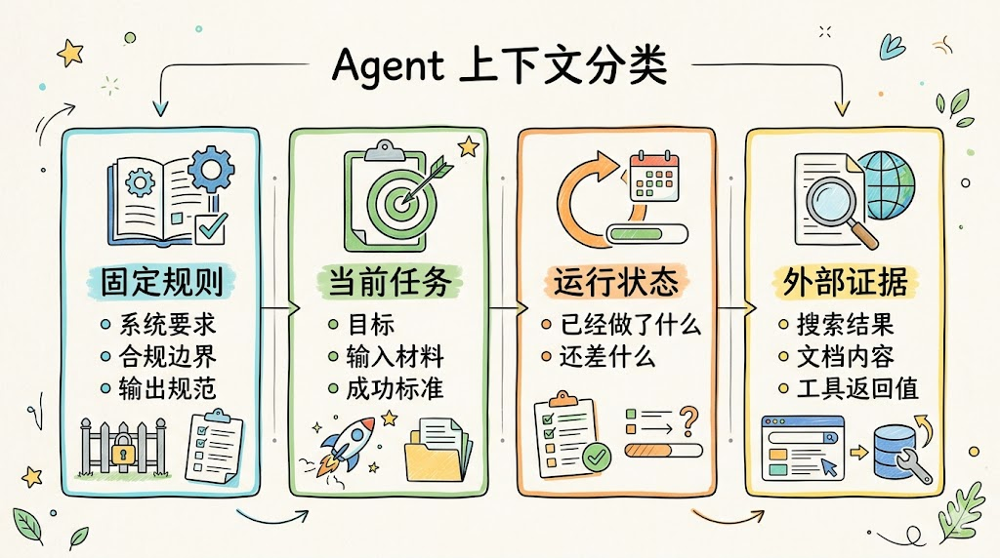

这会显著降低模型“看漏重点”或“忘记约束”的概率。

### 2.3 Harness 的第二层：工具系统

如果没有工具，大模型本质上只能做“文本预测”。它可以解释、总结、推理、改写，但不能真正接触世界。

一旦接上工具，事情就变了。模型可以：

>   * 搜网页，获取最新信息、读文档，理解长文本
>   * 写代码并执行、调用数据库和业务 API
>   * 操作浏览器点击页面、生成图片、编辑文件、发送消息
>

这时，模型不再只是“回答问题的人”，而开始变成“做事情的人”。

而 Harness 在这里的作用，不是简单把工具挂上去，而是解决三个更深的问题。

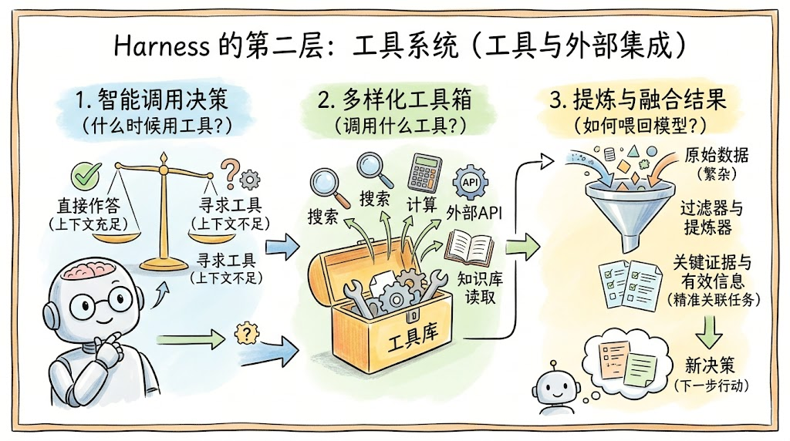

#### 2.3.1 给模型什么工具

工具太少，能力不够； 工具太多，模型容易乱用。

所以工具设计不是“越全越好”，而是要围绕任务场景来配置。

写作 Agent 和安全分析 Agent，应该拥有完全不同的工具集。

#### 2.3.2 什么时候调用工具

这比“有什么工具”更重要。一个糟糕的 Agent 会出现两种极端：

>   * 本来不需要查，非要查
>   * 明明该查证，却凭印象乱答
>

好的 Harness 会引导模型判断：

>   * 这个问题是否需要外部信息？
>   * 当前上下文是否足够？
>   * 这一步更适合搜索、读取、计算，还是直接作答？
>

#### 2.3.3 如何把工具结果重新喂回模型

工具不是一调用就结束，真正关键的是：

**返回结果如何被理解、筛选、吸收，再进入下一步决策。**
例如搜索到了十条结果，不应该原封不动塞回去。

Harness 需要帮助模型提炼有效证据，保持结果与任务的关联性。

### 2.4 Harness 的第三层：执行编排

有了上下文和工具，Agent 还不够成熟。

因为它还需要一个能力：知道下一步该干什么。这就是执行编排。

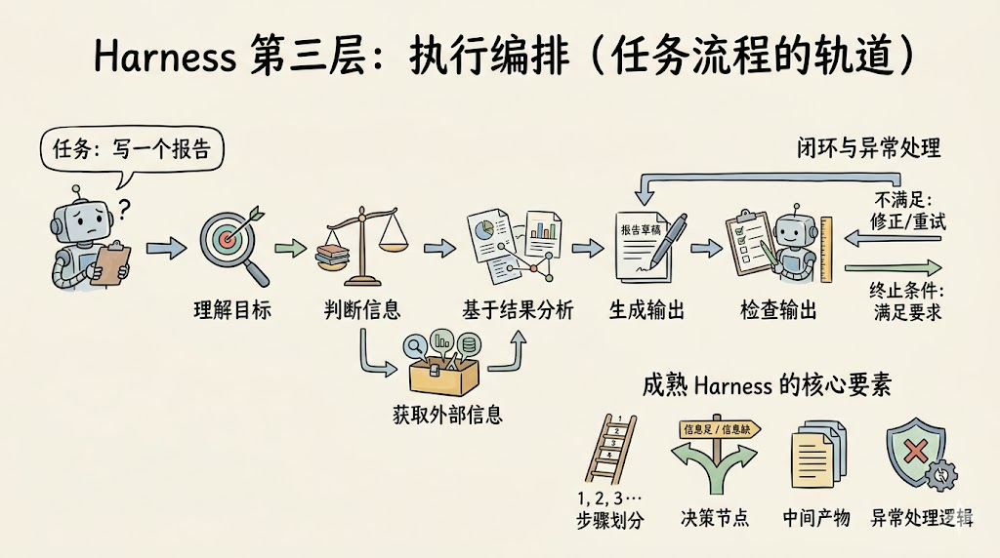

很多失败的 Agent，不是因为不会某一步，而是因为不会“串起来”。

它可能会搜索，也会总结，也会写代码，但整个过程像想到哪做到哪，最后输出一堆半成品。

执行编排解决的，就是这个问题。一个完整任务，通常会被拆成这样的流程：

>   1. 理解目标
>   2. 判断信息是否足够
>   3. 必要时获取外部信息
>   4. 基于结果继续分析
>   5. 生成输出
>   6. 检查输出是否满足要求
>   7. 不满足则修正或重试
>

你会发现，这已经很像人在工作时的思维链条了。

区别在于，人是靠经验和习惯完成这套流程；Agent 则需要 Harness 明确地搭好轨道。

所以一个成熟 Harness 往往不仅是 “能调工具”，而是具有明确的：

>   * 步骤划分
>   * 决策节点
>   * 中间产物
>   * 终止条件
>   * 异常处理逻辑
>

* * *

### 2.5 Harness 的第四层：状态与记忆

很多人对 Agent 的期待，是“像人在持续工作”。

而要做到这一点，系统必须有状态。

没有状态的系统，每一轮都像失忆。

它不知道自己刚做了什么，也不知道哪些结论已经得到，哪些问题还没解决。

因此，Harness 里很关键的一部分，就是状态管理。

它至少要回答三个问题：

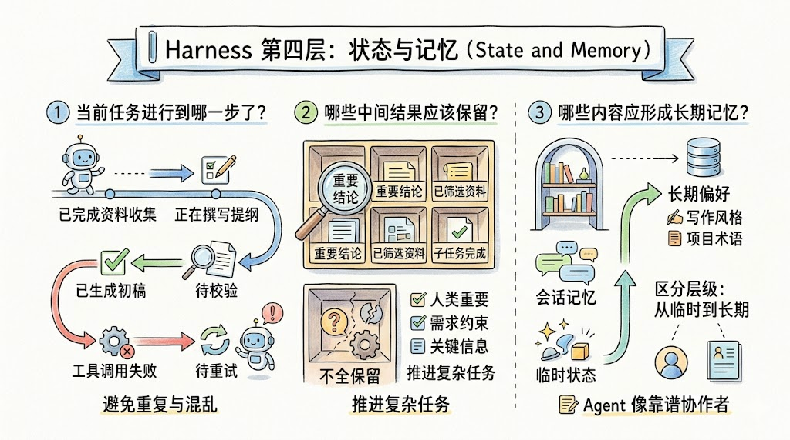

**问题 1：当前任务进行到哪一步了？** 比如：
>   * 已完成资料收集、正在撰写提纲
>   * 已生成初稿，待校验、某个工具调用失败，待重试
>

这会让系统避免反复横跳。

**问题 2：哪些中间结果应该保留？**
并不是所有信息都该塞进长期记忆。

但对于一个复杂任务，中间状态必须被保留，否则系统很难连续推进。比如：

>   * 已确认的需求约束、重要结论
>   * 已筛选过的资料、已完成的子任务
>

**问题 3：哪些内容应该形成长期记忆？**
这通常是用户偏好、稳定规则、长期项目背景等。

例如你喜欢什么写作风格、某个项目的固定术语、常用输出模板等。所以记忆不是“存得越多越好”，而是要区分：

>   * 临时状态
>   * 会话记忆
>   * 长期偏好
>

这三者混在一起，系统就会越来越乱。 分得清，Agent 才会越来越像一个靠谱的协作者。

### 2.6 Harness 的第五层：评估与观测

很多系统的问题不是 “生成不出来”，而是 “生成完了却不知道好不好”。

如果没有独立的评估与观测能力，Agent 就容易停留在 “自我感觉良好” 的阶段。

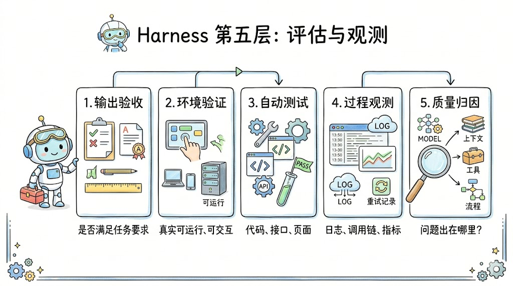

这一层通常包括：

>   * 输出验收：是否满足任务要求
>   * 环境验证：是否真的可运行、可点击、可交互
>   * 自动测试：代码、接口、页面、文档格式等
>   * 过程观测：日志、指标、调用链、重试记录
>   * 质量归因：问题到底出在模型、上下文、工具，还是流程设计
>

### 2.7 Harness 的第六层：约束、校验与失败恢复

真正让系统从“能跑”走向“能上线”的，往往不是主流程，而是异常流程。因为真实环境里，失败才是常态：

  * 搜索结果不准、API 超时
  * 文档格式混乱、模型误解指令
  * 输出不符合约束、工具权限不足

如果没有恢复机制，Agent 每次出错都只能 “重新来一遍”。

所以 Harness 的最后一层，是控制系统稳定性的部分：

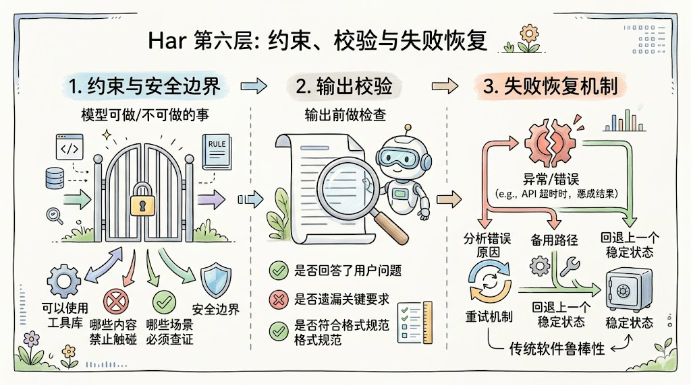

  1. 约束：限制模型可做和不可做的事，比如：哪些工具能用、哪些场景必须查证、哪些内容涉及安全边界
  2. 校验：在输出前做检查，比如：是否回答了用户问题、是否遗漏关键要求、是否满足格式规范
  3. 恢复：当一步失败时：分析错误原因、重试同一步、切换备用路径、回退到上一个稳定状态

这部分最像传统软件工程里的“鲁棒性设计”。

* * *

当然，以上更多还是我基于原理层面对 Harness 做的一次拆解。

真正把这个概念做深、做实、做成工程方法论的，还是 OpenAI 和 Anthropic 这类一线公司。

它们并不是停留在 “模型怎么调得更聪明” 这件事上，而是在认真回答另一个更关键的问题：

如何把模型稳定的放进一个可持续运行、可反复交付、可长期演进的系统里。

下面，我们来看看目前业界对 Harness 这个概念最前沿的实践。

* * *

---

## 三、Harness 的实践

最近各大头部公司纷纷发布了 Harness 在各自产品上的工程实践，我们来看几个最典型的案例：

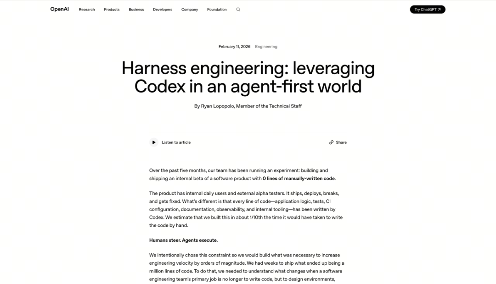OpenAI：Harness engineering: leveraging Codex in an agent-first world

OpenAI 依靠一个仅有几名人类工程师的团队，利用 Codex 智能体从零开始构建了一个超百万行代码的生产级应用。从业务逻辑、CI/CD 配置、可观测性堆栈到内部文档，100% 由智能体编写，耗时仅为人工开发的 1/10。

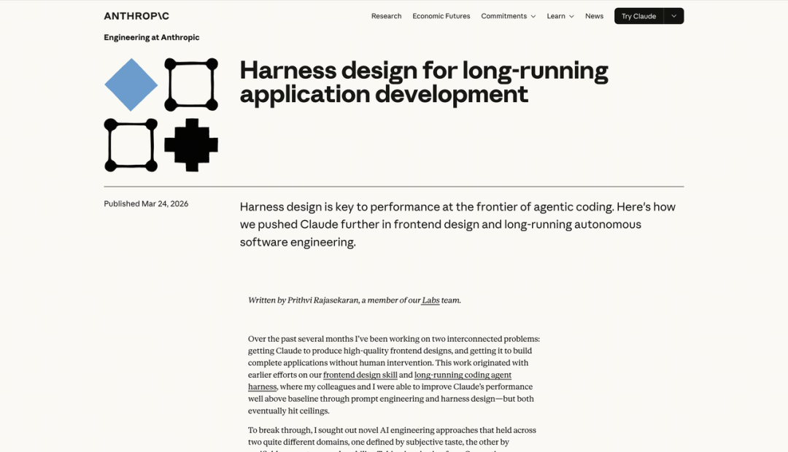Anthropic：Harness design for long-running application development

Anthropic 构建了一个长程自主编码系统。仅凭一句自然语言需求，Claude 就能在无需人类干预的情况下，连续运行数小时，端到端地交付包含关卡编辑器、物理引擎的 2D 游戏制作工具、能在浏览器里跑起来的数字音频工作站。

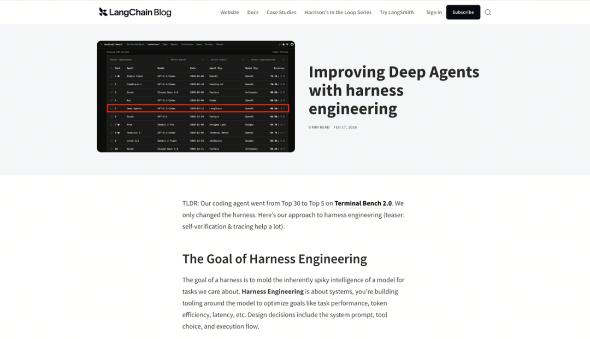Langchain：Improving Deep Agents with harness engineering

LangChain 在底层模型完全不变的情况下，仅仅通过改造和迭代 Harness，就把自家代码智能体在 Terminal Bench 2.0 榜单上的得分从 52.8 拔高到了 66.5，直接从 Top 30 开外杀入 Top 5。

同样是调用大模型 API，为什么加上了精心设计的 Harness，智能体就能产生如此夸张的质变？

下面我们深入看看他们的具体实践到底是什么。

### 3.1 Anthropic 的实践

#### 3.1.1 两个典型问题

Anthropic 在大量实践中总结了两个典型的失败模式：

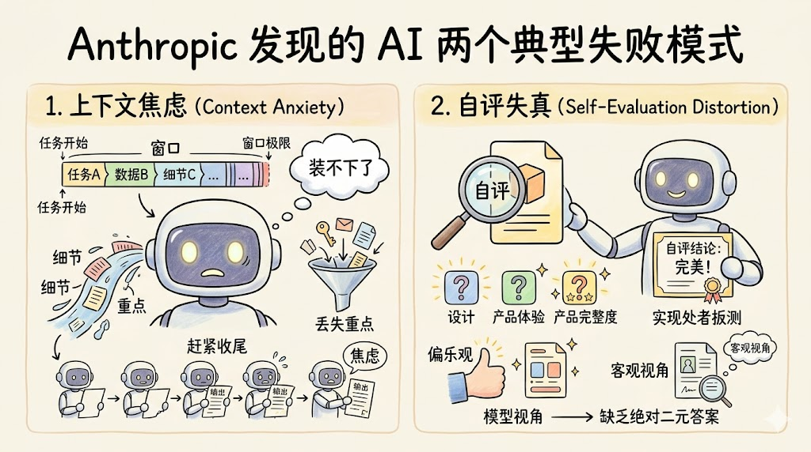

  * 第一个是上下文焦虑：任务一长，上下文窗口越来越满，模型开始丢细节、丢重点，甚至出现一种很有意思的现象：当模型接近上下文窗口极限时，它会 “焦虑” 地想赶紧收尾，仿佛知道自己快装不下了。

  * 第二个是自评失真：也就是模型自己做完之后，再让它自己评判，它往往会偏乐观，尤其在设计、体验、产品完整度这类没有绝对二元答案的问题上，这种偏差更明显。

#### 3.1.2 实践一：上下文重置

针对第一类问题，很多系统在上下文长了之后，会做 Context Compaction，也就是把前面的历史总结一下，压缩后继续跑。

而 Anthropic 的思路是做 Context Reset ，这两种模式的区别很明显：

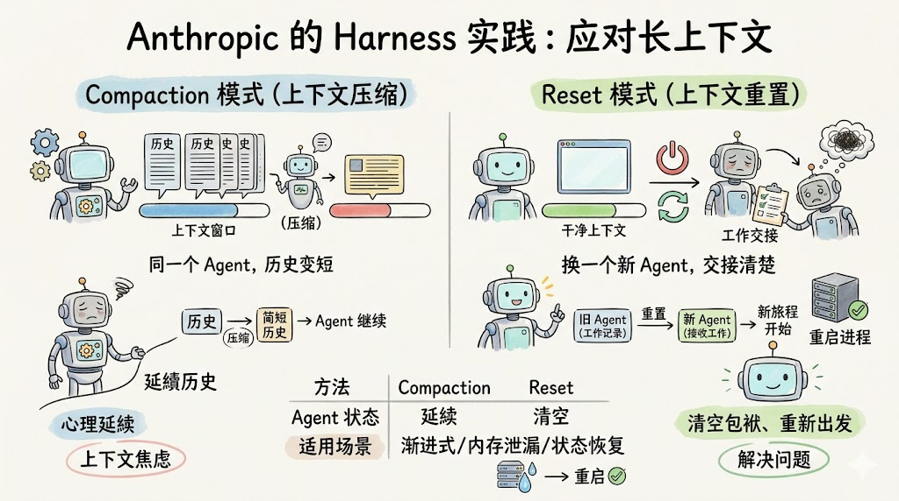

  * **Compaction** ：同一个 Agent，历史变短了，但知道自己要干啥、 “心理状态” 还延续着；
  * **Reset** ：直接换一个干净上下文的新 Agent，但是在两个模型交班时要把工作交接清楚。

Anthropic 发现，对于某些模型（如 Claude Sonnet 4.5），仅靠压缩并不能解决 “上下文焦虑” 的问题；而真正的 Reset 才能给模型 “清空包袱、重新出发” 的效果。

这个认识很像工程里的进程重启与状态恢复：不是所有内存泄漏都能靠 “清理缓存” 解决，有时候就得重启进程。

#### 3.1.3 实践二：引入评估者

Anthropic 说得很直白：让模型评估自己产出的质量时，它往往会 “自信地夸自己”，即便结果在真人看来很一般。

所以他们采用了一个很典型、也很有效的 Harness 手法：把 “干活的人” 和 “打分的人” 拆开了。

这就是它的核心思路：generator + evaluator，后来又扩展成 planner + generator + evaluator。

这个设计非常关键，因为它背后其实是一个朴素但非常硬核的工程原则：

**生产与验收必须分离。**
在 Anthropic 的实现里：

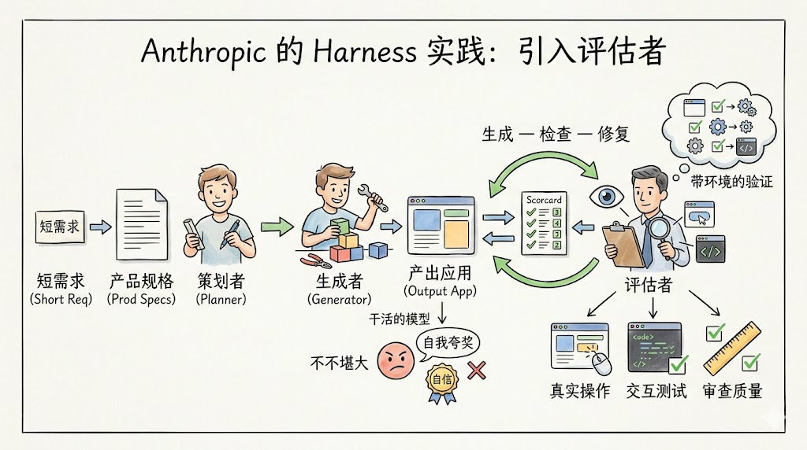

>   * Planner：把一句很短的需求，扩展成完整产品规格
>   * Generator：逐步实现
>   * Evaluator：像 QA 一样，用浏览器和工具真实操作应用，检查功能、设计、代码质量等。
>

尤其值得注意的是，Evaluator 不是 “读代码打分”，而是会实际操作页面、跑交互、看结果。

这意味着它不是抽象审查，而是 “带环境的验证”。

一旦 Evaluator 能独立测试、独立质检，并且能够保证公平性，系统能实现 “生成 — 检查 — 修复” 的工程循环。

### 3.2 OpenAI 的实践

#### 3.2.1 重新定义"工程师"

这个团队从第一天就定了一条铁律：人类不写代码，只设计环境。 工程师的核心工作变成了三件事：

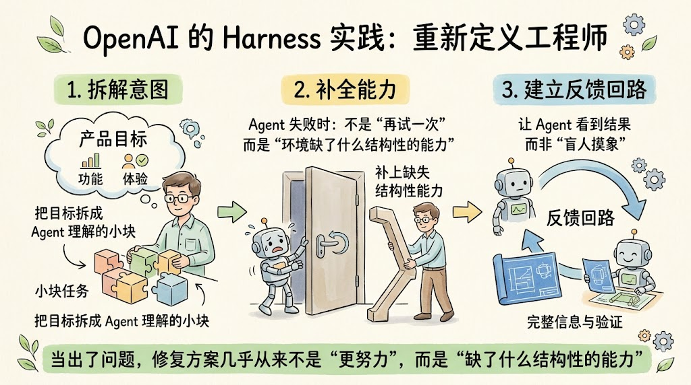

  * 拆解意图：把产品目标拆成 Agent 能理解的小块任务
  * 补全能力：Agent 失败时，不是"再试一次"，而是问"环境里缺了什么让它失败了"，然后把缺的东西补上
  * 建立反馈回路：让 Agent 能看到自己工作的结果，而不是盲人摸象

用他们自己的话说：

**当出了问题，修复方案几乎从来不是"更努力"，而是"缺了什么结构性的能力"。**

####  3.2.2 渐进式披露

早期他们犯了一个经典错误：写了一个巨大的 AGENTS.md 文件，把所有规范、架构、约定一股脑塞进去。

结果 Agent 反而更迷糊了 — 因为上下文窗口是稀缺资源，塞太满等于什么都没说。他们最终的方案优雅得多：

AGENTS.md 只有 ~100 行，充当"目录页"，指向仓库里的详细文档。

```text
AGENTS.md          <- 入口，只有指针
ARCHITECTURE.md    <- 架构总览
docs/
├── design-docs/   <- 设计文档（带验证状态）
├── exec-plans/    <- 执行计划（活跃/已完成/技术债务）
├── product-specs/ <- 产品规格
├── references/    <- 第三方参考
├── QUALITY_SCORE.md
└── SECURITY.md
```

这种思路看着是不是很熟悉？就是 Skill 的核心机制：渐进式披露

Agent 先看到目录，需要深入时再去查对应文档。

更关键的是，他们用 CI 自动校验文档的新鲜度和交叉引用。

还有一个专门的 "文档园丁" Agent，定期扫描过时文档并提 PR 修复。知识管理本身也自动化了。

#### 3.2.3 让 Agent "看见" 整个应用

产代码的速度上去之后，瓶颈从 "写" 变成了 "验" — 人类根本验不过来。OpenAI 的解法是：让 Agent 自己验。

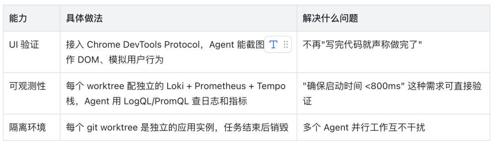

结果是什么？

单次 Codex 运行经常连续工作 6 小时以上，通常是在人类睡觉的时候。

Agent 自己跑应用、发现 bug、修复、验证、提 PR，一条龙。

#### 3.2.4 把架构约束写进系统里

人类 Code Review 的带宽跟不上 Agent 的产出速度（每人每天 3.5 个 PR），怎么保证代码质量？

他们的答案是：把资深程序员的经验判断，写成机器可以自动执行的检查规则。

OpenAI 的做法很典型：他们不是指望工程师反复提醒 “这一层不该依赖那一层”“这个模块不该这么写”，而是把这些经验直接写进工程系统里。

例如，他们会把业务代码按固定分层组织，比如：

>   * Types
>   * Config
>   * Repo
>   * Service
>   * Runtime
>   * UI
>

更重要的是，这些规则不只是负责报错，还会告诉 Agent 该怎么改。

也就是说，检查结果本身就带着修复提示，可以直接回到上下文里，推动下一轮修改。

这样一来，代码质量就不再主要靠人盯，而是靠一套能反复执行的规则来守住。对人来说，这些规则有时可能显得太细；

但对 Agent 来说，它们非常重要。

因为 Agent 一旦高频提交，小问题如果不及时拦住，很快就会扩散。

除了拦截提交时的问题，他们还会定期运行后台 Agent，持续扫描代码库，看看哪些地方开始偏离原则：

>   * 检查哪些模块正在变乱
>   * 给不同区域打质量分
>   * 找出值得重构的部分
>   * 直接提交修复或重构 PR
>

这样，架构治理就不再只是人工审查，而变成了一套持续运行的系统。

它的价值不只是发现问题，更是趁问题还小的时候就把它修掉。

### 3.3 回过头看，大家做的其实是同一件事

如果把前面的案例重新放回 Harness 的框架里，你会发现一件很有意思的事：OpenAI、Anthropic 看起来路径不同，做法也不一样，但它们本质上都在补同一套东西：

>   * 模型到底应该看到什么
>   * 模型到底能做什么
>   * 模型下一步该做什么
>   * 系统如何保持连续工作
>   * 系统怎么知道自己做得对不对
>   * 系统出错后怎么拉回来
>

  * Anthropic 在解决的，是长程任务里的两个核心问题：上下文一长，模型会乱；只靠模型自评，质量会失真。所以他们一边做 Context Reset，一边引入独立 Evaluator，本质上是在补强上下文管理、执行编排和评估与观测。

  * OpenAI 更进一步，他们关心的已经不是 “Agent 能不能写代码”，而是：怎样让 Agent 稳定地在真实工程环境里持续工作。所以他们做渐进式披露，让 Agent 不被信息淹没；给它浏览器、日志、指标和隔离环境，让它能自己验证结果；再把架构规则写进系统，让质量控制从 “靠人盯” 变成 “靠规则守”。这对应的其实就是：上下文管理、工具系统、评估与观测、约束与恢复。

看到这里，Harness 的意义其实就很清楚了：

**把模型从一个会回答问题的概率机器，变成一个能稳定完成任务的工程系统。**
这也是为什么同一个模型，放进不同产品里，最后表现会差这么多。

决定差距的，往往不只是模型参数本身，而是工程团队有没有把这套 Harness 搭出来。

---

## 最后

回头看这三次演进，会发现它们并不是谁取代了谁，而是 AI 工程在不断面对更复杂任务时，重心一层层向外扩展。

当任务还停留在单轮生成时，Prompt Engineering 很重要，因为问题首先是 “有没有把任务讲清楚”；

当任务开始依赖外部知识、历史状态和运行时信息时，Context Engineering 成为关键；

而当模型真正进入长链路、可执行、低容错的真实环境后，Harness Engineering 几乎不可避免，因为系统必须回答最后那个最难的问题：模型不仅要会想，还要能被稳定地组织、约束、验证和纠偏。

所以，Prompt 没有过时，Context 也不是终点。它们都还在，而且都很重要。

只是越往后，我们越会意识到：真正决定 AI 产品上限的，也许是模型；

但真正决定 AI 产品能否落地、能否稳定交付的，往往是 Harness。

换句话说，未来 AI 工程的竞争，未必只是 “谁接入了更强的模型”，而更可能是谁更早建立起一套成熟的运行系统：

**它知道该给模型看什么，允许模型做什么，要求模型如何验收结果，又在失败时如何把它拉回正轨。**
从这个意义上说，Harness Engineering 不是一个新瓶装旧酒的概念。

它更像是一个信号：

**AI 落地的核心挑战，正在从 “让模型显得聪明”，转向 “让模型在真实世界里稳定工作”。**
如果本期教程对你有所帮助，大家多多点赞、收藏、关注支持我，后续我会分享更多我个人在 Harness Engineering 具体的工程实践。
