

  
AI 大模型架构解析 · 图解导读

  <h1>一页串起模型、Agent、MCP、工作流与 Memory</h1>
  
如果你总觉得模型、Agent、MCP、工作流、知识库这些词看起来都懂，但放在一起就容易混，这一页就是用来把它们重新排回同一张地图里的。

  

    AI Fundamentals
    Model vs Agent
    MCP
    Workflow
    Memory
  

  
<strong>先抓主线：</strong>模型负责理解与生成，Agent 负责围绕目标行动，MCP 负责连接工具，Workflow 负责把步骤沉淀成流程，Memory 负责把资料与经验留住。后面的 7 张图，就是沿着这条线一层层展开。

  

    模型
    <strong>先回答：系统“会不会”</strong>
    
负责理解、推理、生成与结构化表达，是能力底座。

  

  

    Agent
    <strong>再回答：系统“会不会自己做”</strong>
    
让模型围绕目标持续行动，而不是只生成一段话。

  

  

    MCP
    <strong>再回答：工具“怎么规范接入”</strong>
    
统一发现、调用和约束工具，降低接入碎片化。

  

  

    Workflow
    <strong>再回答：流程“能不能稳定复用”</strong>
    
把高频任务从一次性成功，变成可复用、可审计的 SOP。

  

  

    Memory
    <strong>最后回答：系统“记不记得住”</strong>
    
延续知识、偏好、状态与经验，让协作具有连续性。

  

  

    模型选型
    <strong>别只问谁强，更要问谁匹配</strong>
    
成本、风格、上下文稳定性和生态集成，都会改变答案。

  

  <a href="#overview">01 总览：AI 世界里到底有哪些层</a>
  <a href="#model">02 什么叫模型：AI 的能力边界从哪里来</a>
  <a href="#agent">03 什么是 Agent：从“会说”到“会做”</a>
  <a href="#mcp">04 什么是 MCP：给工具接入装统一插头</a>
  <a href="#workflow">05 什么是工作流：把能力变成稳定流程</a>
  <a href="#memory">06 什么是知识库 / Memory：让系统不再每次从零开始</a>
  <a href="#compare">07 GPT、Claude、Gemini 有什么区别</a>

## 适合谁从哪一节开始读

  <a class="llm-visual-guide__path-card" href="#overview">
    零基础读者
    <strong>先从 01 总览 开始</strong>
    
先把“模型、Agent、MCP、工作流、Memory”放回同一张地图里，再往下看定义，不容易混层。

  </a>
  <a class="llm-visual-guide__path-card" href="#model">
    产品 / 运营
    <strong>优先读 02 模型 + 05 工作流</strong>
    
先看模型边界，再看如何把能力沉淀成稳定流程，最适合做方案判断和需求拆解。

  </a>
  <a class="llm-visual-guide__path-card" href="#agent">
    开发者
    <strong>优先读 03 Agent + 04 MCP</strong>
    
更快理解工具调用、执行循环、协议接入与系统分层，适合进入工程实现视角。

  </a>
  <a class="llm-visual-guide__path-card" href="#memory">
    做知识库 / 助手的人
    <strong>优先读 06 Memory</strong>
    
先分清知识库与 Memory，再回头看 Workflow 和 Agent，能更快进入真实业务设计。

  </a>

## 先把关系图装进脑子里

很多入门文章会把这些概念拆开讲，但真正让人建立理解的，往往不是一个个定义，而是它们之间的关系。你可以先把下面这张“文字版关系图”记住：

  

    <strong>模型 Model</strong>
    
负责理解、推理、生成，是整个系统的认知引擎。

  

  
->

  

    <strong>Agent</strong>
    
围绕目标驱动模型做判断、调工具、读结果、继续执行。

  

  
->

  

    <strong>Workflow</strong>
    
把高频任务沉淀成稳定步骤，让执行更可控、更可复用。

  

  

    MCP / API / CLI 负责把 Agent 连接到外部工具世界
  

  

    <strong>Knowledge Base / Memory</strong>
    
给模型、Agent 和 Workflow 持续提供资料、上下文、偏好与经验沉淀。

  

这一层关系可以这样理解：

- **模型是能力起点**：没有模型，系统就没有语言理解、推理和生成能力
- **Agent 是行动组织层**：它让模型不只是回答问题，而是开始围绕目标执行任务
- **Workflow 是稳定交付层**：它把本来依赖临场发挥的能力，变成可重复的流程
- **Memory 是长期积累层**：它让系统记住上下文、资料与经验，而不是每次都重新来过
- **MCP / API / CLI 是连接通道**：它们不是目标本身，而是让系统能接上外部工具和真实世界

如果你先有了这张关系图，后面再看单个概念时，就不会把“模型升级”“Agent 设计”“工作流编排”“知识库建设”混成一件事。

## 最容易混淆的 4 组概念

  

    <strong>模型 vs Agent</strong>
    
模型决定系统能不能理解和生成；Agent决定系统能不能围绕目标持续执行。

  

  

    <strong>Agent vs Workflow</strong>
    
Agent擅长应对变化；Workflow擅长把高频步骤固化成稳定流程。

  

  

    <strong>MCP vs 工具本身</strong>
    
MCP是统一接入方式；工具才是真正执行查询、写文件、调系统的能力来源。

  

  

    <strong>知识库 vs Memory</strong>
    
知识库偏外部资料检索；Memory偏系统自己的状态、偏好与经验延续。

  

  

    <strong>第一步：先看层</strong>
    
遇到新概念，先判断它属于能力层、行动层、连接层、流程层还是记忆层。

  

  

    <strong>第二步：再看连接</strong>
    
判断模型、工具、流程和记忆之间是否形成闭环，而不是只停留在一次回答。

  

  

    <strong>第三步：最后看落地约束</strong>
    
权限、成本、可审计性和稳定性，往往决定一个方案能不能真的上线。

  

<section id="overview" class="llm-visual-guide__section">

## 01 总览：AI 世界里到底有哪些层

  

    <button class="llm-visual-guide__figure-link" type="button" @click="openPreview(0)">查看大图</button>
  

  

    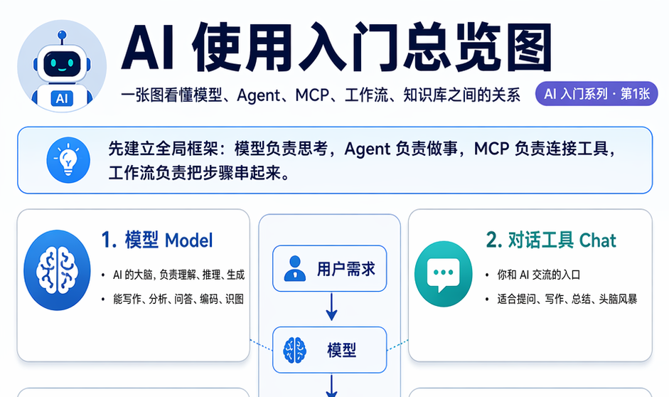
    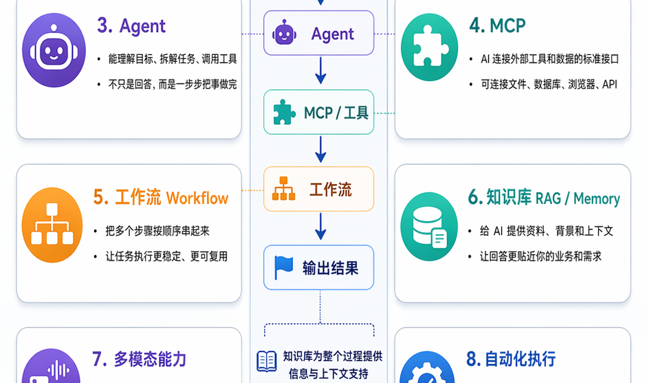
    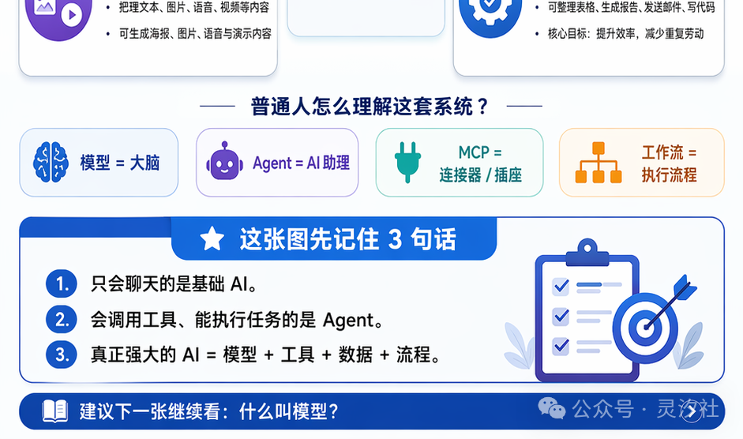
  

  
图解重点
先看清“模型是能力源头，Agent / Workflow / Memory 是模型之外的系统层”。

这张总览图最适合拿来建立全局感。对初学者来说，最容易犯的错，就是把“模型、Agent、工作流、知识库、不同厂商模型”全部当成同一层的问题。实际上它们关注的是不同层面。

读这张图，只需要先抓住 4 个判断：

- **先问能力来源**：内容生成、理解上下文、分析意图，主要是模型层能力
- **再问行动能力**：会不会调工具、查文件、执行命令，这才进入 Agent 层
- **再问接入方式**：工具是直接用 CLI、API，还是用 MCP 统一接入，这是连接层问题
- **最后问长期复用**：是否能把规则、文档、经验和历史上下文保留下来，这是知识层问题

这一张图的意义，不是背定义，而是先把“层”分开。层分开后，你就更容易判断自己讨论的是模型问题、系统问题，还是流程问题。

更实用的阅读顺序是：

- **第一步先识别“能力源头”**：哪些事情是模型天然会的，哪些不是
- **第二步再看“系统外壳”**：Agent、Workflow、Memory 都是在模型外面补能力
- **第三步理解“现实约束”**：成本、权限、工具接入、稳定性，都会把一个 AI 产品拉回工程现实

  <strong>这一节最该带走的结论：</strong>遇到一个新 AI 产品时，先别急着问“它用的是什么模型”，而要先问“它把模型外的系统能力做到了哪一层”。很多产品差异，其实就出在这里。

</section>

<section id="model" class="llm-visual-guide__section">

## 02 什么叫模型：AI 的能力边界从哪里来

  

    <button class="llm-visual-guide__figure-link" type="button" @click="openPreview(1)">查看大图</button>
  

  

    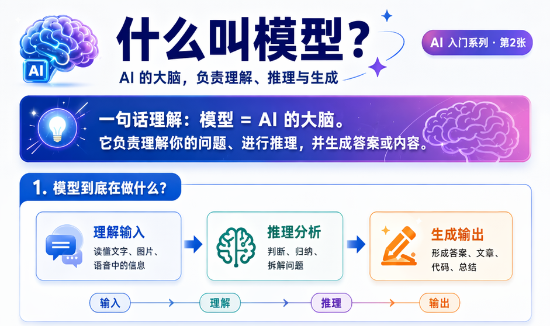
    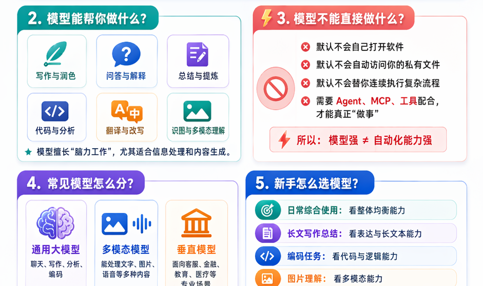
    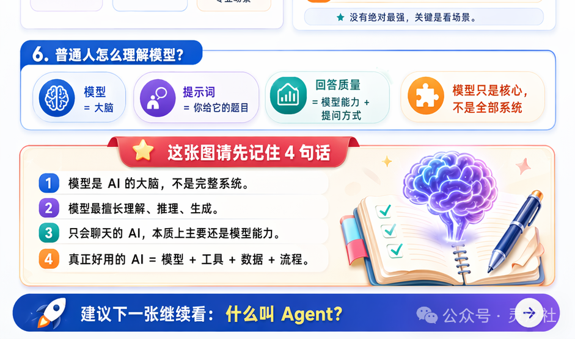
  

  
图解重点
把“会说”与“会做”分开看，模型擅长认知与生成，但默认不直接行动。

模型可以理解成一个经过大量数据训练出来的“概率引擎”。它最重要的，不是“会不会聊天”，而是能力边界：

- **知识边界**：训练数据有截止时间，不一定知道最新世界发生了什么
- **执行边界**：模型能告诉你“应该怎么做”，但默认并不会亲自去做
- **上下文边界**：模型不是无限记忆体，它只能在有限上下文窗口里做判断
- **成本边界**：更强的模型通常更贵、更慢，也更需要精细调度

所以“模型更强”不等于“产品一定更好用”。真正决定体验的，往往还包括提示词、上下文管理、工具接入和任务拆解。

看这一节时，再多问自己 3 个问题：

- **模型擅长什么**：语言理解、模式归纳、文本生成、结构化输出
- **模型不擅长什么**：实时事实获取、长期状态保存、外部世界直接执行
- **模型最怕什么**：信息不足、上下文混乱、目标模糊、约束不清

  <strong>这一节最该带走的结论：</strong>模型回答得像不像人，并不是最重要的；真正重要的是，你是否理解了它在哪些地方必须借助外部系统来补足能力边界。

</section>

<section id="agent" class="llm-visual-guide__section">

## 03 什么是 Agent：从“会说”到“会做”

  

    <button class="llm-visual-guide__figure-link" type="button" @click="openPreview(2)">查看大图</button>
  

  

    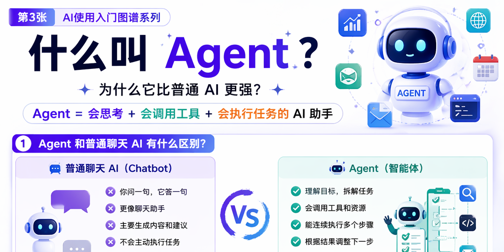
    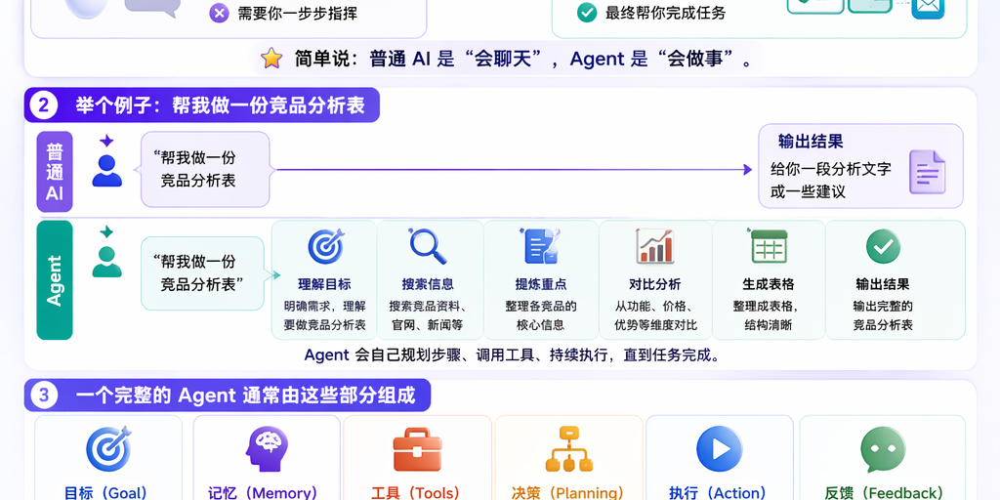
    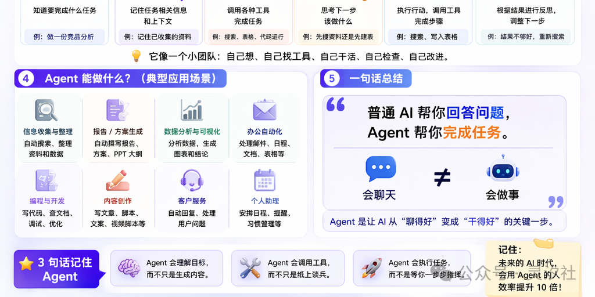
  

  
图解重点
观察 Agent 如何把目标、工具、执行和反馈连接成一个循环，而不只是一次回答。

如果说模型是一颗大脑，那么 Agent 就是一套让这颗大脑真正进入任务现场的工作系统。它不只是生成一句回答，而是围绕目标持续行动。

你可以把 Agent 理解成“带执行循环的大模型系统”，通常至少包含这些环节：

- 接收目标：理解用户到底要完成什么结果
- 制定动作：决定下一步该查、该算、该调用哪个工具
- 执行与观察：拿到真实外部结果，而不是只靠模型臆测
- 继续迭代：根据新信息调整后续动作，直到完成任务

判断一个系统是不是 Agent，通常问 4 个问题就够了：

- 它是不是只回答一句话，还是会继续做后续动作
- 它能不能调用工具、文件、浏览器、命令行或业务系统
- 它会不会根据执行结果调整下一步，而不是一次生成到底
- 它是否具备最基本的任务状态和执行循环

  <strong>这一节最该带走的结论：</strong>Agent 不是另一个模型，而是让模型从“只会生成”升级到“能围绕目标执行”的系统外壳。

</section>

<section id="mcp" class="llm-visual-guide__section">

## 04 什么是 MCP：给工具接入装统一插头

  

    <button class="llm-visual-guide__figure-link" type="button" @click="openPreview(3)">查看大图</button>
  

  

    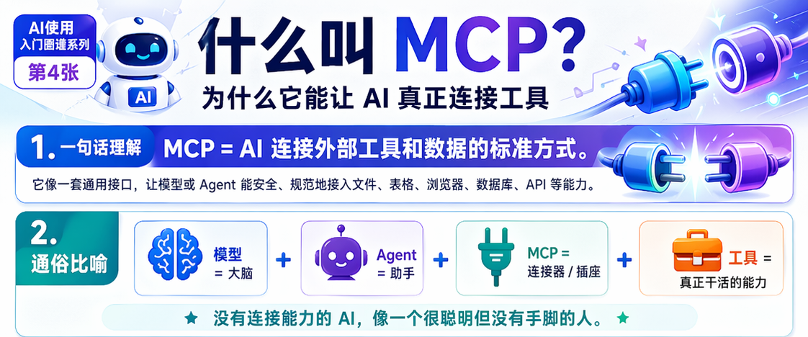
    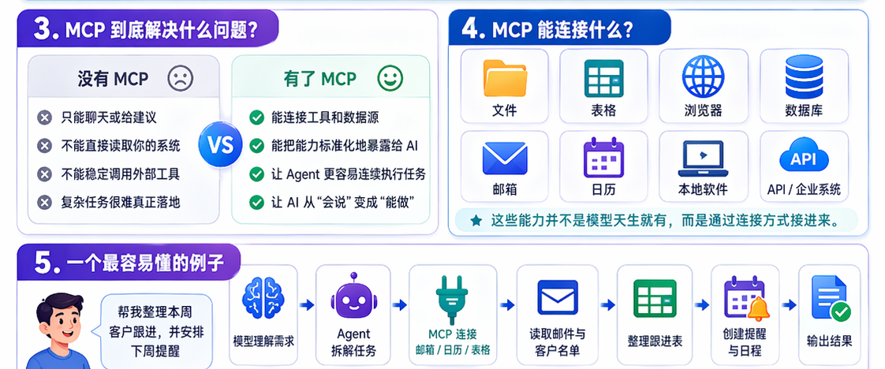
    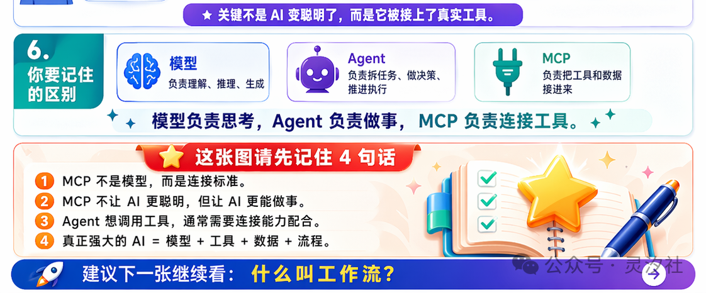
  

  
图解重点
不要把 MCP 当成“更聪明的模型”，它更像让工具接入变统一的标准化通道。

当 Agent 要连接越来越多工具时，工程复杂度会迅速膨胀。MCP（Model Context Protocol）想解决的，就是工具接入碎片化的问题。

MCP 的价值通常体现在 3 个方面：

- **统一发现**：Agent 可以先知道“有哪些工具可用”
- **统一调用**：用相似的方式发起工具调用，而不是每接一个系统都重造一套逻辑
- **统一约束**：更容易建立权限、认证、边界和可审计性

一个很重要的认知是：**MCP 解决的首先是工程接入问题，而不是推理问题。** 它不会让模型突然更聪明，但会让工具接入更规范、更可管理。

把它和前后几层连起来看：

- **模型** 决定“该不该调用工具”
- **Agent** 决定“什么时候调用、先调什么、调完后怎么继续”
- **MCP** 决定“工具之间有没有统一的接入语言”
- **工作流** 决定“这些调用步骤能不能沉淀成稳定流程”

如果你后续想深入看这条线，可以继续读本专题已有的这两篇：

- [第一章：Function Call / MCP / ReAct / Skills 技术栈](../chapter1/)
- [AI Agent 第六章：MCP vs CLI](../../agent/chapter6/)

  <strong>这一节最该带走的结论：</strong>MCP 不是为了替代 Agent，而是为了让 Agent 更容易、也更规范地连接越来越复杂的工具世界。

</section>

<section id="workflow" class="llm-visual-guide__section">

## 05 什么是工作流：把能力变成稳定流程

  

    <button class="llm-visual-guide__figure-link" type="button" @click="openPreview(4)">查看大图</button>
  

  

    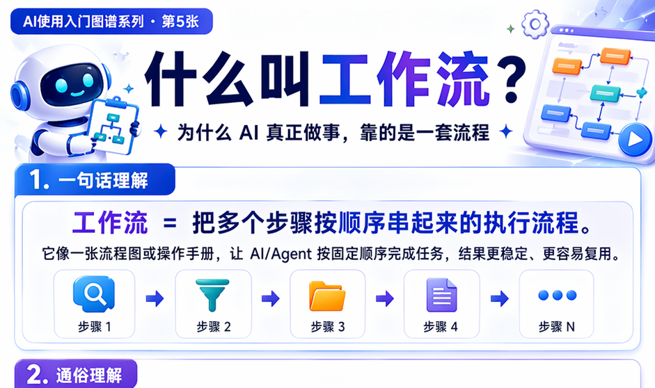
    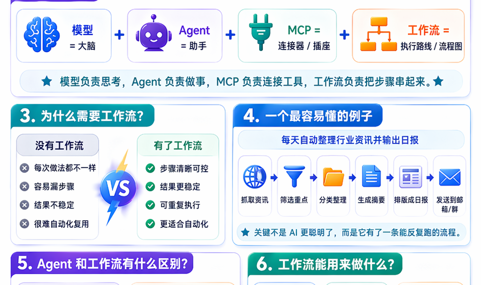
    
  

  
图解重点
看清哪些步骤应该交给 Agent 自由判断，哪些步骤更适合固化成 SOP。

很多团队做 AI 系统时，最先得到的是几个“能跑通”的 Demo；但一旦要稳定交付，就必须把“这次刚好成功”变成“下次还能重复成功”。这就是工作流的价值。

工作流最常见的场景包括：

- 固定顺序任务：例如抓取资料 → 清洗内容 → 生成文稿 → 审核发布
- 多阶段审批：例如先生成，再校验，再人工确认
- 稳定运营流程：例如日报、周报、客服回复、知识整理
- 和 Agent 配合：把高自由度决策留给 Agent，把稳定步骤沉淀成流程

Workflow 常常承担 3 个角色：

- **给复杂任务定顺序**：先做什么、后做什么、谁来审核
- **给不稳定步骤加护栏**：哪些地方必须人工确认，哪些地方必须结构化输出
- **给团队经验沉淀模板**：把一次成功做法变成下次还能重复跑的 SOP

  <strong>这一节最该带走的结论：</strong>工作流的价值，不是让系统看起来更自动化，而是把原本偶然成功的过程，变成稳定可复用的生产能力。

</section>

<section id="memory" class="llm-visual-guide__section">

## 06 什么是知识库 / Memory：让系统不再每次从零开始

  

    <button class="llm-visual-guide__figure-link" type="button" @click="openPreview(5)">查看大图</button>
  

  

    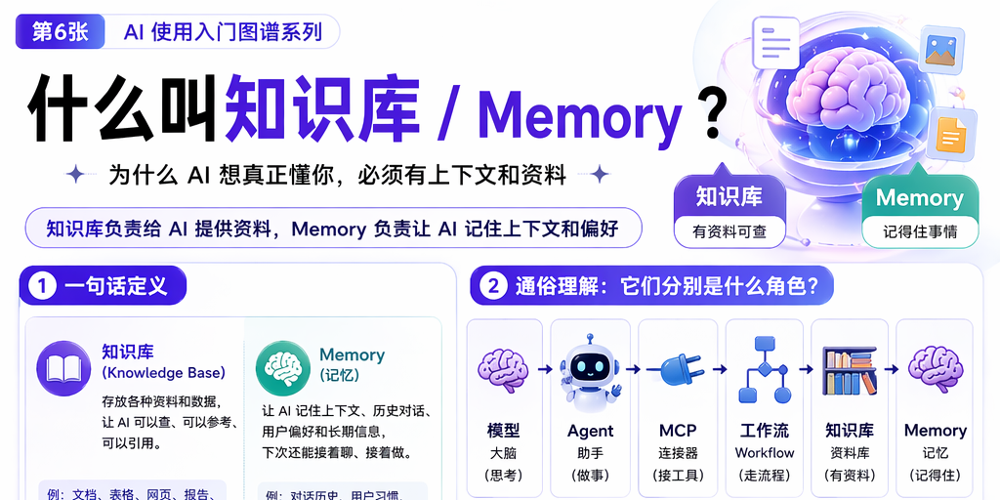
    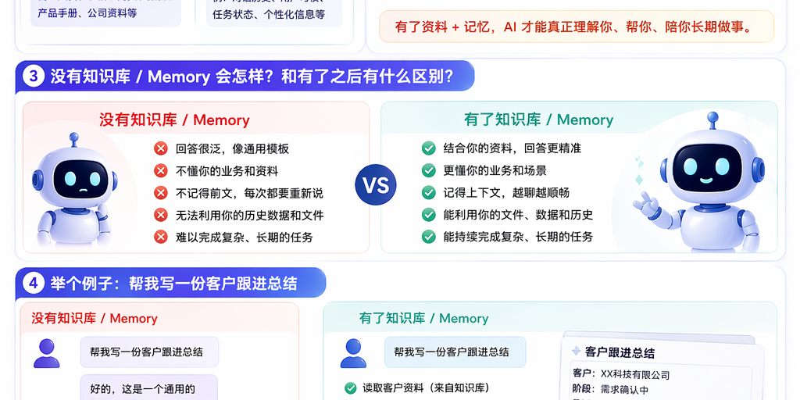
    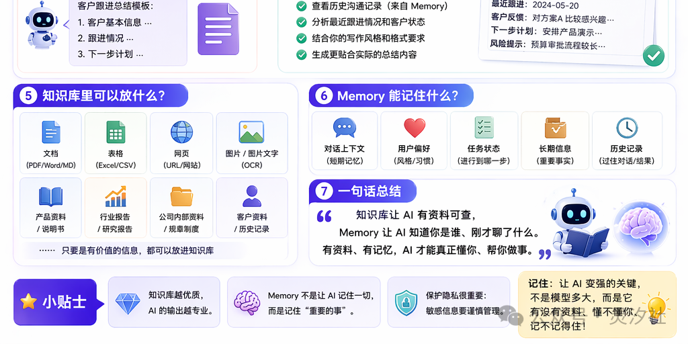
  

  
图解重点
把“外部知识检索”和“系统内部记忆延续”分开，这会直接影响后续架构设计。

知识库和 Memory 经常被混用，但它们并不完全一样。最简单的区分是：

- **知识库** 更像“外部资料库”，重点是文档、文件、说明书、FAQ、业务资料的存储与检索
- **Memory** 更像“系统自己的记忆层”，重点是历史对话、用户偏好、任务状态、经验摘要与上下文延续

它们共同解决的问题都是：**不要让模型每次都从空白上下文重新开始。** 这层能力通常在真实业务里很快变得重要，因为：

- 用户有长期偏好，需要记住
- 任务有历史上下文，需要延续
- 外部知识很多，不可能全部塞进 prompt
- 成功经验需要沉淀，否则每次都重复试错

进一步看，这一层可以拆成两个方向：

- **知识型沉淀**：把公司资料、产品文档、历史案例、FAQ 等放进可检索的知识体系
- **状态型沉淀**：把用户偏好、当前任务进度、历史对话、执行结果和经验摘要保留下来

  <strong>这一节最该带走的结论：</strong>知识库 / Memory 不是锦上添花，而是让 AI 从“一次性回答工具”走向“长期协作系统”的关键一层。

</section>

<section id="compare" class="llm-visual-guide__section">

## 07 GPT、Claude、Gemini 有什么区别

  

    <button class="llm-visual-guide__figure-link" type="button" @click="openPreview(6)">查看大图</button>
  

  

    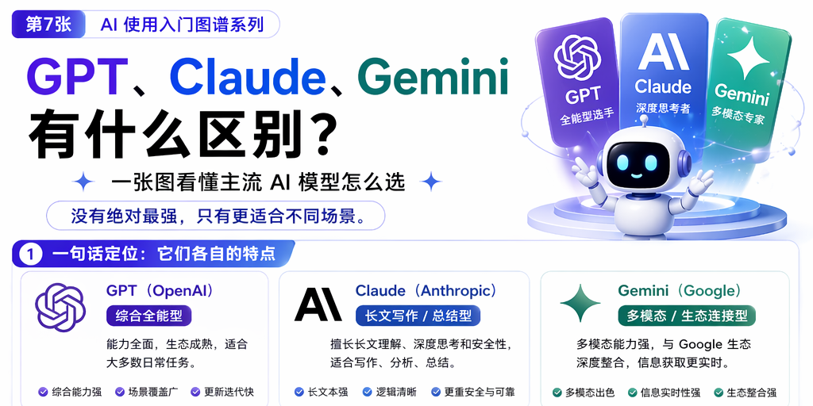
    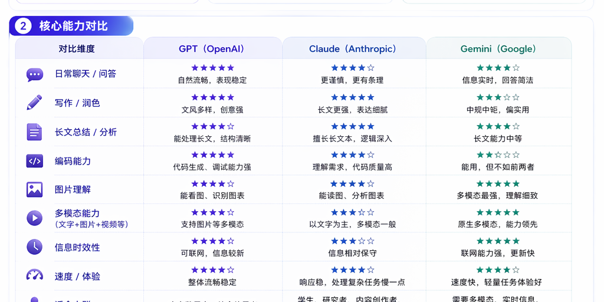
    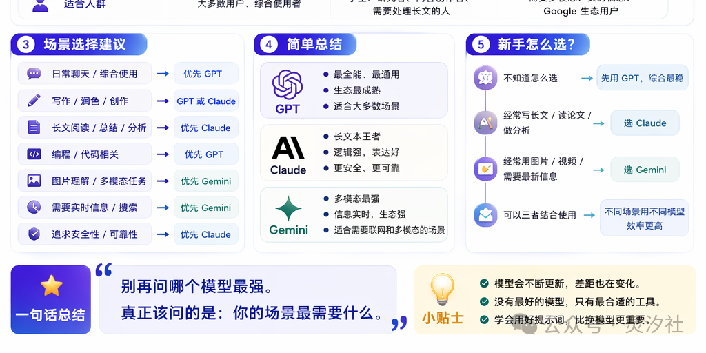
  

  
图解重点
别只比较榜单，优先比较不同模型在风格、成本、上下文稳定性和生态集成上的匹配度。

当你已经理解模型、Agent、MCP、工作流和 Memory 这些层次后，再看 GPT、Claude、Gemini 的差异，就不容易陷入“只比参数”或“只看榜单”的误区。

更有价值的比较维度包括：

- **通用对话与写作风格**：谁更稳定、谁更自然、谁更适合长文本整理
- **代码与工具调用能力**：谁更擅长结构化输出、函数调用与工程任务
- **上下文处理体验**：长上下文是否稳定、是否容易漂移、总结能力如何
- **生态整合方式**：各家产品如何把模型放进 IDE、文档、办公流和企业能力里

真正有价值的问法通常不是“谁更强”，而是：

- 你的任务更偏写作、代码、分析，还是多工具执行
- 你更在乎单次效果，还是长期成本与集成方式
- 你需要的是个人助手，还是面向团队或客户的产品能力
- 你准备把模型放进怎样的系统外壳里：聊天框、IDE、工作流平台，还是企业 SaaS

  <strong>这一节最该带走的结论：</strong>模型对比的真正目标，不是找到一个永久赢家，而是找到在你的系统结构、成本约束和任务形态下最合适的那一个。

</section>

## 最后，把整条线重新串起来

  

    <strong>模型</strong>
    
决定系统会不会理解、生成、推理与结构化表达。

  

  

    <strong>Agent</strong>
    
决定系统能不能围绕目标调用工具、分步执行并完成任务。

  

  

    <strong>MCP</strong>
    
决定工具如何被统一发现、接入和管理。

  

  

    <strong>工作流</strong>
    
决定高频任务能否变成稳定、可审计、可复用的流程。

  

  

    <strong>知识库 / Memory</strong>
    
决定系统能否保留资料、历史与经验，而不是每次从零开始。

  

  

    <strong>模型选型</strong>
    
决定在不同成本、速度、风格与生态之间如何取舍。

  

如果你是第一次进入这条线，这一页最重要的作用不是替你学完全部细节，而是先把地图立起来。

## 如果你正准备自己搭一套 AI 系统

  

    <strong>1. 先定义任务形态</strong>
    
这是单轮问答、长链路执行，还是高频重复流程？不同任务形态，对 Agent 和 Workflow 的依赖完全不同。

  

  

    <strong>2. 再定义模型职责</strong>
    
哪些环节交给模型推理，哪些环节必须交给真实系统执行，尽早把边界切清楚。

  

  

    <strong>3. 设计工具接入方式</strong>
    
工具少时可以直接接 API / CLI；工具多、权限复杂时，再考虑用 MCP 做统一接入与治理。

  

  

    <strong>4. 给流程加护栏</strong>
    
把容易出错、需要审批或必须留痕的步骤沉淀成 Workflow，不要把一切都交给自由发挥。

  

  

    <strong>5. 提前规划 Memory</strong>
    
明确什么该记、记多久、谁能读、何时清理。很多系统不是做不出来，而是记忆治理做不下去。

  

  

    <strong>6. 用评估闭环验证方案</strong>
    
别只看 Demo 漂不漂亮，要持续评估成功率、延迟、成本、可解释性和人工介入点。

  

下一步推荐阅读：

1. [第一章：Function Call / MCP / ReAct / Skills 技术栈](../chapter1/)
2. [第二章：Hermes-Agent 自学习 Skill 机制](../chapter2/)
3. [AI Agent 第六章：MCP vs CLI](../../agent/chapter6/)

<transition name="llm-preview-fade">
  

    

      

        

          
当前图片预览

          
{{ currentPreview.title }}

        

        

          {{ previewCounterText }}
          <a class="llm-visual-guide__preview-open" :href="currentPreview.src" target="_blank" rel="noreferrer">{{ isTallPreview ? '原图' : '新开原图' }}</a>
          <button class="llm-visual-guide__preview-close" type="button" @click="closePreview">关闭</button>
        

      

      

        <button class="llm-visual-guide__preview-nav llm-visual-guide__preview-nav--prev" type="button" @click="showPrev" aria-label="查看上一张">
          ‹
          上一张
        </button>
        
        <button class="llm-visual-guide__preview-nav llm-visual-guide__preview-nav--next" type="button" @click="showNext" aria-label="查看下一张">
          下一张
          ›
        </button>
      

      

        {{ isTallPreview ? '长图已按可阅读宽度展开，可上下滚动查看细节' : '直接展示原图，滚动即可看细节' }}
        支持键盘 `←` `→` 切换，点击空白处关闭
      

    

  

</transition>

