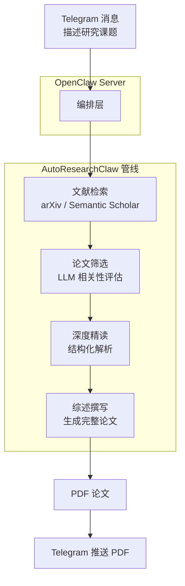

# 🧪 龙虾大学：自动化科研论文实战（说句话，出论文）

> **适用场景**：你发现了一个有趣的研究方向，想快速产出一篇综述论文，但从文献检索到整理成文至少要一两周；或者你的导师/老板要求一份某领域的系统性调研，你希望 AI 帮你跑完从搜论文到写论文的全流程。**你只需要在 Telegram 里描述课题，龙虾帮你搜文献、读论文、写综述。**

[AutoResearchClaw](https://github.com/aiming-lab/AutoResearchClaw) 是由 [aiming-lab](https://github.com/aiming-lab) 开发的开源自动化科研管线。它能够自动完成**文献检索 → 论文筛选 → 深度精读 → 综述撰写**的全流程，最终输出一篇带引用的完整学术论文（PDF）。配合 OpenClaw 的 Telegram 渠道，你可以直接在手机上发起研究课题，然后去喝杯咖啡——论文写好了会推送到你的 Telegram。

---

## 1. 你将得到什么（真实场景价值）

跑通后，你会拥有一个**全自动的科研写作助理**：

### 场景 1：快速产出综述论文
- **问题**：发现了一个新研究方向，想快速了解全貌，但手动检索和整理文献太耗时
- **解决**：在 Telegram 里发送课题描述，AutoResearchClaw 自动检索 arXiv 论文、筛选相关文献、深度精读、撰写综述，2-4 小时后把 PDF 发到你的 Telegram

### 场景 2：应对紧急调研需求
- **问题**：导师/老板要求一份某领域的系统性调研报告，从零开始来不及
- **解决**：把需求发给龙虾，AutoResearchClaw 在后台跑管线，你可以先做别的事，论文生成后自动推送提醒

### 场景 3：研究选题探索
- **问题**：想了解某个交叉领域（如"强化学习 + Agent 框架"）有哪些研究进展，但不知道从哪篇论文开始读
- **解决**：描述你感兴趣的方向，AutoResearchClaw 会帮你从海量论文中筛选、整理出结构化的综述，快速建立领域全景认知

### 场景 4：多课题并行调研
- **问题**：同时关注多个研究方向，精力有限
- **解决**：依次提交多个课题，AutoResearchClaw 逐个跑管线，每完成一篇就推送 PDF

---

## 2. 技能选型：为什么用 AutoResearchClaw？

### 核心架构



### 为什么选 AutoResearchClaw？

| 特性 | 说明 |
|------|------|
| **全自动管线** | 从文献检索到论文输出，全程无需人工干预 |
| **学术级输出** | 生成带引用、有结构的完整综述论文（PDF） |
| **开源免费** | 项目完全开源，只需自备 LLM API Key |
| **灵活的模型支持** | 支持 OpenAI、Claude、本地模型等多种 LLM |
| **对话式配置** | 通过 Telegram 对话完成所有配置，无需手动编辑文件 |

> **与论文推送助手的区别**：[论文推送助手](/cn/university/paper-assistant/) 侧重于**每日论文筛选和摘要推送**（输入是关键词，输出是论文列表）；AutoResearchClaw 侧重于**深度综述写作**（输入是研究课题，输出是完整论文）。两者互补，可以搭配使用。

---

## 3. 配置指南：从零到论文的完整流程

### 3.1 前置条件

| 条件 | 说明 |
|------|------|
| OpenClaw 已安装运行 | 基础环境就绪 |
| Telegram 账号 | 用于与 OpenClaw 交互 |
| 大模型 API Key | AutoResearchClaw 需要调用 LLM（支持 OpenAI / Claude / 本地模型） |
| 工具配置档为 coding/full | AutoResearchClaw 需要命令执行权限，详见[第七章 工具与定时任务](/cn/adopt/chapter7/) |

### 3.2 配置 Telegram 渠道

AutoResearchClaw 通过 Telegram 与你交互，因此需要先创建一个 Telegram 机器人并接入 OpenClaw。

**第一步：创建 Telegram Bot**

打开 Telegram App，在搜索栏输入 `BotFather` 并选择带蓝色认证标志的官方账号：


点击 **Start** 开始对话，然后输入 `/newbot` 创建一个新机器人：


BotFather 会依次询问你两个问题：

1. **机器人显示名称**（name）——可以用中文，比如"虾兄"
2. **机器人用户名**（username）——必须以 `bot` 结尾，比如 `HelloClawClaw_bot`

完整对话示例：

```text
你：/newbot
BotFather：Alright, a new bot. How are we going to call it?
           Please choose a name for your bot.
你：虾兄
BotFather：Good. Now let's choose a username for your bot.
           It must end in `bot`.
你：HelloClawClaw_bot
BotFather：Done! Congratulations on your new bot.
           Use this token to access the HTTP API:
           8658429978:AAHNbNq3sNN4o7sDnz90ON6itCfiqqWLMrc
```

> **重要**：妥善保管这个 Bot Token，后续配置 OpenClaw 时需要用到。任何拥有此 Token 的人都可以控制你的机器人。

**第二步：在 OpenClaw 中接入 Telegram**

回到 OpenClaw 主机，运行 onboard 命令：

```bash
openclaw onboard
```

一路 skip 和 continue，直到出现 **Select channel** 页面，选择 **Telegram (Bot API)**。

系统会提示：

```text
●  How do you want to provide this Telegram bot token?
●  Enter Telegram bot token (Stores the credential
   directly in OpenClaw config)
```

把刚才从 BotFather 获取的 Bot Token 粘贴进去即可。

**第三步：获取你的 Telegram User ID**

接下来需要填写 `allowFrom`（允许哪些用户与机器人对话）。这需要你的 Telegram 数字 ID。

获取方法很简单——在 Telegram 中找到你刚创建的机器人，发送 `/start`：


机器人会回复你的 User ID：

```text
OpenClaw: access not configured.

Your Telegram user id: 8561283145

Pairing code: 6KKG7C7K

Ask the bot owner to approve with:
openclaw pairing approve telegram 6KKG7C7K
```

记下这个 User ID（如 `8561283145`），填入 `allowFrom` 字段。

全部配置完成后，选择 **restart** 重启 OpenClaw，Telegram 渠道即生效。

### 3.3 安装与配置 AutoResearchClaw

Telegram 渠道就绪后，接下来配置 AutoResearchClaw 研究管线。

在 Telegram 端向你的龙虾机器人发送以下提示词，让它进入配置助手模式：

```text
阅读：
https://github.com/aiming-lab/AutoResearchClaw

你是一个"极简交互配置助手"。

规则：
- 每次回复 ≤ 5 行
- 一次只做一件事
- 优先提问，不要解释太多
- 不要一次性给完整教程

流程：
1. 用3行以内说明这个项目是干嘛的
2. 列出必须配置的最少参数
3. 然后开始逐个向我提问（一次一个问题）：
   - 模型类型（OpenAI / Claude / 本地）
   - API key
   - base url（如需要）
4. 根据我的回答逐步生成 config.yaml

目标：
让我用最少输入完成配置
```

龙虾会像一个耐心的配置向导，逐个问你：

1. 你想用哪个大模型？（OpenAI / Claude / 本地部署）
2. API Key 是什么？
3. Base URL 需要自定义吗？（如果用国内代理或本地模型）
4. ...直到 `config.yaml` 生成完毕

> **提示**：配置过程完全通过对话完成，不需要你 SSH 到服务器手动编辑文件。

### 3.4 开启命令执行权限

AutoResearchClaw 需要在服务器上执行命令（运行 Python 脚本、调用 arXiv API 等），确保 OpenClaw 的工具配置档已设为 `coding` 或 `full`：

```bash
openclaw config set tools.profile coding
```

---

## 4. 第一次跑通：发起你的第一个研究课题

### 4.1 自检（30 秒）

```bash
openclaw doctor             # OpenClaw 整体健康
```

确认 Telegram 渠道正常后，就可以发起第一个课题了。

### 4.2 发起研究课题

在 Telegram 里用自然语言描述你的研究课题。建议包含以下要素：

- **研究主题**：明确的研究方向
- **任务目标**：期望产出什么（综述、对比、趋势分析等）
- **约束条件**：范围限制（时间段、领域、不做实验等）
- **输出要求**：论文格式、结构等

示例：

```text
研究主题：强化学习在 OpenClaw 框架中的应用综述

任务目标：
- 收集并整理相关论文与资料
- 分析强化学习在智能代理 / 自动化研究系统中的应用方式
- 总结主要方法、范式与发展趋势

约束：
- 不进行任何实验或代码实现
- 仅进行文献调研与综述写作

输出要求：
- 一篇完整的综述论文（包含引用与结构化分析）
```

### 4.3 等待管线运行

发送后，AutoResearchClaw 会在后台启动研究管线。你会在 Telegram 中看到进度更新：

```text
收到！更新课题 + 跑管线：Preflight 通过了（3/10，只是建议，
课题是综述不追求顶会 novelty）。管线在跑，继续等：
新 run 已启动！查进度：Stage 4 在跑！
新 run：rc-20260329-011929-48c212
arXiv 在限速，circuit breaker 进入冷却。等它恢复...
```

> **耐心等待**：完整的研究管线通常需要 **2-4 小时**，取决于课题复杂度和 arXiv 的 API 限速。管线运行期间你可以正常使用 Telegram 做其他事情。

### 4.4 接收论文 PDF

论文生成完毕后，让龙虾把 PDF 发送到 Telegram。建议在发起课题时就提前说明"完成后请提醒我并发送 PDF"：


龙虾会告诉你 PDF 的存储路径和文件大小，并直接发送到聊天窗口供你预览和下载。

---

## 5. 高级场景：从"能用"到"好用"

### 场景 1：指定论文检索范围

通过在课题描述中明确时间范围和来源，提升文献质量：

```text
研究主题：大语言模型在代码生成中的最新进展

约束：
- 仅检索 2025-2026 年的论文
- 优先 arXiv cs.CL 和 cs.SE 分类
- 包含 ACL、EMNLP、ICSE 顶会论文
```

### 场景 2：竞品/方案对比综述

```text
研究主题：对比分析 ReAct、Reflexion 和 LATS 三种 Agent 推理框架

任务目标：
- 梳理每种框架的核心思想、实现方式和适用场景
- 用表格对比关键维度（推理深度、计算开销、成功率等）
- 总结各框架的优势和局限性

输出要求：一篇包含对比表格的综述论文
```

### 场景 3：交叉领域调研

```text
研究主题：知识图谱与大语言模型的融合研究综述

任务目标：
- 涵盖 KG-enhanced LLM 和 LLM-enhanced KG 两个方向
- 整理代表性工作的方法分类
- 讨论开放问题和未来方向
```

### 场景 4：课题迭代优化

如果第一版论文不够理想，可以通过后续对话调整：

```text
第一版综述已收到，请补充以下内容：
1) 增加 2026 年最新的几篇关键论文
2) 强化"方法对比"部分，增加定量实验结果的汇总表
3) 在结论部分加入对未来研究方向的展望
```

---

## 6. 常见问题与排障

### 问题 1：管线运行时间过长

**常见原因**：
- arXiv API 限速——这是最常见的原因，AutoResearchClaw 内置 circuit breaker 会自动等待恢复，无需手动干预
- 课题范围太广——尝试缩小研究范围或添加更具体的约束条件
- LLM API 响应慢——检查 API Key 是否有效、网络是否通畅

**诊断步骤**：

```bash
openclaw logs --limit 50    # 检查 OpenClaw 日志
```

### 问题 2：Telegram Bot 无响应

**诊断步骤**：

1. 确认 Bot Token 正确：重新在 BotFather 中查看 Token
2. 确认 `allowFrom` 包含你的 User ID
3. 确认 OpenClaw 已重启：`openclaw restart`
4. 检查 OpenClaw 健康状态：`openclaw doctor`

### 问题 3：论文质量不理想

**常见原因**：
- 课题描述太模糊——提供更具体的研究问题、范围限制和输出格式要求
- 模型能力不足——如果使用较小的本地模型，建议切换到 GPT-4 或 Claude 等更强的模型
- 文献检索覆盖不足——可以在课题中指定额外的检索关键词或论文来源

### 问题 4：配置 AutoResearchClaw 失败

**常见原因**：
- 工具配置档不对——确认已执行 `openclaw config set tools.profile coding`
- API Key 无效——检查 Key 是否过期或额度用尽
- 网络问题——确保服务器能访问 arXiv（`curl -I https://arxiv.org`）和 LLM API 端点

---

## 7. 安全与合规提醒

### 提醒 1：Telegram Bot Token 安全

- **不要泄露 Bot Token**：任何拥有 Token 的人都可以控制你的机器人，读取所有消息记录
- **不要将 Token 提交到 Git 仓库**：使用环境变量或 `.env` 文件管理，并确保 `.gitignore` 中包含敏感配置文件
- **定期轮换 Token**：如果怀疑 Token 泄露，立即在 BotFather 中使用 `/revoke` 命令重新生成
- **限制 `allowFrom`**：只允许你自己的 Telegram User ID 与机器人交互，防止陌生人向你的 OpenClaw 发送指令

### 提醒 2：API Key 安全

- LLM API Key 通过对话配置后会存储在服务器的 `config.yaml` 中，确保服务器访问权限受控
- 不要在 Telegram 聊天中以明文方式反复发送 API Key
- 定期检查 API 用量，防止意外消耗

### 提醒 3：论文合规性

- AutoResearchClaw 生成的论文是 AI 辅助产出，**在正式发表前务必人工审核**
- 检查引用的准确性——AI 可能产生错误引用或幻觉
- 遵守所在机构/期刊对 AI 辅助写作的相关政策
- 生成的论文适合用作**调研参考和初稿框架**，不建议直接作为最终投稿

---

## 8. 总结：从"想到"到"论文"

AutoResearchClaw 的核心价值是**消除从研究想法到论文成文之间的巨大鸿沟**——你只需要描述课题，剩下的全部交给 Agent：

- **全自动管线**：文献检索 → 论文筛选 → 深度精读 → 综述撰写，一气呵成
- **手机端操作**：通过 Telegram 随时随地发起课题、接收论文
- **灵活配置**：支持多种 LLM，通过对话完成全部配置
- **开源可控**：代码完全开源，数据存储在自己的服务器上

**记住**：AutoResearchClaw 生成的论文是一个强大的**起点**，而不是终点。它帮你跨过从零到一的最大障碍——快速建立对一个领域的系统性认知。在此基础上，加入你自己的思考、分析和创见，才是真正有价值的研究。

## 参考资料

### AutoResearchClaw
- [AutoResearchClaw（自动化学术研究管线）](https://github.com/aiming-lab/AutoResearchClaw)
- [aiming-lab（项目开发团队）](https://github.com/aiming-lab)

### Telegram
- [Telegram BotFather（创建 Telegram Bot）](https://t.me/BotFather)
- [Telegram Bot API 官方文档](https://core.telegram.org/bots/api)

### 相关教程
- [论文推送助手（每日论文筛选与推送）](/cn/university/paper-assistant/)
- [第七章 工具与定时任务](/cn/adopt/chapter7/)
- [第四章 聊天平台接入](/cn/adopt/chapter4/)
