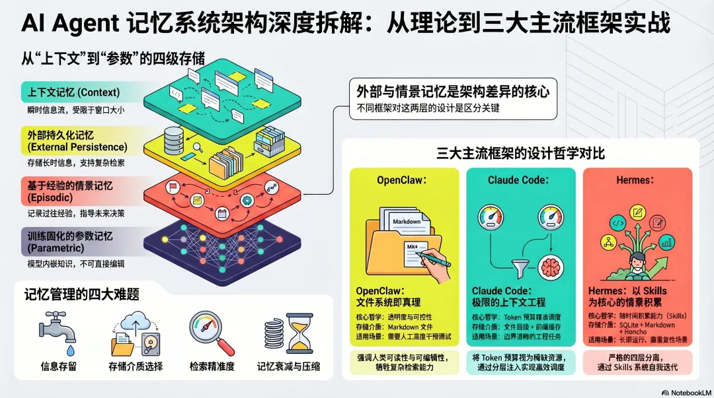
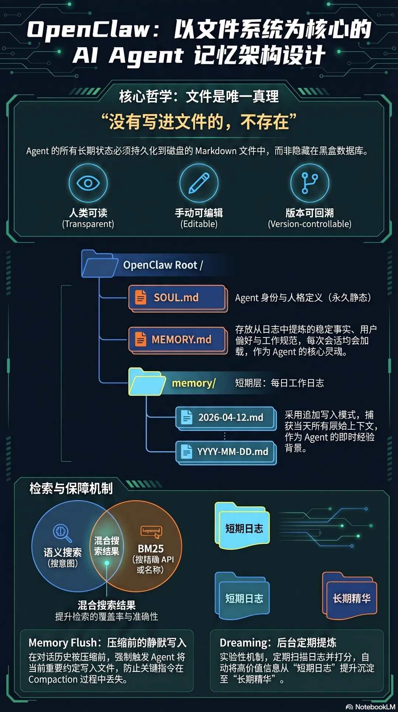
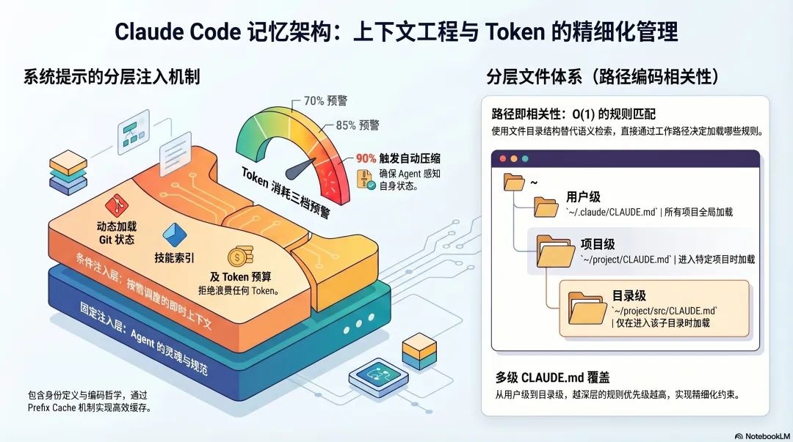
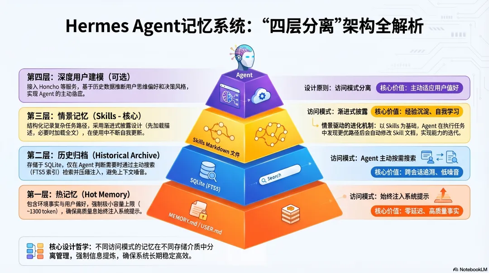
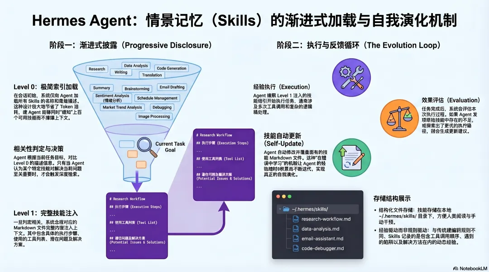
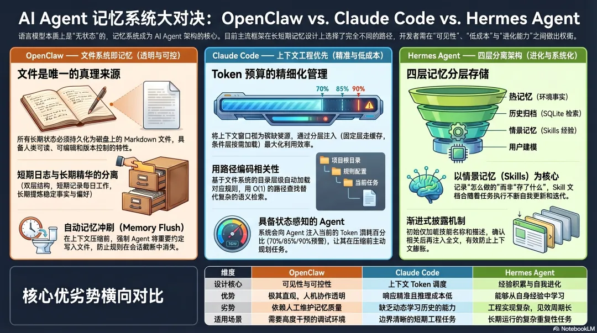

# AI Agent Architecture Design (I): Memory System Design

<p class="memory-subtitle"><strong>Comparing OpenClaw, Claude, and Hermes Agent</strong></p>

<div class="memory-cover memory-figure">
  
</div>

<div class="memory-meta-card">
  <ul>
    <li><strong>Series</strong>: AI Agent Architecture Design (I): Memory System Design</li>
    <li><strong>Goal</strong>: Understand the memory-system decisions made by three mainstream Agent frameworks, and the engineering tradeoffs behind them</li>
    <li><strong>Best for</strong>: Readers interested in Agent internals who want to understand <em>why</em> these systems are designed this way</li>
    <li><strong>Estimated reading time</strong>: 15 minutes</li>
  </ul>
</div>

---

## Why is memory the core architectural problem in an Agent?

When you design an AI Agent, the first unavoidable question is not “which model should I use,” but this:

> **The language model itself has no state. Every call starts from zero. It remembers nothing.**

That fundamental constraint means every Agent framework has to build a memory system outside the model. That system has to answer four architectural questions:

1. **What to store** — which information deserves to be kept, and which should be discarded
2. **Where to store it** — what medium, what format, and what lifetime the memory should have
3. **How to retrieve it** — when needed, how do we find it again: exact match, semantic search, or both
4. **How to govern it** — how memory should decay, be updated, or be compressed so it does not turn into noise

OpenClaw, Claude, and Hermes Agent give three different answers to those four questions. Looking at them side by side reveals the core tradeoffs in memory-system design.

---

## Theoretical frame: the four layers of memory

Before we break down the three frameworks, it helps to build a common analysis frame.

In research, Agent memory is often divided into four types, each with different storage and retrieval patterns:

> Further reading: [AI Agent Memory Systems: A Four-Layer Architecture](https://mp.weixin.qq.com/s?__biz=MzkzMTEzMzI5Ng==&mid=2247496345&idx=1&sn=fb9a950d99190cfa215a57b68dd211aa&scene=21#wechat_redirect)

- **In-context memory**: everything in the current token window. Lowest access cost, but limited in size and gone when the session ends.
- **External memory**: storage outside the model — files, databases, vector stores. It survives across sessions, but requires retrieval.
- **Episodic memory**: structured records of past actions. It stores not only facts, but also *what was done, how it was done, and how it turned out*. This is the basis for learning from experience.
- **Parametric memory**: knowledge encoded in model weights. It is always available and does not require retrieval, but cannot be updated at runtime and is prone to hallucination.

The most interesting architecture questions lie in how external memory and episodic memory are designed — that is where the three frameworks differ the most.

---

## OpenClaw: the filesystem *is* memory

<div class="memory-figure">
  
  <p style="color: #888; font-size: 14px; margin-top: 8px;">Figure 1: OpenClaw memory-system architecture</p>
</div>

### Core design decision: files are the single source of truth

OpenClaw’s memory architecture is built on an extremely simple principle:

> **If it was not written to a file, it does not exist.**

That is not a slogan. It is an architectural constraint. All long-term Agent state must be persisted to Markdown files on disk. The files themselves are both the storage medium for memory and the interface for human-Agent collaboration.

```text
~/.openclaw/workspace/
├── MEMORY.md              ← long-term memory (distilled)
├── SOUL.md                ← Agent identity definition
└── memory/
    ├── 2026-04-12.md      ← today’s log (short-term)
    ├── 2026-04-11.md      ← yesterday’s log
    └── ...
```

**Why choose files instead of a database?**

This is a deliberate tradeoff. Files have three properties that databases do not naturally provide at the same level:

> Human-readable, directly editable, and version-controllable.

You can open `MEMORY.md` in any editor, inspect what the Agent remembers, manually correct bad memory, and use Git to track how it changes over time. That transparency is extremely valuable for debugging and trust.

The cost is that a filesystem is much weaker than a database at querying. Complex relations, high-speed exact lookup, and large-scale indexing are all areas where files are the weaker choice.

### Two-layer memory: separating short-term from long-term

OpenClaw splits external memory into two layers, corresponding to two different information lifecycles:

- **Short-term layer (`memory/YYYY-MM-DD.md`)**: daily work logs. Appended continuously, not heavily curated, used to capture anything that might be useful. Today’s and yesterday’s logs are automatically injected into context; older logs are retrieved on demand.
- **Long-term layer (`MEMORY.md`)**: distilled essentials. Stable facts, user preferences, and durable rules extracted from logs. This file is loaded every session and is always present.

This two-layer design solves a fundamental tension:

> **You want the Agent to remember a lot, but the context window cannot hold a lot.**

The short-term layer solves “don’t lose it yet.” The long-term layer solves “keep access efficient.” The cost is that you need a distillation step — who decides what deserves promotion from daily logs into `MEMORY.md`?

OpenClaw’s answer is: mostly the human, plus some experimental automation (the Dreaming mechanism). That means memory quality still depends significantly on user maintenance.

### Retrieval design: hybrid search

Pure semantic search has an obvious weakness: it finds things that are *similar in meaning*, but sometimes what you actually need is *exact lexical match*. If you search for a specific API endpoint name, semantic search may return related but inaccurate passages.

OpenClaw addresses this with hybrid search:

> **Semantic search and BM25 keyword search run in parallel, and their results are merged to select the most relevant passages.**

The two retrieval methods complement each other: semantic search handles paraphrased meaning; BM25 handles precise term matching.

Implementation-wise, vector indexes are stored in SQLite via `sqlite-vec`, not in a dedicated vector database. That lowers deployment complexity, though it will not scale as well as a specialized vector store.

### The most dangerous step: context compaction

The most complex part of OpenClaw’s memory system is not storage — it is compression.

Long sessions eventually exhaust the token window. When the history approaches the limit, the system has to compact it by replacing old conversation history with a summary.

Compaction itself is the correct operation, but it introduces a major risk:

> **Any agreement that only exists in chat history can disappear during compaction.**

This creates a classic bug pattern: the user tells the Agent an important rule in conversation, the Agent says “got it,” but never writes it to a file. A few more turns later, compaction happens, the agreement disappears, and the Agent starts violating a rule the user thought had already been remembered.

OpenClaw’s answer is **Memory Flush**: before compaction happens, the system triggers a silent Agent turn that tells the model to write all important information from the current context to disk, and only then proceeds with compaction.

This is a very clever design. It turns the principle “it only counts as remembered if it is written to a file” from a human habit into a system-level safeguard.

```text
Compaction is about to happen
        ↓
Trigger silent Memory Flush
        ↓
Agent writes important information into memory/YYYY-MM-DD.md
        ↓
Execute Compaction (compress old history)
        ↓
Continue the session
```

Compaction affects conversation history. It does not affect the files.

### Dreaming: an experimental attempt at episodic memory

Newer versions of OpenClaw include a Dreaming mechanism — a periodic background task that scans log files, scores their contents, and promotes high-value information into `MEMORY.md`.

This is OpenClaw’s first move toward automated episodic memory: letting the system, rather than the human, decide what should be retained long-term.

At the moment it is still experimental and disabled by default. The core difficulty is obvious: describing what “deserves” long-term retention is hard, because it depends on context and judgment.

---

## Claude: context engineering first

<div class="memory-figure">
  
  <p style="color: #888; font-size: 14px; margin-top: 8px;">Figure 2: Claude (Droid) context-engineering architecture</p>
</div>

### Core design decision: token budget is scarce and must be actively managed

Claude’s memory architecture is built on a clear engineering judgment:

> **The full capacity of the context window is not equal to its effective usable capacity, because model attention is not distributed uniformly across the prompt.**

Research shows that language models pay the most attention to the beginning and the end of context, and the least to the middle — the “Lost in the Middle” effect. That means simply cramming memory into context is not enough. You also need active management of what information goes where and how much of it is injected.

Claude’s memory architecture is not primarily a storage system. It is a system for **token-budget allocation and information injection**.

### Precise system-prompt construction: layered injection

From leaked source code and architectural observations, Droid appears to assemble the system prompt very carefully before every model call. This is not simple concatenation. It is conditional, layered injection.

**Always-injected layer (present every time, friendly to Prefix Cache):**

- Agent identity and basic behavioral constraints
- Coding philosophy: minimal edits, avoid over-engineering, do only what was asked
- Tool-use policies and risk-confirmation logic

**Conditionally injected layer (loaded only when needed):**

- `CLAUDE.md` contents loaded by scope
- Git status snapshots (current branch, recent commits, workspace changes)
- Skill names and descriptions (index only, not full content)
- Token-budget instructions when the user has specified a consumption target

The fixed layer benefits from Prefix Cache and only needs to be paid for once. The conditional layer is loaded on demand. **That separation is the basis of Droid’s context optimization.**

### Hierarchical file layout: encoding relevance in paths

Droid solves the question “which rules matter for the current task?” through scoped file layers:

```text
~/.claude/CLAUDE.md           ← user level: loaded everywhere
~/project/CLAUDE.md           ← project level: loaded in this project
~/project/src/CLAUDE.md       ← directory level: loaded in this directory
```

No semantic retrieval algorithm is necessary — the current working directory itself determines which files apply. **Relevance is encoded directly in the filesystem hierarchy**, using O(1) path lookup instead of semantic recall.

The cost is that this is good at static rules such as “what rules apply in this directory,” but weak at dynamic questions such as “what historical knowledge is relevant to this task?”

### Three warning thresholds for token budget: letting the Agent sense its own state

Claude uses three token-usage thresholds:

```text
70% threshold → first warning: compaction may happen soon
85% threshold → second warning: compaction is imminent
90% threshold → automatic compaction (or stop and notify)
```

More importantly, token usage is injected back into the Agent’s context, allowing the Agent to reason about the remaining budget:

> “I still have enough tokens to analyze three files, and then compaction will happen.”

That allows the Agent to make proactive decisions — which files to prioritize, what to finish before compaction, what to postpone. **The state of the memory system becomes an input to reasoning, not just a passive backend.** This is one of the most valuable ideas in context engineering.

---

## Hermes Agent: four-layer separation, with episodic memory at the center

<div class="memory-figure">
  
  <p style="color: #888; font-size: 14px; margin-top: 8px;">Figure 3: Hermes Agent four-layer memory architecture</p>
</div>

### Core design decision: split memory by access pattern

Hermes has the most systematically layered memory design of the three. Its central idea is:

> **Memories with different access patterns must live in different storage media and be governed differently.**

Mixing everything together is one of the main reasons Agent memory systems become unreliable.

Hermes separates memory into four strict layers.

### Layer 1: hot memory (always injected, always present)

```text
~/.hermes/memories/
├── MEMORY.md    ← environment facts, target upper bound ~800 tokens
└── USER.md      ← user preferences, target upper bound ~500 tokens
```

These two files are injected directly into the system prompt at the start of every session. They require no retrieval and have zero-latency access.

**Why keep the upper bounds so small?**

This is a counterintuitive but correct design decision.

A small upper bound forces information-quality control. Every time you want to add a new memory, you have to ask: does this deserve to occupy precious system-prompt space? Is it more important than something already stored there?

If the bound is too large, memory naturally degrades into a dumping ground, and retrieval quality declines as accumulation grows.

At the same time, a smaller system prompt is Prefix Cache friendly — a more stable prefix means better cache hit rates and lower inference cost.

### Layer 2: archival history (retrieved on demand)

```text
~/.hermes/state.db    ← SQLite with FTS5 full-text indexing
```

All session history is stored in this database. When the Agent judges that a task may be related to prior history, it proactively calls a `session_search` tool, retrieves relevant history from the database, compresses it through a lightweight LLM summary, and injects the result into the current context.

**This reflects an important architectural decision: archival history is not automatically injected. The Agent has to decide to retrieve it.**

This follows the principle that architecture should determine access patterns, rather than leaving everything to the Agent’s judgment.

Why? Because if all history were automatically loaded every session, the system prompt would grow forever. On-demand retrieval keeps the prompt stable, and historical memory only enters context when it is actually needed.

FTS5 full-text search has an obvious weakness: it is poor at semantic matching. Searching for “auth service” may fail to find a record written as “authentication microservice.” This is a known tradeoff in the current architecture, and the Hermes community has explored vector-search extensions to strengthen or replace FTS5.

### Layer 3: episodic memory (Skills, Hermes’s defining difference)

<div class="memory-figure">
  
  <p style="color: #888; font-size: 14px; margin-top: 8px;">Figure 4: Hermes Skills as an episodic-memory system</p>
</div>

This is the most fundamental architectural difference between Hermes and the other two frameworks.

> **Episodic memory stores not facts, but experience — what was done, how it was done, and how well it worked.**

Hermes implements this through its Skills system:

```text
~/.hermes/skills/
├── research-workflow.md     ← optimal execution path for a class of tasks
├── image-generation.md      ← accumulated experience for image-generation work
└── data-analysis.md         ← methodology for data-analysis tasks
```

Whenever the Agent completes a complex task (typically involving five or more tool calls), the system evaluates whether that execution process is worth preserving as a Skill. If yes, it automatically writes a structured Markdown file containing the steps, tools used, problems encountered, and solutions discovered.

**Skills use progressive disclosure:**

```text
Level 0: load only the Skill name and description (very cheap)
        ↓ (if relevant)
Level 1: load the full Skill content
```

Most of the time the Agent only knows what Skills exist. When it judges that a particular Skill is relevant, it loads the full content. That allows the system to accumulate dozens or hundreds of Skills without exhausting context.

**More importantly, Skills update themselves through use.**

If the Agent reuses an existing Skill and discovers a better way to perform one step, it can automatically update the Skill document. Experience accumulates, methods evolve. This is real episodic memory: not only remembering what happened, but also learning how to do it better next time.

This design addresses the core question of episodic memory:

> **How can an Agent learn from its own execution history, instead of only following rules prewritten by humans?**

### Layer 4: deep user modeling (optional)

By integrating with Honcho, Hermes can build a structured user model — not merely record “what the user said,” but infer “how the user thinks” and “what decision style the user tends to prefer.”

This layer is optional. It uses conversational user modeling: by analyzing historical user expression, the system infers preferences and values, then adapts future interaction accordingly.

This comes closest to “truly understanding the user,” but it is also the heaviest layer — it requires extra services and raises privacy concerns, so it makes sense only in certain scenarios.

---

## The essential differences between the three architectural philosophies

<div class="memory-figure">
  
  <p style="color: #888; font-size: 14px; margin-top: 8px;">Figure 5: Comparing the three architectural philosophies</p>
</div>

Looking at the three frameworks together reveals three fundamentally different philosophies.

### OpenClaw: the filesystem as the source of truth

The core priority is visibility and controllability. All memory lives on disk, humans can read and edit it directly, and system behavior remains transparent and predictable. The cost is that memory quality depends heavily on ongoing human maintenance.

> Best for scenarios that value control and transparency — where you want to know what the Agent remembers and be able to correct it at any time.

### Droid: context engineering first

The core priority is precise information scheduling. The system does not try to store more information; it tries to inject the right information at the right moment. The filesystem hierarchy itself becomes an encoding of relevance. The cost is that there is no true episodic memory, so each task starts fresh.

> Best for engineering tasks with clear boundaries — where rules are stable, tasks are relatively independent, and the Agent does not need to learn from past execution.

### Hermes: layered accumulation, with episodic memory at the center

The core priority is cumulative capability over time. Four-layer separation prevents different access patterns from interfering with each other, and episodic memory allows the Agent to learn from its own experience. The cost is greater system complexity and a longer runway before the benefits become visible.

> Best for long-running, repetitive scenarios — where task types are relatively stable, and the Agent becomes more aligned with your workflow over time.

---

## Deep analysis

### Core concepts

This article revolves around **AI Agent memory systems** and highlights how OpenClaw, Droid, and Hermes Agent differ on several key concepts:

- **Statelessness constraint**: LLMs do not have durable memory, so all Agent frameworks must build memory outside the model
- **Four-layer memory model**: In-context → External → Episodic → Parametric
- **Context Compaction**: the high-risk moment when overflowing history is compressed and memory may be lost
- **Token budget management**: treating the context window as a scarce resource to be allocated deliberately
- **Episodic memory (Skills)**: upgrading from “remembering facts” to “remembering experience,” so the Agent can learn from execution history

### Concept comparison

| Dimension | OpenClaw | Droid | Hermes Agent |
|:-----|:---------|:------|:-------------|
| **Design philosophy** | Filesystem as truth | Context engineering first | Layered accumulation, centered on episodic memory |
| **Storage medium** | Markdown files on disk | Layered `CLAUDE.md` files | SQLite + Markdown + optional external services |
| **Memory layers** | Two layers (short-term logs + long-term distilled memory) | Two layers (fixed injection + conditional injection) | Four layers (hot memory / archival history / episodic memory / user modeling) |
| **Retrieval** | Hybrid search (semantic + BM25) | O(1) path lookup (directories encode relevance) | FTS5 full-text search + progressive disclosure |
| **Compression strategy** | Memory Flush (persist before compaction) | Three warnings + automatic compaction | Layer separation keeps hot memory always present |
| **Episodic memory** | Dreaming (experimental, off by default) | None | Skills (core mechanism, automatically learned) |
| **Transparency** | Highest (human-readable and directly editable) | Medium (files are readable but scattered) | Medium (Skills are readable, DB requires tools) |
| **Best-fit scenario** | Control-heavy, debugging-oriented work | Clear-boundary engineering tasks | Long-running repetitive tasks |

### Key insights

1. **“More memory is always better” is a common misconception.** Hermes limits hot memory to roughly 1300 tokens. That counterintuitive design forces quality control and prevents memory from degrading into a dumping ground.

2. **Directory structure itself can encode relevance.** Claude-style scoped files use path hierarchy (user level → project level → directory level) instead of semantic retrieval, achieving O(1) selection of relevant rules. This is extremely efficient, though less flexible.

3. **Compression is the most dangerous step in a memory system, not storage.** OpenClaw’s Memory Flush reveals a classic bug pattern: verbal agreements vanish silently during compaction. “Written to file” is not just a design principle; it is defensive engineering.

4. **Episodic memory is what upgrades an Agent from executor to learner.** Hermes Skills do not only record what happened; they also self-update during reuse. Of the three, this is the only architecture with a true built-in path for learning from experience.

5. **Token-budget awareness is a new kind of metacognition.** Claude injects token-usage information back into the Agent’s own context, allowing it to prioritize work proactively. The state of the memory system itself becomes an input to reasoning.

### Practical implications

1. **Choose a framework by first clarifying your memory needs**:
   - Need maximum transparency and human control → OpenClaw
   - Clear task boundaries and stable rules → Droid
   - Long-term accumulation and self-learning → Hermes Agent

2. **No matter which framework you use, implement persist-before-compaction.** Memory Flush is a generally reusable best practice.

3. **The ROI of episodic memory scales with duration.** If the Agent is used once, episodic memory has little value. If it repeatedly performs similar tasks over a long period, it becomes the highest-return memory layer.

4. **Progressive disclosure is an effective pattern for managing large memory volumes.** Load indexes first, then load the full text on demand.

5. **Hybrid search is better than a single retrieval method.** Semantic search and keyword search each have blind spots. Combining them is currently one of the strongest engineering patterns.

### Risks and challenges

| Risk | Description | Mitigation |
|:-----|:------------|:-----------|
| Memory corruption | Outdated or incorrect memory accumulates and starts to distort Agent behavior | Periodic review + expiration policies + version control |
| Compression loss | Important context is discarded during compaction | Memory Flush + explicit persistence of key facts |
| Retrieval inaccuracy | FTS5 is weak semantically; pure semantic search is weak at exact match | Combine semantic and BM25 retrieval |
| Episodic cold start | Skills need repeated executions before they become strong | Allow manually seeded Skills and lower the trigger threshold |
| Privacy and security | Deep user modeling touches sensitive preference data | Favor local storage + explicit user consent + data minimization |
| System complexity | Multi-layer architecture raises debugging and maintenance cost | Adopt memory layers gradually, not all at once |

---

## Core conclusion

The design of an AI Agent memory system is fundamentally a tradeoff among **transparency, efficiency, and learning ability**. OpenClaw prioritizes transparency (files as truth), Claude prioritizes efficiency (precise token scheduling), and Hermes prioritizes learning ability (self-evolving episodic memory). There is no universally best architecture — only the architecture that best fits the scenario.

For real engineering work, the three most reusable design patterns are:

1. **Persist before compaction** (Memory Flush)
2. **Progressive disclosure**
3. **Metacognitive design: let system state become an input to reasoning**

The future is likely a fusion of all three philosophies — a framework that combines transparent file-based memory, precise context management, and accumulated episodic learning in one system.


<style>
.memory-subtitle {
  margin: -4px 0 20px;
  text-align: center;
  color: #6b7280;
  font-size: 1.05rem;
  letter-spacing: 0.02em;
}

.memory-cover,
.memory-figure {
  margin: 28px auto;
  padding: 14px;
  border-radius: 20px;
  background: linear-gradient(180deg, #fffaf2 0%, #ffffff 100%);
  border: 1px solid rgba(222, 180, 106, 0.28);
  box-shadow: 0 14px 34px rgba(148, 101, 28, 0.08);
}

.memory-cover img,
.memory-figure img {
  width: 100% !important;
  max-height: none !important;
  border-radius: 12px;
}

.memory-meta-card {
  margin: 20px 0 28px;
  padding: 18px 20px;
  background: linear-gradient(135deg, rgba(255, 246, 221, 0.92), rgba(255, 255, 255, 0.98));
  border: 1px solid rgba(226, 179, 76, 0.34);
  border-radius: 18px;
  box-shadow: 0 10px 28px rgba(201, 145, 38, 0.08);
}

.memory-meta-card ul {
  margin: 0;
  padding-left: 1.1rem;
}

.memory-meta-card li {
  margin: 0.45rem 0;
  line-height: 1.75;
}

.vp-doc h2 {
  margin-top: 42px;
  padding-left: 14px;
  border-left: 4px solid #e2ad47;
}

.vp-doc h3 {
  margin-top: 28px;
}

.vp-doc blockquote {
  border-left: 4px solid #e2ad47;
  background: rgba(255, 248, 230, 0.72);
  border-radius: 0 14px 14px 0;
  padding: 10px 16px;
}

.vp-doc table {
  border-radius: 12px;
  overflow: hidden;
}

.vp-doc tr:nth-child(2n) {
  background-color: rgba(255, 248, 230, 0.45);
}

.dark .memory-subtitle {
  color: #c8d0da;
}

.dark .memory-cover,
.dark .memory-figure {
  background: linear-gradient(180deg, rgba(56, 43, 20, 0.65), rgba(30, 30, 30, 0.92));
  border-color: rgba(226, 173, 71, 0.28);
  box-shadow: 0 14px 34px rgba(0, 0, 0, 0.28);
}

.dark .memory-meta-card {
  background: linear-gradient(135deg, rgba(73, 53, 20, 0.86), rgba(30, 30, 30, 0.95));
  border-color: rgba(226, 173, 71, 0.28);
}

.dark .vp-doc blockquote {
  background: rgba(82, 61, 22, 0.3);
}
</style>
