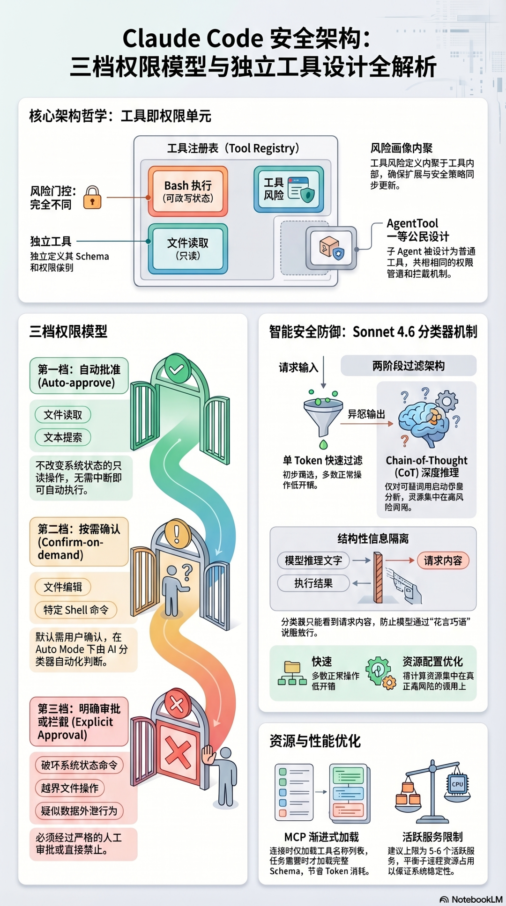
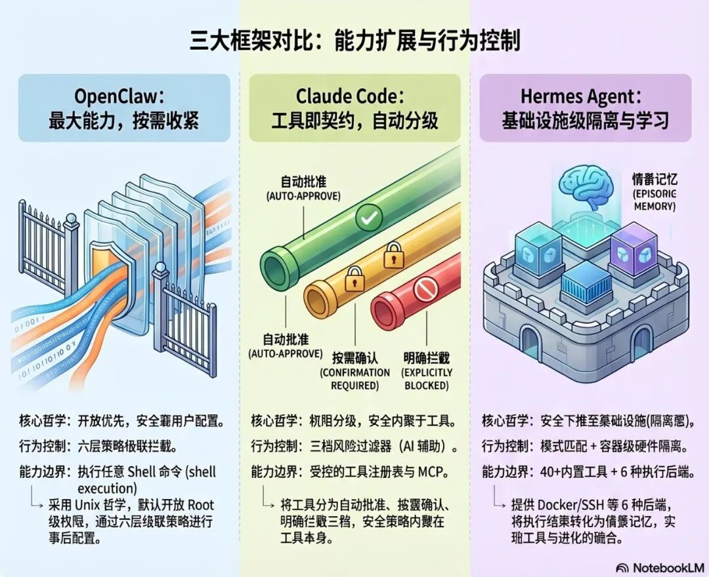
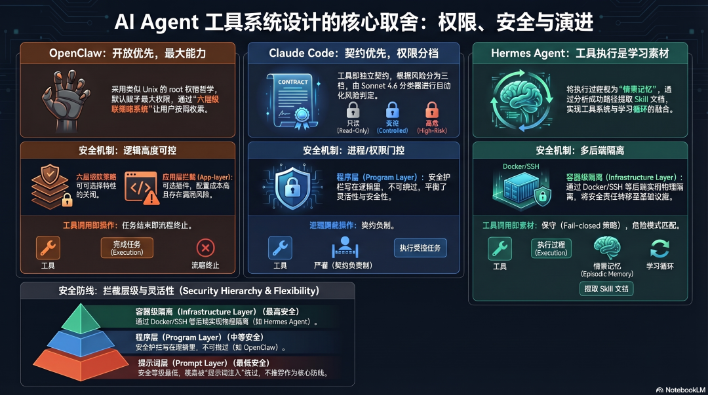

# AI Agent Architecture Design (II): Tool-System Design (Comparing OpenClaw, Claude Code, and Hermes Agent)

<p class="tool-subtitle"><strong>From “what the model wants to do” to “what the system allows it to do”: how three mainstream Agent frameworks design tools, permissions, and safety boundaries</strong></p>

<div class="tool-cover tool-figure">
  
</div>

<div class="tool-meta-card">
  <ul>
    <li><strong>Series</strong>: AI Agent Architecture Design (II): Tool-System Design</li>
    <li><strong>Goal</strong>: Understand the tool-system decisions made by three mainstream Agent frameworks and the engineering tradeoffs behind them</li>
    <li><strong>Best for</strong>: Readers interested in Agent internals who want to understand <em>why</em> these systems are designed this way</li>
    <li><strong>Estimated reading time</strong>: 15 minutes</li>
  </ul>
</div>

---

## What problem does the tool system solve?

A language model can only output text.

If you tell it, “delete the temporary files in this directory,” it can understand the intention and describe what should be done. But without a tool system, it still cannot do anything — it has no hands and cannot touch the filesystem.

**The tool system is the bridge between model intent and real-world action.** Every time the model decides to take an action, the tool system intercepts that decision, checks whether it is allowed, executes it, and returns the result back to the model.

<div class="tool-figure">
  
  <p><sub>Figure 1: the tool system connects “model intent” with “real operations”</sub></p>
</div>

That bridge has to answer two kinds of questions at the same time:

- **Outward capability expansion**: which tools can the Agent call, what can it do, and where is the capability boundary?
- **Inward behavioral control**: who decides whether a tool call is allowed, how dangerous operations are intercepted, and how humans retain control over the Agent’s behavior?

The three frameworks give three fundamentally different answers to those questions.

---

## The basic mechanism of tool calling

Before comparing the three frameworks, let us make the shared underlying mechanism explicit.

<div class="tool-figure">
  
  <p><sub>Figure 2: the core tool-call pipeline shared across Agent frameworks</sub></p>
</div>

All frameworks follow the same basic flow:

```text
Model emits a tool_use block
        ↓
Harness intercepts it and parses tool name + arguments
        ↓
Permission check (allow / block / ask for confirmation)
        ↓
Execute the tool and collect the result
        ↓
Inject the result back as tool_result
        ↓
Model continues reasoning
```

The key architectural decision point here is: **where does permission checking happen, and who performs it?**

<div class="tool-figure">
  
  <p><sub>Figure 3: permission checks can happen at the prompt layer, framework layer, or infrastructure layer</sub></p>
</div>

Does it happen at the model layer through prompt constraints? At the framework layer through program logic? Or at the system layer through sandbox isolation?

**That is where the deepest differences between the three frameworks begin.**

---

## OpenClaw: capability first, security by configuration

<div class="tool-figure">
  
  <p><sub>Figure 4: OpenClaw revolves around a high-capability tool surface and layered policies</sub></p>
</div>

### Core philosophy: maximum capability, tightened only when needed

OpenClaw’s tool-system philosophy is simple: **give the Agent the maximum capability by default, and let the user decide how much to tighten it later.**

That is very close to classic Unix thinking — the system gives you root-level power, and you decide how carefully to use it.

```text
OpenClaw core tools:
├── exec          ← execute arbitrary shell commands (most powerful and most dangerous)
├── read          ← read files
├── write         ← write files
├── edit          ← edit files
├── browser       ← browser control
├── memory_search ← semantic memory search
└── memory_get    ← read a specific memory file
```

`exec` is the key tool in the entire system. Because it can run arbitrary shell commands, the Agent can do almost anything the operating system can do. That is both the source of OpenClaw’s power and the place where most of its risk is concentrated.

**`rm -rf` is also a shell command.**

### A six-layer cascading permission model

OpenClaw’s permission model is not a simple allow/deny switch. It is a six-layer cascading policy system:

```text
Global Policy
        ↓
Provider Policy
        ↓
Agent Policy
        ↓
Group Policy
        ↓
Sandbox Policy
        ↓
Subagent Inheritance Rules
```

A tool call has to pass every layer before it can execute. Upper layers can restrict lower ones; lower layers cannot break through upper constraints.

The architectural value of this design is that **different Agents can carry different permission profiles instead of sharing one global rule set**.

An email-handling Agent can be limited to email-related actions. A development Agent can be granted broader filesystem access. Permissions are tied to role rather than enforced as a single global default.

### The key issue: permissive defaults

One of the most criticized OpenClaw choices is that **the default configuration is permissive**.

The official docs acknowledge that by default OpenClaw ships without tool restrictions, command allowlists, or approval requirements.

That decision is understandable — loose defaults make it easier for individual users to get started quickly.

But the tradeoff is severe: many users may unknowingly be running an Agent with nearly full access to the host machine. In early 2026, security researchers found more than 135,000 OpenClaw instances exposed on the public internet, and 63% of them had no authentication at all.

> **This reveals a foundational architecture problem: if security depends entirely on user configuration, risk is effectively outsourced to the people least equipped to manage it.**

### Tool interception as an event-driven extension point

OpenClaw does provide an important extensibility mechanism: before a tool executes, an event is emitted, and extensions can subscribe to that event to intercept the action.

That is good architecture. The safety guard lives in program logic instead of in the prompt. Program-level interception cannot be bypassed by prompt injection in the same way prompt-only rules can.

The limitation is that this mechanism is optional rather than active by default. You still have to configure extensions intentionally to get the protection.

---

## Claude Code: tools as contracts, permissions in three levels

<div class="tool-figure">
  
  <p><sub>Figure 5: Claude Code keeps schema, risk profile, and execution strategy tightly coupled to each tool</sub></p>
</div>

### Core philosophy: every tool is an independent permission unit

From the leaked source code, Claude Code shows a very clear design rule:

**Every tool defines its own schema, permission level, and execution logic independently, with no shared mutable state.**

`BashTool` and `FileReadTool` live in the same registry, but their risk characteristics are completely different. Bash execution can mutate system state; file reading is read-only. The architecture reflects that difference by attaching different permission gates to different tools instead of forcing one policy onto all of them.

The architectural value here is that **the risk profile is cohesive to the tool itself rather than scattered across external configuration**. Add a new tool and you do not have to rewrite the entire permission core. If a tool’s behavior changes, its permission behavior changes with it.

### The three-tier permission model

Claude Code divides tool calls into three risk tiers.

**Tier 1: auto-approved**

Read-only or naturally safe actions — file reads, text search, code navigation. These do not mutate state and can run without interruption.

**Tier 2: on-demand confirmation**

Operations that modify controlled state — file edits, certain shell commands. By default these require manual confirmation.

In March 2026, Claude Code introduced Auto Mode (in Team/Enterprise Research Preview), adding a Sonnet 4.6-based background classifier to automate part of this tier.

The classifier itself is worth studying. It runs in two stages: first, a lightweight single-token filter performs the initial pass (allow or flag). Only flagged calls go into deeper chain-of-thought-style analysis. That design keeps most ordinary actions cheap while reserving serious computation for genuinely suspicious cases.

There is also a deliberate security boundary in what the classifier can see: **it sees the user request and the tool call content, but not the model’s internal reasoning text and not the tool’s execution result.** That prevents the model from “talking” the classifier into allowing something dangerous, and also prevents malicious tool output from poisoning the judgment process.

**Tier 3: explicit approval or direct blocking**

High-risk operations — shell commands that may damage system state, file operations outside the working directory, and anything that looks like data exfiltration.

These three levels are not completely fixed. Users can adjust them via configuration, and can also override them temporarily during a session.

### AgentTool: subagents as first-class tools

One especially interesting design in the leaked source is `AgentTool`: a subagent is just another ordinary tool inside the tool registry.

That means spawning a subagent and reading a file belong to the same architectural category. They pass through the same permission pipeline and the same interception mechanisms.

There is no need for a separate orchestration layer or a special process model. A subagent is simply a first-class tool. That significantly reduces the architectural complexity of a multi-Agent system — extending the tool system is effectively the same thing as extending Agent collaboration.

### MCP discovery: load names first, not full schemas

Claude Code supports MCP (Model Context Protocol) for integrating external tools. One design detail is especially worth reusing:

**When an MCP server is connected, the full schema of every tool is not injected into context immediately. Only the tool names are loaded first.** The full definition of a tool is loaded only when the task actually needs it.

That is the same logic as progressive Skill loading: first know what exists, then fetch full detail on demand. The more tools you have, the more token-efficient this becomes.

The recommended upper bound is around 5–6 active MCP services, because every service runs as a child process and consumes resources.

---

## Hermes Agent: merging the tool system with the learning loop

<div class="tool-figure">
  
  <p><sub>Figure 6: Hermes Agent deeply couples the tool system with a learning loop</sub></p>
</div>

### Core philosophy: tool execution is input to episodic memory

Hermes Agent starts from a fundamentally different assumption than the other two:

**Tool execution results are not only outputs for the current task; they are also inputs to the episodic-memory system.**

When Hermes Agent finishes a complex task involving five or more tool calls, it analyzes the execution path and abstracts successful patterns into a Skill document. That means the tool system has to support structured capture of the execution process — not only *what* happened, but also *why* it happened that way and *how well* it worked.

This changes the meaning of tool calls entirely: **every execution is both an action for the present task and raw material for future learning.**

### 40+ built-in tools and six execution backends

Hermes Agent includes more than 40 built-in tools, covering file management, browser automation, terminal execution, email, calendars, web search, and more.

But the most interesting design choice is not only the tool list — it is the existence of **six execution backends**:

```text
local        ← run directly on the host (default)
docker       ← Docker-based isolation
ssh          ← remote execution over SSH
daytona      ← cloud development environment
singularity  ← HPC container backend
modal        ← serverless GPU execution
```

The same tool call can run under different isolation levels. This cleanly decouples “what the tool is” from “where the tool runs.”

**Architectural value:** you can adjust safety level and capability needs independently. The same toolset can run under a Docker backend for stronger isolation without changing the tool definitions themselves.

### Approval for dangerous commands

Hermes Agent’s approval model differs from both OpenClaw’s event interception and Claude Code’s risk-tier model.

It uses **pattern-based dangerous-command detection plus three approval modes**.

Before any command runs, Hermes compares it against a library of dangerous patterns — recursive deletion, permission changes, `sudo`, and similar high-risk actions all fall within the detection range. A match triggers an approval workflow.

```yaml
approvals:
  mode: manual       # manual confirmation (default)
        smart        # AI-assisted judgment
        off          # fully automatic (YOLO mode)
  timeout: 60        # reject by default on timeout (fail-closed)
```

Several details are worth noting:

- **Fail-closed by default**: if no response arrives within the timeout, the command is rejected rather than allowed. That is the correct default for security-sensitive design.
- **Container backend bypass**: when running inside Docker, Modal, and other container backends, dangerous-command checks may be skipped because the container itself becomes the isolation boundary. This is a reasonable tradeoff: responsibility shifts from the application layer to the infrastructure layer.
- **YOLO mode**: fully automatic, no interception. This exists to maximize speed in trusted automation environments while making the risk explicit through the naming itself.

### v0.7.0 security hardening: credential protection

In April 2026, Hermes Agent v0.7.0 introduced a notable security-hardening pass focused on credential leakage defense:

- scanning browser URLs and LLM responses for base64-encoded and URL-encoded secrets
- redacting container-execution output to stop secrets leaking through command results
- protecting directories such as `.docker`, `.azure`, and `.config/gh` from file-tool access
- defending against path traversal and zip-slip style attacks

These additions show that Hermes Agent follows a “discover problems, then iteratively harden” path in security design rather than beginning with a fully mature security architecture.

---

## The essential differences in architectural philosophy

<div class="tool-figure">
  
  <p><sub>Figure 7: the three frameworks ultimately express three distinct philosophies of capability and security</sub></p>
</div>

Looking at the three frameworks together, three very different safety philosophies emerge:

**OpenClaw: maximize capability, let safety be configured later**

Give the Agent the broadest tool permission surface possible, and let the user decide how much to tighten it. Friendly for individual users; risky for security-weak users.

**Claude Code: risk is cohesive to the tool, execution policy is auto-tiered**

Each tool carries its own risk profile, and the framework decides execution strategy from that risk level. Safety does not depend on user configuration as heavily, but this also reduces flexibility.

**Hermes: security is an infrastructure problem, and the tool system serves the learning loop**

Isolation is delegated to execution backends, tool execution is tightly coupled to episodic learning, and safety evolves together with the product version.

---

## The core tradeoffs in tool-system design

<div class="tool-figure">
  
  <p><sub>Figure 8: tool-system design is ultimately a tradeoff among capability, safety, flexibility, and learning ability</sub></p>
</div>

After comparing the three frameworks, several core architectural tradeoffs stand out.

### Tradeoff 1: maximum capability vs minimum privilege

OpenClaw chooses maximum capability in order to lower the barrier to use. Claude Code chooses minimum privilege to increase default safety. This is not a purely technical either-or choice; it reflects a judgment about the target user group. Individual users often value capability more. Enterprise users often value safety more.

### Tradeoff 2: application-layer security vs infrastructure-layer security

OpenClaw and Claude Code control permissions mainly at the application layer. Hermes Agent pushes a significant part of safety downward into infrastructure, especially through containerized execution backends. Infrastructure-layer safety is often more robust, but it also costs more to set up.

### Tradeoff 3: tool calls as actions vs tool calls as learning material

This is the deepest difference between Hermes Agent and the other two. Once tool execution results become inputs to episodic memory, the tool system is no longer just an execution layer. It becomes infrastructure for Agent evolution.

### Tradeoff 4: where interception happens

Prompt-layer interception can be bypassed by prompt injection. Program-layer interception cannot be bypassed in the same way. Container-level isolation makes some forms of interception less necessary in the first place. The three layers each have different costs: safety increases as you go downward, while flexibility usually decreases.

---

## Closing summary

The essence of the tool system is not merely “letting the model call commands.” It is **where an Agent’s capability boundary, risk boundary, and control boundary are actually defined.**

Across the three frameworks, the differences are very clear:

- **OpenClaw**: maximize capability first, leave safety responsibility to the configuration system
- **Claude Code**: turn tools into contractual permission units so risk evaluation becomes a built-in framework ability
- **Hermes Agent**: treat the tool system as the foundation for episodic learning and long-term capability growth

If you keep only three reusable design patterns from this comparison, keep these:

1. **A tool’s risk profile should be as cohesive to the tool itself as possible**
2. **Safety interception should live at the program layer or infrastructure layer, not only in prompts**
3. **Once you want long-term Agent learning, tool-execution logs stop being mere output and start becoming training material**

The most mature future Agent tool systems will likely combine all three directions:

- retain OpenClaw’s extensibility
- absorb Claude Code’s permission modeling
- add Hermes Agent’s ability to turn tool execution into episodic memory

That is one of the most important infrastructure layers to refine as we move from “models that can call tools” toward “Agents that can collaborate over time.”

<style>
.tool-subtitle {
  margin: -4px 0 20px;
  text-align: center;
  color: #6b7280;
  font-size: 1.05rem;
  letter-spacing: 0.02em;
}

.tool-cover,
.tool-figure {
  margin: 28px auto;
  padding: 14px;
  border-radius: 20px;
  background: linear-gradient(180deg, #fffaf2 0%, #ffffff 100%);
  border: 1px solid rgba(222, 180, 106, 0.28);
  box-shadow: 0 14px 34px rgba(148, 101, 28, 0.08);
}

.tool-cover img,
.tool-figure img {
  width: 100% !important;
  max-height: none !important;
  border-radius: 12px;
}

.tool-meta-card {
  margin: 20px 0 28px;
  padding: 18px 20px;
  background: linear-gradient(135deg, rgba(255, 246, 221, 0.92), rgba(255, 255, 255, 0.98));
  border: 1px solid rgba(226, 179, 76, 0.34);
  border-radius: 18px;
  box-shadow: 0 10px 28px rgba(201, 145, 38, 0.08);
}

.tool-meta-card ul {
  margin: 0;
  padding-left: 1.1rem;
}

.tool-meta-card li {
  margin: 0.45rem 0;
  line-height: 1.75;
}

.vp-doc h2 {
  margin-top: 42px;
  padding-left: 14px;
  border-left: 4px solid #e2ad47;
}

.vp-doc h3 {
  margin-top: 28px;
}

.vp-doc blockquote {
  border-left: 4px solid #e2ad47;
  background: rgba(255, 248, 230, 0.72);
  border-radius: 0 14px 14px 0;
  padding: 10px 16px;
}

.vp-doc table {
  border-radius: 12px;
  overflow: hidden;
}

.vp-doc tr:nth-child(2n) {
  background-color: rgba(255, 248, 230, 0.45);
}

.dark .tool-subtitle {
  color: #c8d0da;
}

.dark .tool-cover,
.dark .tool-figure {
  background: linear-gradient(180deg, rgba(56, 43, 20, 0.65), rgba(30, 30, 30, 0.92));
  border-color: rgba(226, 173, 71, 0.28);
  box-shadow: 0 14px 34px rgba(0, 0, 0, 0.28);
}

.dark .tool-meta-card {
  background: linear-gradient(135deg, rgba(73, 53, 20, 0.86), rgba(30, 30, 30, 0.95));
  border-color: rgba(226, 173, 71, 0.28);
}

.dark .vp-doc blockquote {
  background: rgba(82, 61, 22, 0.3);
}
</style>
