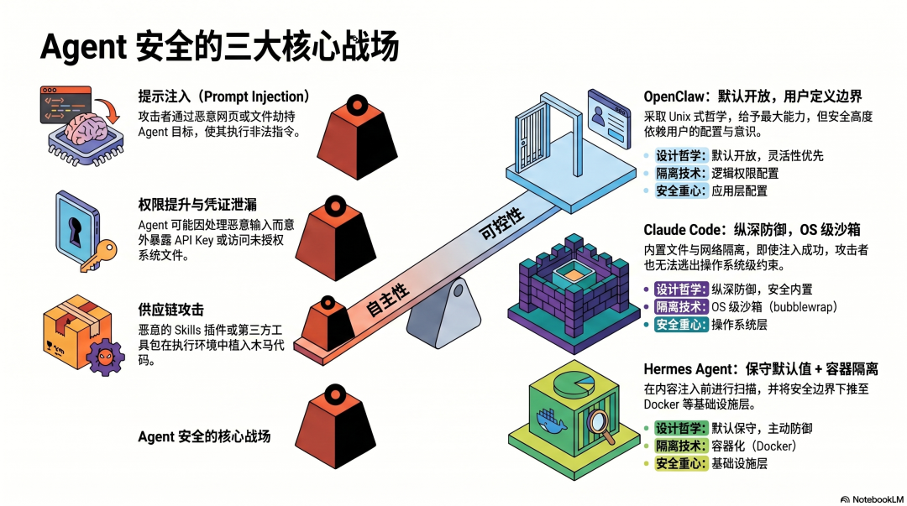
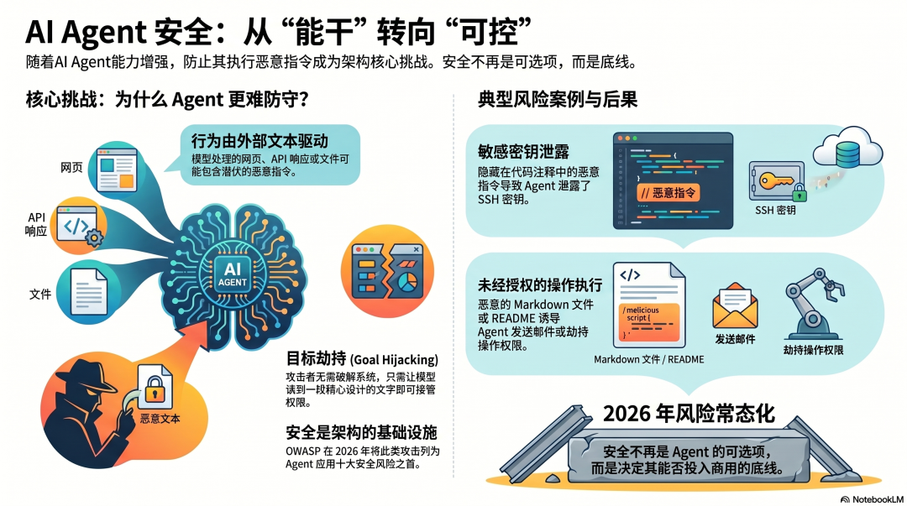
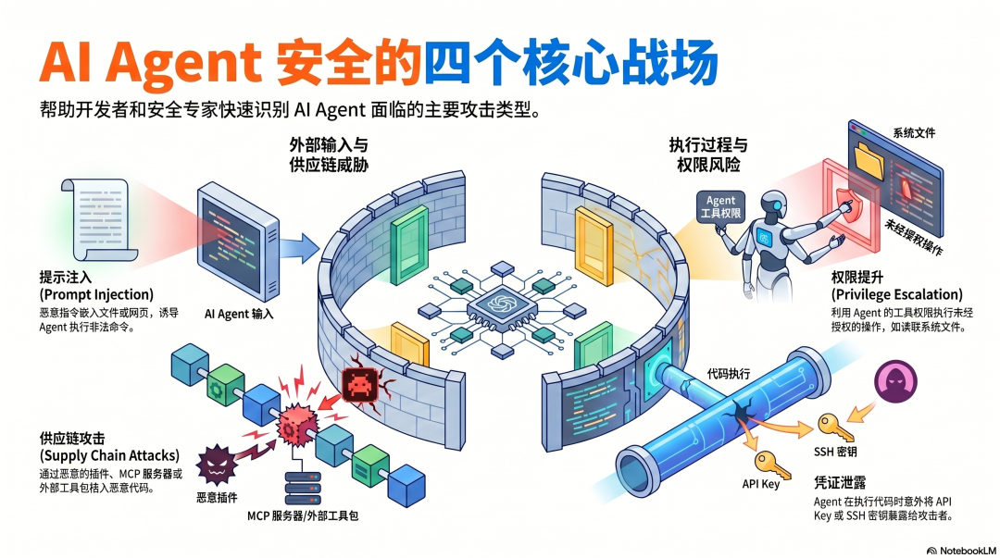
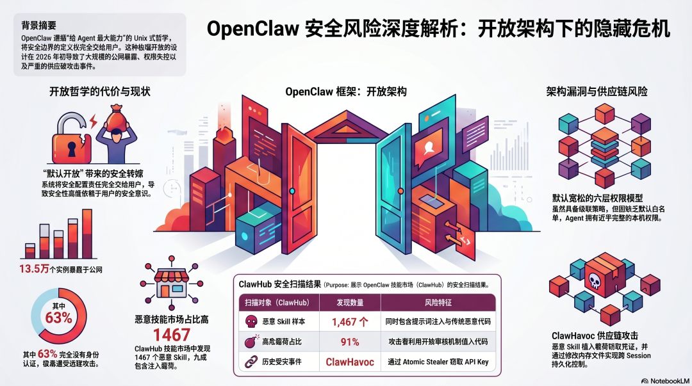
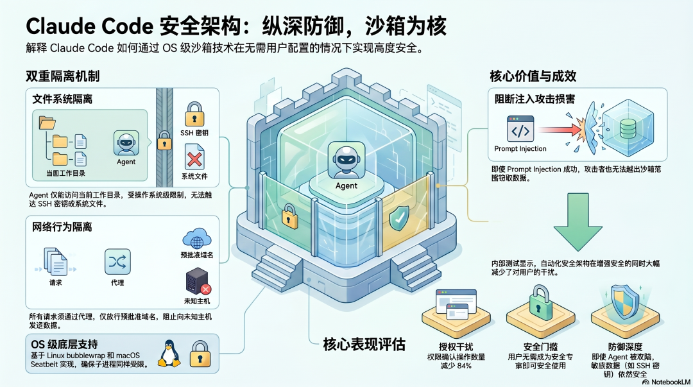
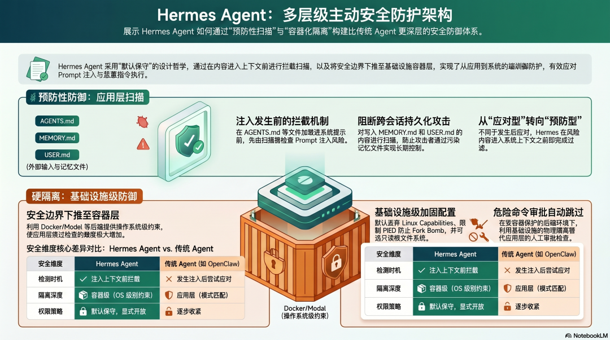
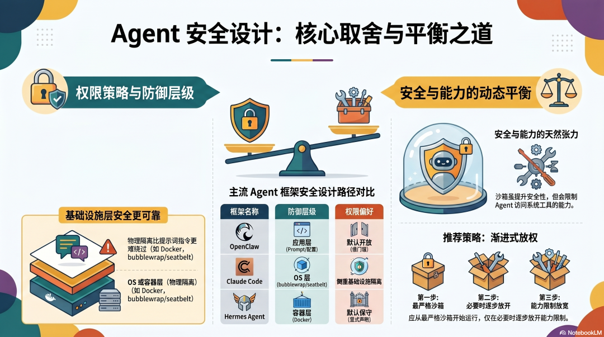

# AI Agent Architecture Design (V): Security and Controllability (Comparing OpenClaw, Claude Code, and Hermes Agent)

<p class="guard-subtitle"><strong>From “Agents getting more capable” to “Agents remaining governable”: how three mainstream frameworks handle prompt injection, approval flows, sandboxing, and safety boundaries</strong></p>

<div class="guard-cover guard-figure">
  
  <p><sub>Overview: the opening diagram frames the core tension directly—how do we keep stronger Agents aligned with human control instead of letting capability outrun safety?</sub></p>
</div>

<div class="guard-meta-card">
  <ul>
    <li><strong>Series</strong>: AI Agent Architecture Design (V): Security and Controllability</li>
    <li><strong>Goal</strong>: understand how three frameworks balance Agent autonomy with human control, and the engineering tradeoffs behind prompt-injection defense, approval mechanisms, and sandbox design</li>
    <li><strong>Best for</strong>: readers who care about Agent internals and want to understand why these systems are designed the way they are</li>
    <li><strong>Estimated reading time</strong>: 15 minutes</li>
  </ul>
</div>


---

## Why is security a core problem in Agent architecture?

<div class="guard-figure">
  
  <p><sub>Figure 1: the first four essays focus on how Agents become more capable; this chapter turns to the other half of the problem—how to keep them controllable once they become powerful</sub></p>
</div>

The first four essays—memory, tools, execution loops, and multi-Agent collaboration—all answer one question: **how does an Agent become more capable?**

This chapter answers a different one: **once an Agent gets stronger, how do we stop it from doing what it should not do?**

That problem is harder than ordinary software security because Agents have a property most software does not: **their behavior is shaped by a language model, and that model constantly processes external text—files, webpages, API responses, user messages, and more.**

Any text that enters the model’s context may contain malicious instructions. The attacker does not need to break into the system directly. They may only need to make sure the model reads a carefully crafted sentence.

In its 2026 “Top 10 Risks for Agent Applications,” OWASP placed this class of attack—Agent Goal Hijacking / Prompt Injection—at the very top.

By 2026, there were already real examples: malicious instructions hidden inside code comments leading an Agent to leak SSH keys, poisoned Markdown files causing unauthorized emails to be sent, and GitHub READMEs hijacking an Agent’s operating authority.

**Security is not optional. It is foundational infrastructure for Agent systems.** The three frameworks compared here answer that challenge with very different defense-in-depth strategies.

---

## The four core battlefields of Agent security

<div class="guard-figure">
  
  <p><sub>Figure 2: what matters is not one isolated bug, but a full attack surface spanning inputs, credentials, privileges, and the supply chain</sub></p>
</div>

Before comparing the frameworks, it helps to define the four major attack classes an Agent architecture has to defend against:

- **Prompt Injection**: attackers embed malicious instructions into content the Agent will process, such as files, webpages, or tool outputs, so the Agent treats those words like legitimate directions.
- **Credential leakage**: the Agent accidentally exposes API keys, SSH keys, or other secrets while executing code or interacting with external services.
- **Privilege escalation**: the Agent uses the tools already available to it to perform actions the user never explicitly authorized, such as reading files outside the working scope or issuing destructive commands.
- **Supply-chain compromise**: malicious Skills, MCP servers, or third-party tool packages bring hostile code into the Agent’s execution environment.

All three frameworks are effectively trying to build defenses across these same four battlefields, but they do so with very different assumptions and layers.

---

## OpenClaw: maximum openness, security through configuration

<div class="guard-figure">
  
  <p><sub>Figure 3: OpenClaw puts capability openness first; security controls exist, but much of the outcome depends on what the user configures and constrains explicitly</sub></p>
</div>

### Design philosophy: trust the user, let the user define the boundary

OpenClaw’s security philosophy feels very Unix-like: **give the Agent the broadest capability surface, then let the user decide where the boundary should be.**

The cost of that philosophy became obvious in early 2026: many instances were exposed to the public internet, some without authentication at all, and malicious Skills emerged in open marketplaces carrying both prompt-injection payloads and conventional malware.

Those outcomes are not always best described as traditional implementation bugs. They are also the natural consequence of a “default-open” philosophy operating in the real world.

### Permission model: six cascading layers, but loose defaults

OpenClaw actually includes a fairly rich six-layer permission model: global, provider, Agent, group, sandbox, and subagent inheritance.

The issue is not a lack of mechanisms. The issue is that **the defaults are relatively permissive**. Out of the box, there may be no shell allowlist, no approval list, and no strong restriction around secret access. Many users therefore begin with an AI Agent that effectively has near-complete authority over the local machine.

**When the burden of secure configuration is pushed onto the user, actual safety quality becomes tightly coupled to the user’s security awareness.** If most users do not understand Agent-specific risks yet, that design naturally amplifies exposure.

### Supply-chain risk: ClawHub is open

ClawHub is OpenClaw’s Skill marketplace, and anyone can upload a Skill. That openness is great for ecosystem growth, but from a security point of view, installing a Skill is often close to running third-party code on your machine.

The original article highlights a more Agent-specific danger: a malicious Skill may not only steal API keys, but also write poisoned content into files like `MEMORY.md` or `SOUL.md`, turning a one-time compromise into persistent cross-session influence. That is what makes supply-chain risk especially dangerous in the Agent era: **the compromise may target not only the present run, but also the Agent’s future memory and behavioral scaffolding.**

---

## Claude Code: defense in depth, with sandboxing at the center

<div class="guard-figure">
  
  <p><sub>Figure 4: Claude Code’s key judgment is that safety should not depend mainly on user discipline; the boundary should be encoded into the system and reinforced by operating-system primitives</sub></p>
</div>

### Design philosophy: encode safety into the architecture itself

Claude Code starts from a very different assumption: **users should not need to become security experts before they can use an Agent with reasonable safety.**

That means safety controls should not just be optional knobs. They need to be built into the architecture so that the default path is already meaningfully constrained.

### The sandbox: OS-level isolation

Claude Code’s sandbox is the most important layer in its safety model. It uses OS-level primitives to implement two kinds of isolation:

- **Filesystem isolation**: the Agent can read and write only inside the current working directory, not arbitrary system files, other parts of the home directory, or SSH keys. Crucially, those limits also apply to child processes spawned by Claude Code.
- **Network isolation**: all network requests must go through an external proxy, and that proxy decides which domains are allowed. The Agent cannot freely connect to unknown hosts.

The value of those two layers is straightforward: **even if prompt injection succeeds, the damage is constrained by the sandbox boundary.**

The compromised Agent cannot read high-value host secrets freely, and it cannot exfiltrate data to arbitrary servers at will. The original article also notes a counterintuitive result from Anthropic’s internal testing: when the safety boundary is stronger by default, the number of actions that need explicit user confirmation can actually go down. In other words, **stricter default isolation does not necessarily create more friction; it can also reduce the need for constant interruption.**

---

## Hermes Agent: conservative defaults, layered scanning, and container isolation

<div class="guard-figure">
  
  <p><sub>Figure 5: Hermes Agent leans toward a “default-conservative” posture, pushes defense earlier into the context-loading path, and then reinforces it with container-level isolation</sub></p>
</div>

### Design philosophy: start conservative and actively search for risk

Hermes Agent takes almost the opposite route from OpenClaw: **default conservative, then open up gradually, with each high-risk capability requiring explicit declaration.**

That makes the initial setup more involved, but it also means the system begins from a posture of non-trust rather than permissiveness.

### Context-file scanning: intercept prompt injection before it enters context

Hermes Agent has a distinctive mechanism that neither OpenClaw nor Claude Code emphasizes in the same way: **it scans context files for prompt-injection risk before they are injected into the system prompt.**

Files such as `AGENTS.md` or `SOUL.md` are not simply read and passed through. They are inspected first. Content written into `MEMORY.md` and `USER.md` can go through the same style of scanning as well.

This is a clear example of moving defense earlier in the pipeline. Instead of waiting until malicious instructions are already inside the model context and hoping the model resists them, Hermes tries to block suspicious content before it becomes part of the reasoning substrate at all.

### Container backends: push the security boundary down to infrastructure

Hermes Agent’s other major move is to push isolation even lower, down into the container layer. The original article points to Docker-style backend isolation using read-only root filesystems, dropped Linux capabilities, PID limits, and namespace separation to keep damage confined inside the container.

One especially interesting architectural decision is that **when Hermes runs inside isolated backends such as Docker, Modal, or Daytona, some dangerous-command approval checks may be reduced or skipped.**

That does not mean those commands are no longer dangerous in the abstract. It means **the real security boundary has already been assumed by the infrastructure layer**. If the container already protects the host, the application does not need to replicate the same strength of defense entirely in user-space logic.

This highlights a broader lesson: application-layer security often depends on pattern matching and policy logic, which can be bypassed; infrastructure-layer isolation relies on runtime and operating-system constraints, which are generally harder for language-level attacks to defeat.

---

## The core tradeoffs in Agent security design

<div class="guard-figure">
  
  <p><sub>Figure 6: the hardest architecture problem is not simply “do you care about security,” but how you trade off openness, capability, usability, and constraint</sub></p>
</div>

### Tradeoff 1: default-open or default-conservative?

OpenClaw chooses a default-open path. The upside is a lower barrier to entry and stronger capability release. The downside is that more risk is pushed onto the end user.

Hermes Agent chooses a default-conservative path. The upside is a safer starting posture. The downside is a more complex initial setup.

This is not just a style preference. It reflects a deeper question: **does your product assume that users already understand operational security?** If the target audience is not made of security specialists, conservative defaults are usually the more responsible starting point.

### Tradeoff 2: application-layer security or infrastructure-layer security?

OpenClaw’s safety story leans more on application-layer configuration and prompt-level constraint. Claude Code pushes isolation down to operating-system primitives. Hermes Agent goes even harder on container-layer boundaries.

A clear takeaway is that **the closer the security boundary is to the infrastructure layer, the harder it usually is for prompt-injection-style attacks to bypass it.** A model can be deceived by text. An operating system will not revoke filesystem isolation because a paragraph told it to.

### Tradeoff 3: the tension between safety and capability

Sandboxing makes Agents safer, but it can also limit access to system-level tools, service management, or broader host capabilities.

There is no perfect resolution to that tension. A more robust operational strategy is usually: **start inside the strictest sandbox, and only relax the boundary when a real capability limitation appears and the need is justified—instead of starting permissive and adding rules after something goes wrong.**

The original article closes this chapter by summarizing the full five-layer structure of the series:

```text
Memory systems      -> how state is stored, retrieved, and governed
Tool systems        -> how capabilities expand and how permissions are bounded
Execution loops     -> how tasks are planned, executed, and recovered from failure
Multi-Agent design  -> how multiple Agents split work, communicate, and avoid interfering with each other
Security & control  -> how autonomy and human governance coexist
```

---

## Closing Note

With this fifth chapter, the series has now connected the most important layers of Agent architecture: memory, tools, execution, multi-Agent coordination, and finally security plus controllability.

- **OpenClaw** represents a “maximum openness, user-configured safety” route.
- **Claude Code** emphasizes “security encoded into the architecture,” with OS-level sandboxing providing defense in depth.
- **Hermes Agent** combines conservative defaults, pre-injection scanning, and container isolation.

No single design wins in every scenario. The right tradeoff always depends on the kind of task, the kind of user, the amount of risk you can tolerate, and the engineering overhead you are willing to carry.

But one point remains constant: **Agents are becoming more capable faster than most of us are learning how to use them safely.**

Security awareness begins with architectural understanding.

<style>
.guard-subtitle {
  margin: -4px 0 20px;
  text-align: center;
  color: #7c5034;
  font-size: 1.05rem;
  letter-spacing: 0.02em;
}

.guard-cover,
.guard-figure {
  margin: 28px auto;
  padding: 14px;
  border-radius: 20px;
  background: linear-gradient(180deg, #fff7f1 0%, #ffffff 100%);
  border: 1px solid rgba(226, 145, 97, 0.26);
  box-shadow: 0 14px 34px rgba(150, 78, 41, 0.08);
  overflow: hidden;
}

.guard-cover img,
.guard-figure img {
  display: block;
  width: 100% !important;
  max-height: none !important;
  margin: 0 auto;
  border-radius: 12px;
}

.guard-cover p,
.guard-figure p {
  margin: 12px 6px 2px;
  text-align: center;
  color: #8a4c2d;
  font-size: 0.94rem;
  line-height: 1.7;
}

.guard-meta-card {
  margin: 20px 0 28px;
  padding: 18px 20px;
  background: linear-gradient(135deg, rgba(255, 240, 232, 0.95), rgba(255, 255, 255, 0.98));
  border: 1px solid rgba(223, 129, 79, 0.28);
  border-radius: 18px;
  box-shadow: 0 10px 28px rgba(179, 93, 55, 0.08);
}

.guard-meta-card ul {
  margin: 0;
  padding-left: 1.1rem;
}

.guard-meta-card li {
  margin: 0.45rem 0;
  line-height: 1.75;
}

.vp-doc h2 {
  margin-top: 42px;
  padding-left: 14px;
  border-left: 4px solid #df814f;
}

.vp-doc h3 {
  margin-top: 28px;
}

.vp-doc blockquote {
  border-left: 4px solid #df814f;
  background: rgba(255, 241, 234, 0.76);
  border-radius: 0 14px 14px 0;
  padding: 10px 16px;
}

.vp-doc table {
  border-radius: 12px;
  overflow: hidden;
}

.vp-doc tr:nth-child(2n) {
  background-color: rgba(255, 241, 234, 0.42);
}

.dark .guard-subtitle {
  color: #efc1ab;
}

.dark .guard-cover,
.dark .guard-figure {
  background: linear-gradient(180deg, rgba(82, 37, 24, 0.68), rgba(30, 30, 30, 0.92));
  border-color: rgba(223, 129, 79, 0.26);
  box-shadow: 0 14px 34px rgba(0, 0, 0, 0.28);
}

.dark .guard-meta-card {
  background: linear-gradient(135deg, rgba(88, 42, 24, 0.86), rgba(30, 30, 30, 0.95));
  border-color: rgba(223, 129, 79, 0.24);
}

.dark .guard-cover p,
.dark .guard-figure p {
  color: #f3cbb8;
}

.dark .vp-doc blockquote {
  background: rgba(110, 53, 30, 0.3);
}

@media (max-width: 768px) {
  .guard-cover,
  .guard-figure,
  .guard-meta-card {
    border-radius: 16px;
  }

  .guard-cover,
  .guard-figure {
    padding: 10px;
  }

  .guard-cover p,
  .guard-figure p {
    margin-top: 10px;
    font-size: 0.9rem;
    line-height: 1.65;
  }
}
</style>
