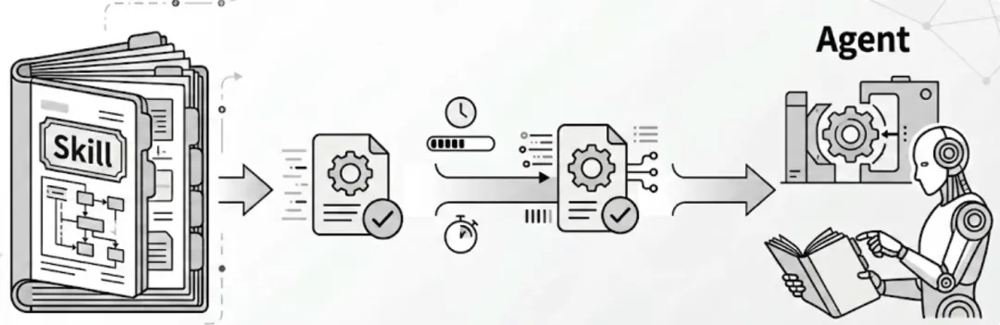
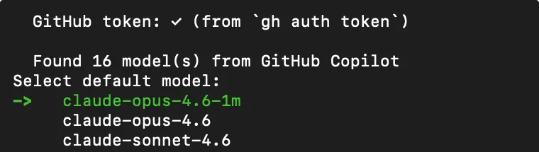
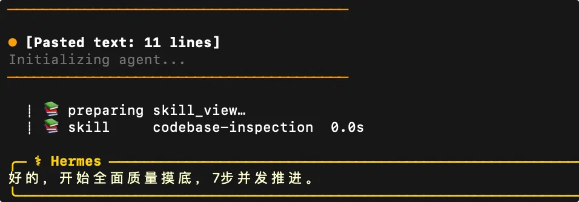
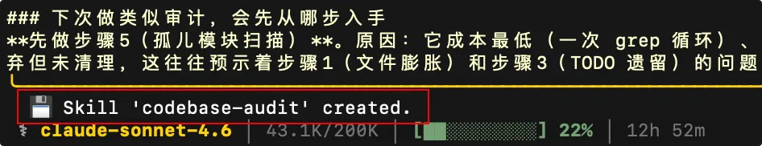
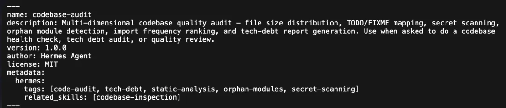
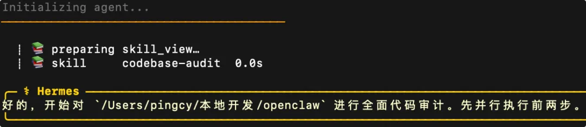
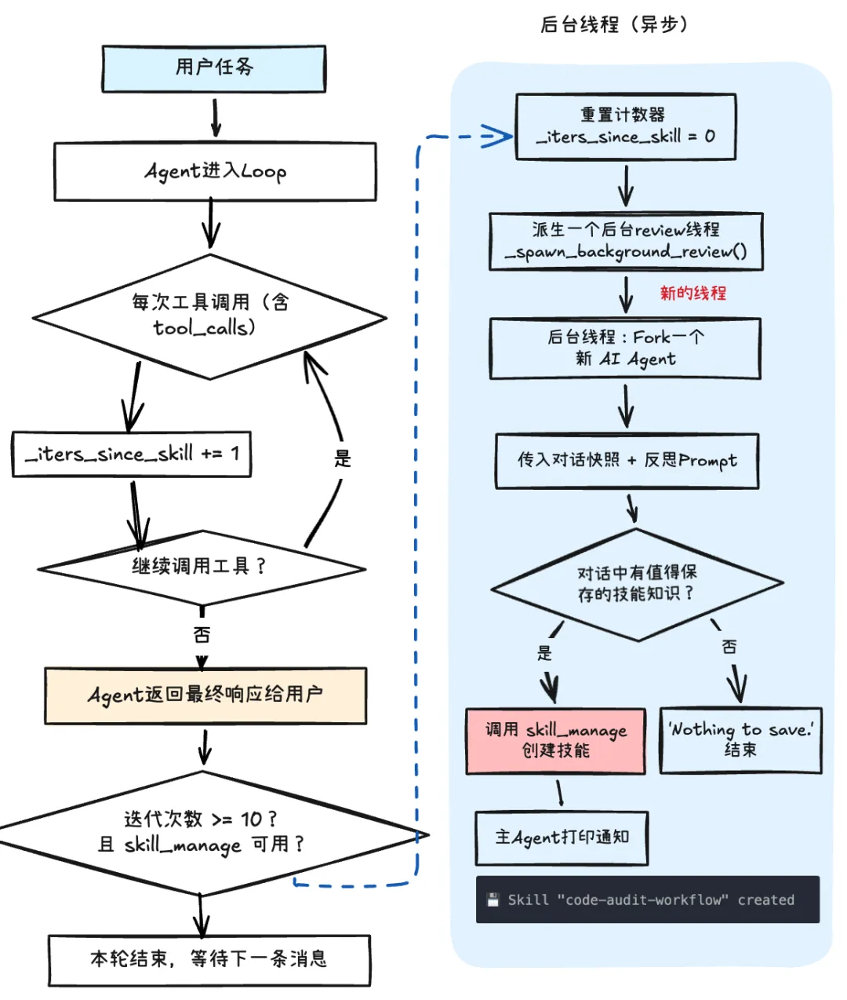
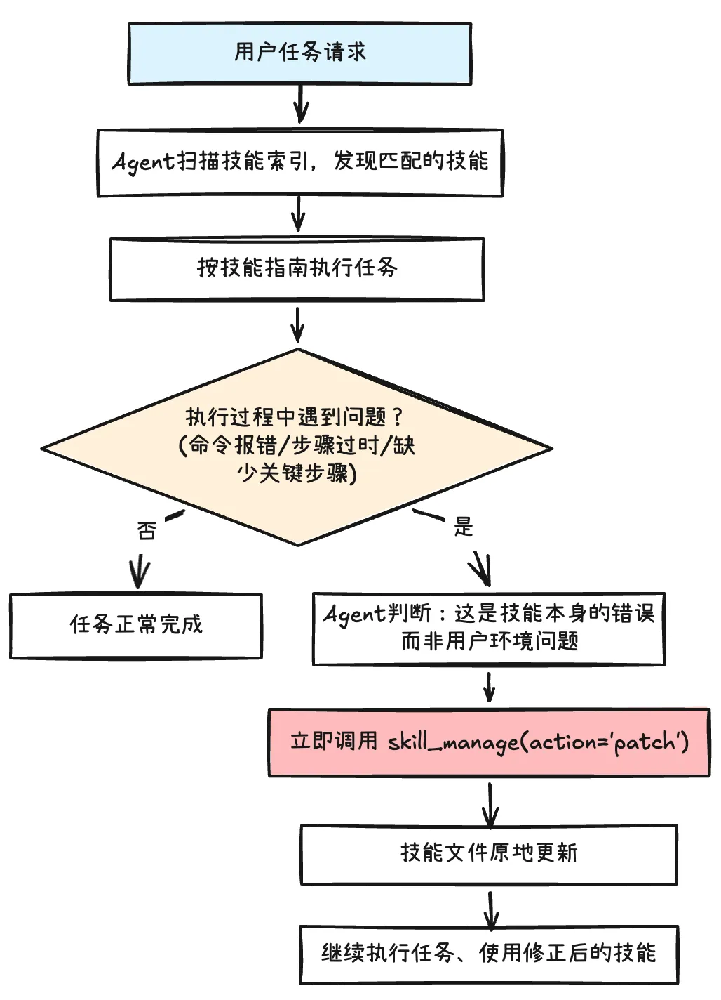
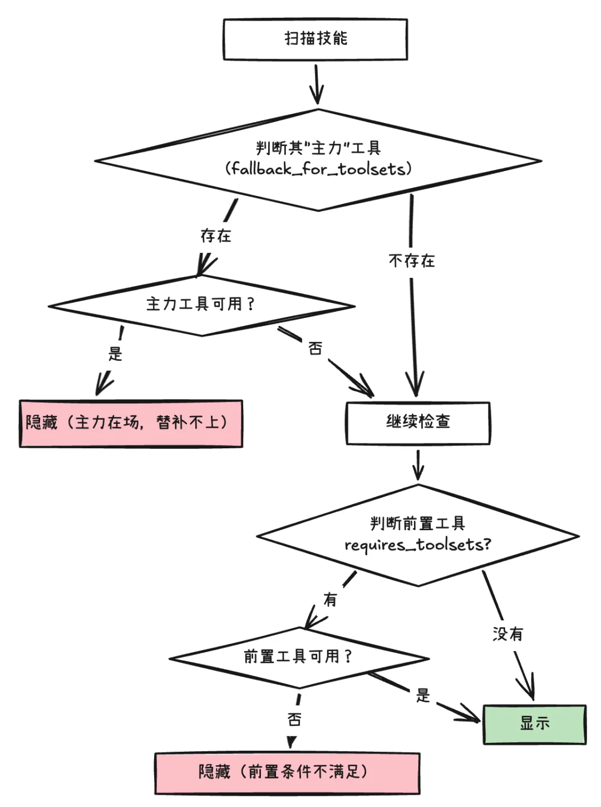

# Hardcore Breakdown of Hermes-Agent: The Architecture and Implementation Principles Behind Its Self-Learning Skill Mechanism

<p class="hermes-subtitle"><strong>From skill manuals to self-evolving capabilities: a close look at how Hermes-Agent learns, patches, and activates Skills through real execution</strong></p>

<div class="hermes-cover hermes-figure">
  
</div>

OpenClaw has an extremely powerful Skill ecosystem. So how can an emerging Agent challenge this "lobster"? Hermes-Agent offers a distinctly different answer.

<div class="hermes-figure">
  
</div>

<div class="hermes-meta-card">
  <ul>
    <li><strong>Core question</strong>: why an Agent should evolve from “being able to use Skills” to “being able to create new Skills by itself”</li>
    <li><strong>What this article covers</strong>: self-learning awareness injection, trigger chains, background review, patch-based repair, conditional activation, and safety guards</li>
    <li><strong>What you gain</strong>: a practical mental model of how Hermes-Agent turns one-off execution experience into reusable long-term capability assets</li>
  </ul>
</div>

Its core philosophy is not to keep expanding Skill breadth alone, but to let the Agent **learn and evolve through practice**, so it becomes stronger the more it is used.

This article breaks down one of Hermes-Agent’s key mechanisms: how self-learning Skills are actually implemented:

1. Why we need self-learning Agents
2. How Hermes-Agent learns a Skill in practice
3. A full breakdown of the Hermes-Agent Skill mechanism
   - How self-learning awareness is implanted
   - The complete trigger chain and timing of Skill learning
   - Automatic Skill repair: patching a broken Skill
   - Conditional activation and safety guards

Let us step into the world of a self-improving Agent.

---

## Part 01 — Why do we need self-learning Agents?

Looking back at this wave of AI systems, we have gone from passive **ChatBots**, to simple **Agents** that can call tools, and then to more complex Agents with persistent memory and continuous work loops.

Capabilities have improved, but most Agents still lack one of the most human abilities of all: **the ability to summarize experience from repeated real work, learn new techniques, and gradually form problem-solving "muscle memory" and SOPs.**

<div class="hermes-figure">
  
  <p><sub><b>Agent capability evolution: from ChatBot → simple Agent → complex Agent → self-learning Agent</b></sub></p>
</div>

### ACE: Agentic Context Engineering

Research and engineering have not stopped exploring this problem. One example is **ACE (Agentic Context Engineering)**: after each task, the Agent reviews the historical messages and summarizes reusable experience into **bullet-style memory items**.

The limitation of ACE is that these bullets are usually **simple, unstructured natural-language hints**. For example: “For key data such as price or quantity, compare multiple authoritative sources and verify accuracy.” Knowledge like this behaves like scattered fragments in a human mind. It is hard to solidify into precise workflows or executable logic. As the memory base grows, the system also starts facing context overload and rule conflicts. And for complex tasks, the model still needs to do a large amount of fresh reasoning from scratch, which is both inefficient and unstable.

### Skill: structured knowledge cards

Skills are undoubtedly a major Agent-engineering breakthrough. **They organize experience in a structured, standardized form and use progressive loading to reduce context pressure.**

But a Skill is still not self-driven. It is a handbook written by humans and handed to the model — when the Agent encounters a problem, it first looks up the answer in a manual.

<div class="hermes-figure">
  
  <p><sub><b>The nature of a Skill: a structured handbook of experience that still depends on manual authoring</b></sub></p>
</div>

The real-world issue is that Agent tasks and environments are always changing. Not every problem has a predefined standard solution. At that point, the Agent needs to be able to **write the handbook itself** — extracting best practices from trial and error, then solidifying them into brand-new Skills.

> And that is exactly the gap **Hermes-Agent** is trying to cross.

### Going one step further: the RL loop

Even though many people now emphasize **harness engineering**, the base model is still the brain of the Agent. In a traditional Agent system, once the model choice is made, the capability baseline is largely fixed.

So is there a way to automatically absorb experience from Agent execution traces, turn that into training data, and quickly feed it into reinforcement learning?

That would let the model develop something closer to an instinctive response for certain complex tasks, instead of always consulting an “operations manual.” This is where Hermes-Agent becomes even more ambitious: it introduces an **RL training loop**. How Agent trajectories are collected, labeled through reward models, and used to reinforce the base model deserves its own article. For now, we stay focused on the earlier step: how Hermes-Agent automatically “writes the manual” — in other words, how it creates Skills.

---

## Part 02 — How Hermes-Agent learns a Skill in practice

In this section, we design a concrete task so we can experience Hermes-Agent’s self-learning Skill capability directly. Before that, let us first look at its overall architecture and basic setup path.

### The overall Hermes-Agent architecture

<div class="hermes-figure">
  
  <p><sub><b>The overall Hermes-Agent architecture — note the Skill evolution subsystem on the right</b></sub></p>
</div>

Unlike OpenClaw, the **Hermes-Agent Gateway** is not a mandatory core module. If you are not connecting external message channels, you may not need to start it at all. Here we mainly care about its Skill-evolution subsystem.

### Installation and configuration

Hermes-Agent is simpler to install, configure, and use. It omits many of the more complicated option layers that exist in OpenClaw and focuses on the core capabilities.

In the minimalist path, you only need three steps: install, configure the model, then run the `hermes` command.

One especially interesting detail for personal use is that Hermes not only supports direct access to common model providers through API keys, but can also reuse subscriptions from AI coding tools such as Codex and Copilot. That means it can directly call top-tier models already included in your subscription plan, without extra provider setup. For example, it can connect to an existing GitHub Copilot subscription:

<div class="hermes-figure">
  
  <p><sub>Example configuration: connect a GitHub Copilot subscription and reuse the model quota you already have</sub></p>
</div>

### Designing a task that can trigger self-learning

So when does **Hermes-Agent** decide that it should summarize a new method and create a Skill by itself? Even before we inspect the implementation, we can infer that at least three conditions should hold:

1. The task cannot be completed directly with an existing Skill
2. The task has enough complexity, for example more than N tool calls
3. The task is likely to be repeated in the future

With that in mind, let us design a multi-step code-audit task:

```text
Run a codebase quality audit on ~/hermes-agent and complete the following:
1. Count the total number of .py files and total lines, and find the 5 largest files
2. Search TODO/FIXME/HACK comments and group the counts by subdirectory
3. Read the first 20 and last 20 lines of the largest file, then inspect the context around each TODO in it
4. Search for password=, secret=, api_key= in non-test files and judge whether they are placeholders or hard-coded credentials
5. Under tools/, find “orphan” modules imported ≤1 time in the whole project
6. Find the 5 most-referenced modules and read the first 50 lines of the top one
7. Write the full report to /tmp/source_checkreport_$(date +%Y%m%d).md,
   including summary tables for each step and at least 8 technical-debt findings ranked high/medium/low priority
Finally tell me which step you would start with next time for a similar audit.
```

The final sentence is there to hint that this kind of task may recur. Now feed the task into Hermes-Agent.

> **Below is the complete six-step demonstration of self-learning Skill creation:**

<div class="hermes-figure">
  
  <p><sub><b>Step 1</b> — Paste the code-audit task into the Hermes-Agent TUI input box</sub></p>
</div>

After waiting for a while, you can see the task execution output:

<div class="hermes-figure">
  
  <p><sub><b>Step 2</b> — The Agent autonomously completes the multi-step code-audit task</sub></p>
</div>

At the end of the output, a crucial log message appears:

<div class="hermes-figure">
  
  <p><sub><b>Step 3</b> — The log shows that a brand-new Skill was created automatically</sub></p>
</div>

At this point, you can find a new Skill under `~/.hermes/skills/`:

<div class="hermes-figure">
  
  <p><sub><b>Step 4</b> — The auto-generated Skill directory, categorized under software-development</sub></p>
</div>

When you open its `SKILL.md`, you will find a code-audit Skill corresponding exactly to the workflow above:

<div class="hermes-figure">
  
  <p><sub><b>Step 5</b> — The generated SKILL.md contains the full code-audit workflow</sub></p>
</div>

This shows that the test task successfully triggered reflection and learning in Hermes-Agent. A new Skill was created and classified under `software-development`. The Agent has effectively “secretly learned” a code-audit Skill. The next time you send a similar request — for example, “run a code audit on project X” — that Skill may be activated automatically:

<div class="hermes-figure">
  
  <p><sub><b>Step 6</b> — On a similar future instruction, the learned Skill is triggered automatically</sub></p>
</div>

Throughout the whole process, you do not need to intervene, and you do not need to install anything from a Skill Hub. The Agent reflects on its own work and learns a new Skill by itself.

---

## Part 03 — Full breakdown of the Hermes-Agent Skill mechanism

Now let us unpack the logic behind Hermes-Agent’s self-learning Skill system. Once you understand the points below, you can borrow the same patterns in your own Agent stack:

- How is self-learning awareness implanted?
- What is the full trigger chain and timing for Skill learning?
- How does automatic Skill repair work?
- How do conditional activation and safety guards fit into the system?

### How is self-learning awareness implanted?

Everything begins at the moment you start a Hermes-Agent session. In the Agent’s startup and initialization entry point (`run_agent.py`), there is a very explicit system-prompt assembly pipeline. One of its important steps is to implant the idea that the Agent should learn Skills, use Skills, and repair Skills.

```python
SKILLS_GUIDANCE = (
    "When you complete a complex task (for example one requiring many tool calls, usually 5 or more),"
    "solve a tricky error, or discover a non-obvious but reusable workflow,"
    "use skill_manage to save that method as a skill,"
    "so it can be reused in similar situations next time.\n"
    "When you are using a skill and discover that it is outdated, incomplete, or wrong,"
    "immediately use skill_manage(action='patch') to repair it,"
    "do not wait until someone explicitly asks you to fix it."
    "If a skill is not maintained, it eventually turns from an asset into a burden."
)
```

After that, the current categorized Skill index is injected into the system prompt as well.

At this point, the Agent has effectively gone through onboarding. It now carries the awareness that it should learn and repair Skills by itself. But this front-stage awareness is only one of the trigger mechanisms.

### The complete self-learning chain and its trigger timing

Self-learning does **not** mean that every time the Agent finishes a task or uses a tool, it immediately performs a mechanical check of whether a new Skill should be written. Hermes-Agent uses a dual mechanism instead:

- **Front-stage initiative**: thanks to the system guidance above, the model can decide during a complex task that a workflow deserves to become a Skill, and proactively call `skill_manage`.
- **Back-stage review**: even if the model does not proactively save anything in the current run, the controller still tracks tool-call counts and can later trigger a background review as an asynchronous safety net.

The background trigger is based on cumulative tool-calling iterations across tasks (`_iters_since_skill`). Once the counter reaches a threshold (default: 10), a background asynchronous review is launched.

<div class="hermes-figure">
  
  <p><sub><b>Background review trigger</b> — once cumulative tool iterations pass the threshold, the system launches an asynchronous reflection path</sub></p>
</div>

Two examples make the two mechanisms easier to understand:

- **Front-stage initiative**

  During normal task execution, the model may judge by itself that “this method is worth saving as a Skill.” At that moment, it calls `skill_manage`, creates the Skill, and resets the `_iters_since_skill` counter to 0. Once the counter is reset, no background review will be triggered for that round.

- **Back-stage review**

  If a task finishes without ever calling `skill_manage`, the counter keeps accumulating. Once the threshold is reached, the system triggers a background review through an independent thread and a dedicated `review_agent`. For example:

> Task 1: a complex task, 8 tool iterations (`_iters_since_skill = 8`)  
> Task 2: a simple task, 3 tool iterations (`_iters_since_skill = 11`) → background review is triggered

| Mechanism | Timing | Trigger condition |
|------|------|----------|
| Front-stage initiative | During task execution | The model decides to call `skill_manage` |
| Back-stage review | After task completion | Cumulative tool iterations >= 10 (configurable) |

Once the background reflection path starts, how does the system decide whether some experience deserves to become a new Skill? It depends on the prompt used by `review_agent`:

```python
_SKILL_REVIEW_PROMPT = (
    "Review the conversation above and decide whether it is worth saving or updating a skill.\n\n"
    "Pay close attention to whether a non-obvious method was used,"
    "whether there was repeated trial and error,"
    "whether the direction changed based on feedback during execution,"
    "or whether the user expected or needed a different method or result.\n\n"
    "If a related skill already exists, update it using the current experience;"
    "if no such skill exists and the method is reusable, create a new skill.\n"
    "If nothing is worth saving, output 'Nothing to save.' and stop."
)
```

In plain language, only experience that truly came from detours, failed attempts, and revised approaches deserves to become a Skill. The background reflection phase is asynchronous, so it does not block the main session.

### Automatic Skill repair: patching a broken Skill

Hermes-Agent also designs in automatic Skill repair. **It is a self-repair behavior jointly driven by system prompts and the `skill_manage` tool while the Agent is actively using a Skill** — similar to how an experienced operator revises the handbook while doing the work.

The core logic is simple: if the model judges that the problem lies in the Skill itself rather than the surrounding environment, it starts Skill repair by calling `skill_manage(action='patch')`.

<div class="hermes-figure">
  
  <p><sub><b>Skill patching and repair</b> — when a Skill itself has become outdated or broken, the system attempts to patch the Skill directly</sub></p>
</div>

At the implementation level, a patch is essentially a string replacement. The system rewrites the broken part inside `SKILL.md` (and potentially other Skill-related files too).

For example, imagine you have a `feature-publish` Skill, but it fails because the publishing URL has changed. After analysis, the Agent calls:

```python
skill_manage(action="patch",
             old_string="https://old-registry.xx.xx",
             new_string="https://registry.xx.xx")
```

That patches the Skill in place and lets execution continue. To find the new value, the Agent may use other tools such as search.

### Conditional activation and safety guards

As the number of Skills and tools grows, overlap and dependency relationships naturally appear. That means not every Skill should always be shown or activated every time the Skill index is injected. Hermes performs filtering based on a simple principle:

> When the primary tool is available, the “backup” Skill stays hidden. When a Skill’s prerequisite tool is missing, that Skill also stays hidden.

The activation path for each Skill looks like this:

<div class="hermes-figure">
  
  <p><sub><b>Conditional activation and safety guards</b> — Skill visibility is governed by tool availability, fallback relationships, and risk checks</sub></p>
</div>

For example:

If a `duckduckgo-search` Skill is configured with `fallback_for_toolsets: [web]`, that means it is the backup for the primary web toolset. When the user has already configured the web tool and its API key, the `duckduckgo-search` Skill disappears from the available list. Likewise, if a `deep-research` Skill depends on a prerequisite tool such as `web-fetch`, it will not load when `web-fetch` is unavailable.

On top of that, every Skill must pass through a **safety-guard scan** at load time. The main checks include:

- hard-coded secrets such as API keys
- suspicious code-execution patterns that may indicate backdoors
- prompt-injection attempts intended to manipulate the Agent
- dangerous commands such as `rm -rf` and `chmod 777`

Hermes then combines the detected risk level (`safe`, `caution`, `dangerous`) with the Skill source (built-in, officially verified, community-provided, and so on) to decide whether the Skill should be allowed. Together, these mechanisms make Skills both stable and safe enough to run in production-like environments.

---

At this point, we have fully unpacked the logic behind Hermes-Agent’s self-learning Skill mechanism. It breaks through the traditional bottleneck where Agents depend on humans to keep feeding and maintaining Skill libraries. By combining **front-stage initiative + back-stage review**, Hermes-Agent automatically captures new reusable workflows, uses hot patching for self-correction, and relies on safety guards to provide a solid execution foundation.

For anyone building long-running production-grade Agents, this is an especially compelling direction: let the Agent iterate through real work, continuously extend its own capability boundary, and gradually convert execution into reusable intelligence.

<style>
.hermes-subtitle {
  margin: -4px 0 20px;
  text-align: center;
  color: #6b7280;
  font-size: 1.05rem;
  letter-spacing: 0.02em;
}

.hermes-cover,
.hermes-figure {
  margin: 28px auto;
  padding: 14px;
  border-radius: 20px;
  background: linear-gradient(180deg, #fffaf2 0%, #ffffff 100%);
  border: 1px solid rgba(222, 180, 106, 0.28);
  box-shadow: 0 14px 34px rgba(148, 101, 28, 0.08);
}

.hermes-cover img,
.hermes-figure img {
  width: 100% !important;
  max-height: none !important;
  border-radius: 12px;
}

.hermes-meta-card {
  margin: 20px 0 28px;
  padding: 18px 20px;
  background: linear-gradient(135deg, rgba(255, 246, 221, 0.92), rgba(255, 255, 255, 0.98));
  border: 1px solid rgba(226, 179, 76, 0.34);
  border-radius: 18px;
  box-shadow: 0 10px 28px rgba(201, 145, 38, 0.08);
}

.hermes-meta-card ul {
  margin: 0;
  padding-left: 1.1rem;
}

.hermes-meta-card li {
  margin: 0.45rem 0;
  line-height: 1.75;
}

.vp-doc h2 {
  margin-top: 42px;
  padding-left: 14px;
  border-left: 4px solid #e2ad47;
}

.vp-doc h3 {
  margin-top: 28px;
}

.vp-doc blockquote {
  border-left: 4px solid #e2ad47;
  background: rgba(255, 248, 230, 0.72);
  border-radius: 0 14px 14px 0;
  padding: 10px 16px;
}

.vp-doc table {
  border-radius: 12px;
  overflow: hidden;
}

.vp-doc tr:nth-child(2n) {
  background-color: rgba(255, 248, 230, 0.45);
}

.dark .hermes-subtitle {
  color: #c8d0da;
}

.dark .hermes-cover,
.dark .hermes-figure {
  background: linear-gradient(180deg, rgba(56, 43, 20, 0.65), rgba(30, 30, 30, 0.92));
  border-color: rgba(226, 173, 71, 0.28);
  box-shadow: 0 14px 34px rgba(0, 0, 0, 0.28);
}

.dark .hermes-meta-card {
  background: linear-gradient(135deg, rgba(73, 53, 20, 0.86), rgba(30, 30, 30, 0.95));
  border-color: rgba(226, 173, 71, 0.28);
}

.dark .vp-doc blockquote {
  background: rgba(82, 61, 22, 0.3);
}
</style>
