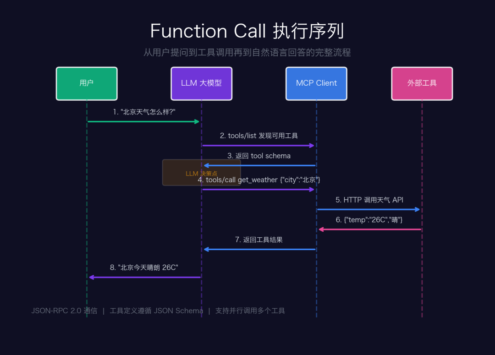
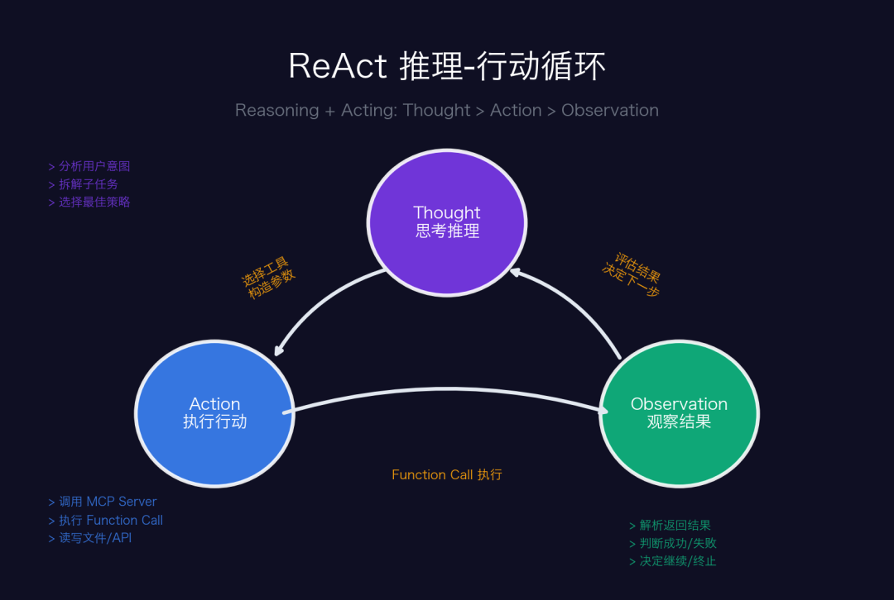

# Deep Dive: How Function Calling, MCP, ReAct, and Skills Form the Full AI Agent Stack

<p class="llm-stack-subtitle"><strong>From function execution to protocol standardization, then up to reasoning loops and reusable capability layers — one article to connect the four core layers of modern AI Agents</strong></p>

<div class="llm-stack-meta-card">
  <ul>
    <li><strong>Core question</strong>: what problem does each layer solve — Function Calling, MCP, ReAct, and Skills — and why do they only become powerful when combined</li>
    <li><strong>What you gain</strong>: a unified architectural lens you can use to analyze most AI Agent products and systems</li>
    <li><strong>Best for</strong>: developers, architects, and product builders who want to connect tool calling, protocol design, agent loops, and workflow encapsulation into one coherent mental model</li>
  </ul>
</div>

When you ask an AI assistant, "Check today's weather in Beijing," it is no longer just inventing a plausible answer. It can actually call an API, fetch real data, and return a grounded response in natural language. Behind that experience sits the coordinated work of **Function Calling, MCP, ReAct, and Skills**.

This article walks through those four layers from protocol details to architectural roles, so you can see how a modern AI Agent stack is really assembled.

## I. Function Calling: The First Step from "Can Talk" to "Can Act"

### 1.1 What problem does it solve?

At its core, a large language model is still a **text continuation machine**. Give it text, and it predicts the next most likely chunk of text. That creates two built-in limitations:

**Limitation 1: knowledge cutoff** — its training data stops at a certain date, so it cannot directly know real-time information.

**Limitation 2: no native execution ability** — it can describe what should be done, but it cannot actually perform the operation by itself.

The core idea of Function Calling is straightforward: **instead of only generating text, let the model output structured JSON that declares “I want to call this function.”** The host application intercepts that request, executes the function, and feeds the result back into the model.

---

### 1.2 What actually happens during a Function Call?

<div class="llm-stack-figure">
  
  <p><sub><b>Figure 1</b> — Full Function Calling execution sequence</sub></p>
</div>

A complete Function Calling flow has several important technical ingredients.

**Tool schema**: each callable function is described with a structured schema, typically JSON Schema. That is the basis on which the model understands what a tool does and which parameters it accepts.

```json
{
  "name": "get_weather",
  "description": "Query weather for a city",
  "parameters": {
    "type": "object",
    "properties": {
      "city": {"type": "string", "description": "City name"},
      "date": {"type": "string", "description": "Date in YYYY-MM-DD"}
    },
    "required": ["city"]
  }
}
```

**The model's decision process** is not just keyword matching. In a real Function Calling flow, the model usually does four things:

1. Understand the user's intent semantically rather than by naive token matching.
2. Choose the most relevant tool among the available ones — possibly none, one, or several.
3. Infer missing arguments from context, such as assuming "today" when the user does not specify a date.
4. Generate a parameter object that conforms to the declared schema.

---

### 1.3 From single-call tools to parallel tool use

When Function Calling first appeared in 2023, the common pattern was **single-call execution**: the model could request only one tool call in a given turn.

By late 2024, mainstream models had broadly moved toward **parallel tool use**. That means the model can request multiple function calls in one round, the host can execute them concurrently, and then feed all results back together.

That improvement matters a lot for efficiency. If a user asks for a weather comparison between Beijing and Shanghai, the model can request two weather calls in parallel rather than serializing them one after another.

Still, Function Calling is fundamentally **stateless and one-shot**. If you want the model to handle a multi-step goal such as "research material, write an article, then publish it," you need a stronger orchestration pattern.

## II. ReAct: Teaching the Model to Think While Acting

---

### 2.1 Why combine reasoning and action?

In 2022, Yao et al. from Princeton introduced the influential paper *ReAct: Synergizing Reasoning and Acting in Language Models*. The core insight was simple but profound.

**Pure reasoning**, such as chain-of-thought style prompting, can lead to deep analysis — but it can also drift into hallucination because the model is trapped inside its own internal world model.

**Pure action**, where the model just calls tools, can retrieve information — but it lacks planning and strategy. It may not know why a tool should be called, or what to do with the result afterward.

ReAct solves this by letting **reasoning guide action, and action results correct reasoning**.

<div class="llm-stack-figure">
  
  <p><sub><b>Figure 2</b> — ReAct reasoning-and-acting loop</sub></p>
</div>

---

### 2.2 A full ReAct example

Take a request like: "Find Apple's latest market cap and compare it with Microsoft." A simplified ReAct loop might look like this:

```text
[Thought 1] The user wants a comparison between Apple and Microsoft.
I need fresh market-cap data for both companies.
I'll search Apple first.

[Action 1] search_web("Apple Inc market cap 2026")

[Observation 1] Apple's market cap is about 3.8 trillion USD (April 2026).

[Thought 2] I have Apple's number.
Now I need Microsoft's market cap before I can compare them.

[Action 2] search_web("Microsoft market cap 2026")

[Observation 2] Microsoft's market cap is about 3.4 trillion USD (April 2026).

[Thought 3] I now have both values.
Apple: 3.8T vs Microsoft: 3.4T.
Apple leads by roughly 11.8%.
I can answer now.

[Final Answer] As of April 2026, Apple's market cap is roughly 3.8 trillion USD...
```

---

### 2.3 Three key ReAct design choices

| Design choice | Why it matters | What happens if it is missing |
| --- | --- | --- |
| Visible thought steps | Keeps the evolving reasoning trace in context | The model may repeat tool calls or fall into loops |
| Observation injection | Replaces guesses with real external evidence | The model falls back to stale training-time knowledge |
| Termination condition | Lets the model decide when the task is complete | The loop may continue wasting tokens and time |

---

### 2.4 How ReAct evolved by 2026

By 2026, ReAct had already expanded far beyond a single-agent loop.

**Plan-and-Execute** introduces a planner model that creates a full plan first, then a separate execution model that carries it out step by step. It is better suited to longer tasks than vanilla ReAct.

**Reflexion** adds a reflection stage outside the main loop, so the system can review what happened after task completion and improve future behavior.

**Multi-Agent ReAct** allows multiple agents to run their own reasoning-action loops and collaborate via agent-to-agent protocols, with a coordinator agent handling decomposition and synthesis.

## III. MCP: Standardizing Tool Connectivity

---

### 3.1 The fragmentation problem behind Function Calling

Function Calling is powerful, but it also creates a major engineering problem: **every AI application has to wire up every tool integration itself**.

Imagine your application needs five kinds of tools — search, filesystem, database access, browser automation, and calendar APIs. If there are three AI applications on the market, then you end up with 5 × 3 = 15 separate integrations. Every new tool or every new application expands that matrix.

This is the classic **M × N integration problem**. HTTP solved an M × N problem for the web. USB solved one for hardware peripherals. AI systems need their own equivalent for tool connectivity.

---

### 3.2 MCP's architectural idea

<div class="llm-stack-figure">
  
  <p><sub><b>Figure 3</b> — MCP three-layer protocol architecture</sub></p>
</div>

MCP, the **Model Context Protocol**, was proposed and open-sourced by Anthropic in late 2024. Its design can be understood in three layers.

**Layer 1: transport**

- **stdio mode**: the MCP server runs as a child process and communicates over standard input/output. This is the simplest and safest setup for local tools.
- **HTTP + SSE mode**: the MCP server runs as an independent service and supports remote access. This is suitable for shared infrastructure such as cloud databases and organizational services.

The transport can change without affecting the higher-level protocol.

**Layer 2: protocol**

MCP reuses the mature **JSON-RPC 2.0** standard instead of inventing a brand-new protocol. Core methods include:

- `initialize` — capability negotiation during the handshake
- `tools/list` — list all tools exposed by the server
- `tools/call` — invoke a tool with arguments
- `resources/read` — read data resources

**Layer 3: capabilities**

| Primitive | Meaning | Who controls it |
| --- | --- | --- |
| Tools | Executable operations such as fetching weather or writing files | **Model-driven** |
| Resources | Readable data such as files or database records | **Application-controlled** |
| Prompts | Predefined interaction flows such as code-review templates | **User-selected** |

---

### 3.3 What does an MCP server actually look like?

```python
from mcp.server import Server
from mcp.types import Tool, TextContent

app = Server("weather-server")

@app.list_tools()
async def list_tools():
    return [Tool(
        name="get_weather",
        description="Query weather for a city",
        inputSchema={
            "type": "object",
            "properties": {
                "city": {"type": "string"}
            }
        }
    )]

@app.call_tool()
async def call_tool(name, arguments):
    if name == "get_weather":
        result = await weather_api.query(arguments["city"])
        return [TextContent(text=json.dumps(result))]

app.run(transport="stdio")
```

Write an MCP server once, and any MCP-compatible client — Claude Desktop, VS Code Copilot, Cursor, or your own app — can discover and call it. That is the real value of standardization: **M × N becomes M + N**.

---

### 3.4 The MCP ecosystem explosion

By April 2026, the MCP ecosystem already spans a huge range of infrastructure:

**Files and code**: filesystem, Git, GitHub, GitLab

**Databases**: PostgreSQL, MySQL, SQLite, MongoDB

**Browsers**: Puppeteer, Playwright, Browser MCP

**Design tools**: Figma, Pencil, and figure-generation pipelines like the matplotlib-based flow used for diagrams in this article

**Cloud services**: AWS, GCP, Cloudflare, Docker

...plus thousands of community-contributed servers.

## IV. Skills: Reusable Capability Packaging

---

### 4.1 Why do we still need Skills?

Once you have Function Calling, ReAct, and MCP, the model can already call tools and complete tasks autonomously. But in real deployments, you quickly notice another problem: **the same tool combinations and workflow patterns appear again and again across recurring tasks**.

Take a workflow such as "publish a WeChat article." It often includes steps like:

```text
1. Search for references (via a search MCP server)
2. Draft the article (via the base LLM)
3. Convert it to publishable HTML (via formatting tools)
4. Generate accompanying images (via an image-generation server)
5. Publish through the WeChat API
6. Verify the final result
```

If the agent has to rediscover this workflow from scratch every single time through ReAct alone, it becomes slower and less stable. It may forget steps, change the order, or vary unnecessarily.

That is why a **Skill** matters. A Skill is a way to freeze working experience into a reusable capability unit: a verified combination of tools, a known execution flow, and domain-specific knowledge packaged together.

---

### 4.2 What a Skill is made of

A Skill usually contains four parts:

| Component | Meaning |
| --- | --- |
| Prompt template | System instructions that define the role and goal of the agent in this workflow |
| Tool set | The MCP servers and tools the workflow depends on |
| Execution logic | Optional deterministic steps that do not need fresh LLM reasoning every time |
| Domain knowledge | Constraints and best practices from the target domain |

---

### 4.3 Skill vs Prompt vs Agent

These three terms are often confused, but they operate at different levels.

**Prompt**: a static piece of instruction text. It has no tools, no execution flow, and no runtime behavior. Think of it as a recipe card.

**Skill**: a packaged capability made of prompt + tools + flow + knowledge. It can be activated and executed by an agent. Think of it as a trained chef.

**Agent**: the complete decision-making entity that owns multiple Skills and decides which one to activate. Think of it as a restaurant manager.

## V. The Four Layers Together: A Complete AI Agent Stack

<div class="llm-stack-figure">
  
  <p><sub><b>Figure 4</b> — Four-layer collaborative AI Agent architecture</sub></p>
</div>

Now let us put the four layers together. Suppose a user says: **"Research AI Agent trends, write a WeChat article, and publish it."** Internally, a capable agent may work like this:

**Step 1 — Skills layer**: the system recognizes this as a research-and-publish workflow and activates a suitable publishing Skill.

**Step 2 — ReAct layer**: the Skill starts a reasoning-action loop. Thought: "First, gather up-to-date AI Agent trend material."

**Step 3 — MCP layer**: ReAct decides to call a search tool through an MCP server and sends a `tools/call` request.

**Step 4 — Function Calling layer**: the search tool is executed and returns the results.

**Step 5 — ReAct layer**: the model reads the observations and decides that it now has enough evidence to start writing.

**Step 6 — MCP layer**: it connects to a diagram-generation or chart-generation tool.

**Step 7 — Function Calling layer**: the chart tool runs and returns image output.

**Step 8 — ReAct layer**: the model determines that the text and figures are ready and prepares to publish.

**Step 9 — Function Calling layer**: the publishing API is called and returns success.

**Step 10 — Skills layer**: the workflow completes and reports the outcome back to the user.

That stack is not just hypothetical. It is the architectural pattern behind many production AI systems today.

## VI. Comparison and Final Thoughts

---

### 6.1 One table to summarize the four layers

| Dimension | Function Calling | MCP | ReAct | Skills |
| --- | --- | --- | --- | --- |
| Layer | Execution layer | Protocol layer | Orchestration layer | Capability layer |
| Granularity | Single call | Connection standard | Multi-step loop | End-to-end workflow |
| Analogy | Fingers | Nervous system | Brain | Muscle memory |
| Stateful? | Stateless | Connection state | Reasoning state | Domain memory |
| Usable by itself? | Yes | Needs tools | Needs tools | Needs an agent |

---

### 6.2 Why security becomes more important

As AI systems evolve from "can answer questions" into systems that can call tools, run loops, and complete multi-step operations, the attack surface changes fundamentally.

**Prompt injection becomes more dangerous** because malicious content can arrive through tool outputs such as webpages or files, then poison the agent's context.

**Permission expansion becomes more consequential** because once the agent can read files, write files, or invoke external APIs, one bad decision can have far more impact than a text-only conversation.

**Tool confusion becomes a real risk** because a malicious MCP server can present itself as a normal tool while exfiltrating data or triggering unsafe actions.

The common defenses today include MCP capability negotiation, user approval steps for sensitive operations, and sandboxed execution environments. Even so, this remains a fast-moving frontier.

## Closing

Function Calling gives the model fingers. MCP connects those fingers to a nervous system. ReAct gives the system a way to think while acting. Skills preserve repeated success as muscle memory.

Together, they are turning AI from a passive answer engine into an active problem-solving system. And that shift is not a distant future trend — it is already the architectural reality of modern AI Agents.

<style>
.llm-stack-subtitle {
  margin: -6px 0 22px;
  text-align: center;
  color: #6b7280;
  font-size: 1.05rem;
  letter-spacing: 0.02em;
}

.llm-stack-meta-card,
.llm-stack-source,
.llm-stack-figure {
  border-radius: 20px;
  border: 1px solid rgba(222, 180, 106, 0.28);
  box-shadow: 0 14px 34px rgba(148, 101, 28, 0.08);
}

.llm-stack-meta-card {
  margin: 20px 0 18px;
  padding: 18px 20px;
  background: linear-gradient(135deg, rgba(255, 246, 221, 0.96), rgba(255, 255, 255, 0.98));
}

.llm-stack-meta-card ul {
  margin: 0;
  padding-left: 1.1rem;
}

.llm-stack-meta-card li {
  margin: 0.5rem 0;
  line-height: 1.75;
}

.llm-stack-source {
  margin: 0 0 28px;
  padding: 14px 18px;
  background: linear-gradient(180deg, #fffaf2 0%, #ffffff 100%);
}

.llm-stack-source p {
  margin: 0.35rem 0;
}

.llm-stack-figure {
  margin: 28px auto;
  padding: 14px;
  background: linear-gradient(180deg, #fffaf2 0%, #ffffff 100%);
}

.llm-stack-figure img {
  width: 100% !important;
  border-radius: 12px;
}

.llm-stack-figure p {
  margin: 12px 0 4px;
  text-align: center;
  color: #7c5a1f;
}

.vp-doc h2 {
  margin-top: 42px;
  padding-left: 14px;
  border-left: 4px solid #e2ad47;
}

.vp-doc h3 {
  margin-top: 30px;
}

.vp-doc blockquote {
  border-left: 4px solid #e2ad47;
  background: rgba(255, 248, 230, 0.72);
  border-radius: 0 14px 14px 0;
  padding: 10px 16px;
}

.vp-doc table {
  border-radius: 12px;
  overflow: hidden;
}

.vp-doc tr:nth-child(2n) {
  background-color: rgba(255, 248, 230, 0.45);
}

.dark .llm-stack-subtitle {
  color: #c8d0da;
}

.dark .llm-stack-meta-card,
.dark .llm-stack-source,
.dark .llm-stack-figure {
  background: linear-gradient(180deg, rgba(56, 43, 20, 0.65), rgba(30, 30, 30, 0.92));
  border-color: rgba(226, 173, 71, 0.28);
  box-shadow: 0 14px 34px rgba(0, 0, 0, 0.28);
}

.dark .llm-stack-figure p {
  color: #f2d7a0;
}

.dark .vp-doc blockquote {
  background: rgba(82, 61, 22, 0.3);
}
</style>
