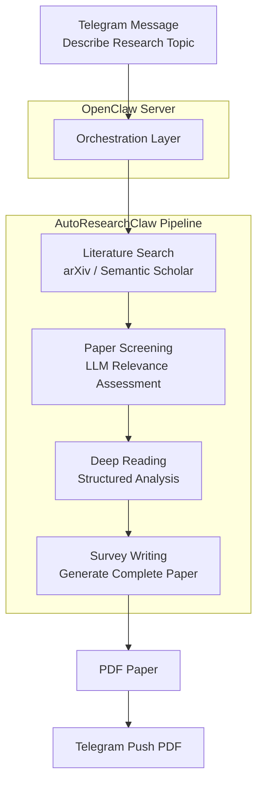

# 🧪 Lobster University: Automated Research Papers in Practice (Just Describe It, Get a Paper)

> **Use cases**: You've found an interesting research direction and want to quickly produce a survey paper, but going from literature search to a finished write-up takes at least a week or two; or your advisor/boss is asking for a systematic review of a field, and you want AI to handle the entire pipeline from searching papers to writing the paper. **All you need to do is describe the topic in Telegram, and Lobster searches the literature, reads the papers, and writes the survey for you.**

[AutoResearchClaw](https://github.com/aiming-lab/AutoResearchClaw) is an open-source automated research pipeline developed by [aiming-lab](https://github.com/aiming-lab). It automates the entire workflow of **literature search → paper screening → deep reading → survey writing**, ultimately producing a complete academic paper with citations (PDF). Combined with OpenClaw's Telegram channel, you can submit a research topic right from your phone, then go grab a coffee — the finished paper will be pushed to your Telegram.

---

## 1. What You'll Get (Real-World Value)

Once this is running, you'll have a **fully automated research writing assistant**:

### Scenario 1: Rapidly Produce a Survey Paper
- **Problem**: You've discovered a new research direction and want to quickly understand the landscape, but manually searching and organizing literature is too time-consuming
- **Solution**: Send a topic description in Telegram, and AutoResearchClaw automatically searches arXiv papers, screens relevant literature, performs deep reading, and writes a survey — 2-4 hours later, the PDF is delivered to your Telegram

### Scenario 2: Handle Urgent Research Requests
- **Problem**: Your advisor/boss asks for a systematic review of a field, and starting from scratch won't make the deadline
- **Solution**: Send the requirements to Lobster, AutoResearchClaw runs the pipeline in the background, you can work on other things, and the paper is automatically pushed when complete

### Scenario 3: Research Topic Exploration
- **Problem**: You want to understand what research progress exists in a cross-disciplinary area (e.g., "reinforcement learning + Agent frameworks") but don't know which paper to start with
- **Solution**: Describe your area of interest, and AutoResearchClaw will screen and organize a structured survey from the vast body of papers, quickly building a panoramic view of the field

### Scenario 4: Parallel Multi-Topic Research
- **Problem**: You're tracking multiple research directions simultaneously but have limited bandwidth
- **Solution**: Submit multiple topics one by one, AutoResearchClaw runs the pipeline for each, and pushes the PDF as each one completes

---

## 2. Skill Selection: Why AutoResearchClaw?

### Core Architecture



### Why AutoResearchClaw?

| Feature | Description |
|---------|-------------|
| **Fully automated pipeline** | From literature search to paper output, no manual intervention needed |
| **Academic-grade output** | Generates a complete survey paper with citations and structure (PDF) |
| **Open source and free** | The project is fully open source — you only need your own LLM API Key |
| **Flexible model support** | Supports OpenAI, Claude, local models, and more |
| **Conversational configuration** | Complete all setup through Telegram conversation — no need to manually edit files |

> **How this differs from the Paper Push Assistant**: The [Paper Push Assistant](/en/university/paper-assistant/) focuses on **daily paper screening and summary notifications** (input: keywords, output: paper list); AutoResearchClaw focuses on **deep survey writing** (input: research topic, output: complete paper). They complement each other and can be used together.

---

## 3. Configuration Guide: Complete Flow from Zero to Paper

### 3.1 Prerequisites

| Condition | Description |
|-----------|-------------|
| OpenClaw installed and running | Base environment ready |
| Telegram account | For interacting with OpenClaw |
| LLM API Key | AutoResearchClaw needs to call an LLM (supports OpenAI / Claude / local models) |
| Tools profile set to coding/full | AutoResearchClaw needs command execution permissions, see [Chapter 7: Tools and Scheduled Tasks](/en/adopt/chapter7/) |

### 3.2 Configuring the Telegram Channel

AutoResearchClaw interacts with you via Telegram, so you first need to create a Telegram bot and connect it to OpenClaw.

**Step 1: Create a Telegram Bot**

Open the Telegram App and search for `BotFather` in the search bar — select the official account with the blue verification badge:


Click **Start** to begin the conversation, then type `/newbot` to create a new bot:


BotFather will ask you two questions in sequence:

1. **Bot display name** (name) — can use any language, e.g., "Lobster Bro"
2. **Bot username** — must end in `bot`, e.g., `HelloClawClaw_bot`

Full conversation example:

```text
You: /newbot
BotFather: Alright, a new bot. How are we going to call it?
           Please choose a name for your bot.
You: Lobster Bro
BotFather: Good. Now let's choose a username for your bot.
           It must end in `bot`.
You: HelloClawClaw_bot
BotFather: Done! Congratulations on your new bot.
           Use this token to access the HTTP API:
           8658429978:AAHNbNq3sNN4o7sDnz90ON6itCfiqqWLMrc
```

> **Important**: Keep this Bot Token safe — you'll need it when configuring OpenClaw. Anyone who has this Token can control your bot.

**Step 2: Connect Telegram to OpenClaw**

Go back to your OpenClaw host machine and run the onboard command:

```bash
openclaw onboard
```

Skip and continue through the prompts until you reach the **Select channel** page, then choose **Telegram (Bot API)**.

The system will prompt:

```text
●  How do you want to provide this Telegram bot token?
●  Enter Telegram bot token (Stores the credential
   directly in OpenClaw config)
```

Paste the Bot Token you got from BotFather.

**Step 3: Get Your Telegram User ID**

Next, you need to fill in `allowFrom` (which users are allowed to chat with the bot). This requires your numeric Telegram ID.

The method is simple — find the bot you just created in Telegram and send `/start`:


The bot will reply with your User ID:

```text
OpenClaw: access not configured.

Your Telegram user id: 8561283145

Pairing code: 6KKG7C7K

Ask the bot owner to approve with:
openclaw pairing approve telegram 6KKG7C7K
```

Note down this User ID (e.g., `8561283145`) and enter it in the `allowFrom` field.

Once all configuration is complete, select **restart** to restart OpenClaw, and the Telegram channel is live.

### 3.3 Installing and Configuring AutoResearchClaw

With the Telegram channel ready, it's time to configure the AutoResearchClaw research pipeline.

Send the following prompt to your Lobster bot on Telegram to enter configuration assistant mode:

```text
Read:
https://github.com/aiming-lab/AutoResearchClaw

You are a "minimalist interactive configuration assistant."

Rules:
- Each reply ≤ 5 lines
- One thing at a time
- Ask questions first, don't over-explain
- Don't give the full tutorial at once

Flow:
1. Describe what this project does in 3 lines or less
2. List the minimum required parameters
3. Then ask me one question at a time:
   - Model type (OpenAI / Claude / local)
   - API key
   - Base URL (if needed)
4. Generate config.yaml based on my answers

Goal:
Let me complete the configuration with minimal input
```

Lobster will act like a patient configuration wizard, asking you one by one:

1. Which LLM do you want to use? (OpenAI / Claude / locally deployed)
2. What's your API Key?
3. Do you need a custom Base URL? (for domestic proxies or local models)
4. ...until `config.yaml` is fully generated

> **Tip**: The entire configuration process is completed through conversation — no need to SSH into the server and edit files manually.

### 3.4 Enable Command Execution Permissions

AutoResearchClaw needs to execute commands on the server (running Python scripts, calling the arXiv API, etc.). Make sure OpenClaw's tools profile is set to `coding` or `full`:

```bash
openclaw config set tools.profile coding
```

---

## 4. First Run: Submitting Your First Research Topic

### 4.1 Self-Check (30 Seconds)

```bash
openclaw doctor             # OpenClaw overall health check
```

Once the Telegram channel is confirmed working, you can submit your first topic.

### 4.2 Submit a Research Topic

Describe your research topic in natural language in Telegram. It's recommended to include these elements:

- **Research topic**: A clear research direction
- **Objectives**: What you expect as output (survey, comparison, trend analysis, etc.)
- **Constraints**: Scope limitations (time period, field, no experiments, etc.)
- **Output requirements**: Paper format, structure, etc.

Example:

```text
Research topic: A Survey of Reinforcement Learning Applications in the OpenClaw Framework

Objectives:
- Collect and organize relevant papers and resources
- Analyze how reinforcement learning is applied in intelligent agents / automated research systems
- Summarize the main methods, paradigms, and development trends

Constraints:
- No experiments or code implementation
- Literature review and survey writing only

Output requirements:
- A complete survey paper (with citations and structured analysis)
```

### 4.3 Wait for the Pipeline to Run

After sending, AutoResearchClaw will start the research pipeline in the background. You'll see progress updates in Telegram:

```text
Got it! Updating topic + running pipeline: Preflight passed (3/10,
just suggestions, this is a survey so no need for top-venue novelty).
Pipeline is running, please wait:
New run started! Check progress: Stage 4 is running!
New run: rc-20260329-011929-48c212
arXiv is rate-limiting, circuit breaker entering cooldown. Waiting for recovery...
```

> **Be patient**: The full research pipeline typically takes **2-4 hours**, depending on topic complexity and arXiv API rate limits. You can continue using Telegram normally for other things while the pipeline runs.

### 4.4 Receive the Paper PDF

When the paper is ready, ask Lobster to send the PDF to Telegram. It's recommended to say upfront when submitting the topic: "Please notify me and send the PDF when complete":


Lobster will tell you the PDF storage path and file size, and send it directly to the chat for you to preview and download.

---

## 5. Advanced Scenarios: From "Works" to "Works Well"

### Scenario 1: Specify Literature Search Scope

Improve literature quality by specifying a time range and sources in the topic description:

```text
Research topic: Latest advances in large language models for code generation

Constraints:
- Only search papers from 2025-2026
- Prioritize arXiv cs.CL and cs.SE categories
- Include ACL, EMNLP, ICSE top-venue papers
```

### Scenario 2: Comparative Analysis Survey

```text
Research topic: Comparative analysis of ReAct, Reflexion, and LATS — three Agent reasoning frameworks

Objectives:
- Outline the core ideas, implementation approaches, and applicable scenarios for each framework
- Compare key dimensions in a table (reasoning depth, computational cost, success rate, etc.)
- Summarize the strengths and limitations of each framework

Output requirements: A survey paper with comparison tables
```

### Scenario 3: Cross-Disciplinary Research

```text
Research topic: A survey on the integration of knowledge graphs and large language models

Objectives:
- Cover both KG-enhanced LLM and LLM-enhanced KG directions
- Organize representative works into a method taxonomy
- Discuss open problems and future directions
```

### Scenario 4: Iterative Topic Refinement

If the first draft isn't ideal, adjust through follow-up conversation:

```text
First draft survey received. Please add the following:
1) Include several key papers from 2026
2) Strengthen the "method comparison" section with a summary table of quantitative experimental results
3) Add a discussion of future research directions in the conclusion
```

---

## 6. Common Issues and Troubleshooting

### Issue 1: Pipeline Takes Too Long

**Common causes**:
- arXiv API rate limiting — this is the most common cause; AutoResearchClaw has a built-in circuit breaker that automatically waits for recovery, no manual intervention needed
- Topic scope too broad — try narrowing the research scope or adding more specific constraints
- Slow LLM API response — check if the API Key is valid and network connectivity is good

**Diagnostic steps**:

```bash
openclaw logs --limit 50    # Check OpenClaw logs
```

### Issue 2: Telegram Bot Not Responding

**Diagnostic steps**:

1. Confirm the Bot Token is correct: re-check the Token in BotFather
2. Confirm `allowFrom` includes your User ID
3. Confirm OpenClaw has been restarted: `openclaw restart`
4. Check OpenClaw health: `openclaw doctor`

### Issue 3: Paper Quality Is Poor

**Common causes**:
- Topic description too vague — provide more specific research questions, scope constraints, and output format requirements
- Model capability insufficient — if using a smaller local model, consider switching to GPT-4 or Claude for better results
- Insufficient literature coverage — specify additional search keywords or paper sources in the topic

### Issue 4: AutoResearchClaw Configuration Fails

**Common causes**:
- Wrong tools profile — confirm you've run `openclaw config set tools.profile coding`
- Invalid API Key — check if the key has expired or the quota is exhausted
- Network issues — make sure the server can access arXiv (`curl -I https://arxiv.org`) and the LLM API endpoint

---

## 7. Security and Compliance Reminders

### Reminder 1: Telegram Bot Token Security

- **Do not leak the Bot Token**: Anyone with the Token can control your bot and read all message history
- **Do not commit the Token to Git repositories**: Use environment variables or `.env` files, and make sure `.gitignore` includes sensitive configuration files
- **Rotate the Token regularly**: If you suspect the Token has been compromised, immediately use the `/revoke` command in BotFather to regenerate it
- **Restrict `allowFrom`**: Only allow your own Telegram User ID to interact with the bot, preventing strangers from sending commands to your OpenClaw instance

### Reminder 2: API Key Security

- The LLM API Key is stored in `config.yaml` on the server after conversational configuration — make sure server access is properly controlled
- Do not repeatedly send the API Key as plain text in Telegram chats
- Regularly check API usage to prevent unexpected consumption

### Reminder 3: Paper Compliance

- Papers generated by AutoResearchClaw are AI-assisted output — **always conduct a manual review before formal publication**
- Verify citation accuracy — AI may produce incorrect citations or hallucinations
- Follow your institution's/journal's policies regarding AI-assisted writing
- Generated papers are best used as **research references and draft frameworks**, not recommended as final submissions directly

---

## 8. Summary: From "Idea" to "Paper"

The core value of AutoResearchClaw is **bridging the enormous gap between a research idea and a finished paper** — all you need to do is describe the topic, and the Agent handles everything else:

- **Fully automated pipeline**: Literature search → paper screening → deep reading → survey writing, all in one flow
- **Mobile operation**: Submit topics and receive papers anytime, anywhere via Telegram
- **Flexible configuration**: Supports multiple LLMs, with all setup completed through conversation
- **Open source and controllable**: Code is fully open source, data is stored on your own server

**Remember**: The paper generated by AutoResearchClaw is a powerful **starting point**, not the finish line. It helps you overcome the biggest obstacle from zero to one — quickly building a systematic understanding of a field. Adding your own thinking, analysis, and original insights on top of it is what makes truly valuable research.

## References

### AutoResearchClaw
- [AutoResearchClaw (Automated Academic Research Pipeline)](https://github.com/aiming-lab/AutoResearchClaw)
- [aiming-lab (Project Development Team)](https://github.com/aiming-lab)

### Telegram
- [Telegram BotFather (Create Telegram Bots)](https://t.me/BotFather)
- [Telegram Bot API Official Documentation](https://core.telegram.org/bots/api)

### Related Tutorials
- [Paper Push Assistant (Daily Paper Screening and Push)](/en/university/paper-assistant/)
- [Chapter 7: Tools and Scheduled Tasks](/en/adopt/chapter7/)
- [Chapter 4: Chat Platform Integration](/en/adopt/chapter4/)
